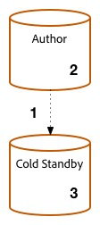
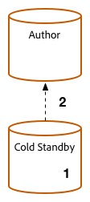
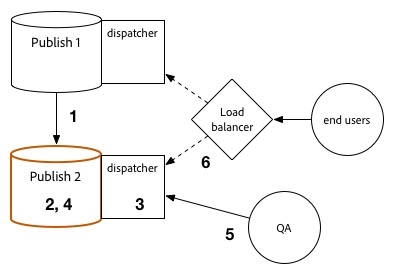

# Procedimento de atualização {#upgrade-procedure}

>[!NOTE]
>
>A atualização exigirá tempo de inatividade para o nível Autor, já que a maioria das atualizações AEM são realizadas no local. Seguindo essas práticas recomendadas, o tempo de inatividade da camada de publicação pode ser minimizado ou eliminado.

Ao atualizar seus ambientes AEM, é necessário considerar as diferenças de abordagem entre a atualização de ambientes do autor ou a publicação de ambientes para minimizar o tempo de inatividade para seus autores e usuários finais. Esta página descreve o procedimento de alto nível para atualizar uma topologia AEM atualmente em execução em uma versão do AEM 6.x. Como o processo difere entre os níveis de autor e publicação, bem como implantações baseadas em Mongo e TarMK, cada camada e microkernel foi listado em uma seção separada. Ao executar sua implantação, recomendamos primeiro atualizar seu ambiente do autor, determinar o sucesso e, em seguida, prosseguir para os ambientes de publicação.

<!--
>[!IMPORTANT]
>
>The downtime during the upgrade can be significally reduced by indexing the repository before performing the upgrade. For more information, see [Using Offline Reindexing To Reduce Downtime During an Upgrade](/help/sites-deploying/upgrade-offline-reindexing.md)
-->

## Camada do autor TarMK {#tarmk-author-tier}

### Iniciando topologia {#starting-topology}

A topologia assumida para esta seção consiste em um servidor de autor em execução no TarMK com um modo de espera a frio. A replicação ocorre do servidor Autor para o farm de publicação do TarMK. Embora não seja ilustrado aqui, essa abordagem também pode ser aproveitada para implantações que usam descarga. Certifique-se de atualizar ou recriar a instância de descarregamento na nova versão depois de desativar os agentes de replicação na instância Autor e antes de reativá-los.

### Preparação de atualização {#upgrade-preparation}

1. Parar a criação de conteúdo

1. Parar a instância de espera

1. Desabilitar agentes de replicação no autor

1. Execute as tarefas [de manutenção de](/help/sites-deploying/pre-upgrade-maintenance-tasks.md)pré-atualização.

### Execução de atualização {#upgrade-execution}

1. Executar a atualização [no local](/help/sites-deploying/in-place-upgrade.md)
1. Atualize o módulo do dispatcher, *se necessário*

1. O controle de qualidade valida a atualização

1. Encerre a instância do autor.

### Se bem-sucedido {#if-successful}

1. Copie a instância atualizada para criar um novo modo de espera frio

1. Start da instância Autor

1. Start a instância Standby.

### Se não for bem-sucedido (Reversão) {#if-unsuccessful-rollback}

1. Start da instância do modo de espera frio como o novo modo principal

1. Reconstrua o ambiente Autor do Modo de espera frio.

## Cluster de Autores MongoMK {#mongomk-author-cluster}

### Iniciando topologia {#starting-topology-1}

A topologia assumida para esta seção consiste em um cluster MongoMK Author com pelo menos duas instâncias do AEM Author, com backup de pelo menos dois bancos de dados MongoMK. Todas as instâncias de Autor compartilham um armazenamento de dados. Essas etapas devem se aplicar aos armazenamentos de dados S3 e File. A replicação ocorre dos servidores de Autor para o farm de publicação do TarMK.

### Preparação de atualização {#upgrade-preparation-1}

1. Parar a criação de conteúdo
1. Clonar o armazenamento de dados para backup
1. Parar todas as instâncias do autor de AEM, seu autor principal
1. Remova todos os nós MongoDB, exceto um, do conjunto de réplicas, sua instância principal Mongo
1. Atualize o `DocumentNodeStoreService.cfg` arquivo no Autor principal para refletir seu conjunto de réplicas de membro único
1. Reinicie o Autor principal para garantir que ele seja reiniciado corretamente
1. Desabilitar agentes de replicação no Autor principal
1. Executar tarefas [de manutenção](/help/sites-deploying/pre-upgrade-maintenance-tasks.md) pré-atualização na instância principal do autor
1. Se necessário, atualize o MongoDB na instância principal do Mongo para a versão 3.2 com WiredTiger

### Execução de atualização {#Upgrade-execution-1}

1. Executar uma atualização  no local no Autor principal
1. Atualize o Dispatcher ou o Módulo Web, *se necessário*
1. O controle de qualidade valida a atualização

### Se bem-sucedido {#if-successful-1}

1. Criar novas instâncias do autor 6.5, conectadas à instância do Mongo atualizada

1. Reconstrua os nós MongoDB que foram removidos do cluster

1. Atualize os `DocumentNodeStoreService.cfg` arquivos para refletir o conjunto completo de réplicas

1. Reinicie as instâncias de Autor, uma de cada vez

1. Remova o armazenamento de dados clonado.

### Se não for bem-sucedido (Reversão)  {#if-unsuccessful-rollback-2}

1. Reconfigure as instâncias secundárias do Autor para se conectar ao armazenamento de dados clonado

1. Desligar a instância principal do Autor atualizado

1. Desligue a instância principal do Mongo atualizada.

1. Start das instâncias secundárias de Mongo com uma delas como a nova principal

1. Configure os `DocumentNodeStoreService.cfg` arquivos nas instâncias secundárias do Autor para apontar para o conjunto de réplicas de instâncias Mongo ainda não atualizadas

1. Start as instâncias secundárias do Autor

1. Limpe as instâncias atualizadas do autor, o nó Mongo e o armazenamento de dados.

## Farm de publicação do TarMK {#tarmk-publish-farm}

### Farm de publicação do TarMK {#tarmk-publish-farm-1}

A topologia assumida para esta seção consiste em duas instâncias de publicação do TarMK, encaminhadas por Dispatchers que, por sua vez, são encaminhados por um balanceador de carga. A replicação ocorre do servidor Autor para o farm de publicação do TarMK.

### Execução de atualização {#upgrade-execution-2}

1. Parar o tráfego para a instância Publicar 2 no balanceador de carga
1. Executar manutenção  pré-atualização no Publicar 2
1. Executar uma atualização [no local](/help/sites-deploying/in-place-upgrade.md) no Publicar 2
1. Atualize o Dispatcher ou o Módulo Web, *se necessário*
1. Liberar o cache do Dispatcher
1. O QA valida o Publicar 2 por meio do Dispatcher, atrás do firewall
1. Encerrar publicação 2
1. Copiar a instância do Publicar 2
1. Publicação de start 2

### Se bem-sucedido {#if-successful-2}

1. Habilitar tráfego para publicar 2
1. Parar o tráfego para publicar 1
1. Parar a instância Publicar 1
1. Substitua a instância Publicar 1 por uma cópia do Publicar 2
1. Atualize o Dispatcher ou o Módulo Web, *se necessário*
1. Liberar o cache do Dispatcher para o Publicar 1
1. Publicação de start 1
1. O QA valida o Publicar 1 por meio do Dispatcher, atrás do firewall

### Se não for bem-sucedido (Reversão) {#if-unsuccessful-rollback-1}

1. Criar uma cópia do Publicar 1
1. Substitua a instância do Publicar 2 por uma cópia do Publicar 1
1. Liberar o cache do Dispatcher para o Publicar 2
1. Publicação de start 2
1. O QA valida o Publicar 2 por meio do Dispatcher, atrás do firewall
1. Habilitar tráfego para publicar 2

## Etapas de atualização finais {#final-upgrade-steps}

1. Habilitar tráfego para publicar 1
1. O controle de qualidade executa a validação final de um URL público
1. Ativar agentes de replicação do ambiente Autor
1. Retomar criação de conteúdo
1. Executar verificações [após a](/help/sites-deploying/post-upgrade-checks-and-troubleshooting.md)atualização.

