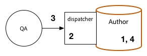

# Procedimento de atualização {#upgrade-procedure}

>[!NOTE]
>
>A atualização exigirá tempo de inatividade para o nível Autor, pois a maioria das atualizações de AEM é realizada no local. Seguindo essas práticas recomendadas, o tempo de inatividade do nível de publicação pode ser minimizado ou eliminado.

Ao atualizar seus ambientes de AEM, você precisa considerar as diferenças na abordagem entre a atualização de ambientes de autor ou de publicação, para minimizar o tempo de inatividade de autores e usuários finais. Esta página descreve o procedimento de alto nível para atualizar uma topologia de AEM atualmente em execução em uma versão do AEM 6.x. Como o processo difere entre os níveis de criação e publicação, bem como implantações baseadas em Mongo e TarMK, cada camada e microkernel foi listado em uma seção separada. Ao executar sua implantação, recomendamos primeiro atualizar seu ambiente de criação, determinar o sucesso e prosseguir para os ambientes de publicação.

<!--
>[!IMPORTANT]
>
>The downtime during the upgrade can be significally reduced by indexing the repository before performing the upgrade. For more information, see [Using Offline Reindexing To Reduce Downtime During an Upgrade](/help/sites-deploying/upgrade-offline-reindexing.md)
-->

## Camada de criação do TarMK {#tarmk-author-tier}

### Iniciando Topologia {#starting-topology}

A topologia presumida para esta seção consiste em um servidor Autor em execução no TarMK com um Cold Standby. A replicação ocorre do servidor Autor para o farm de publicação do TarMK. Embora não seja ilustrada aqui, essa abordagem também pode ser aproveitada para implantações que usam descarga. Certifique-se de atualizar ou reconstruir a instância de descarregamento na nova versão após desativar os agentes de replicação na instância do autor e antes de reativá-los.

### Preparação de atualização {#upgrade-preparation}

1. Interromper a criação de conteúdo

1. Pare a instância de standby

1. Desativar agentes de replicação no autor

1. Execute o [tarefas de manutenção de pré-atualização](/help/sites-deploying/pre-upgrade-maintenance-tasks.md).

### Execução de atualização {#upgrade-execution}

1. Execute o [atualização no local](/help/sites-deploying/in-place-upgrade.md)
1. Atualizar o módulo do dispatcher *se necessário*

1. O controle de qualidade valida a atualização

1. Desligue a instância do autor.

### Se bem-sucedido {#if-successful}

1. Copie a instância atualizada para criar um novo Cold Standby

1. Inicie a instância do autor

1. Inicie a instância Standby .

### Se não tiver êxito (Reversão) {#if-unsuccessful-rollback}

1. Inicie a instância do Cold Standby como o novo Primary

1. Reconstrua o ambiente Autor do Cold Standby.

## Cluster de Autores do MongoMK {#mongomk-author-cluster}

### Iniciando Topologia {#starting-topology-1}

A topologia presumida para esta seção consiste em um cluster de Autores MongoMK com pelo menos duas instâncias de Autor do AEM, com o backup de pelo menos dois bancos de dados MongoMK. Todas as instâncias do autor compartilham um armazenamento de dados. Essas etapas devem se aplicar aos armazenamentos de dados S3 e File. A replicação ocorre dos servidores Autores para o farm de Publicação do TarMK.

### Preparação de atualização {#upgrade-preparation-1}

1. Interromper a criação de conteúdo
1. Clonar o armazenamento de dados para backup
1. Pare todas as instâncias, exceto uma do autor do AEM, seu autor principal
1. Remova todos os nós do MongoDB, exceto um, do conjunto de réplicas, sua instância principal do Mongo
1. Atualize o `DocumentNodeStoreService.cfg` arquivo no Autor principal para refletir seu conjunto de réplicas de membro único
1. Reinicie o autor principal para garantir que ele seja reiniciado corretamente
1. Desative agentes de replicação no Autor principal
1. Executar [tarefas de manutenção de pré-atualização](/help/sites-deploying/pre-upgrade-maintenance-tasks.md) na instância principal do autor
1. Se necessário, atualize o MongoDB na instância principal do Mongo para a versão 3.2 com WiredTiger

### Execução de atualização {#Upgrade-execution-1}

1. Execute um [atualização no local](/help/sites-deploying/in-place-upgrade.md) no Autor principal
1. Atualizar o Dispatcher ou o Módulo Web *se necessário*
1. O controle de qualidade valida a atualização

### Se bem-sucedido {#if-successful-1}

1. Crie novas instâncias do autor do 6.5, conectadas à instância atualizada do Mongo

1. Reconstrua os nós do MongoDB que foram removidos do cluster

1. Atualize o `DocumentNodeStoreService.cfg` arquivos para refletir o conjunto completo de réplicas

1. Reinicie as instâncias do autor, uma de cada vez

1. Remova o armazenamento de dados clonado.

### Se não tiver êxito (Reversão)  {#if-unsuccessful-rollback-2}

1. Reconfigure as instâncias secundárias do autor para se conectar ao armazenamento de dados clonado

1. Desligue a instância principal do Autor atualizado

1. Desligue a instância principal atualizada do Mongo.

1. Inicie as instâncias secundárias do Mongo com uma delas como a nova

1. Configure o `DocumentNodeStoreService.cfg` arquivos nas instâncias secundárias do autor para apontar para o conjunto de réplicas de instâncias Mongo ainda não atualizadas

1. Inicie as instâncias secundárias do autor

1. Limpe as instâncias atualizadas do autor, o nó Mongo e o armazenamento de dados.

## Farm de Publicação TarMK {#tarmk-publish-farm}

### Farm de Publicação TarMK {#tarmk-publish-farm-1}

A topologia presumida para esta seção consiste em duas instâncias de publicação do TarMK, encaminhadas por Dispatchers que, por sua vez, são encaminhados por um balanceador de carga. A replicação ocorre do servidor Autor para o farm de publicação do TarMK.

### Execução de atualização {#upgrade-execution-2}

1. Pare o tráfego para a instância Publicar 2 no balanceador de carga
1. Executar [manutenção pré-atualização](/help/sites-deploying/pre-upgrade-maintenance-tasks.md) na publicação 2
1. Execute um [atualização no local](/help/sites-deploying/in-place-upgrade.md) na publicação 2
1. Atualizar o Dispatcher ou o Módulo Web *se necessário*
1. Liberar o cache do Dispatcher
1. O Controle de qualidade valida o Publicar 2 por meio do Dispatcher, atrás do firewall
1. Desligar publicação 2
1. Copie a instância Publicar 2
1. Iniciar publicação 2

### Se bem-sucedido {#if-successful-2}

1. Habilitar tráfego para publicar 2
1. Parar tráfego para publicar 1
1. Pare a instância Publicar 1
1. Substitua a instância Publicar 1 com uma cópia do Publicar 2
1. Atualizar o Dispatcher ou o Módulo Web *se necessário*
1. Liberar o cache do Dispatcher para Publicação 1
1. Iniciar publicação 1
1. O Controle de qualidade valida o Publicar 1 por meio do Dispatcher, atrás do firewall

### Se não tiver êxito (Reversão) {#if-unsuccessful-rollback-1}

1. Criar uma cópia da Publicação 1
1. Substitua a instância Publicar 2 por uma cópia do Publicar 1
1. Liberar o cache do Dispatcher para o Publish 2
1. Iniciar publicação 2
1. O Controle de qualidade valida o Publicar 2 por meio do Dispatcher, atrás do firewall
1. Habilitar tráfego para publicar 2

## Etapas de atualização final {#final-upgrade-steps}

1. Habilitar tráfego para publicar 1
1. O controle de qualidade executa a validação final de um URL público
1. Habilitar agentes de replicação do ambiente Autor
1. Retomar criação de conteúdo
1. Executar [verificações pós-atualização](/help/sites-deploying/post-upgrade-checks-and-troubleshooting.md).

