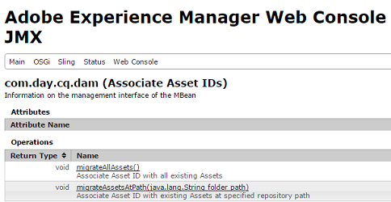

# Atualização de código e personalizações{#upgrading-code-and-customizations}

Ao planejar uma atualização, as seguintes áreas de uma implementação precisam ser investigadas e abordadas.

* [Atualizar a base de código](#upgrade-code-base)
* [Alinhar com a estrutura do repositório 6.5](#align-repository-structure)
* [Personalizações de AEM](#aem-customizations)
* [Procedimento de teste](#testing-procedure)

## Visão geral {#overview}

1. **Detector de padrões**  - execute o Detector de padrões conforme descrito no planejamento de atualização e descrito detalhadamente  [nesta ](/help/sites-deploying/pattern-detector.md) página para obter um relatório de detector de padrões que contenha mais detalhes sobre áreas que precisam ser abordadas além das APIs/pacotes indisponíveis na versão de destino do AEM. O relatório de Detecção de padrões deve fornecer uma indicação de quaisquer incompatibilidades no código. Se não houver nenhuma, sua implantação já for compatível com o 6.5, você ainda poderá optar por fazer um novo desenvolvimento para utilizar a funcionalidade 6.5, mas não precisará apenas para manter a compatibilidade. Se houver incompatibilidades reportadas, você pode optar por a) Executar no modo de compatibilidade e adiar seu desenvolvimento para novos recursos 6.5 ou compatibilidade, b) Decida fazer o desenvolvimento após a atualização e seguir para a etapa 2. Consulte [Compatibilidade com versões anteriores no AEM 6.5](/help/sites-deploying/backward-compatibility.md) para obter mais detalhes.

1. **Desenvolver base de código para a versão 6.5 **- Crie uma ramificação ou repositório dedicado para a base de código da versão de destino. Use as informações da Compatibilidade de pré-atualização para planejar áreas do código a serem atualizadas.
1. **Compile com 6.5 Uber jar **- Atualize os POMs de base de código para apontar para 6.5 uber jar e codifique o código em relação a isso.
1. **Atualizar AEM personalizações*** - *Qualquer personalização ou extensão de AEM deve ser atualizada/validada para funcionar na 6.5 e adicionada à base de código 6.5. Inclui a pesquisa na interface do usuário do Forms, personalizações de ativos, qualquer coisa que use /mnt/overlay

1. **Implantar no ambiente 6.5**  - Uma instância limpa do AEM 6.5 (Autor + Publicação) deve estar em um ambiente de desenvolvimento/QA. A base de código atualizada e uma amostra representativa de conteúdo (da produção atual) devem ser implantadas.
1. **Validação de controle de qualidade e correção de erros**  - O controle de qualidade deve validar o aplicativo nas instâncias de Autor e Publicação da versão 6.5. Quaisquer erros encontrados devem ser corrigidos e confirmados na base de código 6.5. Repita o Dev-Cycle conforme necessário até que todos os bugs sejam corrigidos.

Antes de continuar com uma atualização, você deve ter uma base de código de aplicativo estável que tenha sido totalmente testada em relação à versão de destino do AEM. Com base em observações feitas no teste, pode haver maneiras de otimizar o código personalizado. Isso pode incluir refatoração do código para evitar a passagem do repositório, indexação personalizada para otimizar a pesquisa ou o uso de nós não ordenados no JCR, entre outros.

Além da opção de atualizar a base de código e as personalizações para funcionar com a nova versão do AEM, o 6.5 também ajuda a gerenciar as personalizações de forma mais eficiente com o recurso Compatibilidade com versões anteriores, conforme descrito em [esta página](/help/sites-deploying/backward-compatibility.md).

Conforme mencionado acima e mostrado no diagrama abaixo, executar o [Detector de padrões](/help/sites-deploying/pattern-detector.md) na primeira etapa ajudará a avaliar a complexidade geral da atualização e se deseja executar no modo de compatibilidade ou atualizar suas personalizações para usar todos os novos recursos do AEM 6.5. Consulte a página [Compatibilidade com versões anteriores AEM 6.5](/help/sites-deploying/backward-compatibility.md) para obter mais detalhes.
[ ](assets/upgrade-code-base-highlevel.png)

## Atualizar a base de código {#upgrade-code-base}

### Criar uma ramificação dedicada para o código 6.5 no Controle de versão {#create-a-dedicated-branch-for-6.5-code-in-version-control}

Todos os códigos e configurações necessários para a implementação do AEM devem ser gerenciados usando alguma forma de controle de versão. Uma ramificação dedicada no controle de versão deve ser criada para gerenciar qualquer alteração necessária para a base de código na versão de destino do AEM. Os testes iterativos da base de código em relação à versão de destino do AEM e as correções de erros subsequentes serão gerenciados nesta ramificação.

### Atualize a versão AEM Uber Jar {#update-the-aem-uber-jar-version}

O AEM Uber jar inclui todas as APIs AEM como uma única dependência no `pom.xml` do projeto Maven. É sempre uma prática recomendada incluir o Uber Jar como uma única dependência, em vez de incluir dependências de API de AEM individuais. Ao atualizar a base de código, a versão do Uber Jar deve ser alterada para apontar para a versão de destino do AEM. Se o projeto foi desenvolvido em uma versão de AEM anterior à existência do Uber Jar, todas as dependências de AEM API individuais devem ser removidas e substituídas por uma única inclusão do Uber Jar na versão de destino de AEM. A base de código deve então ser recompilada em relação à nova versão do Uber Jar. Quaisquer APIs ou métodos obsoletos devem ser atualizados para serem compatíveis com a versão de destino do AEM.

```
<dependency>
    <groupId>com.adobe.aem</groupId>
    <artifactId>uber-jar</artifactId>
    <version>6.5.0</version>
    <classifier>apis</classifier>
    <scope>provided</scope>
</dependency>
```

### Eliminação progressiva do uso do Resolvedor de Recursos Administrativos {#phase-out-use-of-administrative-resource-resolver}

O uso de uma sessão administrativa por meio de `SlingRepository.loginAdministrative()` e `ResourceResolverFactory.getAdministrativeResourceResolver()` era bastante predominante em bases de código antes do AEM 6.0. Esses métodos foram descontinuados por motivos de segurança, pois proporcionam um nível de acesso muito amplo. [Em versões futuras do Sling, esses métodos serão removidos](https://sling.apache.org/documentation/the-sling-engine/service-authentication.html#deprecation-of-administrative-authentication). É altamente recomendável refatorar qualquer código para usar Usuários de serviço. Mais informações sobre os Usuários do Serviço e [como eliminar as sessões administrativas podem ser encontradas aqui](/help/sites-administering/security-service-users.md#how-to-phase-out=admin-sessions).

### Consultas e índices Oak {#queries-and-oak-indexes}

Qualquer uso de consultas na base de código precisa ser totalmente testado como parte da atualização da base de código. Para clientes que atualizam do Jackrabbit 2 (versões de AEM anteriores à 6.0), isso é especialmente importante, pois o Oak não indexa conteúdo automaticamente e talvez seja necessário criar índices personalizados. Se estiver atualizando de uma versão AEM 6.x, as definições de índice Oak predefinidas podem ter sido alteradas e podem afetar as consultas existentes.

Várias ferramentas para analisar e inspecionar o desempenho da consulta estão disponíveis:

* [Ferramentas de índice AEM](/help/sites-deploying/queries-and-indexing.md)

* [Ferramentas de Diagnóstico de Operações - Desempenho da Consulta](/help/sites-administering/operations-dashboard.md#diagnosis-tools)

* [Utilitários Oak](https://oakutils.appspot.com/). Esta é uma ferramenta de código aberto que não é mantida pelo Adobe.

### Criação da interface clássica {#classic-ui-authoring}

A criação da interface clássica ainda está disponível no AEM 6.5, mas está sendo substituída. Mais informações podem ser encontradas [aqui](/help/release-notes/deprecated-removed-features.md#pre-announcement-for-next-release). Se seu aplicativo estiver sendo executado no ambiente de criação da interface clássica, é recomendável atualizar para o AEM 6.5 e continuar usando a interface clássica. A migração para a interface do usuário de toque pode ser planejada como um projeto separado, que deve ser concluído em vários ciclos de desenvolvimento. Para usar a interface clássica no AEM 6.5, várias configurações OSGi precisam ser confirmadas na base de código. Mais detalhes sobre como configurar isso podem ser encontrados [aqui](/help/sites-administering/enable-classic-ui.md).

## Alinhar com a estrutura do repositório 6.5 {#align-repository-structure}

Para facilitar as atualizações e garantir que as configurações não sejam substituídas durante uma atualização, o repositório é reestruturado na versão 6.4 para separar o conteúdo da configuração.

Portanto, várias configurações devem ser movidas para que não residam mais em `/etc`, como acontecia no passado. Para revisar o conjunto completo de preocupações de reestruturação de repositório que devem ser revisadas e acomodadas na atualização para o AEM 6.4, consulte [Reestruturação de Repositório no AEM 6.4](/help/sites-deploying/repository-restructuring.md).

## Personalizações de AEM {#aem-customizations}

Todas as personalizações no ambiente de criação do AEM na versão de origem do AEM precisam ser identificadas. Uma vez identificadas, é recomendável que cada personalização seja armazenada no controle de versão ou no mínimo em backup como parte de um pacote de conteúdo. Todas as personalizações devem ser implantadas e validadas em um ambiente de controle de qualidade ou de preparo que execute a versão de destino do AEM antes de uma atualização de produção.

### Sobreposições em geral {#overlays-in-general}

É uma prática comum estender AEM funcionalidade imediata sobrepondo nós e/ou arquivos em /libs com nós adicionais em /apps. Essas sobreposições devem ser rastreadas no controle de versão e testadas em relação à versão de destino do AEM. Se um arquivo (seja JS, JSP, HTL) estiver sobreposto, é recomendável deixar um comentário sobre qual funcionalidade foi aumentada para facilitar o teste de regressão na versão de destino do AEM. Mais informações sobre as sobreposições em geral podem ser encontradas [aqui](/help/sites-developing/overlays.md). As instruções para sobreposições de AEM específicas podem ser encontradas abaixo.

### Atualizar Forms de pesquisa personalizada {#upgrading-custom-search-forms}

Os Aspectos de pesquisa personalizados exigem alguns ajustes manuais após a atualização para funcionarem corretamente. Para obter mais detalhes, consulte [Atualizando Forms de Pesquisa Personalizada](/help/sites-deploying/upgrading-custom-search-forms.md).

### Personalizações da interface do usuário do Assets {#assets-ui-customizations}

>[!NOTE]
>
>Este procedimento é necessário apenas para atualizações de versões anteriores à AEM 6.2.

As instâncias que personalizaram implantações do Assets precisam ser preparadas para a atualização. Isso é necessário para garantir que todo o conteúdo personalizado seja compatível com a nova estrutura de nó 6.4.

Você pode preparar personalizações para a interface do usuário do Assets fazendo o seguinte:

1. Na instância que precisa ser atualizada, abra o CRXDE Lite indo para *https://server:port/crx/de/index.jsp*

1. Vá para o seguinte nó:

   * `/apps/dam/content`

1. Renomeie o nó de conteúdo para **content_backup**. Você pode fazer isso clicando com o botão direito do mouse no painel do explorador, no lado esquerdo da janela, e escolhendo **Renomear**.

1. Depois que o nó tiver sido renomeado, crie um novo nó chamado conteúdo em `/apps/dam` chamado **content** e defina seu tipo de nó como **sling:Folder**.

1. Mova todos os nós filhos de **content_backup** para o nó de conteúdo recém-criado. Você pode fazer isso clicando com o botão direito do mouse em cada nó filho no painel do explorador e selecionando **Move**.

1. Exclua o nó **content_backup**.

1. Os nós atualizados sob `/apps/dam` com o tipo de nó correto `sling:Folder` devem ser salvos no controle de versão e implantados com a base de código ou em um backup mínimo como pacote de conteúdo.

### Gerar IDs de ativos para ativos existentes {#generating-asset-ids-for-existing-assets}

Para gerar IDs de ativos para ativos existentes, atualize os ativos ao atualizar sua instância de AEM para executar AEM 6.5. Isso é necessário para ativar o [recurso do Assets Insights](/help/assets/asset-insights.md). Para obter mais detalhes, consulte [Adicionar código incorporado](/help/assets/use-page-tracker.md#add-embed-code).

Para atualizar ativos, configure o pacote Associar IDs de ativos no console JMX. Dependendo do número de ativos no repositório, `migrateAllAssets` pode levar muito tempo. Nossos testes internos estimam aproximadamente uma hora para 125 mil ativos no TarMK.



Se você precisar de IDs de ativos para um subconjunto de todos os ativos, use a API `migrateAssetsAtPath`.

Para todos os outros fins, use a API `migrateAllAssets()` .

### Personalizações do script do InDesign {#indesign-script-customizations}

O Adobe recomenda colocar scripts personalizados no local `/apps/settings/dam/indesign/scripts`. Mais informações sobre as personalizações do InDesign Script podem ser encontradas [aqui](/help/assets/indesign.md#configuring-the-aem-assets-workflow).

### Recuperando configurações do ContextHub {#recovering-contexthub-configurations}

As configurações do ContextHub são afetadas por uma atualização. As instruções sobre como recuperar configurações existentes do ContextHub podem ser encontradas [aqui](/help/sites-developing/ch-configuring.md#recovering-contexthub-configurations-after-upgrading).

### Personalizações do fluxo de trabalho {#workflow-customizations}

É uma prática comum atualizar e modificar workflows prontos para adicionar ou remover a funcionalidade desnecessária. Um fluxo de trabalho comum personalizado é o fluxo de trabalho [!UICONTROL Ativo de atualização DAM]. Todos os workflows necessários para uma implementação personalizada devem ser armazenados em backup e armazenados no controle de versão, pois podem ser substituídos durante uma atualização.

### Modelos editáveis {#editable-templates}

>[!NOTE]
>
>Este procedimento é necessário somente para atualizações de Sites usando Modelos editáveis do AEM 6.2

A estrutura para modelos editáveis foi alterada entre AEM 6.2 e 6.3. Se estiver atualizando de 6.2 ou anterior e se o conteúdo do site for criado usando modelos editáveis, precisará usar a [Ferramenta de limpeza de nós responsivos](https://github.com/Adobe-Marketing-Cloud/aem-sites-template-migration). A ferramenta deve executar **depois de** uma atualização para limpar o conteúdo. Ele precisará ser executado nos níveis de Autor e Publicação.

### Alterações na implementação de CUG {#cug-implementation-changes}

A implementação de Grupos de usuários fechados mudou significativamente para lidar com as limitações de desempenho e escalabilidade em versões anteriores do AEM. A versão anterior do CUG foi substituída na versão 6.3 e a nova implementação é compatível somente na interface do usuário de toque. Se você estiver atualizando de 6.2 ou anterior, as Instruções para migrar para a nova implementação do CUG poderão ser encontradas [aqui](/help/sites-administering/closed-user-groups.md#upgradetoaem63).

## Procedimento de teste {#testing-procedure}

Deve ser preparado um plano de teste abrangente para testar atualizações. O teste da base de código atualizada e o aplicativo precisarão ser feitos primeiro em ambientes inferiores. Quaisquer bugs encontrados devem ser corrigidos de forma iterativa até que a base de código seja estável, somente então ambientes de nível superior devem ser atualizados.

### Teste do procedimento de atualização {#testing-the-upgrade-procedure}

O procedimento de atualização conforme descrito aqui deve ser testado em ambientes de desenvolvimento e controle de qualidade, conforme documentado em seu manual de execução personalizado (consulte [Planejamento da atualização](/help/sites-deploying/upgrade-planning.md)). O procedimento de atualização deve ser repetido até que todas as etapas estejam documentadas no manual de execução da atualização e o processo de atualização seja suave.

### Áreas de teste de implementação {#implementation-test-areas-}

Abaixo estão áreas críticas de qualquer implementação de AEM que deve ser coberta pelo seu plano de teste depois que o ambiente for atualizado e a base de código atualizada tiver sido implantada.

<table>
 <tbody>
  <tr>
   <td><strong>Área de ensaio funcional</strong></td>
   <td><strong>Descrição</strong></td>
  </tr>
  <tr>
   <td>Sites publicados</td>
   <td>Testando a implementação AEM e o código associado no nível de publicação<br /> por meio do dispatcher. Deve incluir critérios para atualizações de página e invalidação de cache <br />.</td>
  </tr>
  <tr>
   <td>Criação  </td>
   <td>Testando a implementação do AEM e o código associado na camada Autor. Deve incluir páginas, criação de componentes e caixas de diálogo.</td>
  </tr>
  <tr>
   <td>Integrações com as soluções do Marketing Cloud</td>
   <td>Validação de integrações com produtos como Analytics, DTM e Target.</td>
  </tr>
  <tr>
   <td>Integrações com sistemas de terceiros</td>
   <td>Todas as integrações de terceiros devem ser validadas nos níveis de Autor e Publicação.</td>
  </tr>
  <tr>
   <td>Autenticação, segurança e permissões</td>
   <td>Todos os mecanismos de autenticação como LDAP/SAML devem ser validados.<br /> As permissões e os grupos devem ser testados em Autor e <br /> Publicadores.</td>
  </tr>
  <tr>
   <td>Queries</td>
   <td>Índices e queries personalizados devem ser testados junto com o desempenho da consulta.</td>
  </tr>
  <tr>
   <td>Personalizações da interface do usuário</td>
   <td>Quaisquer extensões ou personalizações na interface do usuário do AEM no ambiente de criação.</td>
  </tr>
  <tr>
   <td>Fluxos de trabalhos</td>
   <td>Fluxos de trabalho e funcionalidade personalizados e/ou prontos para uso.</td>
  </tr>
  <tr>
   <td>Teste de desempenho</td>
   <td>O teste de carga deve ser executado em níveis de Autor e Publicação que simulam cenários do mundo real.</td>
  </tr>
 </tbody>
</table>

### Plano de teste do documento e resultados {#document-test-plan-and-results}

Deve ser criado um plano de ensaio que abranja as áreas de ensaio de implementação acima referidas. Em muitos casos, faz sentido separar o plano de teste por listas de tarefas Autor e Publicar . Esse plano de teste deve ser executado em ambientes de desenvolvimento, controle de qualidade e preparo antes da atualização de ambientes de produção. Os resultados de teste e as métricas de desempenho devem ser capturados em ambientes inferiores para fornecer comparação ao atualizar ambientes de Preparo e Produção.
