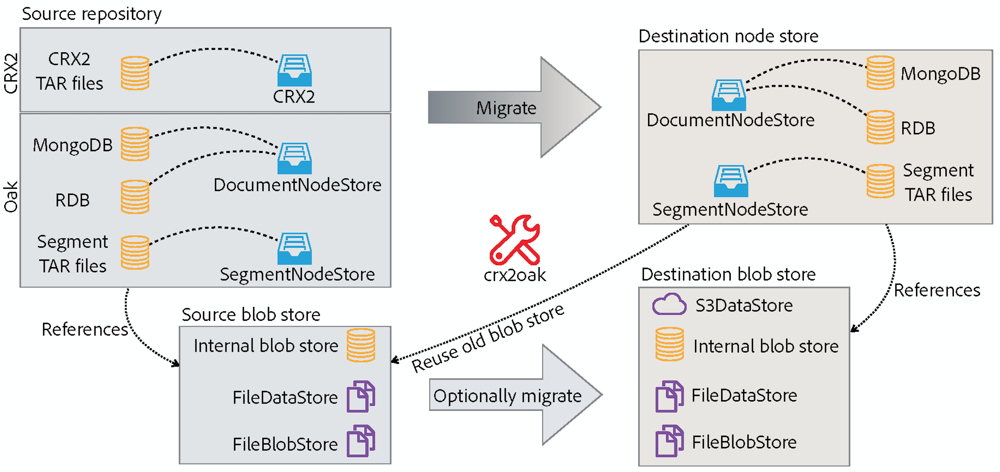

# Usando a Ferramenta de Migração CRX2Oak{#using-the-crx-oak-migration-tool}

## Introdução {#introduction}

CRX2Oak é uma ferramenta projetada para migrar dados entre repositórios diferentes.

Ele pode ser usado para migrar dados de versões mais antigas do CQ com base no Apache Jackrabbit 2 para Oak, e também pode ser usado para copiar dados entre repositórios do Oak.

Você pode baixar a versão mais recente do crx2oak do repositório do Adobe público neste local:
[https://repo.adobe.com/nexus/content/groups/public/com/adobe/granite/crx2oak/](https://repo.adobe.com/nexus/content/groups/public/com/adobe/granite/crx2oak/)

A lista de alterações e correções para a versão mais recente pode ser encontrada nas [Notas de versão do CRX2Oak](https://docs.adobe.com/content/help/en/experience-manager-64/release-notes/crx2oak.html).

>[!NOTE]
>
>Para obter mais informações sobre o Apache Oak e os principais conceitos de persistência AEM, consulte [Introdução à Plataforma AEM](/help/sites-deploying/platform.md).

## Casos de uso da migração {#migration-use-cases}

A ferramenta pode ser usada para:

* Migração de versões anteriores do CQ 5 para o AEM 6
* Copiando dados entre vários repositórios Oak
* Conversão de dados entre diferentes implementações do Oak MicroKernel.

O suporte para migrar repositórios usando armazenamentos de blob externos (comumente conhecidos como armazenamentos de dados) é fornecido em combinações diferentes. Um caminho de migração possível é de um repositório CRX2 que está usando um `FileDataStore` externo para um repositório Oak usando um `S3DataStore`.

O diagrama a seguir ilustra todas as possíveis combinações de migração suportadas pelo CRX2Oak:



## Recursos {#features}

O CRX2Oak é chamado durante AEM upgrades de uma maneira na qual o usuário pode especificar um perfil de migração predefinido que automatiza a reconfiguração dos modos de persistência. Isso é chamado de modo de início rápido.

Ele também pode ser executado separadamente caso exija mais personalização. No entanto, observe que nesse modo as alterações são feitas apenas no repositório e qualquer reconfiguração adicional de AEM precisa ser executada manualmente. Isso é chamado de modo independente.

Outra coisa a ser notada é que, com as configurações padrão no modo independente, somente a Loja de nós será migrada e o novo repositório reutilizará o armazenamento binário antigo.

### Modo de Início Rápido Automatizado {#automated-quickstart-mode}

Desde AEM 6.3, o CRX2Oak é capaz de lidar com perfis de migração definidos pelo usuário que podem ser configurados com todas as opções de migração já disponíveis. Isso permite maior flexibilidade e a capacidade de automatizar a configuração de AEM, recursos que não estão disponíveis se você estiver usando a ferramenta no modo independente.

Para alternar o CRX2Oak para o modo de início rápido, é necessário definir o caminho para a pasta crx-quickstart no diretório de instalação AEM por meio desta variável ambiental do sistema operacional:

**Para sistemas baseados em UNIX e macOS:**

```shell
export SLING_HOME="/path/to/crx-quickstart"
```

**Para Windows:**

```shell
SET "SLING_HOME=/path/to/crx-quickstart"
```

#### Retomar suporte {#resume-support}

A migração pode ser interrompida a qualquer momento, com a possibilidade de retomá-la depois.

#### Lógica de atualização personalizável {#customizable-upgrade-logic}

A lógica personalizada do Java também pode ser implementada usando `CommitHooks`. As classes personalizadas `RepositoryInitializer` podem ser implementadas para inicializar o repositório com valores personalizados.

#### Suporte para operações de memória mapeada {#support-for-memory-mapped-operations}

Por padrão, o CRX2Oak também suporta operações mapeadas por memória. O mapeamento de memória melhora muito o desempenho e deve ser usado sempre que possível.

>[!CAUTION]
>
>Observe, no entanto, que as operações mapeadas por memória não são compatíveis com plataformas Windows. Portanto, é recomendável adicionar o parâmetro **—disable-mmap** ao executar a migração no Windows.

#### Migração seletiva de conteúdo {#selective-migration-of-content}

Por padrão, a ferramenta migra o repositório inteiro no caminho `"/"`. No entanto, você tem controle total sobre qual conteúdo deve ser migrado.

Se houver alguma parte do conteúdo que não seja necessária na nova instância, você poderá usar o parâmetro `--exclude-path` para excluir o conteúdo e otimizar o procedimento de atualização.

#### Mesclagem de caminho {#path-merging}

Se os dados precisarem ser copiados entre dois repositórios e você tiver um caminho de conteúdo diferente em ambas as instâncias, poderá defini-lo no parâmetro `--merge-path`. Depois disso, o CRX2Oak copiará somente os novos nós para o repositório de destino e manterá os antigos no lugar.


#### Suporte de versão {#version-support}

Por padrão, AEM criará uma versão de cada nó ou página que é modificada e a armazenará no repositório. As versões podem ser usadas para restaurar a página para um estado anterior.

No entanto, essas versões nunca são expurgadas mesmo se a página original for excluída. Ao lidar com repositórios que estão em operação há muito tempo, a migração pode precisar processar muitos dados redundantes causados por versões órfãs.

Um recurso útil para esses tipos de situações é a adição do parâmetro `--copy-versions`. Ele pode ser usado para ignorar os nós de versão durante a migração ou cópia de um repositório.

Você também pode escolher se deseja copiar versões órfãs adicionando `--copy-orphaned-versions=true`.

Ambos os parâmetros também suportam um formato de data `YYYY-MM-DD`, caso deseje copiar versões até uma data específica.


#### Abrir versão de origem {#open-source-version}

Uma versão de código aberto do CRX2Oak está disponível na forma de atualização de carvalho. Ele suporta todos os recursos, exceto:

* Suporte CRX2
* Suporte ao perfil de migração
* Suporte para reconfiguração automática de AEM

Consulte [Documentação do Apache](https://jackrabbit.apache.org/oak/docs/migration.html) para obter mais informações.

## Parâmetros {#parameters}

### Opções de armazenamento de nós {#node-store-options}

* `--cache`: Tamanho do cache em MB (o padrão é  `256`)

* `--mmap`: Habilitar acesso a arquivos mapeados de memória para o Repositório de segmentos
* `--src-password:` Senha para o banco de dados RDB de origem

* `--src-user:` Usuário do RDB de origem

* `--user`: Usuário do RDB direcionado

* `--password`: Senha para o RDB do público alvo.

### Opções de migração {#migration-options}

* `--early-shutdown`: Encerra o repositório JCR2 de origem depois que os nós são copiados e antes que os ganchos de confirmação sejam aplicados
* `--fail-on-error`: Força uma falha na migração se os nós não puderem ser lidos do repositório de origem.
* `--ldap`: Migra usuários LDAP de uma instância CQ 5.x para uma baseada em Oak. Para que isso funcione, o provedor de identidade na configuração do Oak precisa ser chamado de ldap. Para obter mais informações, consulte a documentação [LDAP](/help/sites-administering/ldap-config.md).

* `--ldap-config:` Use isso junto com o  `--ldap` parâmetro para repositórios CQ 5.x que usaram vários servidores LDAP para autenticação. Você pode usá-lo para apontar para os arquivos de configuração CQ 5.x `ldap_login.conf` ou `jaas.conf`. O formato é `--ldapconfig=path/to/ldap_login.conf`.

### Opções de armazenamento de versão {#version-store-options}

* `--copy-orphaned-versions`: Ignora a cópia de versões órfãs. Os parâmetros compatíveis são: `true`, `false` e `yyyy-mm-dd`. O padrão é `true`.

* `--copy-versions:` Copia o armazenamento version. Parâmetros: `true`, `false`, `yyyy-mm-dd`. O padrão é `true`.

#### Opções de caminho {#path-options}

* `--include-paths:` Lista separada por vírgulas de caminhos a serem incluídos durante a cópia
* `--merge-paths`: Lista separada por vírgulas de caminhos a serem mesclados durante a cópia
* `--exclude-paths:` Lista de caminhos separada por vírgulas a ser excluída durante a cópia.

### Opções de armazenamento Blob de origem {#source-blob-store-options}

* `--src-datastore:` O diretório de armazenamento de dados a ser usado como fonte  `FileDataStore`

* `--src-fileblobstore`: O diretório de armazenamento de dados a ser usado como fonte  `FileBlobStore`

* `--src-s3datastore`: O diretório de armazenamento de dados a ser usado para a origem  `S3DataStore`

* `--src-s3config`: O arquivo de configuração da origem  `S3DataStore`.

### Opções do BlobStore de destino {#destination-blobstore-options}

* `--datastore:` O diretório de armazenamento de dados a ser usado como um público alvo  `FileDataStore`

* `--fileblobstore:` O diretório de armazenamento de dados a ser usado como um público alvo  `FileBlobStore`

* `--s3datastore`: O diretório de armazenamento de dados a ser usado para o público alvo  `S3DataStore`

* `--s3config`: O arquivo de configuração do público alvo  `S3DataStore`.

### Opções de Ajuda {#help-options}

* `-?, -h, --help:` Mostra informações de ajuda.

## Depuração {#debugging}

Você também pode ativar as informações de depuração para o processo de migração para solucionar problemas que possam aparecer durante o processo. Você pode fazer isso de forma diferente dependendo do modo em que deseja executar a ferramenta:

<table>
 <tbody>
  <tr>
   <td><strong>Modo CRX2Oak</strong></td>
   <td><strong>Ação</strong></td>
  </tr>
  <tr>
   <td>Modo de início rápido</td>
   <td>Você pode adicionar as opções <strong>—log-level TRACE</strong> ou <strong>—log-level DEBUG </strong>à linha de comando ao executar CRX2Oak. Neste modo, os registros são automaticamente redirecionados para o arquivo <strong>upgrade.log</strong>.</td>
  </tr>
  <tr>
   <td>Modo autônomo</td>
   <td><p>Adicione as opções <strong>—trace</strong> à linha de comando CRX2Oak para mostrar eventos TRACE na saída padrão (é necessário redirecionar os logs por conta própria usando o caractere de redirecionamento: comando '&gt;' ou 'tee' para inspeção posterior).</p> </td>
  </tr>
 </tbody>
</table>

## Outras considerações {#other-considerations}

Ao migrar para um conjunto de réplicas MongoDB, certifique-se de definir o parâmetro `WriteConcern` como `2` em todas as conexões com os bancos de dados Mongo.

Você pode fazer isso adicionando o parâmetro `w=2` no final da string de conexão, desta forma:

```xml
java -Xmx4092m -XX:MaxPermSize=1024m -jar crx2oak.jar crx-quickstart/repository/ mongodb://localhost:27017/aem-author?replicaset=replica1&w=2
```

>[!NOTE]
>
>Para obter mais informações, consulte a documentação da Sequência de Conexão MongoDB em [Problemas de Gravação](https://docs.mongodb.org/manual/reference/connection-string/#write-concern-options).

