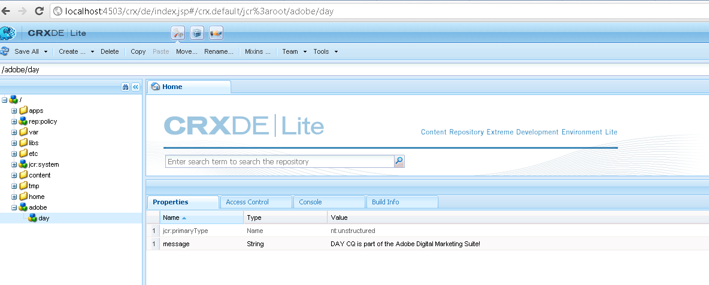

# Como acessar programaticamente o JCR AEM{#how-to-programmatically-access-the-aem-jcr}

Você pode modificar programaticamente os nós e propriedades localizados no repositório do Adobe CQ, que faz parte da Adobe Marketing Cloud. Para acessar o repositório CQ, use a API Java Content Repository (JCR). Você pode usar a API JCR do Java para executar operações de criação, substituição, atualização e exclusão (CRUD) em conteúdo localizado no repositório do Adobe CQ. Para obter mais informações sobre a API JCR Java, consulte [https://jackrabbit.apache.org/jcr/jcr-api.html](https://jackrabbit.apache.org/jcr/jcr-api.html).

>[!NOTE]
>
>Este artigo de desenvolvimento modifica o JCR do Adobe CQ de um aplicativo Java externo. Por outro lado, você pode modificar o JCR em um pacote OSGi usando a API do JCR. Para obter detalhes, consulte [Dados CQ persistentes no repositório de conteúdo Java](https://helpx.adobe.com/experience-manager/using/persisting-cq-data-java-content1.html).

>[!NOTE]
>
>Para usar a API do JCR, adicione o `jackrabbit-standalone-2.4.0.jar` para o caminho de classe do seu aplicativo Java. Você pode obter esse arquivo JAR na página da Web da API JCR do Java em [https://jackrabbit.apache.org/jcr/jcr-api.html](https://jackrabbit.apache.org/jcr/jcr-api.html).

>[!NOTE]
>
>Para saber como consultar o JCR da Adobe CQ usando a API de consulta JCR, consulte [Consulta de dados do Adobe Experience Manager usando a API JCR](https://helpx.adobe.com/experience-manager/using/querying-experience-manager-data-using1.html).

## Criar uma instância do Repositório {#create-a-repository-instance}

Embora existam diferentes maneiras de se conectar a um repositório e estabelecer uma conexão, este artigo de desenvolvimento usa um método estático que pertence ao `org.apache.jackrabbit.commons.JcrUtils` classe . O nome do método é `getRepository`. Esse método usa um parâmetro de string que representa o URL do servidor do Adobe CQ. Por exemplo, `http://localhost:4503/crx/server`.

O `getRepository`método retorna um `Repository`, conforme mostrado no exemplo de código a seguir.

```java
//Create a connection to the AEM JCR repository running on local host
Repository repository = JcrUtils.getRepository("http://localhost:4503/crx/server");
```

## Criar uma instância de sessão {#create-a-session-instance}

O `Repository`A instância representa o repositório CRX. Você usa a variável `Repository`para estabelecer uma sessão com o repositório. Para criar uma sessão, chame o `Repository`da instância `login`e passe um `javax.jcr.SimpleCredentials` objeto. O `login`método retorna um `javax.jcr.Session` instância.

Você cria um `SimpleCredentials`usando seu construtor e transmitindo os seguintes valores de string:

* O nome de utilizador;
* A senha correspondente

Ao transmitir o segundo parâmetro, chame o `toCharArray`método . O código a seguir mostra como chamar a função `login`que retorna um método `javax.jcr.Sessioninstance`.

```java
//Create a Session instance
javax.jcr.Session session = repository.login( new SimpleCredentials("admin", "admin".toCharArray()));
```

## Criar uma instância de nó {#create-a-node-instance}

Use um `Session`para criar uma `javax.jcr.Node` instância. A `Node`A instância permite executar operações de nó. Por exemplo, você pode criar um novo nó. Para criar um nó que represente o nó raiz, chame o `Session`da instância `getRootNode` , conforme mostrado na linha de código a seguir.

```java
//Create a Node
Node root = session.getRootNode();
```

Depois de criar uma `Node`Por exemplo, é possível executar tarefas como criar outro nó e adicionar um valor a ele. Por exemplo, o código a seguir cria dois nós e adiciona um valor ao segundo nó.

```java
// Store content
Node day = adobe.addNode("day");
day.setProperty("message", "Adobe CQ is part of the Adobe Digital Marketing Suite!");
```

## Recuperar valores do nó {#retrieve-node-values}

Para recuperar um nó e seu valor, chame o `Node`da instância `getNode`e transmita um valor de string que representa o caminho totalmente qualificado para o nó. Considere a estrutura do nó criada no exemplo de código anterior. Para recuperar o nó do dia, especifique adobe/day, conforme mostrado no seguinte código:

```java
// Retrieve content
Node node = root.getNode("adobe/day");
System.out.println(node.getPath());
System.out.println(node.getProperty("message").getString());
```

## Criar nós no Repositório Adobe CQ {#create-nodes-in-the-adobe-cq-repository}

O exemplo de código Java a seguir representa uma classe Java que se conecta ao Adobe CQ, cria um `Session`e adiciona novos nós. Um nó recebe um valor de dados e, em seguida, o valor do nó e seu caminho é gravado no console. Quando terminar a sessão, certifique-se de fazer logoff.

```java
/*
 * This Java Quick Start uses the jackrabbit-standalone-2.4.0.jar
 * file. See the previous section for the location of this JAR file
 */

import javax.jcr.Repository;
import javax.jcr.Session;
import javax.jcr.SimpleCredentials;
import javax.jcr.Node;

import org.apache.jackrabbit.commons.JcrUtils;
import org.apache.jackrabbit.core.TransientRepository;

public class GetRepository {

public static void main(String[] args) throws Exception {

try {

    //Create a connection to the CQ repository running on local host
    Repository repository = JcrUtils.getRepository("http://localhost:4503/crx/server");

   //Create a Session
   javax.jcr.Session session = repository.login( new SimpleCredentials("admin", "admin".toCharArray()));

  //Create a node that represents the root node
  Node root = session.getRootNode();

  // Store content
  Node adobe = root.addNode("adobe");
  Node day = adobe.addNode("day");
  day.setProperty("message", "Adobe CQ is part of the Adobe Digital Marketing Suite!");

  // Retrieve content
  Node node = root.getNode("adobe/day");
  System.out.println(node.getPath());
  System.out.println(node.getProperty("message").getString());

  // Save the session changes and log out
  session.save();
  session.logout();
  }
 catch(Exception e){
  e.printStackTrace();
  }
 }
}
```

Depois de executar o exemplo de código completo e criar os nós, você pode exibir os novos nós na **[!UICONTROL CRXDE Lite]**, conforme mostrado na ilustração a seguir.


