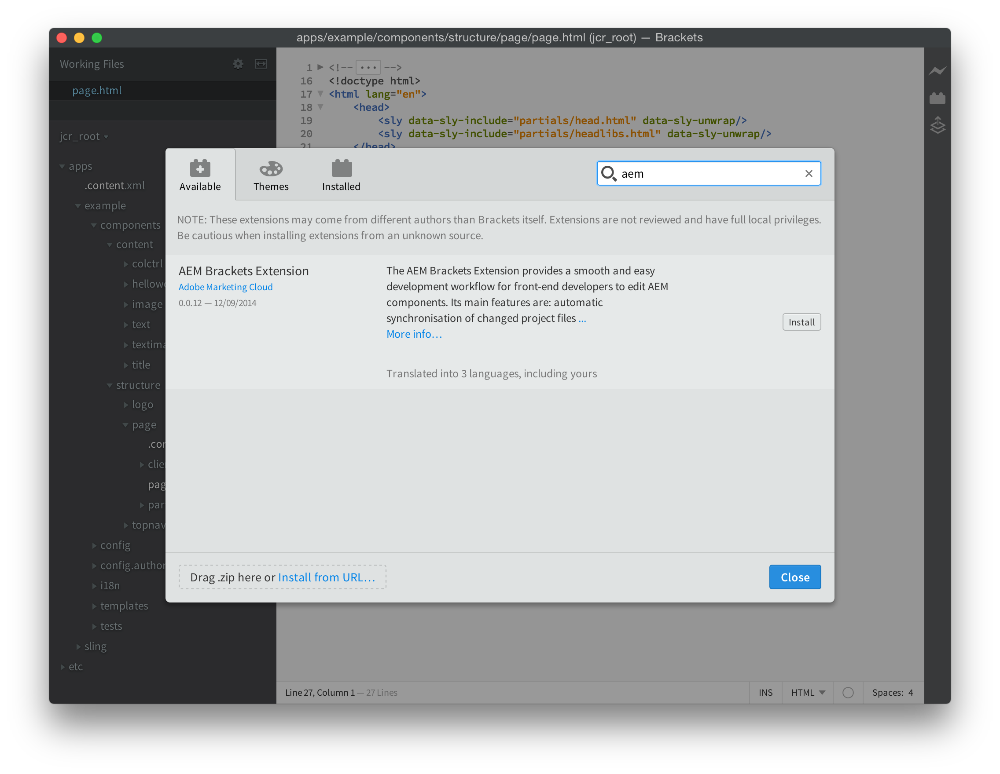

# Extensão de colchetes AEM{#aem-brackets-extension}

## Visão geral {#overview}

A extensão AEM Brackets fornece um fluxo de trabalho suave para editar AEM componentes e bibliotecas de clientes e aproveita o potencial da [Colchetes](https://brackets.io/) editor de código, que dá acesso de dentro do editor de código a arquivos e camadas do Photoshop. A sincronização fácil oferecida pela extensão (sem Maven ou File Vault necessário) aumenta a eficiência do desenvolvedor e também ajuda desenvolvedores front-end com conhecimento de AEM limitado a participar de projetos. Essa extensão também oferece suporte para a variável [Linguagem de modelo do HTML (HTL)](https://docs.adobe.com/content/help/pt-BR/experience-manager-htl/using/overview.html), o que elimina a complexidade do JSP para tornar o desenvolvimento de componentes mais fácil e seguro.

### Recursos {#features}

Os principais recursos da Extensão AEM Brackets são:

* Sincronização automatizada de arquivos alterados para a instância de desenvolvimento AEM.
* Sincronização bidirecional manual de arquivos e pastas.
* Sincronização completa do pacote de conteúdo do projeto.
* Conclusão de código HTL para expressões e `data-sly-*` instruções de bloco.

Além disso, o Brackets tem muitos recursos úteis para desenvolvedores de fim de fonte AEM:

* Suporte ao arquivo Photoshop para extrair informações de um arquivo PSD, como camadas, medidas, cores, fontes, textos etc.
* Dicas de código do PSD, para reutilizar facilmente essas informações extraídas no código.
* Suporte a pré-processador CSS, como LESS e SCSS.
* E centenas de extensões adicionais que cobrem necessidades mais específicas.

## Instalação {#installation}

### Colchetes {#brackets}

A extensão AEM Brackets oferece suporte ao Brackets versão 1.0 ou superior.

Faça o download da versão mais recente do Brackets em [colchetes.io](https://brackets.io/).

### A extensão {#the-extension}

Para instalar a extensão, proceda da seguinte maneira:

1. Abra Colchetes. No menu **Arquivo**, selecione **Extension Manager...**
1. Enter **AEM** na barra de pesquisa e procure por **Extensão de colchetes AEM**.

   

1. Clique em **Instalar**.
1. Feche a caixa de diálogo e o Extension Manager após a conclusão da instalação.

## Introdução {#getting-started}

### O projeto Content-Package {#the-content-package-project}

Após a instalação da extensão, você pode começar a desenvolver componentes AEM abrindo uma pasta de pacote de conteúdo do sistema de arquivos com o Brackets.

O projeto deve conter pelo menos:

1. a `jcr_root` pasta (por exemplo, `myproject/jcr_root`)

1. a `filter.xml` (por exemplo, `myproject/META-INF/vault/filter.xml`); para obter mais detalhes sobre a estrutura do `filter.xml` consulte o [Definição de filtro do Workspace](https://jackrabbit.apache.org/filevault/filter.html).

Em colchetes&#39; **Arquivo** escolha **Abrir Pasta...** e escolha `jcr_root` ou a pasta do projeto pai.

>[!NOTE]
>
>Se você não tiver um projeto próprio com um pacote de conteúdo, tente a variável [Exemplo de HTL TodoMVC](https://github.com/Adobe-Marketing-Cloud/aem-sightly-sample-todomvc). No GitHub, clique em **Baixar ZIP**, extraia os arquivos localmente e, conforme instruído acima, abra o `jcr_root` em Colchetes. Siga as etapas abaixo para configurar o **Configurações do projeto** e, por fim, faça o upload do pacote inteiro para a instância de desenvolvimento do AEM fazendo uma **Exportar Pacote de Conteúdo** conforme instruído mais abaixo na seção Sincronização completa do pacote de conteúdo .
>
>Após essas etapas, é possível acessar a variável `/content/todo.html` URL na sua instância de desenvolvimento de AEM e você pode começar a fazer modificações no código no Brackets e ver como, depois de fazer uma atualização no navegador da Web, as alterações foram sincronizadas imediatamente com o servidor AEM.

### Configurações do projeto {#project-settings}

Para sincronizar o conteúdo de e para uma instância de desenvolvimento de AEM, é necessário definir as Configurações do projeto. Isso pode ser feito indo até a **AEM** menu e escolha **Configurações do projeto...**

As Configurações do projeto permitem definir:

1. O URL do servidor (por exemplo, `http://localhost:4502`)
1. Tolerar servidores que não tenham um certificado HTTPS válido (mantenha desmarcado, a menos que necessário)
1. O nome de usuário usado para sincronizar o conteúdo (por exemplo, `admin`)
1. A senha do usuário (por exemplo, `admin`)

## Sincronizar conteúdo {#synchronizing-content}

A extensão AEM Brackets fornece os seguintes tipos de sincronização de conteúdo para arquivos e pastas que são permitidos pelas regras de filtragem definidas em `filter.xml`:

### Sincronização Automatizada De Arquivos Alterados {#automated-synchronization-of-changed-files}

Isso só sincronizará as alterações do Brackets para a instância de AEM, mas nunca o contrário.

### Sincronização bidirecional manual {#manual-bidirectional-synchronization}

No Explorador de projetos, abra o menu contextual clicando com o botão direito do mouse em qualquer arquivo ou pasta e depois selecione **Exportar para servidor** ou **Importar do Servidor** podem ser acessadas.

>[!NOTE]
>
>Se a entrada selecionada estiver fora do `jcr_root` , a **Exportar para servidor** e **Importar do Servidor** as entradas de menu contextual são desativadas.

### Sincronização completa do pacote de conteúdo {#full-content-package-synchronization}

No **AEM** , o **Exportar Pacote de Conteúdo** ou **Importar pacote de conteúdo** permitem sincronizar o projeto inteiro com o servidor.

### Status da Sincronização {#synchronization-status}

A Extensão AEM Brackets apresenta um ícone de notificação na barra de ferramentas à direita da janela Brackets, que indica o status da última sincronização:

* verde - todos os arquivos foram sincronizados com êxito
* azul - uma operação de sincronização está em andamento
* amarelo - alguns dos arquivos não foram sincronizados
* vermelho - nenhum dos arquivos foi sincronizado

Clicar no ícone de notificação abrirá a caixa de diálogo Status da Sincronização que lista todos os status de cada arquivo sincronizado.

>[!NOTE]
>
>Somente o conteúdo marcado como incluído pelas regras de filtragem de `filter.xml` será sincronizada, independentemente do método de sincronização usado.
>
>Além disso, `.vltignore` os arquivos são compatíveis com a exclusão de conteúdo da sincronização com e do repositório.

## Edição do código HTL {#editing-htl-code}

A Extensão AEM Brackets também apresenta alguns recursos de autopreenchimento para facilitar a escrita de atributos e expressões HTL.

### Autocompletar de atributo {#attribute-auto-completion}

1. Em um atributo HTML, digite `sly`. O atributo é preenchido automaticamente para `data-sly-`.
1. Selecione o atributo HTL na lista suspensa.

### Conclusão automática de expressão {#expression-auto-completion}

Em uma expressão `${}`, nomes de variáveis comuns são preenchidos automaticamente.

## Mais informações {#more-information}

A extensão AEM Brackets é um projeto de código aberto, hospedado no GitHub pela [Adobe Marketing Cloud](https://github.com/Adobe-Marketing-Cloud) organização, sob a licença do Apache, versão 2.0:

* Repositório de código: [https://github.com/Adobe-Marketing-Cloud/aem-sightly-brackets-extension](https://github.com/Adobe-Marketing-Cloud/aem-sightly-brackets-extension)
* Licença Apache, versão 2.0: [https://www.apache.org/licenses/LICENSE-2.0.html](https://www.apache.org/licenses/LICENSE-2.0.html)

O editor de código do Brackets também é um projeto de código aberto, hospedado no GitHub pela [Adobe Systems Incorporated](https://github.com/adobe) organização:

* Repositório de código: [https://github.com/adobe/brackets](https://github.com/adobe/brackets)

Você pode contribuir!
