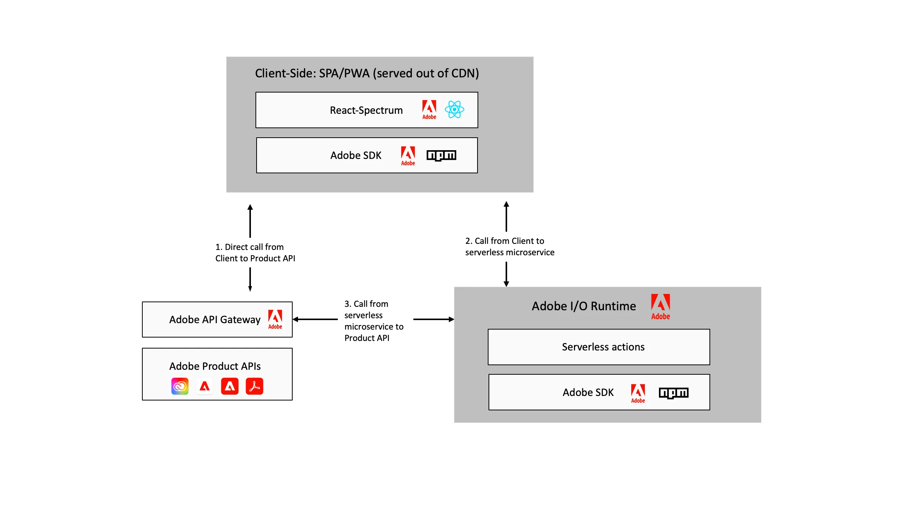

# Extensão [!DNL Adobe Experience Manager] usar o Construtor de aplicativos Adobe Developer {#extend-using-app-builder}

## O que é o App Builder para AEM {#project-appbuilder}

O novo Construtor de aplicativos do Adobe Developer fornece uma estrutura de extensibilidade para que um desenvolvedor estenda facilmente as funcionalidades do AEM.

O App Builder fornece uma estrutura unificada de extensibilidade de terceiros para integrar e criar experiências personalizadas que estendem o Adobe Experience Manager. Com essa estrutura completa de extensibilidade, criada na infraestrutura Adobe, os desenvolvedores podem criar microsserviços personalizados, estender e integrar o Adobe Experience Manager em todas as soluções Adobe e no restante da pilha de TI.

O App Builder fornece uma maneira de os clientes estenderem facilmente o Adobe Experience Manager em vários casos de uso:

* Extensibilidade Middleware - Conecte sistemas externos com aplicativos Adobe criando conectores personalizados ou use um conjunto de integrações pré-construídas.
* Extensibilidade dos principais serviços - Amplie os principais recursos do aplicativo estendendo o comportamento padrão com recursos personalizados e lógica de negócios.
* Extensibilidade de experiência do usuário - Amplie a experiência principal para atender aos requisitos comerciais ou criar propriedades digitais específicas do cliente, vitrines e aplicativos de back-office.

O App Builder está disponível para clientes e parceiros corporativos por meio da Visualização do desenvolvedor do Adobe desde o verão de 2020. A disponibilidade geral (GA) do App Builder está agendada para dezembro de 2021. O Adobe recebe os desenvolvedores para experimentar o Construtor de aplicativos por meio do Adobe [Programa de avaliação](https://developer.adobe.com/app-builder/trial/).

>[!NOTE]
>
>Para clientes do AEM as a Cloud Service, que desejam usar o App Builder, consulte [Extensão do Adobe Experience Manager as a Cloud Service usando o Construtor de aplicativos do Adobe Developer](https://experienceleague.adobe.com/docs/experience-manager-65/developing/extending-aem/app-builder.html).

## Arquitetura {#architecture}

Em vez de uma solução pronta para uso, o Adobe Developer App Builder fornece uma plataforma de desenvolvimento comum, consistente e padronizada para a extensão de soluções da Adobe Cloud, como o AEM, incluindo:

* Console do Adobe Developer — Para microsserviços personalizados e desenvolvimento de extensões, permite que os desenvolvedores criem e gerenciem projetos enquanto acessam todas as ferramentas e APIs necessárias para criar plug-ins e integrações.
* Ferramentas do desenvolvedor — Ferramentas de código aberto, SDKs e bibliotecas para permitir que os desenvolvedores criem facilmente extensões e integrações personalizadas. Use o Espectro de Reação (kit de ferramentas da interface do Adobe) para ter uma interface comum para todos os aplicativos Adobe.
* Serviços — I/O Runtime para hospedar a infraestrutura na plataforma sem servidor Adobe e I/O Events para integrações baseadas em eventos. O Adobe também oferece suporte pronto para armazenar dados e arquivos.
* Adobe Experience Cloud — os desenvolvedores podem enviar extensões e integrações para publicação em sua Experience Cloud Org. Em seguida, os administradores do sistema podem revisar, gerenciar e aprovar essas extensões. Depois de publicado, suas ferramentas e extensões personalizadas do App Builder podem ser encontradas junto com outros aplicativos da Adobe Experience Cloud.

O diagrama a seguir ilustra como um aplicativo padrão criado no App Builder usa essas funcionalidades:

Para obter mais detalhes sobre a arquitetura do App Builder, consulte [Visão geral da arquitetura](https://developer.adobe.com/app-builder/docs/guides/).

## Introdução ao App Builder {#additional-resources}

Para ajudar você a começar a usar o App Builder, uma série de documentações foi criada para ajudar você a começar:

* [Introdução ao App Builder](https://developer.adobe.com/app-builder/docs/getting_started/)

## Continue aprendendo com a documentação {#appbuilder-documentation}

O App Builder fornece vídeos e documentação para desenvolvedores, incluindo guias e documentação de referência para ajudar você a começar a desenvolver seus próprios aplicativos personalizados:

* [Documentação do App Builder](https://developer.adobe.com/app-builder/docs/overview/)
* [Vídeos do Construtor de aplicativos](https://www.youtube.com/playlist?list=PLcVEYUqU7VRfDij-Jbjyw8S8EzW073F_o)

## Experimente um dos aplicativos de amostra {#appbuilder-codesamples}

Pronto para começar a desenvolver? Há vários aplicativos de exemplo para ajudá-lo a começar rapidamente:

* [Laboratórios de código do App Builder no site da Adobe Developer](https://developer.adobe.com/app-builder/docs/resources/)

