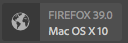
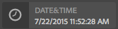

# Exemplos de tipos de módulos de interface do usuário do ContextHub {#sample-contexthub-ui-module-types}

O ContextHub fornece vários módulos de UI de amostra que você pode usar em suas soluções. São fornecidas as seguintes informações:

* Os principais recursos do módulo de interface do usuário.
* Onde encontrar o código fonte para que você possa abri-lo para fins de aprendizado.
* Como configurar o módulo da interface do usuário.

Para obter informações sobre como adicionar módulos de interface ao ContextHub, consulte [Adicionar um módulo](ch-configuring.md#adding-a-ui-module)de interface. Para obter informações sobre o desenvolvimento de módulos de interface do usuário, consulte [Criação de tipos](/help/sites-developing/ch-extend.md#creating-contexthub-ui-module-types)de módulos de interface do usuário do ContextHub.

## tipo de módulo de interface do usuário do contexthub.base {#contexthub-base-ui-module-type}

O tipo de módulo da interface do usuário contexthub.base é o tipo básico para todos os outros tipos de módulo da interface do usuário. Dessa forma, ele fornece recursos genéricos para renderizar dados de armazenamento.

Os seguintes recursos estão disponíveis:

* **Título e ícone:** Especifique um título para o módulo da interface do usuário e um ícone. O ícone pode ser referenciado usando um URL ou a partir da biblioteca de ícones da interface do Coral.
* **Armazenar dados:** Identifique um ou mais armazenamentos dos quais recuperar dados.
* **Conteúdo:** Especifique o conteúdo que aparece no módulo da interface como ele aparece na barra de ferramentas do ContextHub.
* **Conteúdo do pai:** Especifique o conteúdo que aparece em uma janela pop-up quando o módulo da interface do usuário é clicado ou tocado.
* **Modo de tela cheia:** Controle se o modo de tela cheia é permitido.

O código-fonte está localizado em /libs/granite/contexthub/code/ui/container/js/ContextHub.UI.BaseModuleRenderer.js.

### Configuração {#configuration}

Configure o módulo de interface do usuário contexthub.base usando um objeto Javascript no formato JSON. Inclua qualquer uma das seguintes propriedades para configurar os recursos do módulo de interface:

* **imagem:** Um URL para uma imagem a ser exibida como o ícone.
* **ícone:** O nome de uma classe de ícone [da interface do](https://helpx.adobe.com/experience-manager/6-4/sites/developing/using/reference-materials/coral-ui/coralui3/Coral.Icon.html) Coral. Se você especificar um valor para as propriedades de ícone e imagem, a imagem será usada.

* **título:** Um título para o módulo da interface do usuário. O título é exibido quando o ponteiro é pausado sobre o ícone do módulo da interface do usuário.
* **tela cheia:** Um valor booliano que indica se o módulo da interface suporta o modo de tela cheia. Use `true` para suportar tela cheia e `false` para impedir o modo de tela cheia.

* **modelo:** Um modelo [Handlebars](https://handlebarsjs.com/) que especifica o conteúdo a ser renderizado na barra de ferramentas do ContextHub. Use no máximo duas `<p>` tags.

* **storeMapping:** Um mapeamento de chave/loja. Use a tecla nos modelos de Handlebar para acessar os dados de armazenamento do ContextHub associados.
* **lista:** Uma matriz de itens a serem exibidos como uma lista em um módulo quando o módulo da interface é clicado. Se você incluir esse item, não inclua propoverTemplate. O valor é uma matriz de objetos com as seguintes teclas:

   * título: O texto a ser exibido para este item
   * imagem: (Opcional) Um URL para uma imagem que deve ser exibida à esquerda
   * ícone: (Opcional) Uma classe de ícone CUI que deve ser exibida à esquerda; ignorado se uma imagem for especificada
   * selecionados: (Opcional) Um valor booliano que especifica se este item deve ser exibido como selecionado (true=selecionado). Por padrão, os itens selecionados aparecem usando uma fonte em negrito. Use uma `listType` propriedade para configurar outras aparências (consulte abaixo).

* **listType:** O estilo a ser usado para itens de lista de entrega. Use um dos seguintes valores:

   * marca
   * caixa de seleção
   * rádio

* **poverTemplate:** Um modelo de handlebars que especifica o conteúdo a ser renderizado no pop-up quando o módulo de interface é clicado. Se você incluir este item, não inclua o `list` item.

### Exemplo {#example}

O exemplo a seguir configura um módulo de interface do usuário contexthub.base para exibir informações de uma loja [contexthub.emulators](/help/sites-developing/ch-samplestores.md#granite-emulators-sample-store-candidate) . O `template` item demonstra como obter dados da loja usando a chave que o `storeMapping` item estabelece.

```xml
{
   "icon": "coral-Icon--move",
    "title": "Screen Resolution",
    "storeMapping": {
      "emulator": "emulators"
    },
    "template": "<p>{{{ i18n \"Resolution\"}}}</p><p>{{{emulator.currentDevice.width}}} x {{{emulator.currentDevice.height}}}</p>"
}
```


## tipo de módulo de interface do usuário context.browserinfo {#contexthub-browserinfo-ui-module-type}

O módulo de interface do usuário contexthub.browserinfo exibe informações sobre o navegador da Web do cliente e o sistema operacional. As informações são obtidas da loja surferinfo, com base no candidato da loja [contexthub.surferinfo](/help/sites-developing/ch-samplestores.md#contexthub-surferinfo-sample-store-candidate) .



O código fonte do módulo de interface está localizado em /libs/granite/contexthub/components/modules/browserinfo. Embora o contexthub.browserinfo amplie o módulo de interface contexthub.base, ele não substitui nem fornece funções adicionais. A implementação fornece uma configuração padrão para renderizar informações do navegador.

### Configuração {#configuration-1}

As instâncias do módulo de interface contexthub.browserinfo não exigem um valor para a Configuração de detalhes. O seguinte texto JSON representa a configuração padrão do módulo.

```xml
{
   "icon":"coral-Icon--globe",
   "title":"Browser/OS Information",
   "storeMapping":{"surferinfo":"surferinfo"},
   "template":"<p>{{surferinfo.browser.family}} {{surferinfo.browser.version}}</p><p>{{surferinfo.os.name}} {{surferinfo.os.version}}</p>"
}
```

## tipo de módulo de interface do usuário context.datetime {#contexthub-datetime-ui-module-type}

O módulo de interface contexthub.datetime exibe a data e a hora armazenadas em um armazenamento chamado datetime com base no candidato do repositório [contexthub.datetime](/help/sites-developing/ch-samplestores.md#contexthub-datetime-sample-store-candidate) .



O módulo fornece um formulário de entrega que permite alterar a data e a hora na loja.

A fonte do módulo de interface contexthub.datetime está localizada em /libs/granite/contexthub/components/modules/datetime.

### Configuração {#configuration-2}

As instâncias do módulo de interface contexthub.datetime não exigem um valor para a Configuração de detalhes. O seguinte texto JSON representa a configuração padrão do módulo.

```xml
{
   "icon":"coral-Icon--clock",
   "title":"DATE&TIME",
   "clickable":true,
   "storeMapping":{"d":"datetime"},
   "template":"<p class=\"contexthub-module-line1\">{{i18n \"Date&Time\"}}</p><p class=\"contexthub-module-line2\">{{d.formatted.locale.date}} {{d.formatted.locale.time}}</p>",
   "popoverTemplate":"<div class=\"datetime center\"><div class=\"coral-DatePicker-calendar\" data-init=\"datepicker\"><input class=\"coral-Textfield\" type=\"datetime\" value=\"{{d.formatted.iso}}\"><button class=\"coral-Button coral-Button--secondary coral-Button--square\" title=\"{{i18n \"Datetime picker\"}}\"><i class=\"coral-Icon coral-Icon--calendar coral-Icon--sizeS\"></i></button></div></div>"
}
```

## tipo de módulo de interface do usuário context.location {#contexthub-location-ui-module-type}

O módulo de interface do usuário contexthub.location exibe a longitude e a latitude do cliente. O módulo fornece um provedor que exibe um mapa do Google no qual você pode clicar para alterar o local atual. O módulo obtém informações de uma loja do ContextHub chamada geolocation baseada no candidato da loja [contexthub.geolocation](/help/sites-developing/ch-samplestores.md#contexthub-geolocation-sample-store-candidate) .


A fonte do módulo da interface está localizada em /etc/cloudsettings/default/contexthub/geolocation.

### Configuração {#configuration-4}

As instâncias do módulo de interface contexthub.location não exigem um valor para a Configuração de detalhes. O seguinte texto JSON representa a configuração padrão do módulo.

```xml
{
 "icon":"coral-Icon--compass",
 "title":"Location",
 "clickable":true,
 "editable":{"key":"/geolocation","disabled":[],"hidden":["/geolocation/generatedThumbnail","/geolocation/city","/geolocation/country"]},
 "fullscreen":true,
 "storeMapping":{"g":"geolocation"},
 "template":"<p>{{i18n \"Location\"}}</p><p>{{g.address.postalCode}} {{g.address.city}}{{#if g.address.city}}{{#if g.address.region}},{{/if}}{{/if}} {{g.address.region}}</p>",
 "list":[
  {"title":"Basel, Switzerland",
  "data":{"longitude":7.58929,"latitude":47.554746,"city":"Basel","country":"Switzerland"}},
  {"title":"Melbourne, Australia",
  "data":{"longitude":144.96328,"latitude":-37.814107,"city":"Melbourne","country":"Australia"}},
  {"title":"Beijing, China",
  "data":{"longitude":116.407526,"latitude":39.90403,"city":"Beijing","country":"China"}},
  {"title":"New York, NY, USA",
  "data":{"longitude":-74.005973,"latitude":40.714353,"city":"New York","country":"United States"}},
  {"title":"Paris, France",
  "data":{"longitude":2.352222,"latitude":48.856614,"city":"Paris","country":"France"}},
  {"title":"Rio de Janeiro, Brazil",
  "data":{"longitude":-43.20071,"latitude":-22.913395,"city":"Rio","country":"Brazil"}},
  {"title":"San Jose, CA, USA",
  "data":{"longitude":-121.894955,"latitude":37.339386,"city":"San Jose","country":"United States"}},
  {"title":"Tokyo, Japan",
  "data":{"longitude":139.691706,"latitude":35.689487,"city":"Shinjuku","country":"Japan"}}
 ],
 "listType":"checkmark"
}
```

## tipo de módulo de interface de usuário contexthub.screen-orientation {#contexthub-screen-orientation-ui-module-type}

O módulo de interface de usuário contexthub.screen-orientation exibe a orientação de tela atual do cliente. Embora desativado por padrão, o módulo fornece um provedor que permite selecionar uma orientação. O módulo obtém informações de uma loja do ContextHub chamada emuladores, com base no candidato à loja do [granite.emuladores](/help/sites-developing/ch-samplestores.md#granite-emulators-sample-store-candidate) .


A fonte do módulo da interface está localizada em /libs/granite/contexthub/components/modules/screen-orientation.

### Configuração {#configuration-5}

As instâncias do módulo de interface contexthub.screen-orientation não exigem um valor para a Configuração de detalhes. O seguinte texto JSON representa a configuração padrão do módulo. Observe que a `clickable` propriedade é `false` por padrão. Se você substituir a configuração padrão definida `clickable` como `true`, clicar no módulo revelará um pop-up onde você pode selecionar a orientação.

```xml
{
   "icon":"coral-Icon--rotateRight",
   "title":"Screen Orientation",
   "clickable":false,
   "storeMapping":{"emulator":"emulators"},
   "template":"<p>{{{ i18n \"Screen Orientation\" }}}</p><p>{{{ emulator.currentDevice.orientation }}}",
   "listReference":"/emulators/orientations",
   "listType":"checkmark"
}
```

## tipo de módulo de interface do usuário do contexthub.tagcloud {#contexthub-tagcloud-ui-module-type}

O módulo de interface do usuário do contexthub.tagcloud exibe informações sobre tags. Na barra de ferramentas, o módulo da interface mostra o número de tags. O pop-up revela uma tagcloud e uma caixa de texto para adicionar novas tags. O módulo da interface do usuário obtém informações de uma loja do ContextHub chamada tagcloud, com base no candidato à loja [contexthub.tagcloud](/help/sites-developing/ch-samplestores.md#contexthub-tagcloud-sample-data-store) .


A fonte do módulo de interface está localizada em /libs/granite/contexthub/components/modules/tagcloud.

### Configuração {#configuration-6}

As instâncias do módulo de interface do usuário contexthub.tagcloud não exigem um valor para a Configuração de detalhes. O seguinte texto JSON representa a configuração padrão do módulo.

```xml
{
   "icon":"coral-Icon--tag",
   "title":"TagCloud",
   "clickable":true,
   "storeMapping":{"t":"tagcloud"},
   "maxTags":20,
   "template":"<p class=\"contexthub-module-line1\">{{i18n \"TagCloud\"}}</p><p class=\"contexthub-module-line2\">{{stats.total}} {{i18n \"Tags\"}}</p>",
   "popoverTemplate":"<div class=\"contexthub-popover-content center\"><p class=\"stats\">{{stats.total}} {{i18n \"Tags\"}} | {{stats.hits}} {{i18n \"Hits\"}} | {{i18n \"Last tag\"}}: {{#if stats.recent}}{{stats.recent}}{{else}}{{i18n \"Unknown\"}}{{/if}}</p><p class=\"tagcloud\">{{#each tags}}<span class=\"tag{{this.weight}}\">{{this.name}}</span> {{/each}}</p><div class=\"coral-InputGroup\"><input type=\"text\" class=\"coral-InputGroup-input coral-Textfield tag-name\" placeholder=\"{{i18n \"Add a namespace:my/tag\"}}\" pattern=\"^[A-Za-z0-9_\\-]+(:[A-Za-z0-9_\\-\\/]+)?$\" title=\"{{i18n \"namespace:my/tag\"}}\"><span class=\"coral-InputGroup-button\"><button class=\"coral-Button coral-Button--secondary coral-Button--square contexthub-new-tag\" type=\"button\" title=\"{{i18n \"increment\"}}\"><i class=\"coral-Icon coral-Icon--sizeS coral-Icon--add\"></i></button></span></div></div>"
}
```

## tipo de módulo de interface do usuário granite.perfil {#granite-profile-ui-module-type}

O módulo de interface do usuário do ContextHub granite.perfil exibe o nome de exibição do usuário atual. O pop-up revela o nome de logon do usuário e permite que você altere o valor do nome de exibição. O módulo de interface do usuário obtém informações de uma loja do ContextHub chamada perfil que é baseado no candidato à loja [granite.perfil](/help/sites-developing/ch-samplestores.md#granite-profile-sample-store-candidate) .


A fonte do módulo de interface está em /libs/granite/contexthub/components/modules/perfil.

### Configuração {#configuration-7}

As instâncias do módulo de interface do usuário grantie.perfil não exigem um valor para a Configuração de detalhes. O seguinte texto JSON representa a configuração padrão do módulo.

```xml
{
   "icon":"coral-Icon--user",
   "title":"Profile",
   "clickable":true,
   "editable":{
      "key":"/profile",
      "disabled":["/profile/authorizableId"],
      "hidden":["/profile/avatar","/profile/path"]},
   "storeMapping":{"p":"profile"},
   "template":"<p class=\"contexthub-module-line1\">{{i18n \"Persona\"}}</p><p class=\"contexthub-module-line2\">{{p.displayName}}</p>",
   "listType":"checkmark"
}
```
