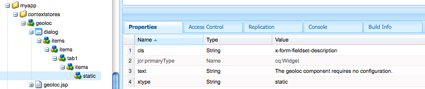

# Contexto do cliente em Detalhe{#client-context-in-detail}

>[!NOTE]
>
>O Contexto do cliente foi substituído pelo ContextHub. Consulte a [documentação relacionada](/help/sites-developing/contexthub.md) para obter detalhes.

O Contexto do cliente representa uma coleção de dados do usuário agrupados dinamicamente. Você pode usar os dados para determinar o conteúdo a ser exibido em uma página da Web em uma determinada situação (direcionamento de conteúdo). Os dados também estão disponíveis para análises de sites e para qualquer javascript na página.

O Contexto do cliente consiste principalmente nos seguintes aspectos:

* O armazenamento da sessão, que contém os dados do usuário.
* A interface que exibe os dados do usuário e fornece ferramentas para simular a experiência do usuário.
* Uma [API javascript](/help/sites-developing/ccjsapi.md) para interagir com armazenamentos de sessão.

Para criar um armazenamento de sessão independente e adicioná-lo ao Contexto do cliente, ou criar um armazenamento de sessão vinculado a um componente do Repositório de contexto. AEM instala vários componentes da Context Store que podem ser usados imediatamente. Você pode usar esses componentes como base para seus componentes.

Para obter informações sobre como abrir o Contexto do cliente, configurar as informações exibidas e simular a experiência do usuário, consulte [Contexto do cliente](/help/sites-administering/client-context.md).

## Repositórios de Sessão {#session-stores}

O Contexto do cliente inclui vários armazenamentos de sessão que contêm dados do usuário. Os dados de armazenamento vêm das seguintes fontes:

* O navegador da Web do cliente.
* O servidor (consulte [JSONP Store](/help/sites-administering/client-context.md#main-pars-variable-8) para armazenar informações de fontes de terceiros)

A estrutura Contexto do cliente fornece uma [API javascript](/help/sites-developing/ccjsapi.md) que você pode usar para interagir com armazenamentos de sessão para ler e gravar dados do usuário, além de ouvir e reagir a eventos de armazenamento. Você também pode criar armazenamentos de sessão para dados de usuário que você usa para direcionamento de conteúdo ou outros fins.

Os dados do armazenamento da sessão permanecem no cliente. O Contexto do cliente não grava dados de volta no servidor. Para enviar dados ao servidor, use um formulário ou desenvolva um javascript personalizado.

Cada armazenamento de sessão é uma coleção de pares de valores de propriedade. O armazenamento de sessões representa uma coleção de dados (de qualquer tipo) cujo significado conceitual pode ser decidido pelo designer e/ou desenvolvedor. O exemplo de código javascript a seguir define um objeto que representa os dados do perfil que o armazenamento da sessão pode conter:

```
{
  age: 20,
  authorizableId: "aparker@geometrixx.info",
  birthday: "27 Feb 1992",
  email: "aparker@geometrixx.info",
  formattedName: "Alison Parker",
  gender: "female",
  path: "/home/users/geometrixx/aparker@geometrixx.info/profile"
}
```

Um armazenamento de sessão pode ser persistente em sessões do navegador ou pode durar apenas para a sessão do navegador em que é criado.

>[!NOTE]
>
>A persistência de armazenamento usa o armazenamento do navegador ou os cookies (o cookie `SessionPersistence`). O armazenamento do navegador é mais comum.
>
>Quando o navegador é fechado e reaberto, um armazenamento de sessão pode ser carregado com os valores de um armazenamento persistente. A limpeza do cache do navegador é necessária para remover os valores antigos.

### Componentes do Context Store {#context-store-components}

Um componente de armazenamento de contexto é um componente CQ que pode ser adicionado ao Contexto do cliente. Normalmente, os componentes do armazenamento de contexto exibem dados de um armazenamento de sessão ao qual estão associados. No entanto, as informações que os componentes do armazenamento de contexto exibem não se limitam aos dados do armazenamento de sessão.

Os componentes do armazenamento de contexto podem incluir os seguintes itens:

* Scripts JSP que definem a aparência no Contexto do cliente.
* Propriedades para listar o componente no Sidekick.
* Edite as caixas de diálogo para configurar instâncias de componente.
* Javascript que inicializa o armazenamento de sessão.

Para obter uma descrição dos componentes instalados do Context Store que podem ser adicionados ao Context Store, consulte [Componentes de contexto do cliente disponíveis](/help/sites-administering/client-context.md#available-client-context-components).

>[!NOTE]
>
>Os Dados da página não estão mais no contexto do cliente como um componente padrão. Se necessário, você pode adicionar isso editando o contexto do cliente, adicionando o componente **Propriedades genéricas de armazenamento** e configurando-o para definir **Loja** como `pagedata`.

### Delivery de conteúdo direcionado {#targeted-content-delivery}

As informações do perfil também são usadas para fornecer [conteúdo direcionado](/help/sites-authoring/content-targeting-touch.md).

 

## Adicionando o contexto do cliente a uma página {#adding-client-context-to-a-page}

Inclua o componente Contexto do cliente na seção de corpo de suas páginas da Web para ativar o Contexto do cliente. O caminho do nó do componente Contexto do cliente é `/libs/cq/personalization/components/clientcontext`. Para incluir o componente, adicione o seguinte código ao arquivo JSP do componente de sua página, localizado logo abaixo do elemento `body` da sua página:

```java
<cq:include path="clientcontext" resourceType="cq/personalization/components/clientcontext"/>
```

O componente clientcontext faz com que a página carregue as bibliotecas do cliente que implementam o Client Context.

* A API javascript de contexto do cliente.
* A estrutura de contexto do cliente que suporta armazenamentos de sessão, gerenciamento de eventos etc.
* Segmentos definidos.
* Os scripts init.js gerados para cada componente de armazenamento de contexto que foi adicionado ao Contexto do cliente.
* (Somente instância do autor) A interface do usuário de contexto do cliente.

A interface do usuário de contexto do cliente está disponível somente na instância do autor.

## Extensão do contexto do cliente {#extending-client-context}

Para estender o Contexto do cliente, crie um armazenamento de sessão e, opcionalmente, exiba os dados do armazenamento:

* Crie um armazenamento de sessão para os dados do usuário necessários para o direcionamento de conteúdo e análises da Web.
* Crie um componente de armazenamento de contexto para permitir que os administradores configurem o armazenamento de sessão associado e exibam dados de armazenamento no Contexto do cliente para fins de teste.

>[!NOTE]
>
>Se você tiver (ou criar) um serviço `JSONP` que possa fornecer os dados, basta usar o componente de armazenamento de contexto `JSONP` e mapeá-lo para o serviço JSONP. Isso lidará com o armazenamento de sessão.

### Criando um Repositório de Sessões {#creating-a-session-store}

Crie um armazenamento de sessão para os dados que você precisa adicionar e recuperar do Contexto do cliente. Geralmente, você usa o seguinte procedimento para criar um armazenamento de sessão:

1. Crie uma pasta de biblioteca de cliente que tenha um valor de propriedade `categories` de `personalization.stores.kernel`. O Client Context carrega automaticamente as bibliotecas clientes desta categoria.

1. Configure a pasta da biblioteca do cliente para que ela tenha uma dependência na pasta `personalization.core.kernel` da biblioteca do cliente. A biblioteca do cliente `personalization.core.kernel` fornece a API javascript de contexto do cliente.

1. Adicione o javascript que cria e inicializa o armazenamento da sessão.

A inclusão do javascript na biblioteca de cliente personalization.stores.kernel faz com que a loja seja criada quando a estrutura Contexto do cliente for carregada.

>[!NOTE]
>
>Se você estiver criando um armazenamento de sessão como parte de um componente de armazenamento de contexto, poderá colocar o javascript no arquivo init.js.jsp do componente. Nesse caso, o armazenamento de sessão é criado somente se o componente for adicionado ao Contexto do cliente.

#### Tipos de armazenamentos de sessão {#types-of-session-stores}

Os armazenamentos de sessão são criados e disponibilizados durante uma sessão do navegador, ou são mantidos no armazenamento do navegador ou em cookies. A API javascript de contexto do cliente define várias classes que representam ambos os tipos de armazenamentos de dados:

* ` [CQ_Analytics.SessionStore](/help/sites-developing/ccjsapi.md#cq-analytics-sessionstore)`: Esses objetos residem apenas no DOM da página. Os dados são criados e persistentes durante a vida útil da página.
* ` [CQ_Analytics.PerstistedSessionStore](/help/sites-developing/ccjsapi.md#cq-analytics-persistedsessionstore)`: Esses objetos residem no DOM da página e são persistentes no armazenamento do navegador ou nos cookies. Os dados estão disponíveis nas páginas e nas sessões do usuário.

A API também fornece extensões dessas classes especializadas para armazenar dados JSON ou dados JSONP:

* Objetos somente para sessão: [CQ_Analytics.JSONStore](/help/sites-developing/ccjsapi.md#cq-analytics-jsonstore) e [CQ_Analytics.JSONPStore](/help/sites-developing/ccjsapi.md#cq-analytics-jsonpstore).

* Objetos persistentes: [CQ_Analytics.PersistedJSONStore](/help/sites-developing/ccjsapi.md#cq-analytics-persistedjsonstore) e [CQ_Analytics.PersistedJSONPStore](/help/sites-developing/ccjsapi.md#cq-analyics-persistedjsonpstore).

#### Criando o objeto de armazenamento de sessão {#creating-the-session-store-object}

O javascript da pasta da biblioteca do cliente cria e inicializa o armazenamento da sessão. O armazenamento de sessão deve ser registrado usando o Gerenciador de armazenamento de contexto. O exemplo a seguir cria e registra um objeto [CQ_Analytics.SessionStore](/help/sites-developing/ccjsapi.md#cq-analytics-sessionstore).

```
//Create the session store
if (!CQ_Analytics.MyStore) {
    CQ_Analytics.MyStore = new CQ_Analytics.SessionStore();
    CQ_Analytics.MyStore.STOREKEY = "MYSTORE";
    CQ_Analytics.MyStore.STORENAME = "mystore";
    CQ_Analytics.MyStore.data={};
}
//register the session store
if (CQ_Analytics.ClientContextMgr){
    CQ_Analytics.ClientContextMgr.register(CQ_Analytics.MyStore)
}
```

Para armazenar dados JSON, o exemplo a seguir cria e registra um objeto [CQ_Analytics.JSONStore](/help/sites-developing/ccjsapi.md#cq-analytics-sessionstore).

```
if (!CQ_Analytics.myJSONStore) {
    CQ_Analytics.myJSONStore = CQ_Analytics.JSONStore.registerNewInstance("myjsonstore",{});
}
```

### Criação de um componente de armazenamento de contexto {#creating-a-context-store-component}

Crie um componente de armazenamento de contexto para renderizar dados de armazenamento de sessão no Contexto do cliente. Depois de criado, você pode arrastar seu componente de armazenamento de contexto para o Contexto do cliente para renderizar dados de um armazenamento de sessão. Os componentes do armazenamento de contexto consistem nos seguintes itens:

* Script JSP para renderizar os dados.
* Uma caixa de diálogo de edição.
* Um script JSP para inicializar o armazenamento de sessão.
* (Opcional) Uma pasta da biblioteca do cliente que cria o armazenamento da sessão. Não há necessidade de incluir a pasta da biblioteca do cliente se o componente usar um armazenamento de sessão existente.

#### Extensão dos componentes fornecidos do armazenamento de contexto {#extending-the-provided-context-store-components}

AEM fornece os componentes de armazenamento de contexto genéricos e propriedades de armazenamento genérico que podem ser estendidos. A estrutura dos dados da loja determina o componente que você estende:

* Pares de valor de propriedade: Estenda o componente `GenericStoreProperties`. Esse componente renderiza automaticamente armazenamentos de pares de valor de propriedade. Vários pontos de interação são fornecidos:

   * `prolog.jsp` e  `epilog.jsp`: interação do componente que permite adicionar lógica do lado do servidor antes ou depois da renderização do componente.

* Dados complexos: Estenda o componente `GenericStore`. Seu armazenamento de sessão precisará de um método de &quot;renderizador&quot; que será chamado sempre que o componente precisar ser renderizado. A função renderizadora é chamada com dois parâmetros:

   * `@param {String} store`
A loja a ser renderizada

   * `@param {String} divId`
Id da div na qual o armazenamento deve ser renderizado.

>[!NOTE]
>
>Todos os componentes de Contexto do cliente são extensões dos componentes Loja genérica ou Propriedades genéricas da loja. Vários exemplos estão instalados na pasta `/libs/cq/personalization/components/contextstores`.

#### Configuração da aparência no Sidekick {#configuring-the-appearance-in-sidekick}

Ao editar o Contexto do cliente, os componentes do armazenamento de contexto são exibidos no Sidekick. Como em todos os componentes, as propriedades `componentGroup` e `jcr:title` do componente de contexto do cliente determinam o grupo e o nome do componente.

Todos os componentes que têm um valor de propriedade `componentGroup` de `Client Context` são exibidos no Sidekick por padrão. Se você usar um valor diferente para a propriedade `componentGroup`, deverá adicionar manualmente o componente ao Sidekick usando o modo Design.

#### Instâncias do componente de armazenamento de contexto {#context-store-component-instances}

Quando você adiciona um componente de armazenamento de contexto ao Contexto do cliente, um nó que representa a instância do componente é criado abaixo de `/etc/clientcontext/default/content/jcr:content/stores`. Este nó contém os valores de propriedade que estão configurados usando a caixa de diálogo de edição do componente.

Quando o Contexto do cliente é inicializado, esses nós são processados.

#### Inicializando o Repositório de Sessões Associado {#initializing-the-associated-session-store}

Adicione um arquivo init.js.jsp ao seu componente para gerar um código javascript que inicializa o armazenamento de sessão que seu componente de armazenamento de contexto usa. Por exemplo, use o script de inicialização para recuperar as propriedades de configuração do componente e use-as para preencher o armazenamento da sessão.

O javascript gerado é adicionado à página quando o Contexto do cliente é inicializado no carregamento da página nas instâncias de autor e publicação. Esse JSP é executado antes que a instância do componente de armazenamento de contexto seja carregada e renderizada.

O código deve definir o tipo mime do arquivo como `text/javascript`, ou não é executado.

>[!CAUTION]
>
>O script init.js.jsp é executado na instância de autor e publicação, mas somente se o componente de armazenamento de contexto for adicionado ao Contexto do cliente.

O procedimento a seguir cria o arquivo de script init.js.jsp e adiciona o código que define o tipo mime correto. O código que executa a inicialização da loja seria seguido.

1. Clique com o botão direito do mouse no nó do componente de armazenamento de contexto e clique em Criar > Criar arquivo.
1. No campo Nome, digite `init.js.jsp` e clique em OK.
1. Na parte superior da página, adicione o seguinte código e clique em Salvar tudo.

   ```java
   <%@page contentType="text/javascript" %>
   ```

### Renderizando dados do armazenamento de sessão para componentes {#rendering-session-store-data-for-genericstoreproperties-components} do Genericstoreproperties

Exibir dados de armazenamento de sessão no Contexto do cliente usando um formato consistente.

#### Exibição de dados de propriedade {#displaying-property-data}

A tag de personalização fornece a tag `personalization:storePropertyTag` que exibe o valor de uma propriedade de um armazenamento de sessão. Para usar a tag, inclua a seguinte linha de código no arquivo JSP:

```xml
<%@taglib prefix="personalization" uri="https://www.day.com/taglibs/cq/personalization/1.0" %>
```

A tag tem o seguinte formato:

```xml
<personalization:storePropertyTag propertyName="property_name" store="session_store_name"/>
```

O atributo `propertyName` é o nome da propriedade store a ser exibida. O atributo `store` é o nome do repositório registrado. A tag de exemplo a seguir exibe o valor da propriedade `authorizableId` do armazenamento `profile`:

```xml
<personalization:storePropertyTag propertyName="authorizableId" store="profile"/>
```

#### Estrutura HTML {#html-structure}

A pasta da biblioteca do cliente personalization.ui (/etc/clientlibs/Foundation/personalization/ui/temas/default) fornece os estilos CSS que o Client Context usa para formatar o código HTML. O código a seguir ilustra a estrutura sugerida a ser usada para exibir dados de armazenamento:

```xml
<div class="cq-cc-store">
   <div class="cq-cc-thumbnail">
      <div class="cq-cc-store-property">
           <!-- personalization:storePropertyTag for the store thumbnail image goes here -->
      </div>
   </div>
   <div class="cq-cc-content">
       <div class="cq-cc-store-property cq-cc-store-property-level0">
           <!-- personalization:storePropertyTag for a store property goes here -->
       </div>
       <div class="cq-cc-store-property cq-cc-store-property-level1">
           <!-- personalization:storePropertyTag for a store property goes here -->
       </div>
       <div class="cq-cc-store-property cq-cc-store-property-level2">
           <!-- personalization:storePropertyTag for a store property goes here -->
       </div>
       <div class="cq-cc-store-property cq-cc-store-property-level3">
           <!-- personalization:storePropertyTag for a store property goes here -->
       </div>
   </div>
   <div class="cq-cc-clear"></div>
</div>
```

O componente de armazenamento de contexto `/libs/cq/personalization/components/contextstores/profiledata` usa essa estrutura para exibir dados do armazenamento de sessão de perfil. A classe `cq-cc-thumbnail` coloca a imagem em miniatura. As classes `cq-cc-store-property-level*x*` formatam os dados alfanuméricos:

* level0, level1 e level2 são distribuídos verticalmente e usam uma fonte branca.
* level3 e quaisquer níveis adicionais são distribuídos horizontalmente e usam uma fonte branca com um fundo mais escuro.


### Renderizando dados do armazenamento da sessão para componentes do genéricstore {#rendering-session-store-data-for-genericstore-components}

Para renderizar dados de armazenamento usando um componente de repositório genérico, é necessário:

* Adicione a tag personalization:storeRendererTag ao script JSP do componente para identificar o nome do armazenamento da sessão.
* Implemente um método renderizador na classe session store.

#### Identificação do armazenamento de Sessão do Genericstore {#identifying-the-genericstore-session-store}

A tag de personalização fornece a tag `personalization:storePropertyTag` que exibe o valor de uma propriedade de um armazenamento de sessão. Para usar a tag, inclua a seguinte linha de código no arquivo JSP:

```xml
<%@taglib prefix="personalization" uri="https://www.day.com/taglibs/cq/personalization/1.0" %>
```

A tag tem o seguinte formato:

```java
<personalization:storeRendererTag store="store_name"/>
```

#### Implementação do método de renderização do Repositório de Sessões {#implementing-the-session-store-renderer-method}

Seu armazenamento de sessão precisará de um método de &quot;renderizador&quot; que será chamado sempre que o componente precisar ser renderizado. A função renderizadora é chamada com dois parâmetros:

* repositório @param {String}
A loja a ser renderizada
* @param {String} divId
Id da div na qual o armazenamento deve ser renderizado.

## Interagindo com os Repositórios de Sessão {#interacting-with-session-stores}

Use o javascript para interagir com armazenamentos de sessão.

### Acessar as lojas de sessão {#accessing-session-stores}

Obtenha um objeto de armazenamento de sessão para ler ou gravar dados na loja. [CQ_Analytics.](/help/sites-developing/ccjsapi.md#cq-analytics-clientcontextmgr) ClientContextMgrfornece acesso a lojas com base no nome da loja. Depois de obtido, use os métodos de [CQ_Analytics.SessionStore](/help/sites-developing/ccjsapi.md#cq-analytics-sessionstore) ou [CQ_Analytics.PersistedSessionStore](/help/sites-developing/ccjsapi.md#cq-analytics-persistedsessionstore) para interagir com os dados de armazenamento.

O exemplo a seguir obtém a loja `profile` e recupera a propriedade `formattedName` da loja.

```
function getName(){
   var profilestore = CQ_Analytics.ClientContextMgr.getRegisteredStore("profile");
   if(profilestore){
      return profilestore.getProperty("formattedName", false);
   } else {
      return null;
   }
}
```

### Criação de um Listener para reagir a uma Atualização do Session Store {#creating-a-listener-to-react-to-a-session-store-update}

A sessão armazena eventos de disparo, de modo que é possível adicionar ouvintes e eventos de disparo com base nesses eventos.

Os armazenamentos de sessão são criados no padrão `Observable`. Eles estendem [ `CQ_Analytics.Observable`](/help/sites-developing/ccjsapi.md#cq-analytics-observable) que fornece o método ` [addListener](/help/sites-developing/ccjsapi.md#addlistener-event-fct-scope)`.

O exemplo a seguir adiciona um ouvinte ao evento `update` do armazenamento de sessão `profile`.

```
var profileStore = ClientContextMgr.getRegisteredStore("profile");
if( profileStore ) {
  //callback execution context
  var executionContext = this;

  //add "update" event listener to store
  profileStore.addListener("update",function(store, property) {
    //do something on store update

  },executionContext);
}
```

### Verificando se um Repositório de Sessões está definido e inicializado {#checking-that-a-session-store-is-defined-and-initialized}

Os armazenamentos de sessão não estão disponíveis até que sejam carregados e inicializados com dados. Os seguintes fatores podem afetar o tempo de disponibilidade do armazenamento da sessão:

* Carregamento de página
* Carregamento do JavaScript
* Tempo de execução do JavaScript
* Tempo de resposta para solicitações XHR
* Alterações dinâmicas no repositório de sessão

Use os métodos [CQ_Analytics.ClientContextUtils](/help/sites-developing/ccjsapi.md#cq-analytics-clientcontextutils) do objeto [onStoreRegistered](/help/sites-developing/ccjsapi.md#onstoreregistered-storename-callback) e [onStoreInitialized](/help/sites-developing/ccjsapi.md#onstoreinitialized-storename-callback-delay) para acessar os armazenamentos de sessão somente quando eles estiverem disponíveis. Esses métodos permitem registrar ouvintes de eventos que reagem aos eventos de registro e inicialização da sessão.

>[!CAUTION]
>
>Se você depender de outra loja, precisará atender o caso de a loja nunca estar registrada.

O exemplo a seguir usa o evento `onStoreRegistered` do armazenamento de sessão `profile`. Quando a loja é registrada, um ouvinte é adicionado ao evento `update` do armazenamento da sessão. Quando a loja é atualizada, o conteúdo do elemento `<div class="welcome">` na página é atualizado com o nome da loja `profile`.

```
//listen for the store registration
CQ_Analytics.ClientContextUtils.onStoreRegistered("profile", listen);

//listen for the store's update event
function listen(){
 var profilestore = CQ_Analytics.ClientContextMgr.getRegisteredStore("profile");
    profilestore.addListener("update",insertName);
}

//insert the welcome message
function insertName(){
 $("div.welcome").text("Welcome "+getName());
}

//obtain the name from the profile store
function getName(){
 var profilestore = CQ_Analytics.ClientContextMgr.getRegisteredStore("profile");
 if(profilestore){
  return profilestore.getProperty("formattedName", false);
    } else {
        return null;
    }
}
```

### Excluindo uma propriedade do cookie sessionpersistence {#excluding-a-property-from-the-sessionpersistence-cookie}

Para impedir que uma propriedade de `PersistedSessionStore` seja persistente (isto é, exclua-a do cookie `sessionpersistence`), adicione a propriedade à lista de propriedade não persistente do armazenamento de sessão persistente.

Consulte ` [CQ_Analytics.PersistedSessionStore.setNonPersisted(propertyName)](/help/sites-developing/ccjsapi.md#setnonpersisted-name)`

```
CQ_Analytics.ClientContextUtils.onStoreRegistered("surferinfo", function(store) {
  //this will exclude the browser, OS and resolution properties of the surferinfo session store from the
  store.setNonPersisted("browser");
  store.setNonPersisted("OS");
  store.setNonPersisted("resolution");
});
```

## Configurando o controle deslizante do dispositivo {#configuring-the-device-slider}

### Condições {#conditions}

A página atual deve ter uma página móvel correspondente; isso é determinado somente se a página tiver um LiveCopy configurado com uma configuração de implantação móvel ( `rolloutconfig.path.toLowerCase` contém `mobile`).

#### Configuração {#configuration}

Ao alternar da página da área de trabalho para seu equivalente móvel:

* O DOM da página móvel é carregado.
* O principal `div` (obrigatório) que contém o conteúdo é extraído e injetado na página da área de trabalho atual.

* As classes CSS e body que precisam ser carregadas precisam ser configuradas manualmente.

Por exemplo:

```
window.CQMobileSlider["geometrixx-outdoors"] = {
  //CSS used by desktop that need to be removed when mobile
  DESKTOP_CSS: [
    "/etc/designs/${app}/clientlibs_desktop_v1.css"
  ],

  //CSS used by mobile that need to be removed when desktop
  MOBILE_CSS: [
    "/etc/designs/${app}/clientlibs_mobile_v1.css"
  ],

  //id of the content that needs to be removed when mobile
  DESKTOP_MAIN_ID: "main",

  //id of the content that needs to be removed when desktop
  MOBILE_MAIN_ID: "main",

  //body classes used by desktop that need to be removed when mobile
  DESKTOP_BODY_CLASS: [
    "page"
  ],

  //body classes used by mobile that need to be removed when desktop
  MOBILE_BODY_CLASS: [
    "page-mobile"
  ]
};
```

## Exemplo: Criação de um componente de armazenamento de contexto personalizado {#example-creating-a-custom-context-store-component}

Neste exemplo, você cria um componente de armazenamento de contexto que recupera dados de um serviço externo e os armazena no armazenamento de sessão:

* Estende o componente genérico storeproperties.
* Inicializa uma loja usando um objeto javascript CQ_Analytics.JSONPStore.
* Chama um serviço JSONP para recuperar dados e adicioná-los à loja.
* Renderiza os dados no Contexto do cliente.

### Adicionar o componente geoloc {#add-the-geoloc-component}

Crie um aplicativo CQ e adicione o componente geoloc.

1. Abra o CRXDE Lite no navegador da Web ([https://localhost:4502/crx/de](https://localhost:4502/crx/de)).
1. Clique com o botão direito do mouse na pasta `/apps` e clique em Criar > Criar pasta. Especifique um nome de `myapp` e clique em OK.
1. Da mesma forma, abaixo de `myapp`, crie uma pasta chamada `contextstores`. &quot;
1. Clique com o botão direito do mouse na pasta `/apps/myapp/contextstores` e clique em Criar > Criar componente. Especifique os seguintes valores de propriedade e clique em Avançar:

   * Rótulo: geoloc
   * Título: Loja de localização
   * Supertipo: cq/personalization/components/contextstores/genericstoreproperties
   * Grupo: Contexto do cliente

1. Na caixa de diálogo Criar componente, clique em Avançar em cada página até que o botão OK esteja ativado e clique em OK.
1. Clique em Salvar tudo.

### Criar a caixa de diálogo Editar geoloc {#create-the-geoloc-edit-dialog}

O componente de armazenamento de contexto requer uma caixa de diálogo de edição. A caixa de diálogo de edição geográfica conterá uma mensagem estática que indica que não há propriedades para configurar.

1. Clique com o botão direito do mouse no nó `/libs/cq/personalization/components/contextstores/genericstoreproperties/dialog` e clique em Copiar.
1. Clique com o botão direito do mouse no nó `/apps/myapp/contextstores/geoloc` e clique em colar.
1. Exclua todos os nós filho abaixo do nó /apps/myapp/contextstores/geoloc/dialog/items/items/tab1/items:

   * loja
   * propriedades
   * miniatura

1. Clique com o botão direito do mouse no nó `/apps/myapp/contextstores/geoloc/dialog/items/items/tab1/items` e clique em Criar > Criar nó. Especifique os seguintes valores de propriedade e clique em OK:

   * Nome: estática
   * Tipo: cq:Widget

1. Adicione as seguintes propriedades ao nó:

   | Nome | Tipo | Valor |
   |---|---|---|
   | cls | Sequência de caracteres | x-form-fieldset-description |
   | texto | Sequência de caracteres | O componente geoloc não requer configuração. |
   | xtype | Sequência de caracteres | estáticas |

1. Clique em Salvar tudo.

   

### Criar o script de inicialização {#create-the-initialization-script}

Adicione um arquivo init.js.jsp ao componente geoloc e use-o para criar o armazenamento da sessão, recuperar os dados de localização e adicioná-los à loja.

O arquivo init.js.jsp é executado quando o Contexto do cliente é carregado pela página. Nesse momento, a API javascript de contexto do cliente é carregada e está disponível para seu script.

1. Clique com o botão direito do mouse no nó /apps/myapp/contextstores/geoloc e clique em Criar > Criar arquivo. Especifique um Nome de init.js.jsp e clique em OK.
1. Adicione o seguinte código à parte superior da página e clique em Salvar tudo.

   ```java
   <%@page contentType="text/javascript;charset=utf-8" %><%
   %><%@include file="/libs/foundation/global.jsp"%><%
   log.info("***** initializing geolocstore ****");
   String store = "locstore";
   String jsonpurl = "https://api.wipmania.com/jsonp?callback=${callback}";
   
   %>
   var locstore = CQ_Analytics.StoreRegistry.getStore("<%= store %>");
   if(!locstore){
    locstore = CQ_Analytics.JSONPStore.registerNewInstance("<%= store %>", "<%= jsonpurl %>",{});
   }
   <% log.info(" ***** done initializing geoloc ************"); %>
   ```

### Renderizar os dados do armazenamento de sessão geoloc {#render-the-geoloc-session-store-data}

Adicione o código ao arquivo JSP do componente geoloc para renderizar os dados de armazenamento no Contexto do cliente.


1. No CRXDE Lite, abra o arquivo `/apps/myapp/contextstores/geoloc/geoloc.jsp`.
1. Adicione o seguinte código HTML abaixo do código stub:

   ```xml
   <%@taglib prefix="personalization" uri="https://www.day.com/taglibs/cq/personalization/1.0" %>
   <div class="cq-cc-store">
      <div class="cq-cc-content">
          <div class="cq-cc-store-property cq-cc-store-property-level0">
              Continent: <personalization:storePropertyTag propertyName="address/continent" store="locstore"/>
          </div>
          <div class="cq-cc-store-property cq-cc-store-property-level1">
              Country: <personalization:storePropertyTag propertyName="address/country" store="locstore"/>
          </div>
          <div class="cq-cc-store-property cq-cc-store-property-level2">
              City: <personalization:storePropertyTag propertyName="address/city" store="locstore"/>
          </div>
          <div class="cq-cc-store-property cq-cc-store-property-level3">
              Latitude: <personalization:storePropertyTag propertyName="latitude" store="locstore"/>
          </div>
          <div class="cq-cc-store-property cq-cc-store-property-level4">
              Longitude: <personalization:storePropertyTag propertyName="longitude" store="locstore"/>
          </div>
      </div>
       <div class="cq-cc-clear"></div>
   </div>
   ```

1. Clique em Salvar tudo.

### Adicionar o componente ao contexto do cliente {#add-the-component-to-client-context}

Adicione o componente Local Store ao Contexto do cliente para que ele seja inicializado quando a página for carregada.

1. Abra o home page Geometrixx Outdoors na instância do autor ([https://localhost:4502/content/geometrixx-outdoors/en.html](https://localhost:4502/content/geometrixx-outdoors/en.html)).
1. Clique em Ctrl-Alt-c (windows) ou control-option-c (Mac) para abrir o Contexto do cliente.
1. Clique no ícone de edição na parte superior do Contexto do cliente para abrir o Designer de contexto do cliente.

   

1. Arraste o componente Local Store para o Contexto do cliente.

### Consulte Informações de localização no contexto do cliente {#see-the-location-information-in-client-context}

Abra o home page Geometrixx Outdoors no modo de edição e, em seguida, abra o Contexto do cliente para ver os dados do componente Armazenamento de localização.

1. Abra a página em inglês do site de Geometrixx Outdoors. ([https://localhost:4502/content/geometrixx-outdoors/en.html](https://localhost:4502/content/geometrixx-outdoors/en.html))
1. Para abrir o Contexto do cliente, pressione Ctrl-Alt-c (windows) ou control-option-c (Mac).

## Criando um Contexto de Cliente Personalizado {#creating-a-customized-client-context}

Para criar um segundo contexto de cliente, é necessário duplicado da ramificação:

`/etc/clientcontext/default`

* A subpasta:
   `/content`
conterá o conteúdo do contexto personalizado do cliente.

* A pasta:
   `/contextstores`
permite definir configurações diferentes para os armazenamentos de contexto.

Para usar o contexto personalizado do cliente, edite a propriedade
`path`
no estilo de design do componente de contexto do cliente, conforme incluído no modelo da página. Por exemplo, como o local padrão de:
`/libs/cq/personalization/components/clientcontext/design_dialog/items/path`
