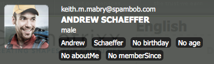

# Contexto do cliente em detalhes{#client-context-in-detail}

>[!NOTE]
>
>O Client Context foi substituído pelo ContextHub. Consulte a [documentação relacionada](/help/sites-developing/contexthub.md) para obter detalhes.

O Client Context representa uma coleção de dados do usuário montada dinamicamente. Você pode usar os dados para determinar o conteúdo a ser exibido em uma página da Web em uma determinada situação (direcionamento de conteúdo). Os dados também estão disponíveis para análise de site e para qualquer JavaScript na página.

O Contexto do cliente consiste principalmente nos seguintes aspectos:

* O armazenamento de sessão que contém os dados do usuário.
* A interface que exibe os dados do usuário e fornece ferramentas para simular a experiência do usuário.
* Uma [API do JavaScript](/help/sites-developing/ccjsapi.md) para interagir com armazenamentos de sessão.

Para criar um armazenamento de sessão independente e adicioná-lo ao Contexto do cliente, ou criar um armazenamento de sessão vinculado a um componente do Armazenamento de contexto. O Adobe Experience Manager (AEM) instala vários componentes do Context Store que você pode usar imediatamente. Você pode usar esses componentes como base para seus componentes.

Para obter informações sobre como abrir o Client Context, configurar as informações exibidas e simular a experiência do usuário, consulte [Client Context](/help/sites-administering/client-context.md).

## Lojas de sessão {#session-stores}

O Client Context inclui vários armazenamentos de sessão que contêm dados do usuário. Os dados da loja vêm das seguintes fontes:

* O navegador Web do cliente.
* O servidor (consulte [Armazenamento JSONP](/help/sites-administering/client-context.md#main-pars-variable-8) para armazenar informações de fontes de terceiros)

A estrutura do Client Context fornece uma [API JavaScript](/help/sites-developing/ccjsapi.md) que você pode usar para interagir com armazenamentos de sessão para ler e gravar dados do usuário, além de ouvir e reagir a eventos de armazenamento. Você também pode criar armazenamentos de sessão para dados de usuário que você usa para direcionamento de conteúdo ou outros fins.

Os dados do repositório de sessão permanecem no cliente. O Client Context não grava dados no servidor. Para enviar dados ao servidor, use um formulário ou desenvolva um JavaScript personalizado.

Cada armazenamento de sessão é uma coleção de pares de valor de propriedade. O armazenamento de sessão representa uma coleção de dados (de qualquer tipo), cujo significado conceitual pode ser decidido pelo designer ou desenvolvedor, ou ambos. O exemplo de código JavaScript a seguir define um objeto que representa os dados do perfil que o armazenamento de sessão pode conter:

```
{
  age: 20,
  authorizableId: "aparker@geometrixx.info",
  birthday: "27 Feb 1992",
  email: "aparker@geometrixx.info",
  formattedName: "Alison Parker",
  gender: "female",
  path: "/home/users/geometrixx/aparker@geometrixx.info/profile"
}
```

Um armazenamento de sessão pode ser mantido entre sessões do navegador ou pode durar somente para a sessão do navegador em que foi criado.

>[!NOTE]
>
>A persistência de armazenamento usa o armazenamento do navegador ou cookies (o cookie `SessionPersistence`). O armazenamento do navegador é mais comum.
>
>Quando o navegador é fechado e reaberto, um armazenamento de sessão pode ser carregado com os valores de um armazenamento persistente. É necessário limpar o cache do navegador para remover os valores antigos.

### Componentes do armazenamento de contexto {#context-store-components}

Um componente do armazenamento de contexto é um componente do CQ que pode ser adicionado ao Client Context. Normalmente, os componentes do armazenamento de contexto exibem dados de um armazenamento de sessão ao qual estão associados. No entanto, as informações que os componentes do armazenamento de contexto exibem não estão limitadas aos dados do armazenamento de sessão.

Os componentes do armazenamento de contexto podem incluir os seguintes itens:

* Scripts JSP que definem a aparência no Client Context.
* Propriedades para listar o componente no Sidekick.
* Editar caixas de diálogo para configurar instâncias de componentes.
* JavaScript que inicializa o armazenamento de sessão.

Para obter uma descrição dos Componentes do Context Store instalados que você pode adicionar ao Context Store, consulte [Componentes do Client Context Store disponíveis](/help/sites-administering/client-context.md#available-client-context-components).

>[!NOTE]
>
>Os dados de página não estão mais no contexto do cliente como um componente padrão. Se necessário, você pode adicionar isso editando o contexto do cliente, adicionando o componente **Propriedades de Repositório Genérico** e configurando para definir o **Repositório** como `pagedata`.

### Entrega de conteúdo direcionada {#targeted-content-delivery}

As informações de perfil também são usadas para entrega de [conteúdo direcionado](/help/sites-authoring/content-targeting-touch.md).

 

## Adicionar O Contexto Do Cliente A Uma Página {#adding-client-context-to-a-page}

Inclua o componente Contexto do cliente na seção de corpo das páginas da Web para ativar o Contexto do cliente. O caminho do nó do componente Client Context é `/libs/cq/personalization/components/clientcontext`. Para incluir o componente, adicione o seguinte código ao arquivo JSP do componente Página, localizado logo abaixo do elemento `body` da sua página:

```java
<cq:include path="clientcontext" resourceType="cq/personalization/components/clientcontext"/>
```

O componente clientcontext faz com que a página carregue as bibliotecas de clientes que implementam o Client Context.

* A API do JavaScript do Client Context.
* A estrutura do Client Context compatível com armazenamentos de sessão, gerenciamento de eventos e assim por diante.
* Segmentos definidos.
* Os scripts init.js gerados para cada componente do armazenamento de contexto que foi adicionado ao Contexto do cliente.
* (Somente instância do autor) A interface do usuário do Client Context.

A interface do usuário do Client Context está disponível somente na instância do autor.

## Extensão do Client Context {#extending-client-context}

Para estender o Client Context, crie um armazenamento de sessão e, como opção, exiba os dados de armazenamento:

* Crie um armazenamento de sessão para os dados de usuário necessários para o direcionamento de conteúdo e a análise da Web.
* Crie um componente de armazenamento de contexto para permitir que os administradores configurem o armazenamento de sessão associado e exibam dados de armazenamento no Client Context para fins de teste.

>[!NOTE]
>
>Se você tiver (ou criar) um serviço `JSONP` que possa fornecer os dados, poderá simplesmente usar o componente de repositório de contexto `JSONP` e mapeá-lo para o serviço JSONP. Isso manipula o armazenamento da sessão.

### Criar um armazenamento de sessão {#creating-a-session-store}

Crie um armazenamento de sessão para os dados que você deve adicionar e recuperar do Client Context. Geralmente, você usa o seguinte procedimento para criar um armazenamento de sessão:

1. Crie uma pasta da biblioteca do cliente que tenha um valor de propriedade `categories` de `personalization.stores.kernel`. O Client Context carrega automaticamente as bibliotecas de clientes desta categoria.

1. Configure a pasta da biblioteca do cliente para que ela tenha uma dependência na pasta da biblioteca do cliente `personalization.core.kernel`. A biblioteca do cliente `personalization.core.kernel` fornece a API JavaScript do Client Context.

1. Adicione a JavaScript que cria e inicializa o armazenamento de sessão.

Incluir o JavaScript na biblioteca do cliente personalization.stores.kernel faz com que o armazenamento seja criado quando a estrutura Client Context é carregada.

>[!NOTE]
>
>Se estiver criando um armazenamento de sessão como parte de um componente do armazenamento de contexto, você pode, como alternativa, colocar o JavaScript no arquivo init.js.jsp do componente. Nesse caso, o armazenamento de sessão será criado somente se o componente for adicionado ao Client Context.

#### Tipos de lojas de sessão {#types-of-session-stores}

Os armazenamentos de sessão são criados e disponibilizados durante uma sessão do navegador ou são mantidos no armazenamento do navegador ou em cookies. A API JavaScript do Client Context define várias classes que representam ambos os tipos de armazenamentos de dados:

* ` [CQ_Analytics.SessionStore](/help/sites-developing/ccjsapi.md#cq-analytics-sessionstore)`: esses objetos residem somente no DOM da página. Os dados são criados e mantidos durante o tempo de vida da página.
* ` [CQ_Analytics.PerstistedSessionStore](/help/sites-developing/ccjsapi.md#cq-analytics-persistedsessionstore)`: esses objetos residem no DOM da página e são mantidos no armazenamento do navegador ou em cookies. Os dados estão disponíveis em todas as páginas e sessões do usuário.

A API também fornece extensões dessas classes especializadas para armazenar dados JSON ou dados JSONP:

* Objetos somente sessão: [CQ_Analytics.JSONStore](/help/sites-developing/ccjsapi.md#cq-analytics-jsonstore) e [CQ_Analytics.JSONPStore](/help/sites-developing/ccjsapi.md#cq-analytics-jsonpstore).

* Objetos persistentes: [CQ_Analytics.PersistedJSONStore](/help/sites-developing/ccjsapi.md#cq-analytics-persistedjsonstore) e [CQ_Analytics.PersistedJSONPStore](/help/sites-developing/ccjsapi.md#cq-analyics-persistedjsonpstore).

#### Criando o objeto de armazenamento da sessão {#creating-the-session-store-object}

O JavaScript da pasta da biblioteca do cliente cria e inicializa o armazenamento de sessão. O armazenamento de sessão deve ser registrado usando o Gerenciador de Armazenamento de Contexto. O exemplo a seguir cria e registra um objeto [CQ_Analytics.SessionStore](/help/sites-developing/ccjsapi.md#cq-analytics-sessionstore).

```
//Create the session store
if (!CQ_Analytics.MyStore) {
    CQ_Analytics.MyStore = new CQ_Analytics.SessionStore();
    CQ_Analytics.MyStore.STOREKEY = "MYSTORE";
    CQ_Analytics.MyStore.STORENAME = "mystore";
    CQ_Analytics.MyStore.data={};
}
//register the session store
if (CQ_Analytics.ClientContextMgr){
    CQ_Analytics.ClientContextMgr.register(CQ_Analytics.MyStore)
}
```

Para armazenar dados JSON, o exemplo a seguir cria e registra um objeto [CQ_Analytics.JSONStore](/help/sites-developing/ccjsapi.md#cq-analytics-sessionstore).

```
if (!CQ_Analytics.myJSONStore) {
    CQ_Analytics.myJSONStore = CQ_Analytics.JSONStore.registerNewInstance("myjsonstore",{});
}
```

### Criação de um componente de armazenamento de contexto {#creating-a-context-store-component}

Crie um componente de armazenamento de contexto para renderizar os dados do armazenamento de sessão no Contexto do Cliente. Depois de criado, você pode arrastar o componente de armazenamento de contexto para o Contexto do cliente para renderizar dados de um armazenamento de sessão. Os componentes do armazenamento de contexto consistem nos seguintes itens:

* Script JSP para renderizar os dados.
* Um diálogo de edição.
* Um script JSP para inicializar o armazenamento de sessão.
* (Opcional) Uma pasta da biblioteca do cliente que cria o armazenamento de sessão. Não há necessidade de incluir a pasta da biblioteca do cliente se o componente usar um armazenamento de sessão existente.

#### Extensão dos componentes fornecidos do armazenamento de contexto {#extending-the-provided-context-store-components}

O AEM fornece os componentes de armazenamento genérico e de armazenamento de contexto genérico das propriedades que você pode estender. A estrutura dos dados de armazenamento determina o componente que você estende:

* Pares de valor de propriedade: estenda o componente `GenericStoreProperties`. Esse componente renderiza automaticamente armazenamentos de pares de valores da propriedade. Vários pontos de interação são fornecidos:

   * `prolog.jsp` e `epilog.jsp`: interação de componente que permite adicionar lógica do lado do servidor antes ou depois da renderização do componente.

* Dados complexos: estenda o componente `GenericStore`. Seu armazenamento de sessão precisa de um método &quot;renderizador&quot; que é chamado sempre que o componente deve ser renderizado. A função do renderizador é chamada com dois parâmetros:

   * `@param {String} store`
O armazenamento a ser renderizado

   * `@param {String} divId`
Id da div na qual o armazenamento deve ser renderizado.

>[!NOTE]
>
>Todos os componentes do Client Context são extensões dos componentes Loja genérica ou Propriedades da Loja genérica. Vários exemplos estão instalados na pasta `/libs/cq/personalization/components/contextstores`.

#### Configuração da aparência no Sidekick {#configuring-the-appearance-in-sidekick}

Ao editar o Contexto do cliente, os componentes do armazenamento de contexto aparecem no Sidekick. Como em todos os componentes, as propriedades `componentGroup` e `jcr:title` do componente de contexto de cliente determinam o grupo e o nome do componente.

Todos os componentes que têm um valor de propriedade `componentGroup` igual a `Client Context` aparecem em Sidekick por padrão. Se você usar um valor diferente para a propriedade `componentGroup`, deverá adicionar manualmente o componente ao Sidekick usando o modo Design.

#### Instâncias do componente de armazenamento de contexto {#context-store-component-instances}

Quando você adiciona um componente de repositório de contexto ao Client Context, um nó que representa a instância do componente é criado abaixo de `/etc/clientcontext/default/content/jcr:content/stores`. Este nó contém os valores de propriedade que são configurados usando a caixa de diálogo de edição do componente.

Quando o Client Context é inicializado, esses nós são processados.

#### Inicializando o Repositório de Sessão Associado {#initializing-the-associated-session-store}

Adicione um arquivo init.js.jsp ao componente para gerar o código JavaScript que inicializa o armazenamento de sessão que seu componente de armazenamento de contexto usa. Por exemplo, use o script de inicialização para recuperar as propriedades de configuração do componente e usá-las para preencher o armazenamento da sessão.

O JavaScript gerado é adicionado à página quando o Contexto do cliente é inicializado no carregamento da página nas instâncias do autor e de publicação. Esta JSP é executada antes que a instância do componente do armazenamento de contexto seja carregada e renderizada.

O código deve definir o tipo MIME do arquivo como `text/javascript`, ou ele não é executado.

>[!CAUTION]
>
>O script init.js.jsp é executado na instância do autor e da publicação, mas somente se o componente do armazenamento de contexto for adicionado ao Contexto do cliente.

O procedimento a seguir cria o arquivo de script init.js.jsp e adiciona o código que define o tipo mime correto. O código que executa a inicialização de armazenamento seguiria.

1. Clique com o botão direito do mouse no nó do componente do armazenamento de contexto e clique em Criar > Criar arquivo.
1. No campo Nome, digite `init.js.jsp` e clique em OK.
1. Na parte superior da página, adicione o seguinte código e clique em Salvar tudo.

   ```java
   <%@page contentType="text/javascript" %>
   ```

### Renderização de Dados de Repositório de Sessão para componentes genericstoreproperties {#rendering-session-store-data-for-genericstoreproperties-components}

Exibir dados de armazenamento de sessão no Contexto do Cliente usando um formato consistente.

#### Exibição de dados de propriedade {#displaying-property-data}

O taglib de personalização fornece a tag `personalization:storePropertyTag` que exibe o valor de uma propriedade de um armazenamento de sessão. Para usar a tag, inclua a seguinte linha de código no arquivo JSP:

```xml
<%@taglib prefix="personalization" uri="https://www.day.com/taglibs/cq/personalization/1.0" %>
```

A tag tem o seguinte formato:

```xml
<personalization:storePropertyTag propertyName="property_name" store="session_store_name"/>
```

O atributo `propertyName` é o nome da propriedade de armazenamento a ser exibida. O atributo `store` é o nome do armazenamento registrado. O exemplo de marca a seguir exibe o valor da propriedade `authorizableId` do armazenamento `profile`:

```xml
<personalization:storePropertyTag propertyName="authorizableId" store="profile"/>
```

#### Estrutura HTML {#html-structure}

A pasta da biblioteca do cliente personalization.ui (/etc/clientlibs/foundation/personalization/ui/themes/default) fornece os estilos CSS que o Contexto do Cliente usa para formatar o código HTML. O código a seguir ilustra a estrutura sugerida para usar na exibição de dados de armazenamento:

```xml
<div class="cq-cc-store">
   <div class="cq-cc-thumbnail">
      <div class="cq-cc-store-property">
           <!-- personalization:storePropertyTag for the store thumbnail image goes here -->
      </div>
   </div>
   <div class="cq-cc-content">
       <div class="cq-cc-store-property cq-cc-store-property-level0">
           <!-- personalization:storePropertyTag for a store property goes here -->
       </div>
       <div class="cq-cc-store-property cq-cc-store-property-level1">
           <!-- personalization:storePropertyTag for a store property goes here -->
       </div>
       <div class="cq-cc-store-property cq-cc-store-property-level2">
           <!-- personalization:storePropertyTag for a store property goes here -->
       </div>
       <div class="cq-cc-store-property cq-cc-store-property-level3">
           <!-- personalization:storePropertyTag for a store property goes here -->
       </div>
   </div>
   <div class="cq-cc-clear"></div>
</div>
```

O componente de repositório de contexto `/libs/cq/personalization/components/contextstores/profiledata` usa esta estrutura para exibir dados do repositório de sessão de perfil. A classe `cq-cc-thumbnail` coloca a imagem da miniatura. As classes `cq-cc-store-property-level*x*` formatam os dados alfanuméricos:

* level0, level1 e level2 são distribuídos verticalmente e usam uma fonte branca.
* o nível 3 e quaisquer níveis adicionais são distribuídos horizontalmente e usam uma fonte branca com um plano de fundo mais escuro.



### Renderização de Dados de Repositório de Sessão para Componentes de repositório genérico {#rendering-session-store-data-for-genericstore-components}

Para renderizar dados de armazenamento usando um componente de armazenamento genérico, faça o seguinte:

* Adicione a tag personalization:storeRendererTag ao script JSP do componente para identificar o nome do armazenamento da sessão.
* Implemente um método de renderizador na classe de armazenamento de sessão.

#### Identificação do armazenamento de sessão genericstore {#identifying-the-genericstore-session-store}

O taglib de personalização fornece a tag `personalization:storePropertyTag` que exibe o valor de uma propriedade de um armazenamento de sessão. Para usar a tag, inclua a seguinte linha de código no arquivo JSP:

```xml
<%@taglib prefix="personalization" uri="https://www.day.com/taglibs/cq/personalization/1.0" %>
```

A tag tem o seguinte formato:

```java
<personalization:storeRendererTag store="store_name"/>
```

#### Implementar o método renderizador de armazenamento de sessão {#implementing-the-session-store-renderer-method}

Seu armazenamento de sessão precisa de um método &quot;renderizador&quot; que é chamado sempre que o componente deve ser renderizado. A função do renderizador é chamada com dois parâmetros:

* @param {String} armazenamento
O armazenamento a ser renderizado
* @param {String} divId
Id da div na qual o armazenamento deve ser renderizado.

## Interagir com armazenamentos de sessão {#interacting-with-session-stores}

Use o JavaScript para interagir com armazenamentos de sessão.

### Acessar lojas de sessão {#accessing-session-stores}

Obtenha um objeto de armazenamento de sessão para ler ou gravar dados no armazenamento. [CQ_Analytics.ClientContextMgr](/help/sites-developing/ccjsapi.md#cq-analytics-clientcontextmgr) fornece acesso aos armazenamentos com base no nome do armazenamento. Depois de obtido, use os métodos do [CQ_Analytics.SessionStore](/help/sites-developing/ccjsapi.md#cq-analytics-sessionstore) ou do [CQ_Analytics.PersistedSessionStore](/help/sites-developing/ccjsapi.md#cq-analytics-persistedsessionstore) para interagir com os dados do armazenamento.

O exemplo a seguir obtém o armazenamento `profile` e recupera a propriedade `formattedName` do armazenamento.

```
function getName(){
   var profilestore = CQ_Analytics.ClientContextMgr.getRegisteredStore("profile");
   if(profilestore){
      return profilestore.getProperty("formattedName", false);
   } else {
      return null;
   }
}
```

### Criando um Listener para reagir a uma Atualização do Repositório da Sessão {#creating-a-listener-to-react-to-a-session-store-update}

A sessão armazena eventos de acionamento, de modo que é possível adicionar ouvintes e acionar eventos com base nesses eventos.

Os armazenamentos de sessão são criados no padrão `Observable`. Eles estendem [`CQ_Analytics.Observable`](/help/sites-developing/ccjsapi.md#cq-analytics-observable) que fornece o método ` [addListener](/help/sites-developing/ccjsapi.md#addlistener-event-fct-scope)`.

O exemplo a seguir adiciona um ouvinte ao evento `update` do armazenamento de sessão `profile`.

```
var profileStore = ClientContextMgr.getRegisteredStore("profile");
if( profileStore ) {
  //callback execution context
  var executionContext = this;

  //add "update" event listener to store
  profileStore.addListener("update",function(store, property) {
    //do something on store update

  },executionContext);
}
```

### Verificando se um Repositório de Sessão está definido e inicializado {#checking-that-a-session-store-is-defined-and-initialized}

Os armazenamentos de sessão não estarão disponíveis até que sejam carregados e inicializados com dados. Os seguintes fatores podem afetar o tempo de disponibilidade do armazenamento da sessão:

* Carregamento de página
* Carregamento do JavaScript
* Tempo de execução do JavaScript
* Tempos de resposta para solicitações XHR
* Alterações dinâmicas no armazenamento de sessão

Use os métodos [onStoreRegistered](/help/sites-developing/ccjsapi.md#onstoreregistered-storename-callback) e [onStoreInitialized](/help/sites-developing/ccjsapi.md#onstoreinitialized-storename-callback-delay) do objeto [CQ_Analytics.ClientContextUtils](/help/sites-developing/ccjsapi.md#cq-analytics-clientcontextutils) para acessar armazenamentos de sessão somente quando estiverem disponíveis. Esses métodos permitem registrar ouvintes de eventos que reagem a eventos de registro e inicialização de sessão.

>[!CAUTION]
>
>Se você depender de outra loja, deverá atender ao caso de quando a loja nunca é registrada.

O exemplo a seguir usa o evento `onStoreRegistered` do armazenamento de sessão `profile`. Quando o armazenamento é registrado, um ouvinte é adicionado ao evento `update` do armazenamento de sessão. Quando o armazenamento é atualizado, o conteúdo do elemento `<div class="welcome">` na página é atualizado com o nome do armazenamento `profile`.

```
//listen for the store registration
CQ_Analytics.ClientContextUtils.onStoreRegistered("profile", listen);

//listen for the store's update event
function listen(){
 var profilestore = CQ_Analytics.ClientContextMgr.getRegisteredStore("profile");
    profilestore.addListener("update",insertName);
}

//insert the welcome message
function insertName(){
 $("div.welcome").text("Welcome "+getName());
}

//obtain the name from the profile store
function getName(){
 var profilestore = CQ_Analytics.ClientContextMgr.getRegisteredStore("profile");
 if(profilestore){
  return profilestore.getProperty("formattedName", false);
    } else {
        return null;
    }
}
```

### Excluir uma propriedade do cookie sessionpersistence {#excluding-a-property-from-the-sessionpersistence-cookie}

Para evitar que uma propriedade de `PersistedSessionStore` seja persistente (ou seja, exclua-a do cookie `sessionpersistence`), adicione a propriedade à lista de propriedades não persistentes do repositório de sessão persistente.

Ver ` [CQ_Analytics.PersistedSessionStore.setNonPersisted(propertyName)](/help/sites-developing/ccjsapi.md#setnonpersisted-name)`

```
CQ_Analytics.ClientContextUtils.onStoreRegistered("surferinfo", function(store) {
  //this will exclude the browser, OS and resolution properties of the surferinfo session store from the
  store.setNonPersisted("browser");
  store.setNonPersisted("OS");
  store.setNonPersisted("resolution");
});
```

## Configuração do controle deslizante do dispositivo {#configuring-the-device-slider}

### Condições {#conditions}

A página atual deve ter uma página móvel correspondente; isso é determinado somente se a página tiver uma Live Copy definida com uma configuração de implantação móvel ( `rolloutconfig.path.toLowerCase` contém `mobile`).

#### Configuração {#configuration}

Ao alternar da página da área de trabalho para seu equivalente móvel:

* O DOM da página móvel é carregado.
* O(s) `div` principal(is) (obrigatório) que contém(êm) o conteúdo é(são) extraído(s) e inserido(s) na página de desktop atual.

* O CSS e as classes de corpo que são carregadas devem ser configuradas manualmente.

Por exemplo:

```
window.CQMobileSlider["geometrixx-outdoors"] = {
  //CSS used by desktop that need to be removed when mobile
  DESKTOP_CSS: [
    "/etc/designs/${app}/clientlibs_desktop_v1.css"
  ],

  //CSS used by mobile that need to be removed when desktop
  MOBILE_CSS: [
    "/etc/designs/${app}/clientlibs_mobile_v1.css"
  ],

  //id of the content that needs to be removed when mobile
  DESKTOP_MAIN_ID: "main",

  //id of the content that needs to be removed when desktop
  MOBILE_MAIN_ID: "main",

  //body classes used by desktop that need to be removed when mobile
  DESKTOP_BODY_CLASS: [
    "page"
  ],

  //body classes used by mobile that need to be removed when desktop
  MOBILE_BODY_CLASS: [
    "page-mobile"
  ]
};
```

## Exemplo: criação de um componente de armazenamento de contexto personalizado {#example-creating-a-custom-context-store-component}

Neste exemplo, você cria um componente de armazenamento de contexto que recupera dados de um serviço externo e os armazena no armazenamento de sessão:

* Estende o componente genericstoreproperties.
* Inicializa um armazenamento usando um objeto JavaScript CQ_Analytics.JSONPStore.
* Chama um serviço JSONP para recuperar dados e adicioná-los ao armazenamento.
* Renderiza os dados no Contexto do cliente.

### Adicionar o componente geográfico {#add-the-geoloc-component}

Crie um aplicativo CQ e adicione o componente geográfico.

1. Abra o CRXDE Lite no navegador da Web ([https://localhost:4502/crx/de](https://localhost:4502/crx/de)).
1. Clique com o botão direito do mouse na pasta `/apps` e clique em Criar > Criar pasta. Especifique um nome de `myapp` e clique em OK.
1. Da mesma forma, abaixo de `myapp`, crie uma pasta chamada `contextstores`. &quot;
1. Clique com o botão direito do mouse na pasta `/apps/myapp/contextstores` e clique em Criar > Criar componente. Especifique os seguintes valores de propriedade e clique em Próximo:

   * Rótulo: geoloc
   * Título: armazenamento de localização
   * Supertipo: cq/personalization/components/contextstores/genericstoreproperties
   * Grupo: Client Context

1. Na caixa de diálogo Criar componente, clique em Próximo em cada página até que o botão OK seja ativado e, em seguida, clique em OK.
1. Clique em Salvar tudo.

### Criar a caixa de diálogo de edição geográfica {#create-the-geoloc-edit-dialog}

O componente de armazenamento de contexto requer uma caixa de diálogo de edição. A caixa de diálogo de edição geográfica contém uma mensagem estática que indica que não há propriedades a serem configuradas.

1. Clique com o botão direito no nó `/libs/cq/personalization/components/contextstores/genericstoreproperties/dialog` e clique em Copiar.
1. Clique com o botão direito do mouse no nó `/apps/myapp/contextstores/geoloc` e clique em colar.
1. Exclua todos os nós secundários abaixo do nó /apps/myapp/contextstores/geoloc/dialog/items/tab1/items:

   * loja
   * propriedades
   * miniatura

1. Clique com o botão direito do mouse no nó `/apps/myapp/contextstores/geoloc/dialog/items/items/tab1/items` e clique em Criar > Criar nó. Especifique os seguintes valores de propriedade e clique em OK:

   * Nome: estático
   * Tipo: cq:Widget

1. Adicione as seguintes propriedades ao nó:

   | Nome | Tipo | Valor |
   |---|---|---|
   | cls | String | x-form-fieldset-description |
   | text | String | O componente geográfico não requer configuração. |
   | xtype | String | estático |

1. Clique em Salvar tudo.

   

### Criar o script de inicialização {#create-the-initialization-script}

Adicione um arquivo init.js.jsp ao componente geográfico e use-o para criar o armazenamento de sessão, recuperar os dados de local e adicioná-lo ao armazenamento.

O arquivo init.js.jsp é executado quando o Client Context é carregado pela página. Nesse momento, a API JavaScript do Client Context é carregada e está disponível para o script.

1. Clique com o botão direito do mouse no nó /apps/myapp/contextstores/geoloc e clique em Criar > Criar arquivo. Especifique um Nome de init.js.jsp e clique em OK.
1. Adicione o seguinte código à parte superior da página e clique em Salvar tudo.

   ```java
   <%@page contentType="text/javascript;charset=utf-8" %><%
   %><%@include file="/libs/foundation/global.jsp"%><%
   log.info("***** initializing geolocstore ****");
   String store = "locstore";
   String jsonpurl = "https://api.wipmania.com/jsonp?callback=${callback}";
   
   %>
   var locstore = CQ_Analytics.StoreRegistry.getStore("<%= store %>");
   if(!locstore){
    locstore = CQ_Analytics.JSONPStore.registerNewInstance("<%= store %>", "<%= jsonpurl %>",{});
   }
   <% log.info(" ***** done initializing geoloc ************"); %>
   ```

### Renderizar os Dados de Repositório da Sessão Geográfica {#render-the-geoloc-session-store-data}

Adicione o código ao arquivo JSP do componente geográfico para renderizar os dados de armazenamento no Contexto do cliente.


1. No CRXDE Lite, abra o arquivo `/apps/myapp/contextstores/geoloc/geoloc.jsp`.
1. Adicione o seguinte código de HTML abaixo do código de stub:

   ```xml
   <%@taglib prefix="personalization" uri="https://www.day.com/taglibs/cq/personalization/1.0" %>
   <div class="cq-cc-store">
      <div class="cq-cc-content">
          <div class="cq-cc-store-property cq-cc-store-property-level0">
              Continent: <personalization:storePropertyTag propertyName="address/continent" store="locstore"/>
          </div>
          <div class="cq-cc-store-property cq-cc-store-property-level1">
              Country: <personalization:storePropertyTag propertyName="address/country" store="locstore"/>
          </div>
          <div class="cq-cc-store-property cq-cc-store-property-level2">
              City: <personalization:storePropertyTag propertyName="address/city" store="locstore"/>
          </div>
          <div class="cq-cc-store-property cq-cc-store-property-level3">
              Latitude: <personalization:storePropertyTag propertyName="latitude" store="locstore"/>
          </div>
          <div class="cq-cc-store-property cq-cc-store-property-level4">
              Longitude: <personalization:storePropertyTag propertyName="longitude" store="locstore"/>
          </div>
      </div>
       <div class="cq-cc-clear"></div>
   </div>
   ```

1. Clique em Salvar tudo.

### Adicionar o componente ao Client Context {#add-the-component-to-client-context}

Adicione o componente de Armazenamento de localização ao Contexto do cliente para que ele seja inicializado quando a página for carregada.

1. Abra a página inicial do Geometrixx Outdoors na instância do autor ([https://localhost:4502/content/geometrixx-outdoors/en.html](https://localhost:4502/content/geometrixx-outdoors/en.html)).
1. Clique em Ctrl-Alt-c (windows) ou control-option-c (Mac) para abrir o Client Context.
1. Clique no ícone de edição na parte superior do Contexto do cliente para abrir o Designer do Contexto do cliente.

   

1. Arraste o componente Loja de localização para Contexto do cliente.

### Consulte as Informações de localização no Client Context {#see-the-location-information-in-client-context}

Abra a página inicial do Geometrixx Outdoors no modo de edição e abra o Contexto do cliente para ver os dados do componente Loja de localização.

1. Abra a página em inglês do site Geometrixx Outdoors. ([https://localhost:4502/content/geometrixx-outdoors/en.html](https://localhost:4502/content/geometrixx-outdoors/en.html))
1. Para abrir o Client Context, pressione Ctrl-Alt-c (windows) ou control-option-c (Mac).

## Criação de um Contexto de cliente personalizado {#creating-a-customized-client-context}

Para criar um segundo contexto de cliente, duplique a ramificação:

`/etc/clientcontext/default`

* A subpasta:
  `/content`
contém o conteúdo do contexto de cliente personalizado.

* A pasta:
  `/contextstores`
permite definir configurações diferentes para os armazenamentos de contexto.

Para usar o contexto de cliente personalizado, edite a propriedade
`path`
no estilo de design do componente de contexto do cliente, conforme incluído no modelo de página. Por exemplo, como o local padrão de:
`/libs/cq/personalization/components/clientcontext/design_dialog/items/path`
