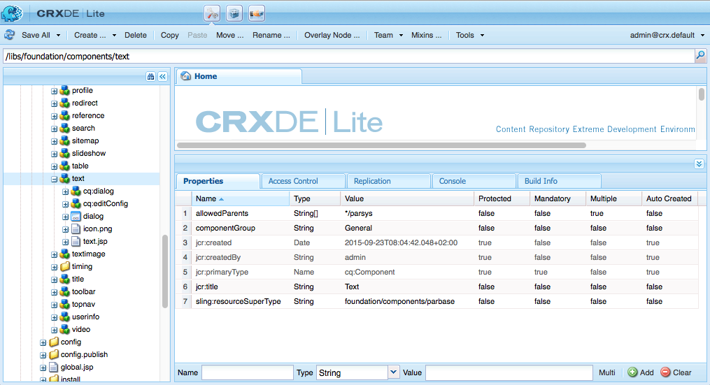

# Componentes do Adobe Experience Manager (AEM) - Noções básicas{#aem-components-the-basics}

Quando você começa a desenvolver novos componentes, é necessário entender as noções básicas de sua estrutura e configuração.

Esse processo envolve a leitura da teoria e a análise da ampla gama de implementações de componentes em uma instância padrão do AEM. Essa última abordagem é um pouco complicada pelo fato de que, embora o AEM tenha mudado para uma nova interface padrão, moderna e habilitada para toque, ela continua a ser compatível com a interface clássica.

## Visão geral {#overview}

Esta seção aborda os principais conceitos e problemas como uma introdução aos detalhes necessários ao desenvolver seus próprios componentes.

### Planejamento {#planning}

Antes de começar a realmente configurar ou codificar seu componente, você deve perguntar:

* O que exatamente você precisa que o novo componente faça?
   * Uma especificação clara ajuda em todos os estágios de desenvolvimento, teste e entrega. Os detalhes podem mudar com o tempo, mas a especificação pode ser atualizada (embora as alterações também devam ser documentadas).
* Você precisa criar seu componente do zero ou pode herdar as noções básicas de um componente existente?
   * Não há necessidade de reinventar a roda.
   * Há vários mecanismos fornecidos pelo AEM que permitem herdar e estender detalhes de outra definição de componente, incluindo substituição, sobreposição e o [Fusão de recursos do Sling](/help/sites-developing/sling-resource-merger.md).
* O componente requer lógica para selecionar ou manipular o conteúdo?
   * A lógica deve ser mantida separada da camada da interface do usuário. O HTL foi projetado para ajudar a garantir que isso aconteça.
* Seu componente precisa de formatação CSS?
   * A formatação CSS deve ser mantida separada das definições de componentes. Defina convenções para nomear seus elementos de HTML para que você possa modificá-los por meio de arquivos CSS externos.
* Quais aspectos de segurança devo considerar?
   * Consulte [Lista de verificação de segurança - Práticas recomendadas de desenvolvimento](/help/sites-administering/security-checklist.md#development-best-practices) para obter mais detalhes.

### Interface habilitada para toque vs. interface clássica {#touch-enabled-vs-classic-ui}

Antes de qualquer discussão séria começar sobre o desenvolvimento de componentes, você deve saber qual interface do usuário seus autores estão usando:

* **Interface de usuário habilitada para toque**
  [A interface de usuário padrão](/help/sites-developing/touch-ui-concepts.md) é baseado na experiência unificada do usuário para o Adobe Experience Cloud, usando as tecnologias subjacentes do [Coral UI](/help/sites-developing/touch-ui-concepts.md#coral-ui) e [Interface do Granite](/help/sites-developing/touch-ui-concepts.md#granite-ui).
* **Interface clássica**
Interface do usuário baseada na tecnologia ExtJS que foi descontinuada com o AEM 6.4.

Consulte [Interface de interface do usuário Recommendations para clientes](/help/sites-deploying/ui-recommendations.md) para obter mais detalhes.

Os componentes podem ser implementados para suportar a interface habilitada para toque, a interface clássica ou ambas. Ao observar uma instância padrão, você também verá componentes prontos para uso que foram originalmente projetados para a interface clássica, para a interface habilitada para toque ou para ambas.

As noções básicas de ambos são abordadas nesta página e como reconhecê-las.

>[!NOTE]
>
>A Adobe recomenda o uso da interface habilitada para toque para se beneficiar da tecnologia mais recente. [Ferramentas de modernização do AEM](modernization-tools.md) pode facilitar a migração.

### Lógica de conteúdo e marcação de renderização  {#content-logic-and-rendering-markup}

A Adobe recomenda manter o código responsável pela marcação e renderização separado do código que controla a lógica usada para selecionar o conteúdo do componente.

Essa filosofia é apoiada pela [HTL](https://experienceleague.adobe.com/docs/experience-manager-htl/content/overview.html?lang=pt-BR), uma linguagem de modelo que é propositalmente limitada para garantir que uma linguagem de programação real seja usada para definir a lógica de negócios subjacente. Essa lógica (opcional) é invocada do HTL com um comando específico. Esse mecanismo destaca o código chamado para uma determinada exibição e, se necessário, permite uma lógica específica para diferentes exibições do mesmo componente.

### HTL vs JSP {#htl-vs-jsp}

HTL é uma linguagem de modelo de HTML introduzida com AEM 6.0.

A discussão sobre o uso [HTL](https://experienceleague.adobe.com/docs/experience-manager-htl/content/overview.html?lang=pt-BR) ou JSP (Java™ Server Pages) ao desenvolver seus próprios componentes, deve ser simples, pois o HTL agora é a linguagem de script recomendada para o AEM.

HTL e JSP podem ser usados para desenvolver componentes para a interface clássica e para a interface habilitada para toque. Embora possa haver uma tendência de supor que o HTL seja somente para a interface habilitada para toque e o JSP para a interface clássica, isso é um equívoco e muito mais devido ao tempo. A interface habilitada para toque e o HTL foram incorporados ao AEM aproximadamente no mesmo período. Como HTL agora é a linguagem recomendada, ela está sendo usada para novos componentes, que tendem a ser para a interface habilitada para toque.

>[!NOTE]
>
>As exceções são Campos de formulário do Granite UI Foundation (como usados em caixas de diálogo). Elas ainda exigem o uso do JSP.

### Desenvolver seus próprios componentes {#developing-your-own-components}

Para criar seus próprios componentes para a interface apropriada, consulte (após ler esta página):

* [Componentes do AEM para a interface habilitada para toque](/help/sites-developing/developing-components.md)
* [Componentes do AEM para a interface clássica](/help/sites-developing/developing-components-classic.md)

Uma maneira rápida de começar é copiar um componente existente e fazer as alterações desejadas. Para saber como criar seus próprios componentes e adicioná-los ao sistema de parágrafos, consulte:

* [Desenvolvendo componentes](/help/sites-developing/developing-components-samples.md) (com foco na interface habilitada para toque)

### Mover componentes para a instância de publicação {#moving-components-to-the-publish-instance}

Os componentes que renderizam conteúdo devem ser implantados na mesma instância do AEM que o conteúdo. Portanto, todos os componentes usados para criar e renderizar páginas na instância do autor devem ser implantados na instância de publicação. Quando implantados, os componentes ficam disponíveis para renderizar páginas ativadas.

Use as seguintes ferramentas para mover seus componentes para a instância de publicação:

* [Usar gerenciador de pacotes](/help/sites-administering/package-manager.md) para adicionar seus componentes a um pacote e movê-los para outra instância de AEM.
* [Usar a ferramenta de replicação Ativar árvore](/help/sites-authoring/publishing-pages.md#manage-publication) para replicar os componentes.

>[!NOTE]
>
>Esses mecanismos também podem ser usados para transferir o componente entre outras instâncias, por exemplo, do desenvolvimento para a instância de teste.

### Componentes que devem ser considerados desde o início {#components-to-be-aware-of-from-the-start}

* Página:

   * O AEM tem *página* componente ( `cq:Page`).
   * Esse é um tipo específico de recurso importante para o gerenciamento de conteúdo.
      * Uma página corresponde a uma página da Web com conteúdo para o seu site.

* Sistemas de parágrafos:

   * O sistema de parágrafos é uma parte essencial de um site, pois gerencia uma lista de parágrafos. É usado para manter e estruturar os componentes individuais que contêm o conteúdo real.
   * É possível criar, mover, copiar e excluir parágrafos no sistema de parágrafos.
   * Você também pode selecionar os componentes que estarão disponíveis para uso em um sistema de parágrafos específico.
   * Há vários sistemas de parágrafo disponíveis em uma instância padrão (por exemplo, `parsys`, ` [responsivegrid](/help/sites-authoring/responsive-layout.md)`).

## Estrutura {#structure}

A estrutura de um componente AEM é poderosa e flexível. As principais considerações são:

* Tipo de recurso
* Definição de componente
* Propriedades e nós filhos de um componente
* Caixas de diálogo
* Caixas de diálogo de design
* Disponibilidade de componentes
* Componentes e o conteúdo que eles criam

### Tipo de recurso {#resource-type}

Um elemento-chave da estrutura é o tipo de recurso.

* A estrutura de conteúdo declara intenções.
* O tipo de recurso os implementa.

Essa é uma abstração que ajuda a garantir que, mesmo quando a aparência muda com o tempo, a intenção permanece no tempo.

### Definição de componente {#component-definition}

#### Noções básicas sobre componentes {#component-basics}

A definição de um componente pode ser dividida da seguinte forma:

* Os componentes do AEM são baseados em [Sling](https://sling.apache.org/documentation.html).
* Os componentes do AEM estão (geralmente) localizados em:

   * HTL: `/libs/wcm/foundation/components`
   * JSP: `/libs/foundation/components`

* Os componentes específicos do projeto/site estão (geralmente) localizados em:

   * `/apps/<myApp>/components`

* Os componentes padrão do AEM são definidos como `cq:Component` e têm os seguintes elementos-chave:

   * propriedades jcr:

     Uma lista de propriedades jcr; elas são variáveis e algumas podem ser opcionais, por meio da estrutura básica de um nó de componente, suas propriedades e subnós são definidos pelo `cq:Component` definição

   * Recursos:

     Eles definem elementos estáticos usados pelo componente.

   * Scripts:

  São usados para implementar o comportamento da instância resultante do componente.

* **Nó raiz**:

   * `<mycomponent> (cq:Component)` - Nó hierárquico do componente.

* **Propriedades vitais**:

   * `jcr:title` - Título do componente; por exemplo, usado como um rótulo quando o componente é listado no navegador de componentes ou sidekick.
   * `jcr:description` - Descrição do componente; pode ser usado como dica do mouse sobre o navegador de componentes ou sidekick.
   * Interface clássica:

      * `icon.png` - Ícone para este componente.
      * `thumbnail.png` - Imagem mostrada se esse componente estiver listado no sistema de parágrafos.

   * Interface de toque

      * Consulte a seção [Ícone de componente na interface para toque](/help/sites-developing/components-basics.md#component-icon-in-touch-ui) para obter detalhes.

* **Nós-filhos vitais**:

   * `cq:editConfig (cq:EditConfig)` - Define as propriedades de edição do componente e permite que o componente seja exibido no navegador de Componentes ou Sidekick.

     Observação: se o componente tiver uma caixa de diálogo, ele aparecerá automaticamente no navegador de Componentes ou Sidekick, mesmo se cq:editConfig não existir.

   * `cq:childEditConfig (cq:EditConfig)` - Controla os aspectos da interface do usuário do autor para componentes secundários que não definem seus próprios `cq:editConfig`.
   * Interface habilitada para toque:

      * `cq:dialog` ( `nt:unstructured`) - Caixa de diálogo para esse componente. Define a interface que permite ao usuário configurar o componente e/ou editar conteúdo.
      * `cq:design_dialog` ( `nt:unstructured`) - Edição de design para este componente

   * Interface clássica:

      * `dialog` ( `cq:Dialog`) - Caixa de diálogo para esse componente. Define a interface que permite ao usuário configurar o componente ou editar o conteúdo, ou ambos.
      * `design_dialog` ( `cq:Dialog`) - Edição de design para este componente.

#### Ícone de componente na interface para toque {#component-icon-in-touch-ui}

O ícone ou a abreviação do componente é definido por meio das propriedades JCR do componente quando ele é criado pelo desenvolvedor. Essas propriedades são avaliadas na seguinte ordem e a primeira propriedade válida encontrada é usada.

1. `cq:icon` - Propriedade de string que aponta para um ícone padrão no [Biblioteca da interface de usuário Coral](https://developer.adobe.com/experience-manager/reference-materials/6-5/coral-ui/coralui3/Coral.Icon.html) para exibir no navegador de componentes
   * Use o valor do atributo HTML do ícone Coral.
1. `abbreviation` - Propriedade de string para personalizar a abreviação do nome do componente no navegador de componentes
   * A abreviação deve ser limitada a dois caracteres.
   * O fornecimento de uma cadeia de caracteres vazia cria a abreviação a partir dos dois primeiros caracteres do `jcr:title` propriedade.
      * Por exemplo, &quot;Im&quot; para &quot;Image&quot;
      * O título localizado é usado para criar a abreviação.
   * A abreviação só é traduzida se o componente tiver uma `abbreviation_commentI18n` que é usada como dica de tradução.
1. `cq:icon.png` ou `cq:icon.svg` - Ícone para este componente, que é mostrado no navegador de componentes
   * 20 x 20 pixels é o tamanho dos ícones dos componentes padrão.
      * Ícones maiores são reduzidos (lado do cliente).
   * A cor recomendada é rgb(112, 112, 112) > #707070
   * O plano de fundo dos ícones de componente padrão é transparente.
   * Somente `.png` e `.svg` arquivos são suportados.
   * Se importar do sistema de arquivos por meio do plug-in Eclipse, os nomes de arquivos devem ser evitados como `_cq_icon.png` ou `_cq_icon.svg` por exemplo.
   * `.png` tem precedência sobre `.svg` se ambos estiverem presentes

Se nenhuma das propriedades acima ( `cq:icon`, `abbreviation`, `cq:icon.png`ou `cq:icon.svg`) são encontrados no componente:

* O sistema pesquisa as mesmas propriedades nos supercomponentes após o plug-in `sling:resourceSuperType` propriedade.
* Se nada ou uma abreviação vazia for encontrada no nível do supercomponente, o sistema criará a abreviação a partir das primeiras letras do `jcr:title` propriedade do componente atual.

Para cancelar a herança de ícones de supercomponentes, defina um valor vazio `abbreviation` no componente reverte para o comportamento padrão.

A variável [Console de componentes](/help/sites-authoring/default-components-console.md#component-details) mostra como o ícone de um componente específico é definido.

#### Exemplo de ícone do SVG {#svg-icon-example}

```xml
<?xml version="1.0" encoding="utf-8"?>
<!DOCTYPE svg PUBLIC "-//W3C//DTD SVG 1.1//EN" "https://www.w3.org/Graphics/SVG/1.1/DTD/svg11.dtd">
<svg version="1.1" id="Layer_1" xmlns="https://www.w3.org/2000/svg" xmlns:xlink="https://www.w3.org/1999/xlink" x="0px" y="0px"
     width="20px" height="20px" viewBox="0 0 20 20" enable-background="new 0 0 20 20" xml:space="preserve">
    <ellipse cx="5" cy="5" rx="3" ry="3" fill="#707070"/>
    <ellipse cx="15" cy="5" rx="4" ry="4" fill="#707070"/>
    <ellipse cx="5" cy="15" rx="5" ry="5" fill="#707070"/>
    <ellipse cx="15" cy="15" rx="4" ry="4" fill="#707070"/>
</svg>
```

### Propriedades e nós filhos de um componente {#properties-and-child-nodes-of-a-component}

Muitos dos nós/propriedades necessários para definir um componente são comuns a ambas as interfaces do usuário, com diferenças permanecendo independentes para que seu componente possa funcionar em ambos os ambientes.

Um componente é um nó do tipo `cq:Component` e tem as seguintes propriedades e nós filhos:

<table>
 <tbody>
  <tr>
   <td><strong>Nome <br /> </strong></td>
   <td><strong>Tipo <br /> </strong></td>
   <td><strong>Descrição <br /> </strong></td>
  </tr>
  <tr>
   <td>.<br /> </td>
   <td><code>cq:Component</code></td>
   <td>Componente atual. Um componente é do tipo de nó <code>cq:Component</code>.<br /> </td>
  </tr>
  <tr>
   <td><code>componentGroup</code></td>
   <td><code>String</code></td>
   <td>Grupo no qual o componente pode ser selecionado no navegador Componentes (interface habilitada para toque) ou Sidekick (interface clássica).<br /> Um valor de <code>.hidden</code> é usado para componentes que não estão disponíveis para seleção na interface do usuário, como os sistemas de parágrafos reais.</td>
  </tr>
  <tr>
   <td><code>cq:isContainer</code></td>
   <td><code>Boolean</code></td>
   <td>Indica se o componente é um componente de contêiner e, portanto, pode conter outros componentes, como um sistema de parágrafo.</td>
  </tr>
  <tr>
   <td> </td>
   <td> </td>
   <td> </td>
  </tr>
  <tr>
   <td><code>cq:dialog</code></td>
   <td><code>nt:unstructured</code><br /> </td>
   <td>Definição da caixa de diálogo de edição para a interface habilitada para toque.</td>
  </tr>
  <tr>
   <td><code>dialog</code></td>
   <td><code>cq:Dialog</code></td>
   <td>Definição da caixa de diálogo de edição da interface clássica.</td>
  </tr>
  <tr>
   <td><code>cq:design_dialog</code></td>
   <td><code>nt:unstructured</code></td>
   <td>Definição da caixa de diálogo de design para a interface habilitada para toque.</td>
  </tr>
  <tr>
   <td><code>design_dialog</code></td>
   <td><code>cq:Dialog </code></td>
   <td>Definição da caixa de diálogo de design para a interface clássica.<br /> </td>
  </tr>
  <tr>
   <td><code>dialogPath</code></td>
   <td><code>String</code></td>
   <td>Caminho para uma caixa de diálogo para tratar do caso quando o componente não tiver um nó de caixa de diálogo.<br /> </td>
  </tr>
  <tr>
   <td> </td>
   <td> </td>
   <td> </td>
  </tr>
  <tr>
   <td><code>cq:cellName</code></td>
   <td><code>String</code></td>
   <td>Se definida, essa propriedade será tomada como ID da célula. Para obter mais informações, consulte o artigo da Base de conhecimento <a href="https://helpx.adobe.com/experience-manager/kb/DesigneCellId.html">Como as IDs de célula de design são criadas</a>.<br /> </td>
  </tr>
  <tr>
   <td><code>cq:childEditConfig</code></td>
   <td><code>cq:EditConfig</code></td>
   <td>Quando o componente é um container, por exemplo, um sistema de parágrafo, ele direciona a configuração de edição dos nós secundários.<br /> </td>
  </tr>
  <tr>
   <td><code>cq:editConfig</code></td>
   <td><code>cq:EditConfig</code></td>
   <td><a href="#edit-behavior">Editar configuração do componente</a>.<br /> </td>
  </tr>
  <tr>
   <td><code>cq:htmlTag</code></td>
   <td><code>nt:unstructured </code></td>
   <td>Retorna atributos de tag adicionais que são adicionados à tag html ao redor. Permite a adição de atributos aos divs gerados automaticamente.</td>
  </tr>
  <tr>
   <td><code>cq:noDecoration</code></td>
   <td><code>Boolean</code></td>
   <td>Se true, o componente não será renderizado com as classes div e css geradas automaticamente.<br /> </td>
  </tr>
  <tr>
   <td><code>cq:template</code></td>
   <td><code>nt:unstructured</code></td>
   <td>Se encontrado, esse nó será usado como um template de conteúdo quando o componente for adicionado do Navegador de componentes ou Sidekick.</td>
  </tr>
  <tr>
   <td><code>cq:templatePath</code></td>
   <td><code>String</code></td>
   <td>Caminho para um nó a ser usado como modelo de conteúdo quando o componente for adicionado do navegador de Componentes ou Sidekick. Deve ser um caminho absoluto, não relativo ao nó do componente.<br /> A menos que você queira reutilizar o conteúdo já disponível em outro lugar, isso não é obrigatório e <code>cq:template</code> é suficiente (veja abaixo).</td>
  </tr>
  <tr>
   <td><code>jcr:created</code></td>
   <td><code>Date</code></td>
   <td>Data de criação do componente.<br /> </td>
  </tr>
  <tr>
   <td><code>jcr:description</code></td>
   <td><code>String</code></td>
   <td>Descrição do componente.<br /> </td>
  </tr>
  <tr>
   <td><code>jcr:title</code></td>
   <td><code>String</code></td>
   <td>Título do componente.<br /> </td>
  </tr>
  <tr>
   <td><code>sling:resourceSuperType</code></td>
   <td><code>String</code></td>
   <td>Quando definido, o componente herda deste componente.<br /> </td>
  </tr>
  <tr>
   <td><code>virtual</code></td>
   <td><code>sling:Folder</code></td>
   <td>Permite a criação de componentes virtuais. Para ver um exemplo, verifique o componente de contato em:<br /> <code>/libs/foundation/components/profile/form/contact</code></td>
  </tr>
  <tr>
   <td><code>&lt;breadcrumb.jsp&gt;</code></td>
   <td><code>nt:file</code><br /> </td>
   <td>Arquivo de script.<br /> </td>
  </tr>
  <tr>
   <td><code>icon.png</code></td>
   <td><code>nt:file</code></td>
   <td>Ícone do componente, aparece ao lado do Título no Sidekick.<br /> </td>
  </tr>
  <tr>
   <td><code>thumbnail.png</code></td>
   <td><code>nt:file</code></td>
   <td>Miniatura opcional que é mostrada enquanto o componente é arrastado do Sidekick para o lugar.<br /> </td>
  </tr>
 </tbody>
</table>

Se você observar o **Texto** (qualquer versão), você pode ver estes elementos:

* HTL ( `/libs/wcm/foundation/components/text`)

  

* JSP `/libs/foundation/components/text`)

  

As propriedades de particular interesse incluem:

* `jcr:title` - título do componente; pode ser usado para identificar o componente; por exemplo, ele aparece na lista de componentes no navegador de componentes ou no sidekick
* `jcr:description` - descrição do componente; pode ser usado como uma dica para passar o mouse sobre a lista de componentes dentro do sidekick
* `sling:resourceSuperType`: indica o caminho da herança ao estender um componente (substituindo uma definição)

Os nós filhos de interesse específico incluem:

* `cq:editConfig` ( `cq:EditConfig`) - controla aspectos visuais; por exemplo, pode definir a aparência de uma barra ou widget, ou pode adicionar controles personalizados
* `cq:childEditConfig` ( `cq:EditConfig`) - controla os aspectos visuais para componentes filhos que não têm suas próprias definições
* Interface habilitada para toque:
   * `cq:dialog` ( `nt:unstructured`) - define a caixa de diálogo para editar o conteúdo desse componente
   * `cq:design_dialog` ( `nt:unstructured`) - especifica as opções de edição de design para este componente
* Interface clássica:
   * `dialog` ( `cq:Dialog`) - define a caixa de diálogo para editar o conteúdo desse componente (específico da interface clássica)
   * `design_dialog` ( `cq:Dialog`) - especifica as opções de edição de design para este componente
   * `icon.png` - arquivo gráfico a ser usado como um ícone para o componente no Sidekick
   * `thumbnail.png` - arquivo gráfico a ser usado como miniatura do componente ao arrastá-lo do Sidekick

### Caixas de diálogo {#dialogs}

As caixas de diálogo são um elemento essencial do componente, pois fornecem uma interface para que os autores configurem e forneçam entrada para esse componente.

Dependendo da complexidade do componente, sua caixa de diálogo pode precisar de uma ou mais guias, para manter a caixa de diálogo curta e classificar os campos de entrada.

As definições de caixa de diálogo são específicas da interface do usuário:

>[!NOTE]
>
>* Para fins de compatibilidade, a interface habilitada para toque pode usar a definição de uma caixa de diálogo da interface clássica, quando nenhuma caixa de diálogo foi definida para a interface habilitada para toque.
>* A variável [Ferramentas de modernização do AEM](/help/sites-developing/modernization-tools.md) também são fornecidos para ajudar a estender/converter componentes que têm apenas caixas de diálogo definidas para a interface clássica.
>

* Interface de usuário habilitada para toque
   * `cq:dialog` ( `nt:unstructured`) nós:
      * definir a caixa de diálogo para editar o conteúdo deste componente
      * específico para a interface habilitada para toque
      * são definidos usando componentes de interface do Granite
      * têm uma propriedade `sling:resourceType`, como estrutura de conteúdo Sling padrão
      * pode ter uma propriedade `helpPath` para definir o recurso de ajuda contextual (caminho absoluto ou relativo) que é acessado quando o ícone Ajuda (o `?` é selecionada.
         * Para componentes prontos para uso, isso geralmente faz referência a uma página na documentação.
         * Se não `helpPath` for especificada, a URL padrão (página de visão geral da documentação) será exibida.

  

  Na caixa de diálogo, os campos individuais são definidos:

  

* IU Clássica
   * `dialog` ( `cq:Dialog`) nós
      * definir a caixa de diálogo para editar o conteúdo deste componente
      * específico para a interface clássica
      * são definidos usando widgets ExtJS
      * têm uma propriedade `xtype`, que se refere a ExtJS
      * pode ter uma propriedade `helpPath` para definir o recurso de ajuda contextual (caminho absoluto ou relativo) que é acessado quando a variável **Ajuda** for selecionado.
         * Para componentes prontos para uso, isso geralmente faz referência a uma página na documentação.
         * Se não `helpPath` for especificada, a URL padrão (página de visão geral da documentação) será exibida.

  

  Na caixa de diálogo, os campos individuais são definidos:

  

  Em uma caixa de diálogo clássica:

   * você pode criar a caixa de diálogo como `cq:Dialog`, que fornecerá uma única guia - como no componente de texto, ou se você precisar de várias guias, como no componente de imagem de texto, a caixa de diálogo poderá ser definida como `cq:TabPanel`.
   * a `cq:WidgetCollection` ( `items`) é usada para fornecer uma base para os campos de entrada ( `cq:Widget`) ou em outras guias ( `cq:Widget`). Essa hierarquia pode ser estendida.

### Caixas de diálogo de design {#design-dialogs}

As caixas de diálogo de design são semelhantes às caixas de diálogo usadas para editar e configurar conteúdo, mas fornecem a interface para os autores configurarem e fornecerem detalhes de design para esse componente.

[As caixas de diálogo de design estão disponíveis no Modo de design](/help/sites-authoring/default-components-designmode.md), embora eles não sejam necessários para todos os componentes, por exemplo, **Título** e **Imagem** ambos têm diálogos de design, enquanto **Texto** não.

A caixa de diálogo de design do sistema de parágrafo (por exemplo, parsys) é um caso especial, pois permite que o usuário disponibilize outros componentes específicos para seleção (no navegador de componentes ou sidekick) na página.

### Adicionar o componente ao sistema de parágrafos {#adding-your-component-to-the-paragraph-system}

Depois que um componente é definido, ele deve ser disponibilizado para uso. Para disponibilizar um componente para uso em um sistema de parágrafos, é possível:

1. Abertura [Modo Design](/help/sites-authoring/default-components-designmode.md) para uma página e ativar o componente desejado.
1. Adicione os componentes necessários à `components` propriedade da definição do modelo em:

   `/etc/designs/<*yourProject*>/jcr:content/<*yourTemplate*>/par`

   Por exemplo, consulte:

   `/etc/designs/geometrixx/jcr:content/contentpage/par`

   

### Componentes e o conteúdo que eles criam {#components-and-the-content-they-create}

Se você criar e configurar uma instância do **Título** na página: `<content-path>/Prototype.html`

* Interface de usuário habilitada para toque

  

* IU Clássica

  

Em seguida, é possível ver a estrutura do conteúdo criado no repositório:


Em particular, se você observar o texto real de um **Título**:

* a definição (para ambas as interfaces) tem a propriedade `name`= `./jcr:title`

   * `/libs/foundation/components/title/cq:dialog/content/items/column/items/title`
   * `/libs/foundation/components/title/dialog/items/title`

* no conteúdo, isso gera a propriedade `jcr:title` mantendo o conteúdo do autor.

As propriedades definidas dependem das definições individuais. Embora possam ser mais complexos do que os anteriores, seguem os mesmos princípios básicos.

## Hierarquia e herança do componente {#component-hierarchy-and-inheritance}

Os componentes dentro do AEM estão sujeitos a três hierarquias diferentes:

* **Hierarquia de tipo de recurso**

  Isso é usado para estender componentes usando a propriedade `sling:resourceSuperType`. Isso permite que o componente herde. Por exemplo, um componente de texto herda vários atributos do componente padrão.

   * scripts (resolvidos pelo Sling)
   * caixas de diálogo
   * descrições (incluindo imagens em miniatura e ícones)

* **Hierarquia do contêiner**

  Isso é usado para preencher as definições de configuração para o componente secundário e é usado com mais frequência em um cenário parsys.

  Por exemplo, as configurações dos botões da barra de edição, o layout do conjunto de controle (barras de edição, rolagem), o layout da caixa de diálogo (em linha, flutuante) podem ser definidos no componente principal e propagados para os componentes secundários.

  Definições de configuração (relacionadas à funcionalidade de edição) no `cq:editConfig` e `cq:childEditConfig` são propagados.

* **Hierarquia de inclusão**

  Isso é imposto no tempo de execução pela sequência de inclusões.

  Essa hierarquia é usada pelo Designer, que por sua vez atua como base para vários aspectos de design da renderização; incluindo informações de layout, informações de css, os componentes disponíveis em um parsys, entre outros.

## Editar comportamento {#edit-behavior}

Esta seção explica como configurar o comportamento de edição de um componente. Isso inclui atributos como ações disponíveis para o componente, características do editor de local e os ouvintes relacionados aos eventos no componente.

A configuração é comum à interface habilitada para toque e à interface clássica, embora com determinadas diferenças específicas.

O comportamento de edição de um componente é configurado adicionando um `cq:editConfig` nó do tipo `cq:EditConfig` abaixo do nó do componente (do tipo `cq:Component`) e adicionando propriedades específicas e nós filhos. As seguintes propriedades e nós filhos estão disponíveis:

* [`cq:editConfig` propriedades do nó](#configuring-with-cq-editconfig-properties):

   * `cq:actions` ( `String array`): define as ações que podem ser executadas no componente.
   * `cq:layout` ( `String`): define como o componente é editado na interface clássica.
   * `cq:dialogMode` ( `String`): define como a caixa de diálogo do componente é aberta na interface clássica

      * Na interface habilitada para toque, as caixas de diálogo estão sempre flutuando no modo desktop e são abertas automaticamente como tela cheia em dispositivos móveis.

   * `cq:emptyText` ( `String`): define o texto que é exibido quando nenhum conteúdo visual está presente.
   * `cq:inherit` ( `Boolean`): define se os valores ausentes são herdados do componente do qual ele herda.
   * `dialogLayout` (String): define como a caixa de diálogo deve ser aberta.

* [`cq:editConfig` nós filhos](#configuring-with-cq-editconfig-child-nodes):

   * `cq:dropTargets` (tipo de nó `nt:unstructured`): define uma lista de destinos de lançamento que podem aceitar um lançamento de um ativo do localizador de conteúdo

      * Vários destinos de lançamento estão disponíveis somente na interface clássica.
      * Na interface habilitada para toque, um único destino de soltar é permitido.

   * `cq:actionConfigs` (tipo de nó `nt:unstructured`): define uma lista de novas ações que são anexadas à lista cq:actions.
   * `cq:formParameters` (tipo de nó `nt:unstructured`): define parâmetros adicionais que são adicionados ao formulário da caixa de diálogo.
   * `cq:inplaceEditing` (tipo de nó `cq:InplaceEditingConfig`): define uma configuração de edição no local para o componente.
   * `cq:listeners` (tipo de nó `cq:EditListenersConfig`): define o que acontece antes ou depois de uma ação ocorrer no componente.

>[!NOTE]
>
>Nesta página, um nó (propriedades e nós filhos) é representado como XML, conforme mostrado no exemplo a seguir.

```
<jcr:root xmlns:cq="https://www.day.com/jcr/cq/1.0" xmlns:jcr="https://www.jcp.org/jcr/1.0"
    cq:actions="[edit]"
    cq:dialogMode="floating"
    cq:layout="editbar"
    jcr:primaryType="cq:EditConfig">
    <cq:listeners
        jcr:primaryType="cq:EditListenersConfig"
        afteredit="REFRESH_PAGE"/>
</jcr:root>
```

Há muitas configurações existentes no repositório. Você pode pesquisar facilmente por propriedades específicas ou nós secundários:

* Para procurar uma propriedade do `cq:editConfig` nó, por exemplo, `cq:actions`, é possível usar a ferramenta Consulta no **CRXDE Lite** e pesquise com a seguinte sequência de consulta XPath:

  `//element(cq:editConfig, cq:EditConfig)[@cq:actions]`

* Para procurar um nó filho de `cq:editConfig`, por exemplo, você pode pesquisar por `cq:dropTargets`, que é do tipo `cq:DropTargetConfig`; você pode usar a Ferramenta de consulta em** CRXDE Lite** e pesquisar com a seguinte sequência de consulta XPath:

  `//element(cq:dropTargets, cq:DropTargetConfig)`

### Marcadores de posição do componente {#component-placeholders}

Os componentes sempre devem renderizar algum HTML que esteja visível para o autor, mesmo quando o componente não tiver conteúdo. Caso contrário, ela poderá desaparecer visualmente da interface do editor, tornando-se tecnicamente presente, mas invisível na página e no editor. Nesse caso, os autores não podem selecionar e interagir com o componente vazio.

Por esse motivo, os componentes devem renderizar um espaço reservado, desde que não renderizem nenhuma saída visível quando a página for renderizada no editor de páginas (quando o modo WCM for `edit` ou `preview`).
A marcação de HTML típica de um espaço reservado é a seguinte:

```HTML
<div class="cq-placeholder" data-emptytext="Component Name"></div>
```

O script HTL típico que renderiza o HTML de espaço reservado acima é o seguinte:

```HTML
<div class="cq-placeholder" data-emptytext="${component.properties.jcr:title}"
     data-sly-test="${(wcmmode.edit || wcmmode.preview) && isEmpty}"></div>
```

No exemplo anterior, `isEmpty` é uma variável que é verdadeira somente quando o componente não tem conteúdo e está invisível para o autor.

Para evitar repetição, a Adobe recomenda que os implementadores de componentes usem um modelo HTL para esses espaços reservados, [como o fornecido pelos Componentes principais.](https://github.com/adobe/aem-core-wcm-components/blob/master/content/src/content/jcr_root/apps/core/wcm/components/commons/v1/templates.html)

O uso do modelo no link anterior é feito com a seguinte linha de HTL:

```HTML
<sly data-sly-use.template="core/wcm/components/commons/v1/templates.html"
     data-sly-call="${template.placeholder @ isEmpty=!model.text}"></sly>
```

No exemplo anterior, `model.text` é a variável verdadeira somente quando o conteúdo tem conteúdo e está visível.

Um exemplo de uso desse modelo pode ser visto nos Componentes principais, [como no componente de Título.](https://github.com/adobe/aem-core-wcm-components/blob/master/content/src/content/jcr_root/apps/core/wcm/components/title/v2/title/title.html#L27)

### Configuração com propriedades cq:EditConfig {#configuring-with-cq-editconfig-properties}

### cq:actions {#cq-actions}

A variável `cq:actions` propriedade ( `String array`) define uma ou várias ações que podem ser executadas no componente. Os seguintes valores estão disponíveis para configuração:

<table>
 <tbody>
  <tr>
   <td><strong>Valor de propriedade</strong></td>
   <td><strong>Descrição</strong></td>
  </tr>
  <tr>
   <td><code>text:&lt;some text&gt;</code></td>
   <td>Exibe o valor do texto estático &lt;some text=""&gt;<br /> Visível somente na interface clássica. A interface habilitada para toque não exibe ações em um menu contextual, portanto, isso não se aplica.</td>
  </tr>
  <tr>
   <td>-</td>
   <td>Adiciona um espaçador.<br /> Visível somente na interface clássica. A interface habilitada para toque não exibe ações em um menu contextual, portanto, isso não se aplica.</td>
  </tr>
  <tr>
   <td><code>edit</code></td>
   <td>Adiciona um botão para editar o componente.</td>
  </tr>
      <tr>
    <td><code>editannotate</code></td>
    <td>Adiciona um botão para editar o componente e permitir <a href="/help/sites-authoring/annotations.md">anotações</a>.</td>
   </tr>
  <tr>
   <td><code>delete</code></td>
   <td>Adiciona um botão para excluir o componente.</td>
  </tr>
  <tr>
   <td><code>insert</code></td>
   <td>Adiciona um botão para inserir um novo componente antes do atual.</td>
  </tr>
  <tr>
   <td><code>copymove</code></td>
   <td>Adiciona um botão para copiar e recortar o componente.</td>
  </tr>
 </tbody>
</table>

A configuração a seguir adiciona um botão de edição, um espaçador, um botão de exclusão e um botão de inserção à barra de edição do componente:

```
<jcr:root xmlns:cq="https://www.day.com/jcr/cq/1.0" xmlns:jcr="https://www.jcp.org/jcr/1.0"
    cq:actions="[edit,-,delete,insert]"
    cq:layout="editbar"
    jcr:primaryType="cq:EditConfig"/>
```

A configuração a seguir adiciona o texto &quot;Configurações herdadas da estrutura base&quot; à barra de edição do componente:

```
<jcr:root xmlns:cq="https://www.day.com/jcr/cq/1.0" xmlns:jcr="https://www.jcp.org/jcr/1.0"
    cq:actions="[text:Inherited Configurations from Base Framework]"
    cq:layout="editbar"
    jcr:primaryType="cq:EditConfig"/>
```

### cq:layout (somente interface clássica) {#cq-layout-classic-ui-only}

A variável `cq:layout` propriedade ( `String`) define como o componente pode ser editado na interface clássica. Os seguintes valores estão disponíveis:

<table>
 <tbody>
  <tr>
   <td><strong>Valor de propriedade</strong></td>
   <td><strong>Descrição</strong></td>
  </tr>
  <tr>
   <td><code>rollover</code></td>
   <td>Valor padrão. A edição do componente é acessível "ao passar o mouse" por meio de cliques e/ou menu de contexto.<br /> Para uso avançado, o objeto do lado do cliente correspondente é: <code>CQ.wcm.EditRollover</code>.</td>
  </tr>
  <tr>
   <td><code>editbar</code></td>
   <td>A edição do componente é acessível por meio de uma barra de ferramentas.<br /> Para uso avançado, o objeto do lado do cliente correspondente é: <code>CQ.wcm.EditBar</code>.</td>
  </tr>
  <tr>
   <td><code>auto</code></td>
   <td>A escolha é deixada para o código do lado do cliente.</td>
  </tr>
 </tbody>
</table>

>[!NOTE]
>
>Os conceitos de rolagem e barra de edição não se aplicam à interface habilitada para toque.

A configuração a seguir adiciona um botão de edição à barra de edição do componente:

```
<jcr:root xmlns:cq="https://www.day.com/jcr/cq/1.0" xmlns:jcr="https://www.jcp.org/jcr/1.0"
    cq:actions="[edit]"
    cq:layout="editbar"
    jcr:primaryType="cq:EditConfig">
</jcr:root>
```

### cq:dialogMode (somente interface clássica) {#cq-dialogmode-classic-ui-only}

O componente pode ser vinculado a uma caixa de diálogo de edição. A variável `cq:dialogMode` propriedade ( `String`) define como a caixa de diálogo do componente é aberta na interface clássica. Os seguintes valores estão disponíveis:

<table>
 <tbody>
  <tr>
   <td><strong>Valor de propriedade</strong></td>
   <td><strong>Descrição</strong></td>
  </tr>
  <tr>
   <td><code>floating</code></td>
   <td>A caixa de diálogo está flutuante.<br /> </td>
  </tr>
  <tr>
   <td><code>inline</code></td>
   <td>(valor padrão). A caixa de diálogo é ancorada sobre o componente.<br /> </td>
  </tr>
  <tr>
   <td><code>auto</code></td>
   <td>Se a largura do componente for menor que a do lado do cliente, <code>CQ.themes.wcm.EditBase.INLINE_MINIMUM_WIDTH</code> , a caixa de diálogo estará flutuante, caso contrário, estará em linha.</td>
  </tr>
 </tbody>
</table>

>[!NOTE]
>
>Na interface habilitada para toque, as caixas de diálogo estão sempre flutuando no modo de desktop e são abertas automaticamente como tela cheia em dispositivos móveis.

A configuração a seguir define uma barra de edição com um botão de edição e uma caixa de diálogo flutuante:

```
<jcr:root xmlns:cq="https://www.day.com/jcr/cq/1.0" xmlns:jcr="https://www.jcp.org/jcr/1.0"
    cq:actions="[edit]"
    cq:dialogMode="floating"
    cq:layout="editbar"
    jcr:primaryType="cq:EditConfig">
</jcr:root>
```

### cq:emptyText {#cq-emptytext}

A variável `cq:emptyText` propriedade ( `String`) define o texto que é exibido quando nenhum conteúdo visual está presente. O padrão é: `Drag components or assets here`.

### cq:inherit {#cq-inherit}

A variável `cq:inherit` propriedade ( `boolean`) define se os valores ausentes são herdados do componente do qual ele herda. O padrão é `false`.

### dialogLayout {#dialoglayout}

A variável `dialogLayout` define como uma caixa de diálogo deve ser aberta por padrão.

* Um valor de `fullscreen` abre a caixa de diálogo em tela cheia.
* Um valor vazio ou ausência da propriedade é padronizado para abrir a caixa de diálogo normalmente.
* O usuário sempre pode alternar o modo de tela cheia na caixa de diálogo.
* Não se aplica à interface clássica.

### Configuração com nós filhos cq:EditConfig {#configuring-with-cq-editconfig-child-nodes}

### cq:dropTarget {#cq-droptargets}

A variável `cq:dropTargets` nó (tipo de nó `nt:unstructured`) define uma lista de destinos que podem aceitar a ação de soltar de um ativo arrastado do localizador de conteúdo. Ele serve como uma coleção de nós do tipo `cq:DropTargetConfig`.

>[!NOTE]
>
>Vários destinos de lançamento estão disponíveis somente na interface clássica.
>
>Na interface habilitada para toque, somente o primeiro target é usado.

Cada nó filho do tipo `cq:DropTargetConfig` define um alvo de soltar no componente. O nome do nó é importante porque deve ser usado no JSP, da seguinte maneira, para gerar o nome da classe CSS atribuído ao elemento DOM que é o destino de liberação efetivo:

```
<drop target css class> = <drag and drop prefix> +
 <node name of the drop target in the edit configuration>
```

A variável `<drag and drop prefix>` é definido pela propriedade do Java™:

`com.day.cq.wcm.api.components.DropTarget.CSS_CLASS_PREFIX`.

Por exemplo, o nome da classe é definido da seguinte maneira no JSP do componente de Download ( `/libs/foundation/components/download/download.jsp`), onde `file` é o nome do nó do destino de soltar na configuração de edição do componente de Download:

`String ddClassName = DropTarget.CSS_CLASS_PREFIX + "file";`

O nó do tipo `cq:DropTargetConfig` deve ter as seguintes propriedades:

<table>
 <tbody>
  <tr>
   <td><strong>Nome de propriedade</strong></td>
   <td><strong>Valor de propriedade<br /> </strong></td>
  </tr>
  <tr>
   <td><code>accept</code></td>
   <td>Regex aplicado ao tipo MIME do ativo para validar se a remoção é permitida.</td>
  </tr>
  <tr>
   <td><code>groups</code></td>
   <td>Matriz de grupos de destino de lançamento. Cada grupo deve corresponder ao tipo de grupo definido na extensão do localizador de conteúdo e anexado aos ativos.</td>
  </tr>
  <tr>
   <td><code>propertyName</code></td>
   <td>Nome da propriedade que será atualizada após uma queda válida.</td>
  </tr>
 </tbody>
</table>

A configuração a seguir é retirada do componente de Download. Ela ativa qualquer ativo (o tipo MIME pode ser qualquer string) do `media` grupo a ser solto do localizador de conteúdo no componente. Após a queda, a propriedade do componente `fileReference` está sendo atualizado:

```
    <cq:dropTargets jcr:primaryType="nt:unstructured">
        <file
            jcr:primaryType="cq:DropTargetConfig"
            accept="[.*]"
            groups="[media]"
            propertyName="./fileReference"/>
    </cq:dropTargets>
```

### cq:actionConfigs (somente interface clássica) {#cq-actionconfigs-classic-ui-only}

A variável `cq:actionConfigs` nó (tipo de nó `nt:unstructured`) define uma lista de novas ações que são anexadas à lista definida pelo `cq:actions` propriedade. Cada nó filho de `cq:actionConfigs` O define uma nova ação ao definir um widget.

O exemplo de configuração a seguir define um novo botão (com um separador para a interface clássica):

* um separador, definido pelo xtype `tbseparator`;

   * Isso é usado somente pela interface clássica.
   * Essa definição é ignorada pela interface habilitada para toque, pois os xtypes são ignorados (e os separadores são desnecessários, pois a barra de ferramentas de ação é construída de forma diferente na interface habilitada para toque).

* um botão chamado **Gerenciar comentários** que executa a função de manipulador `CQ_collab_forum_openCollabAdmin()`.

```
<jcr:root xmlns:cq="https://www.day.com/jcr/cq/1.0" xmlns:jcr="https://www.jcp.org/jcr/1.0" xmlns:nt="https://www.jcp.org/jcr/nt/1.0"
    cq:actions="[EDIT,COPYMOVE,DELETE,INSERT]"
    jcr:primaryType="cq:EditConfig">
    <cq:actionConfigs jcr:primaryType="nt:unstructured">
        <separator0
            jcr:primaryType="nt:unstructured"
            xtype="tbseparator"/>
        <manage
            jcr:primaryType="nt:unstructured"
            handler="function(){CQ_collab_forum_openCollabAdmin();}"
            text="Manage comments"/>
    </cq:actionConfigs>
</jcr:root>
```

>[!NOTE]
>
>Consulte [Adicionar nova ação a uma barra de ferramentas do componente](/help/sites-developing/customizing-page-authoring-touch.md#add-new-action-to-a-component-toolbar) como exemplo para a interface habilitada para toque.

### cq:formParameters {#cq-formparameters}

A variável `cq:formParameters` nó (tipo de nó `nt:unstructured`) define parâmetros adicionais que são adicionados ao formulário da caixa de diálogo. Cada propriedade é mapeada para um parâmetro de formulário.

A configuração a seguir adiciona um parâmetro chamado `name`, definido com o valor `photos/primary` ao formulário de diálogo:

```
    <cq:formParameters
        jcr:primaryType="nt:unstructured"
        name="photos/primary"/>
```

### cq:inplaceEditing {#cq-inplaceediting}

A variável `cq:inplaceEditing` nó (tipo de nó `cq:InplaceEditingConfig`) define uma configuração de edição local para o componente. Ele pode ter as seguintes propriedades:

<table>
 <tbody>
  <tr>
   <td><strong>Nome de propriedade</strong></td>
   <td><strong>Valor de propriedade<br /> </strong></td>
  </tr>
  <tr>
   <td><code>active</code></td>
   <td>(<code>boolean</code>) True para habilitar a edição local do componente.</td>
  </tr>
  <tr>
   <td><code>configPath</code></td>
   <td>(<code>String</code>) Caminho da configuração do editor. A configuração pode ser especificada por um nó de configuração.</td>
  </tr>
  <tr>
   <td><code>editorType</code></td>
   <td><p>(<code>String</code>) Tipo de editor. Os tipos disponíveis são:</p>
    <ul>
     <li>texto sem formatação: a ser usado para conteúdo não-HTML.<br /> </li>
     <li>título: é um editor de texto sem formatação aprimorado que converte títulos gráficos em texto sem formatação antes de começar a edição. Usado pelo componente Geometrixx title.<br /> </li>
     <li>text: a serem usados para conteúdo de HTML (usa o editor de rich text).<br /> </li>
    </ul> </td>
  </tr>
 </tbody>
</table>

A configuração a seguir habilita a edição local do componente e define `plaintext` conforme o tipo do editor:

```
    <cq:inplaceEditing
        jcr:primaryType="cq:InplaceEditingConfig"
        active="{Boolean}true"
        editorType="plaintext"/>
```

### cq:listeners {#cq-listeners}

A variável `cq:listeners` nó (tipo de nó `cq:EditListenersConfig`) define o que acontece antes ou depois de uma ação no componente. A tabela a seguir define suas possíveis propriedades.

<table>
 <tbody>
  <tr>
   <td><strong>Nome de propriedade</strong></td>
   <td><strong>Valor de propriedade<br /> </strong></td>
   <td><p><strong>Valor padrão</strong></p> <p>(Somente interface clássica)</p> </td>
  </tr>
  <tr>
   <td><code>beforedelete</code></td>
   <td>O manipulador é acionado antes da remoção do componente.<br /> </td>
   <td> </td>
  </tr>
  <tr>
   <td><code>beforeedit</code></td>
   <td>O manipulador é acionado antes que o componente seja editado.</td>
   <td> </td>
  </tr>
  <tr>
   <td><code>beforecopy</code></td>
   <td>O manipulador é acionado antes que o componente seja copiado.</td>
   <td> </td>
  </tr>
  <tr>
   <td><code>beforemove</code></td>
   <td>O manipulador é acionado antes que o componente seja movido.</td>
   <td> </td>
  </tr>
  <tr>
   <td><code>beforeinsert</code></td>
   <td>O manipulador é acionado antes da inserção do componente.<br /> Operacional somente para a interface habilitada para toque.</td>
   <td> </td>
  </tr>
  <tr>
   <td><code>beforechildinsert</code></td>
   <td>O manipulador é acionado antes que o componente seja inserido dentro de outro componente (somente contêineres).</td>
   <td> </td>
  </tr>
  <tr>
   <td><code>afterdelete</code></td>
   <td>O manipulador é acionado após a remoção do componente.</td>
   <td><code>REFRESH_SELF</code></td>
  </tr>
  <tr>
   <td><code>afteredit</code></td>
   <td>O manipulador é acionado depois que o componente é editado.</td>
   <td><code>REFRESH_SELF</code></td>
  </tr>
  <tr>
   <td><code>aftercopy</code></td>
   <td>O manipulador é acionado depois que o componente é copiado.</td>
   <td><code>REFRESH_SELF</code></td>
  </tr>
  <tr>
   <td><code>afterinsert</code></td>
   <td>O manipulador é acionado após a inserção do componente.</td>
   <td><code>REFRESH_INSERTED</code></td>
  </tr>
  <tr>
   <td><code>aftermove</code></td>
   <td>O manipulador é acionado depois que o componente é movido.</td>
   <td><code>REFRESH_SELFMOVED</code></td>
  </tr>
  <tr>
   <td><code>afterchildinsert</code></td>
   <td>O manipulador é acionado depois que o componente é inserido dentro de outro componente (somente contêineres).</td>
   <td> </td>
  </tr>
 </tbody>
</table>

>[!NOTE]
>
>A variável `REFRESH_INSERTED` e `REFRESH_SELFMOVED` Os manipuladores só estão disponíveis na interface clássica.

>[!NOTE]
>
>Os valores padrão para os ouvintes são definidos somente na interface clássica.

>[!NOTE]
>
>Se houver componentes aninhados, há certas restrições nas ações definidas como propriedades na `cq:listeners` nó:
>
>* Para componentes aninhados, os valores das seguintes propriedades *deve* ser `REFRESH_PAGE`: >
>  * `aftermove`
>  * `aftercopy`

O manipulador de eventos pode ser implementado com uma implementação personalizada. Por exemplo, onde `project.customerAction` é um método estático:

`afteredit = "project.customerAction"`

O exemplo a seguir é equivalente ao `REFRESH_INSERTED` configuração:

`afterinsert="function(path, definition) { this.refreshCreated(path, definition); }"`

>[!NOTE]
>
>Para a interface clássica, consulte os parâmetros que podem ser usados nos manipuladores `before<action>` e `after<action>` seção eventos da [`CQ.wcm.EditBar`](https://developer.adobe.com/experience-manager/reference-materials/6-5/widgets-api/index.html?class=CQ.wcm.EditBar) e [`CQ.wcm.EditRollover`](https://developer.adobe.com/experience-manager/reference-materials/6-5/widgets-api/index.html?class=CQ.wcm.EditRollover) documentação do widget.

Com a seguinte configuração, a página é atualizada depois que o componente é excluído, editado, inserido ou movido:

```
    <cq:listeners
        jcr:primaryType="cq:EditListenersConfig"
        afterdelete="REFRESH_PAGE"
        afteredit="REFRESH_PAGE"
        afterinsert="REFRESH_PAGE"
        afterMove="REFRESH_PAGE"/>
```
