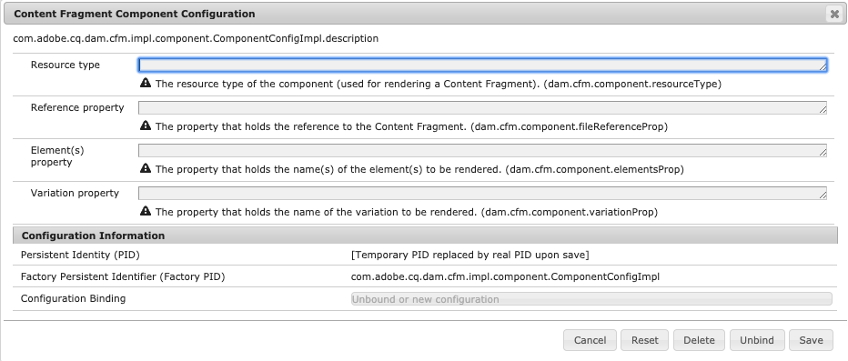

# Personalização e extensão de fragmentos de conteúdo{#customizing-and-extending-content-fragments}

Um fragmento de conteúdo estende um ativo padrão; consulte:

* [Criação e gerenciamento de fragmentos](/help/assets/content-fragments/content-fragments.md) de conteúdo e criação de [páginas com fragmentos](/help/sites-authoring/content-fragments.md) de conteúdo para obter mais informações sobre fragmentos de conteúdo.

* [Gerenciamento de ativos](/help/assets/manage-assets.md) e [personalização e extensão de ativos](/help/assets/extending-assets.md) para obter mais informações sobre os ativos padrão.

## Arquitetura {#architecture}

As partes [](/help/assets/content-fragments/content-fragments.md#constituent-parts-of-a-content-fragment) constituintes básicas de um fragmento de conteúdo são:

* Um fragmento *do conteúdo,*
* consistindo em um ou mais *elementos* de conteúdo,
* e que podem ter uma ou mais *Variações* de conteúdo.

Dependendo do tipo de fragmento, modelos ou modelos também são usados:

>[!CAUTION]
>
>[Modelos](/help/assets/content-fragments/content-fragments-models.md) de fragmento de conteúdo agora são recomendados para a criação de todos os fragmentos.
>
>Os modelos de fragmento de conteúdo são usados para todos os exemplos em We.Retail.

* Modelos de fragmentos do conteúdo:

   * Usado para definir fragmentos de conteúdo que contêm conteúdo estruturado.
   * Os modelos de fragmento de conteúdo definem a estrutura de um fragmento de conteúdo quando ele é criado.
   * Um fragmento faz referência ao modelo; portanto, as alterações no modelo podem/afetarão quaisquer fragmentos dependentes.
   * Os modelos são construídos de tipos de dados.
   * As funções para adicionar novas variações, etc., precisam atualizar o fragmento de acordo.

   >[!CAUTION]
   >
   >Quaisquer alterações em um modelo de fragmento de conteúdo existente podem afetar fragmentos dependentes; isso pode levar a propriedades órfãs nesses fragmentos.

* Modelos de fragmento de conteúdo:

   * Usado para definir fragmentos de conteúdo simples.
   * Os modelos definem a estrutura (básica e somente texto) de um fragmento de conteúdo quando ele é criado.
   * O modelo é copiado para o fragmento quando é criado; portanto, novas alterações no modelo não serão refletidas em fragmentos existentes.
   * As funções para adicionar novas variações, etc., precisam atualizar o fragmento de acordo.
   * [Os modelos](/help/sites-developing/content-fragment-templates.md) de fragmento de conteúdo operam de maneira diferente da de outros mecanismos de modelagem dentro do ecossistema AEM (por exemplo, modelos de página, etc.). Por conseguinte, devem ser considerados separadamente.
   * Quando baseado em um modelo, o tipo MIME do conteúdo é gerenciado no conteúdo real; isso significa que cada elemento e variação pode ter um tipo MIME diferente.

### Integração com ativos {#integration-with-assets}

O Gerenciamento de fragmentos de conteúdo (CFM) faz parte do AEM Assets como:

* Fragmentos de conteúdo são ativos.
* Eles usam a funcionalidade Ativos existente.
* Eles são totalmente integrados aos Ativos (consoles de administrador etc.).

#### Mapeamento de fragmentos de conteúdo estruturados para ativos {#mapping-structured-content-fragments-to-assets}


Fragmentos de conteúdo com conteúdo estruturado (isto é, com base em um modelo de fragmento de conteúdo) são mapeados para um único ativo:

* Todo o conteúdo é armazenado no `jcr:content/data` nó do ativo:

   * Os dados do elemento são armazenados sob o subnó principal:
      `jcr:content/data/master`

   * As variações são armazenadas em um subnó que contém o nome da variação:
por exemplo, `jcr:content/data/myvariation`

   * Os dados de cada elemento são armazenados no respectivo subnó como uma propriedade com o nome do elemento:
Por exemplo, o conteúdo do elemento `text` é armazenado como propriedade `text` em `jcr:content/data/master`

* Os metadados e o conteúdo associado são armazenados abaixo, `jcr:content/metadata`exceto o título e a descrição, que não são considerados metadados tradicionais e armazenados em 
`jcr:content`

#### Mapeamento de fragmentos de conteúdo simples para ativos {#mapping-simple-content-fragments-to-assets}


Fragmentos de conteúdo simples (com base em um modelo) são mapeados para um composto que consiste em um ativo principal e subativos (opcionais):

* Todas as informações de não conteúdo de um fragmento (como título, descrição, metadados, estrutura) são gerenciadas exclusivamente no ativo principal.
* O conteúdo do primeiro elemento de um fragmento é mapeado para a representação original do ativo principal.

   * As variações (se houver) do primeiro elemento são mapeadas para outras representações do ativo principal.

* Elementos adicionais (se existentes) são mapeados para subativos do ativo principal.

   * O conteúdo principal desses elementos adicionais mapeia para a representação original do respectivo subativo.
   * Outras variações (se aplicável) de quaisquer elementos adicionais mapeiam outras representações do respectivo subativo.

#### Local do ativo {#asset-location}

Como ocorre com os ativos padrão, um fragmento de conteúdo é mantido em:

`/content/dam`

#### Permissões de ativos {#asset-permissions}

Para obter mais detalhes, consulte Fragmento [do conteúdo - Excluir considerações](/help/assets/content-fragments/content-fragments-delete.md).

#### Integração de recursos {#feature-integration}

* O recurso de Gerenciamento de fragmento de conteúdo (CFM) baseia-se no núcleo Ativos, mas deve ser o mais independente possível dele.
* O CFM fornece suas próprias implementações para itens nas visualizações de cartão/coluna/lista; eles são conectados às implementações existentes de renderização de conteúdo dos Ativos.
* Vários componentes do Assets foram estendidos para atender a fragmentos de conteúdo.

### Uso de fragmentos de conteúdo em páginas {#using-content-fragments-in-pages}

>[!CAUTION]
>
>O Componente [principal do fragmento de](https://helpx.adobe.com/experience-manager/core-components/using/content-fragment-component.html) conteúdo agora é recomendado. Consulte [Desenvolvimento de componentes](https://helpx.adobe.com/experience-manager/core-components/using/developing.html) principais para obter mais detalhes.

Os fragmentos de conteúdo podem ser referenciados AEM páginas, assim como qualquer outro tipo de ativo. AEM fornece o componente [**principal do Fragmento** de conteúdo - um](https://helpx.adobe.com/experience-manager/core-components/using/content-fragment-component.html) componente que permite incluir fragmentos de conteúdo em suas páginas [](/help/sites-authoring/content-fragments.md#adding-a-content-fragment-to-your-page). Você também pode estender, este componente principal do Fragmento **** de conteúdo.

* O componente usa a `fragmentPath` propriedade para fazer referência ao fragmento de conteúdo real. A `fragmentPath` propriedade é tratada da mesma forma que as propriedades semelhantes de outros tipos de ativos; por exemplo, quando o fragmento de conteúdo é movido para outro local.

* O componente permite selecionar a variação a ser exibida.
* Além disso, um intervalo de parágrafos pode ser selecionado para restringir a saída; por exemplo, isso pode ser usado para saída de várias colunas.
* O componente permite conteúdo [intermediário](/help/sites-developing/components-content-fragments.md#in-between-content)em:

   * Aqui, o componente permite que você coloque outros ativos (imagens, etc.) entre os parágrafos do fragmento referenciado.
   * Para conteúdo intermediário, é necessário:

      * Estar ciente da possibilidade de referências instáveis; o conteúdo intermediário (adicionado ao criar uma página) não tem relação fixa com o parágrafo ao lado do qual está posicionado, inserindo um novo parágrafo (no editor de fragmentos de conteúdo) antes que a posição do conteúdo intermediário possa perder a posição relativa
      * considere os parâmetros adicionais (como variação semelhante e filtros de parágrafo) para evitar falsos positivos nos resultados da pesquisa

>[!NOTE]
>
>**Modelo de fragmentos de conteúdo:**
>
>Ao usar um fragmento de conteúdo que tenha sido baseado em um modelo de fragmento de conteúdo em uma página, o modelo é referenciado. Isso significa que, se o modelo não tiver sido publicado no momento em que você publicar a página, ele será sinalizado e o modelo adicionado aos recursos a serem publicados com a página.
>
>**Modelo de fragmento de conteúdo:**
>
>Ao usar um fragmento de conteúdo que tenha sido baseado em um modelo de fragmento de conteúdo em uma página, não há referência quando o modelo foi copiado ao criar o fragmento.

#### Configuração usando o console OSGi {#configuration-using-osgi-console}

A implementação de backend de fragmentos de conteúdo é, por exemplo, responsável por tornar as instâncias de um fragmento usadas em uma página pesquisável ou pelo gerenciamento de conteúdo de mídia mista. Essa implementação precisa saber quais componentes são usados para renderizar fragmentos e como a renderização é parametrizada.

Os parâmetros para isso podem ser configurados no Console [da](/help/sites-deploying/configuring-osgi.md#osgi-configuration-with-the-web-console)Web para a Configuração **do componente de fragmento de** conteúdo do pacote OSGi.

* **Tipos** de recursos Uma lista de 
`sling:resourceTypes` pode ser fornecido para definir componentes usados para renderizar fragmentos de conteúdo e para os quais o processamento em segundo plano deve ser aplicado.

* **Propriedades** de referênciaUma lista de propriedades pode ser configurada para especificar onde a referência ao fragmento é armazenada para o respectivo componente.

>[!NOTE]
>
>Não há mapeamento direto entre a propriedade e o tipo de componente.
>
>AEM simplesmente a primeira propriedade que pode ser encontrada em um parágrafo. Então você deve escolher as propriedades cuidadosamente.



Ainda há algumas diretrizes que você deve seguir para garantir que seu componente seja compatível com o processamento em segundo plano do fragmento de conteúdo:

* O nome da propriedade em que os elementos a serem renderizados são definidos deve ser `element` ou `elementNames`.

* O nome da propriedade em que a variação a ser renderizada é definida deve ser `variation` ou `variationName`.

* Se a saída de vários elementos for suportada (usando `elementNames` para especificar vários elementos), o modo de exibição real será definido pela propriedade `displayMode`:

   * Se o valor for `singleText` (e houver apenas um elemento configurado), o elemento será renderizado como um texto com conteúdo intermediário, suporte para layout etc. Esse é o padrão para fragmentos nos quais apenas um único elemento é renderizado.
   * Caso contrário, uma abordagem muito mais simples será usada (poderia ser chamada de &quot;visualização de formulário&quot;), na qual nenhum conteúdo intermediário é suportado e o conteúdo do fragmento é renderizado &quot;como está&quot;.

* Se o fragmento for renderizado para `displayMode` == `singleText` (implicitamente ou explicitamente), as seguintes propriedades adicionais serão reproduzidas:

   * `paragraphScope` define se todos os parágrafos, ou apenas um intervalo de parágrafos, devem ser renderizados (valores: `all` vs. `range`)

   * if `paragraphScope` == `range` , a propriedade `paragraphRange` define o intervalo de parágrafos a serem renderizados

### Integração com outros quadros {#integration-with-other-frameworks}

Os fragmentos de conteúdo podem ser integrados com:

* **Traduções**

   Os Fragmentos de conteúdo são totalmente integrados ao fluxo de trabalho [de tradução](/help/sites-administering/tc-manage.md)AEM. Em nível arquitetônico, isso significa:

   * As traduções individuais de um fragmento de conteúdo são, na verdade, fragmentos separados; por exemplo:

      * estão localizados sob raízes de idiomas diferentes:

         `/content/dam/<path>/en/<to>/<fragment>`

         vs.

         `/content/dam/<path>/de/<to>/<fragment>`

      * mas eles compartilham exatamente o mesmo caminho relativo abaixo da raiz do idioma:

         `/content/dam/<path>/en/<to>/<fragment>`

         vs.

         `/content/dam/<path>/de/<to>/<fragment>`
   * Além dos caminhos baseados em regras, não há mais conexão entre as diferentes versões linguísticas de um fragmento de conteúdo; são manipulados como dois fragmentos separados, embora a interface do usuário forneça os meios de navegação entre as variantes de idioma.
   >[!NOTE]
   >
   >O fluxo de trabalho de tradução AEM funciona com `/content`:
   >
   >    * Como os modelos de fragmento de conteúdo residem em `/conf`, eles não são incluídos nessas traduções. Você pode [internacionalizar as strings](/help/sites-developing/i18n-dev.md)da interface do usuário.
      >
      >    
   * Os modelos são copiados para criar o fragmento, de modo que isso esteja implícito.


* **Esquemas de metadados**

   * Os fragmentos de conteúdo (re)usam os schemas [de](/help/assets/metadata-schemas.md)metadados, que podem ser definidos com ativos padrão.
   * O CFM fornece seu próprio schema específico:

      `/libs/dam/content/schemaeditors/forms/contentfragment`

      isso pode ser estendido se necessário.

   * O respectivo formulário de schema é integrado ao editor de fragmentos.

## A API de gerenciamento de fragmentos de conteúdo - lado do servidor {#the-content-fragment-management-api-server-side}

Você pode usar a API do lado do servidor para acessar seus fragmentos de conteúdo; consulte:

[com.adobe.cq.dam.cfm](https://helpx.adobe.com/experience-manager/6-5/sites/developing/using/reference-materials/javadoc/com/adobe/cq/dam/cfm/package-summary.html)

>[!CAUTION]
>
>É altamente recomendável usar a API do lado do servidor em vez de acessar diretamente a estrutura de conteúdo.

### Interfaces principais {#key-interfaces}

As três interfaces a seguir podem servir como pontos de entrada:

* **Modelo** de fragmento ([FragmentTemplate](https://helpx.adobe.com/experience-manager/6-5/sites/developing/using/reference-materials/javadoc/com/adobe/cq/dam/cfm/FragmentTemplate.html))

   Use `FragmentTemplate.createFragment()` para criar um novo fragmento.

   ```
   Resource templateOrModelRsc = resourceResolver.getResource("...");
   FragmentTemplate tpl = templateOrModelRsc.adaptTo(FragmentTemplate.class);
   ContentFragment newFragment = tpl.createFragment(parentRsc, "A fragment name", "A fragment description.");
   ```

   Esta interface representa:

   * um modelo de fragmento de conteúdo ou um modelo de fragmento de conteúdo a partir do qual criar um fragmento de conteúdo,
   * e (após a criação) as informações estruturais desse fragmento

   Essas informações podem incluir:

   * Acessar dados básicos (título, descrição)
   * Acesse modelos/modelos para os elementos do fragmento:

      * Modelos de elementos de lista
      * Obter informações estruturais para um determinado elemento
      * Acessar o modelo de elemento (consulte `ElementTemplate`)
   * Acessar modelos para as variações do fragmento:

      * Modelos de variação de lista
      * Obter informações estruturais para determinada variação
      * Acessar o modelo de variação (consulte `VariationTemplate`)
   * Obter conteúdo associado inicial

   Interfaces que representam informações importantes:

   * `ElementTemplate`

      * Obter dados básicos (nome, título)
      * Obter conteúdo inicial do elemento
   * `VariationTemplate`

      * Obter dados básicos (nome, título, descrição)


* **Fragmento** do conteúdo ([ContentFragment](https://helpx.adobe.com/experience-manager/6-5/sites/developing/using/reference-materials/javadoc/com/adobe/cq/dam/cfm/ContentFragment.html))

   Essa interface permite que você trabalhe com um fragmento de conteúdo de forma abstrata.

   >[!CAUTION]
   >
   >É altamente recomendável acessar um fragmento por meio dessa interface. A alteração direta da estrutura de conteúdo deve ser evitada.

   A interface fornece os meios para:

   * Gerenciar dados básicos (por exemplo, obter nome; get/set título/descrição)
   * Acessar metadados
   * Elementos de acesso:

      * Elementos de lista
      * Obter elementos por nome
      * Criar novos elementos (consulte [Avisos](#caveats))

      * Dados do elemento de acesso (consulte `ContentElement`)
   * variações de lista definidas para o fragmento
   * Criar novas variações globalmente
   * Gerenciar conteúdo associado:

      * Coleções de lista
      * Adicionar coleções
      * Remover coleções
   * Acessar o modelo ou modelo do fragmento

   As interfaces que representam os principais elementos de um fragmento são:

   * **Elemento** de conteúdo ([ContentElement](https://helpx.adobe.com/experience-manager/6-5/sites/developing/using/reference-materials/javadoc/com/adobe/cq/dam/cfm/ContentElement.html))

      * Obter dados básicos (nome, título, descrição)
      * Obter/definir conteúdo
      * Variações de acesso de um elemento:

         * variações de lista
         * Obter variações por nome
         * Criar novas variações (consulte [Avisos](#caveats))
         * Remover variações (consulte [Avisos](#caveats))
         * Dados de variação de acesso (consulte `ContentVariation`)
      * Atalho para resolver variações (aplicando alguma lógica de fallback adicional e específica da implementação se a variação especificada não estiver disponível para um elemento)
   * **Variação** de conteúdo ([ContentVariation](https://helpx.adobe.com/experience-manager/6-5/sites/developing/using/reference-materials/javadoc/com/adobe/cq/dam/cfm/ContentVariation.html))

      * Obter dados básicos (nome, título, descrição)
      * Obter/definir conteúdo
      * Sincronização simples, com base nas últimas informações modificadas

   Todas as três interfaces ( `ContentFragment`, `ContentElement`, `ContentVariation``Versionable` ) estendem a interface, que adiciona recursos de controle de versão, necessários para fragmentos de conteúdo:

   * Criar nova versão do elemento
   * Versões de lista do elemento
   * Obter o conteúdo de uma versão específica do elemento com versão


### Adaptando - usando adaptTo() {#adapting-using-adaptto}

Podem ser adaptados:

* `ContentFragment` pode ser adaptado para:

   * `Resource` - o recurso Sling subjacente; observe que atualizar o subjacente `Resource` diretamente requer a reconstrução do `ContentFragment` objeto.

   * `Asset` - a `Asset` abstração DAM que representa o fragmento do conteúdo; observe que atualizar o objeto `Asset` diretamente requer a reconstrução do `ContentFragment` objeto.

* `ContentElement` pode ser adaptado para:

   * `ElementTemplate` - para aceder às informações estruturais do elemento.

* `FragmentTemplate` pode ser adaptado para:

   * `Resource` - a `Resource` determinação do modelo referenciado ou do modelo original que foi copiado;

      * as alterações feitas por meio do `Resource` não são refletidas automaticamente no `FragmentTemplate`.

* `Resource` pode ser adaptado para:

   * `ContentFragment`
   * `FragmentTemplate`

### Avisos {#caveats}

Note-se que:

* A API é implementada para fornecer a funcionalidade suportada pela interface do usuário.
* A API inteira foi projetada para **não** persistir as alterações automaticamente (a menos que seja observado de outra forma no JavaDoc da API). Portanto, você sempre terá que confirmar o resolvedor de recursos da respectiva solicitação (ou o resolvedor que você está usando).
* Tarefas que podem exigir esforço adicional:

   * A criação/remoção de novos elementos não atualizará a estrutura de dados de fragmentos simples (com base em um modelo de fragmento).
   * Criar novas variações a partir de não `ContentElement` atualizará a estrutura de dados (mas criá-las globalmente a partir da `ContentFragment` vontade).

   * A remoção de variações existentes não atualizará a estrutura de dados.

## A API de gerenciamento de fragmentos de conteúdo - lado do cliente {#the-content-fragment-management-api-client-side}

>[!CAUTION]
>
>Para AEM 6.5, a API do cliente é interna.

### Informações adicionais {#additional-information}

Consulte o link a seguir:

* `filter.xml`

   O gerenciamento de fragmentos do conteúdo `filter.xml` para o conteúdo é configurado de modo que não se sobreponha ao pacote de conteúdo principal dos Ativos.

## Editar sessões {#edit-sessions}

Uma sessão de edição é iniciada quando o usuário abre um fragmento de conteúdo em uma das páginas do editor. A sessão de edição é concluída quando o usuário sai do editor selecionando **Salvar** ou **Cancelar**.

### Requisitos {#requirements}

Os requisitos para controle de uma sessão de edição são:

* A edição de um fragmento de conteúdo, que pode abranger várias visualizações (= páginas HTML), deve ser atômica.
* A edição deve igualmente ser *transacional*; no final da sessão de edição, as alterações devem ser confirmadas (salvas) ou revertidas (canceladas).
* Os casos de borda devem ser manuseados corretamente; incluem situações como quando o usuário sai da página digitando um URL manualmente ou usando a navegação global.
* Um salvamento automático periódico (a cada x minutos) deve estar disponível para evitar perda de dados.
* Se um fragmento de conteúdo for editado simultaneamente por dois usuários, eles não devem substituir as alterações um do outro.

#### Processos {#processes}

Os processos envolvidos são:

* Iniciar uma sessão

   * Uma nova versão do fragmento de conteúdo é criada.
   * O salvamento automático é iniciado.
   * Os cookies estão definidos; eles definem o fragmento editado no momento e que há uma sessão de edição aberta.

* Conclusão de uma sessão

   * O salvamento automático é interrompido.
   * Ao confirmar:

      * As últimas informações modificadas foram atualizadas.
      * Os cookies são removidos.
   * Após a reversão:

      * A versão do fragmento de conteúdo criado quando a sessão de edição foi iniciada é restaurada.
      * Os cookies são removidos.


* Edição

   * Todas as alterações (salvamento automático incluído) são feitas no fragmento de conteúdo ativo - não em uma área separada e protegida.
   * Portanto, essas alterações são refletidas imediatamente em páginas AEM que fazem referência ao respectivo fragmento de conteúdo

#### Ações {#actions}

As ações possíveis são:

* Inserir uma página

   * Verificar se uma sessão de edição já está presente; verificando o respectivo cookie.

      * Se houver, verifique se a sessão de edição foi iniciada para o fragmento de conteúdo que está sendo editado no momento

         * Se o fragmento atual, restaure a sessão.
         * Caso contrário, tente cancelar a edição do fragmento de conteúdo editado anteriormente e remover cookies (nenhuma sessão de edição presente depois).
      * Se não houver uma sessão de edição, aguarde pela primeira alteração feita pelo usuário (veja abaixo).
   * Verifique se o fragmento de conteúdo já está referenciado em uma página e, se estiver, exiba as informações apropriadas.


* Alteração de conteúdo

   * Sempre que o usuário alterar o conteúdo e não houver uma sessão de edição presente, uma nova sessão de edição será criada (consulte [Iniciar uma sessão](#processes)).

* Sair de uma página

   * Se uma sessão de edição estiver presente e as alterações não tiverem sido persistidas, uma caixa de diálogo de confirmação modal será exibida para notificar o usuário sobre o conteúdo potencialmente perdido e permitir que ele permaneça na página.

## Exemplos {#examples}

### Exemplo: Acessar um fragmento de conteúdo existente {#example-accessing-an-existing-content-fragment}

Para conseguir isso, você pode adaptar o recurso que representa a API para:

`com.adobe.cq.dam.cfm.ContentFragment`

Por exemplo:

```java
// first, get the resource
Resource fragmentResource = resourceResolver.getResource("/content/dam/fragments/my-fragment");
// then adapt it
if (fragmentResource != null) {
    ContentFragment fragment = fragmentResource.adaptTo(ContentFragment.class);
    // the resource is now accessible through the API
}
```

### Exemplo: Criação de um novo fragmento de conteúdo {#example-creating-a-new-content-fragment}

Para criar um novo fragmento de conteúdo programaticamente, é necessário usar:

`com.adobe.cq.dam.cfm.ContentFragmentManager#create`

Por exemplo:

```java
Resource templateOrModelRsc = resourceResolver.getResource("...");
FragmentTemplate tpl = templateOrModelRsc.adaptTo(FragmentTemplate.class);
ContentFragment newFragment = tpl.createFragment(parentRsc, "A fragment name", "A fragment description.");
```

### Exemplo: Especificação do intervalo de salvamento automático {#example-specifying-the-auto-save-interval}

O intervalo de salvamento automático (medido em segundos) pode ser definido usando o gerenciador de configuração (ConfMgr):

* Nó: `<*conf-root*>/settings/dam/cfm/jcr:content`
* Nome da Propriedade: `autoSaveInterval`
* Tipo: `Long`

* Padrão: `600` (10 minutos); isso é definido em `/libs/settings/dam/cfm/jcr:content`

Se você quiser definir um intervalo de salvamento automático de 5 minutos, é necessário definir a propriedade no nó; por exemplo:

* Nó: `/conf/global/settings/dam/cfm/jcr:content`
* Nome da Propriedade: `autoSaveInterval`

* Tipo: `Long`

* Valor: `300` (5 minutos equivale a 300 segundos)

## Modelos de fragmento de conteúdo {#content-fragment-templates}

Consulte Modelos [de fragmento de](/help/sites-developing/content-fragment-templates.md) conteúdo para obter informações completas.

## Componentes da autoria de página {#components-for-page-authoring}

Para obter mais informações, consulte

* [Componentes principais - Componente](https://helpx.adobe.com/experience-manager/core-components/using/content-fragment-component.html) de fragmento do conteúdo (recomendado)
* [Componentes do fragmento de conteúdo - Componentes para criação de página](/help/sites-developing/components-content-fragments.md#components-for-page-authoring)
