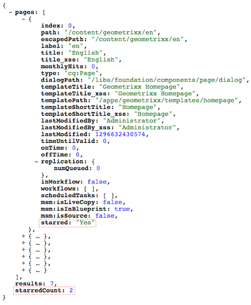

# Personalização do console Sites (Interface clássica){#customizing-the-websites-console-classic-ui}

## Adicionando uma coluna personalizada ao console Sites (siteadmin) {#adding-a-custom-column-to-the-websites-siteadmin-console}

O console Administração de sites pode ser estendido para exibir colunas personalizadas. O console é criado com base em um objeto JSON que pode ser estendido pela criação de um serviço OSGI que implementa a `ListInfoProvider` interface. Esse serviço modifica o objeto JSON enviado para o cliente para criar o console.

Este tutorial passo a passo explica como exibir uma nova coluna no console Administração de sites implementando a `ListInfoProvider` interface. Ele consiste nas seguintes etapas:

1. [Criar o serviço](#creating-the-osgi-service) OSGI e implantar o pacote que o contém no servidor AEM.
1. (opcional) [Testando o novo serviço](#testing-the-new-service) emitindo uma chamada JSON para solicitar o objeto JSON usado para criar o console.
1. [Exibindo a nova coluna](#displaying-the-new-column) estendendo a estrutura de nós do console no repositório.

>[!NOTE]
>
>Este tutorial também pode ser usado para estender os seguintes consoles de administração:
>
>* o console Ativos digitais
>* o console Comunidade

>


### Criação do serviço OSGI {#creating-the-osgi-service}

A `ListInfoProvider` interface define dois métodos:

* `updateListGlobalInfo`, para atualizar as propriedades globais da lista,
* `updateListItemInfo`, para atualizar um item de lista única.

Os argumentos para ambos os métodos são:

* `request`, o objeto de solicitação Sling HTTP associado,
* `info`, o objeto JSON a ser atualizado, que é respectivamente a lista global ou o item de lista atual,
* `resource`, um recurso Sling.

A implementação de amostra abaixo:

* Adiciona uma propriedade *estrelada* para cada item, que é `true` se o nome da página for start com um *e*, e `false` assim por diante.

* Adiciona uma propriedade *starredCount* , que é global para a lista e contém o número de itens de lista estrelados.

Para criar o serviço OSGI:

1. No CRXDE Lite, [crie um pacote](/help/sites-developing/developing-with-crxde-lite.md#managing-a-bundle).
1. Adicione o código de amostra abaixo.
1. Construa o pacote.

O novo serviço está funcionando.

```java
package com.test;

import com.day.cq.commons.ListInfoProvider;
import com.day.cq.i18n.I18n;
import com.day.cq.wcm.api.Page;
import org.apache.felix.scr.annotations.Component;
import org.apache.felix.scr.annotations.Service;
import org.apache.sling.api.SlingHttpServletRequest;
import org.apache.sling.api.resource.Resource;
import org.apache.sling.commons.json.JSONException;
import org.apache.sling.commons.json.JSONObject;

@Component(metatype = false)
@Service(value = ListInfoProvider.class)
public class StarredListInfoProvider implements ListInfoProvider {

    private int count = 0;

    public void updateListGlobalInfo(SlingHttpServletRequest request, JSONObject info, Resource resource) throws JSONException {
        info.put("starredCount", count);
        count = 0; // reset for next execution
    }

    public void updateListItemInfo(SlingHttpServletRequest request, JSONObject info, Resource resource) throws JSONException {
        Page page = resource.adaptTo(Page.class);
        if (page != null) {
            // Consider starred if page name starts with 'e'
            boolean starred = page.getName().startsWith("e");
            if (starred) {
                count++;
            }
            I18n i18n = new I18n(request);
            info.put("starred", starred ? i18n.get("Yes") : i18n.get("No"));
        }
    }

}
```

>[!CAUTION]
>
>* Sua implementação deve decidir, com base na solicitação e/ou no recurso fornecido, se deve ou não adicionar as informações ao objeto JSON.
>* Se sua `ListInfoProvider` implementação definir uma propriedade que já existe no objeto response, seu valor será substituído pelo valor fornecido.

>
>  
Você pode usar a classificação [de](https://www.osgi.org/javadoc/r2/org/osgi/framework/Constants.html#SERVICE_RANKING) serviço para gerenciar a ordem de execução de várias `ListInfoProvider` implementações.

### Testando o novo serviço {#testing-the-new-service}

Quando você abre o console Administração de sites e navega pelo site, o navegador emite uma chamada ajax para obter o objeto JSON usado para criar o console. Por exemplo, quando você navega para a `/content/geometrixx` pasta, a seguinte solicitação é enviada para o servidor AEM para criar o console:

[https://localhost:4502/content/geometrixx.pages.json?start=0&amp;limit=30&amp;predicate=siteadmin](https://localhost:4502/content/geometrixx.pages.json?start=0&amp;limit=30&amp;predicate=siteadmin)

Para verificar se o novo serviço está em execução após ter implantado o pacote que o contém:

1. Aponte seu navegador para o seguinte URL:
   [https://localhost:4502/content/geometrixx.pages.json?start=0&amp;limit=30&amp;predicate=siteadmin](https://localhost:4502/content/geometrixx.pages.json?start=0&amp;limit=30&amp;predicate=siteadmin)

1. A resposta deve exibir as novas propriedades da seguinte maneira:



### Exibição da nova coluna {#displaying-the-new-column}

A última etapa consiste em adaptar a estrutura de nós do console Administração de sites para exibir a nova propriedade de todas as páginas do Geometrixx sobrepondo `/libs/wcm/core/content/siteadmin`. Proceda do seguinte modo:

1. No CRXDE Lite, crie a estrutura de nós `/apps/wcm/core/content` com nós do tipo `sling:Folder` para refletir a estrutura `/libs/wcm/core/content`.

1. Copie o nó `/libs/wcm/core/content/siteadmin` e cole-o abaixo `/apps/wcm/core/content`.

1. Copie o nó `/apps/wcm/core/content/siteadmin/grid/assets` para `/apps/wcm/core/content/siteadmin/grid/geometrixx` e altere suas propriedades:

   * Remover **pageText**

   * Defina **pathRegex** como `/content/geometrixx(/.*)?`Isso tornará a configuração de grade ativa para todos os sites geometrixx.

   * Definir **storeProxySuffix** como `.pages.json`

   * Edite a propriedade **storeReaderFields** com vários valores e adicione o `starred` valor.

   * Para ativar a funcionalidade MSM, adicione os seguintes parâmetros MSM à propriedade multi-String **storeReaderFields**:

      * **msm:isSource**
      * **msm:isInBlueprint**
      * **msm:isLiveCopy**

1. Adicione um `starred` nó (do tipo **nt:unstructed**) abaixo `/apps/wcm/core/content/siteadmin/grid/geometrixx/columns` com as seguintes propriedades:

   * **dataIndex**: `starred` do tipo String

   * **cabeçalho**: `Starred` do tipo String

   * **xtype**: `gridcolumn` do tipo String

1. (opcional) Solte as colunas nas quais você não deseja exibir `/apps/wcm/core/content/siteadmin/grid/geometrixx/columns`

1. `/siteadmin` é um caminho vaidoso que, como padrão, aponta para `/libs/wcm/core/content/siteadmin`.
Para redirecionar isso para sua versão do siteadmin, `/apps/wcm/core/content/siteadmin` defina a propriedade `sling:vanityOrder` para ter um valor superior ao definido em `/libs/wcm/core/content/siteadmin`. O valor padrão é 300, portanto qualquer valor maior é adequado.

1. Acesse o console Administração de sites e navegue até o site Geometrixx:
   [https://localhost:4502/siteadmin#/content/geometrixx](https://localhost:4502/siteadmin#/content/geometrixx).

1. A nova coluna chamada **Starred** está disponível, exibindo informações personalizadas da seguinte maneira:


>[!CAUTION]
>
>Se várias configurações de grade corresponderem ao caminho solicitado definido pela propriedade **pathRegex** , o primeiro será usado, e não o mais específico, o que significa que a ordem das configurações é importante.

### Pacote de amostra {#sample-package}

O resultado deste tutorial está disponível no pacote [Personalizando o console](https://localhost:4502/crx/packageshare/index.html/content/marketplace/marketplaceProxy.html?packagePath=/content/companies/public/adobe/packages/helper/customizing-siteadmin) de administração de sites em Compartilhamento de pacotes.
