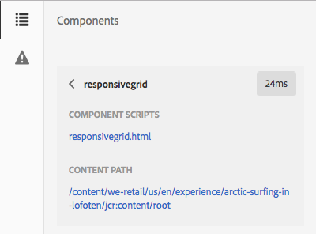

# Modo de desenvolvedor{#developer-mode}

Ao editar páginas no Adobe Experience Manager (AEM), várias [modos](/help/sites-authoring/author-environment-tools.md#modestouchoptimizedui) estão disponíveis, incluindo o Modo de desenvolvedor. Isso abre um painel lateral com várias guias que fornecem informações sobre a página atual para um desenvolvedor. As três guias são:

* **[Componentes](#components)** para exibir informações sobre estrutura e desempenho.
* **[Testes](#tests)** para executar testes e analisar os resultados.
* **[Erros](#errors)** para ver os problemas que ocorrerem.

Isso ajuda um desenvolvedor a:

* Descubra: as páginas que são compostas por.
* Depuração: o que está acontecendo, onde e quando, que por sua vez ajuda a resolver problemas.
* Teste: o aplicativo se comporta conforme esperado.

>[!CAUTION]
>
>Modo de desenvolvedor:
>
>* Só está disponível na interface habilitada para toque (ao editar páginas).
>* Não está disponível em dispositivos móveis ou janelas pequenas na área de trabalho (devido a restrições de espaço).
>
>   * Isso ocorre quando a largura é menor que 1024px.
>* Está disponível somente para usuários que são membros da `administrators` grupo.

>[!CAUTION]
>
>O modo de desenvolvedor só está disponível em uma instância de autor padrão que não esteja usando o modo de execução nosamplecontent.
>
>Se necessário, ele pode ser configurado para uso:
>
>* em uma instância do autor usando o modo de execução nosamplecontent
>* uma instância de publicação
>
>Ele deve ser desativado novamente após o uso.

>[!NOTE]
>
>Consulte:
>
>* Artigo da knowledge base, [Solução de problemas da interface de toque AEM](https://helpx.adobe.com/experience-manager/kb/troubleshooting-aem-touchui-issues.html), para obter mais dicas e ferramentas.
>* Sessão AEM Gems sobre [Modo de desenvolvedor do AEM 6.0](https://experienceleague.adobe.com/docs/events/experience-manager-gems-recordings/gems2014/aem-developer-mode.html?lang=en).
>

## Abrindo o Modo de Desenvolvedor {#opening-developer-mode}

O modo de desenvolvedor é implementado como um painel lateral para o editor de páginas. Para abrir o painel, selecione **Desenvolvedor** no seletor de modo, na barra de ferramentas do editor de páginas:

O painel é dividido em duas guias:

* **[Componentes](/help/sites-developing/developer-mode.md#components)** - Isso mostra uma árvore de componentes, semelhante à [árvore de conteúdo](/help/sites-authoring/author-environment-tools.md#content-tree) para autores

* **[Erros](/help/sites-developing/developer-mode.md#errors)** - Quando ocorrem problemas, os detalhes são mostrados para cada componente.

### Componentes {#components}

Isso mostra uma árvore de componentes que:

* Descreve a cadeia de componentes e modelos renderizados na página (SLY, JSP e assim por diante). A árvore pode ser expandida para mostrar o contexto dentro da hierarquia.
* Mostra o tempo computacional do lado do servidor para renderizar o componente.
* Permite expandir a árvore e selecionar componentes específicos dentro dela. A seleção fornece acesso aos detalhes do componente; como:

   * Caminho do repositório
   * Links para scripts (acessados em CRXDE Lite)

* Os componentes selecionados (no fluxo de conteúdo, indicados por uma borda azul) serão destacados na árvore de conteúdo (e vice-versa).

Isso pode ajudar a:

* Determine e compare o tempo de renderização por componente.
* Veja e entenda a hierarquia.
* Entenda e melhore o tempo de carregamento da página ao encontrar componentes lentos.

Cada entrada de componente pode mostrar (por exemplo):

* **Exibir detalhes**: um link para uma lista que mostra:

   * todos os scripts de componentes usados para renderizar o componente.
   * o caminho do conteúdo do repositório para este componente específico.

  

* **Editar script**: um link que:

   * abre o script do componente no CRXDE Lite.

* A expansão de uma entrada de componente (ponta de seta) também pode mostrar:

   * A hierarquia no componente selecionado.
   * Tempos de renderização para o componente selecionado isolado, quaisquer componentes individuais aninhados dentro dele e o total combinado.

  

>[!CAUTION]
>
>Alguns links apontam para scripts em `/libs`. No entanto, eles são apenas para referência, você **não deve** editar qualquer item em `/libs`, pois as alterações feitas poderão ser perdidas. Isso ocorre porque essa ramificação pode sofrer alterações sempre que você atualizar ou aplicar um hotfix ou pacote de recursos. Faça as alterações necessárias em `/apps`. Consulte [Sobreposições e substituições](/help/sites-developing/overlays.md).

### Erros {#errors}

Esperamos que o **Erros** A guia sempre estará vazia (como acima), mas quando ocorrerem problemas os detalhes a seguir serão mostrados para cada componente:

* Um aviso se o componente gravar uma entrada no log de erros, juntamente com detalhes do erro e links diretos para o código apropriado no CRXDE Lite.
* Um aviso se o componente abrir uma sessão de administrador.

Por exemplo, em uma situação em que um método indefinido é chamado, o erro resultante é mostrado no **Erros** guia:

A entrada de componente na árvore da guia Componentes também será marcada com um indicador quando ocorrer um erro.

### Testes {#tests}

>[!CAUTION]
>
>No AEM 6.2, os recursos de teste do modo de Desenvolvedor foram reimplementados como uma aplicação de Ferramentas independente.
>
>Para obter detalhes completos, consulte [Teste da interface do usuário](/help/sites-developing/hobbes.md).
