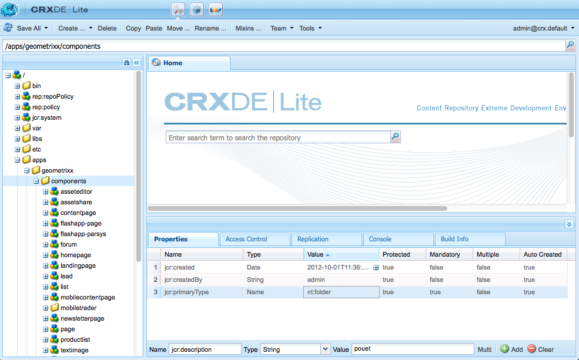

# Desenvolvimento de componentes AEM (interface clássica){#developing-aem-components-classic-ui}

A interface clássica usa o ExtJS para criar widgets que fornecem a aparência dos componentes. Devido à natureza desses widgets, há algumas diferenças entre a forma como os componentes interagem com a interface do usuário clássica e a [interface habilitada para toque](/help/sites-developing/developing-components.md).

>[!NOTE]
>
>Muitos aspectos do desenvolvimento de componentes são comuns à interface clássica e à interface habilitada para toque, portanto **você deve ler [Componentes AEM - Noções básicas](/help/sites-developing/components-basics.md) before** usando esta página, que lida com as especificidades da interface clássica.

>[!NOTE]
>
>Embora a Linguagem de modelo do HTML (HTL) e o JSP possam ser usados para desenvolver componentes para a interface clássica, esta página ilustra o desenvolvimento com o JSP. Isso se deve exclusivamente ao histórico de uso do JSP na interface clássica.
>
>HTL agora é a linguagem de script recomendada para o AEM. Consulte [HTL](https://docs.adobe.com/content/help/pt-BR/experience-manager-htl/using/overview.html) e [Desenvolvimento de componentes de AEM](/help/sites-developing/developing-components.md) para comparar métodos.

## Estrutura {#structure}

A estrutura básica de um componente é abordada na página [Componentes AEM - Noções básicas](/help/sites-developing/components-basics.md#structure), que se aplica às interfaces de usuário habilitada para toque e clássica. Mesmo se não precisar usar as configurações da interface habilitada para toque em seu novo componente, pode ajudar a conhecê-las ao herdar dos componentes existentes.

## Scripts JSP {#jsp-scripts}

Scripts ou Servlets JSP podem ser usados para renderizar componentes. De acordo com as regras de processamento de solicitação do Sling, o nome do script padrão é:

`<*componentname*>.jsp`

## global.jsp {#global-jsp}

O arquivo de script JSP `global.jsp` é usada para fornecer acesso rápido a objetos específicos (ou seja, para acessar conteúdo) a qualquer arquivo de script JSP usado para renderizar um componente.

Portanto `global.jsp` deve ser incluído em cada script JSP de renderização de componente, onde um ou mais dos objetos fornecidos em `global.jsp` são usadas.

O local do padrão `global.jsp` é:

`/libs/foundation/global.jsp`

>[!NOTE]
>
>O caminho `/libs/wcm/global.jsp`, que foi usada pelas versões CQ 5.3 e anterior, agora é obsoleta.

### Função do global.jsp, APIs usadas e Taglibs {#function-of-global-jsp-used-apis-and-taglibs}

Abaixo encontram-se os objetos mais importantes fornecidos a partir do padrão `global.jsp`:

Resumo:

* `<cq:defineObjects />`

   * `slingRequest` - O objeto de solicitação encapsulado ( `SlingHttpServletRequest`).
   * `slingResponse` - O objeto de resposta encurtado ( `SlingHttpServletResponse`).
   * `resource` - O Objeto De Recurso Sling ( `slingRequest.getResource();`).
   * `resourceResolver` - O Objeto Sling Resource Resolver ( `slingRequest.getResoucreResolver();`).
   * `currentNode` - O nó JCR resolvido para a solicitação.
   * `log` - O logger padrão ().
   * `sling` - O auxiliar do script Sling.
   * `properties` - As propriedades do recurso endereçado ( `resource.adaptTo(ValueMap.class);`).
   * `pageProperties` - As propriedades da página do recurso endereçado.
   * `pageManager` - O gerenciador de páginas para acessar AEM páginas de conteúdo ( `resourceResolver.adaptTo(PageManager.class);`).
   * `component` - O objeto componente do componente de AEM atual.
   * `designer` - O objeto do desenhador para obter informações sobre o projeto ( `resourceResolver.adaptTo(Designer.class);`).
   * `currentDesign` - A concepção do recurso endereçado.
   * `currentStyle` - O estilo do recurso endereçado.

### Acesso ao conteúdo {#accessing-content}

Há três métodos para acessar o conteúdo AEM WCM:

* Por meio do objeto properties introduzido em `global.jsp`:

   O objeto properties é uma instância de um ValueMap (consulte [API Sling](https://sling.apache.org/apidocs/sling5/org/apache/sling/api/resource/ValueMap.html)) e contém todas as propriedades do recurso atual.

   Exemplo: `String pageTitle = properties.get("jcr:title", "no title");` usado no script de renderização de um componente de página.

   Exemplo: `String paragraphTitle = properties.get("jcr:title", "no title");` usado no script de renderização de um componente de parágrafo padrão.

* Por meio do `currentPage` objeto introduzido em `global.jsp`:

   O `currentPage` é uma instância de uma página (consulte [API AEM](https://helpx.adobe.com/experience-manager/6-5/sites/developing/using/reference-materials/javadoc/com/day/cq/wcm/api/Page.mhtml)). A classe page fornece alguns métodos para acessar conteúdo.

   Exemplo: `String pageTitle = currentPage.getTitle();`

* Via `currentNode` objeto introduzido em `global.jsp`:

   O `currentNode` é uma instância de um nó (consulte [API JCR](https://jackrabbit.apache.org/api/2.16/org/apache/jackrabbit/standalone/cli/core/CurrentNode.html)). As propriedades de um nó podem ser acessadas pela variável `getProperty()` método .

   Exemplo: `String pageTitle = currentNode.getProperty("jcr:title");`

## Bibliotecas de tags JSP {#jsp-tag-libraries}

As bibliotecas de tags CQ e Sling fornecem acesso a funções específicas para uso no script JSP de seus modelos e componentes.

Para obter mais informações, consulte o documento [Bibliotecas de tags](/help/sites-developing/taglib.md).

## Usar bibliotecas HTML do lado do cliente {#using-client-side-html-libraries}

Sites modernos dependem muito de processamento no lado do cliente impulsionado por códigos complexos de JavaScript e CSS. Organizar e otimizar a veiculação desse código pode ser um problema complicado.

Para ajudar a lidar com esse problema, AEM fornece **Pastas de bibliotecas do lado do cliente**, que permitem armazenar o código do lado do cliente no repositório, organizá-lo em categorias e definir quando e como cada categoria de código deve ser apresentada ao cliente. O sistema de bibliotecas do lado do cliente cuida da produção dos links corretos na página da Web final para carregar o código correto.

Consulte o documento [Usar bibliotecas HTML do lado do cliente](/help/sites-developing/clientlibs.md) para obter mais informações.

## Caixa de diálogo {#dialog}

Seu componente precisará de uma caixa de diálogo para que os autores adicionem e configurem o conteúdo.

Consulte [Componentes AEM - Noções básicas](/help/sites-developing/components-basics.md#dialogs) para obter mais detalhes.

## Configurar o comportamento de edição {#configuring-the-edit-behavior}

Você pode configurar o comportamento de edição de um componente. Isso inclui atributos como ações disponíveis para o componente, características do editor local e ouvintes relacionados a eventos no componente. A configuração é comum às interfaces de usuário habilitadas com toque e clássica, embora com determinadas diferenças específicas.

O [editar o comportamento de um componente está configurado](/help/sites-developing/components-basics.md#edit-behavior) adicionando uma `cq:editConfig` nó do tipo `cq:EditConfig` abaixo do nó do componente (do tipo `cq:Component`) e adicionando propriedades específicas e nós secundários.

## Uso e extensão de widgets ExtJS {#using-and-extending-extjs-widgets}

Consulte [Uso e extensão de widgets ExtJS](/help/sites-developing/widgets.md) para obter mais detalhes.

## Uso de xtypes para widgets ExtJS {#using-xtypes-for-extjs-widgets}

Consulte [Uso de xtypes](/help/sites-developing/xtypes.md) para obter mais detalhes.

## Desenvolvimento de novos componentes {#developing-new-components}

Esta seção descreve como criar seus próprios componentes e adicioná-los ao sistema de parágrafos.

Uma maneira rápida de começar é copiar um componente existente e fazer as alterações desejadas.

Um exemplo de como desenvolver um componente é descrito detalhadamente em [Extensão do componente de texto e imagem - um exemplo.](#extending-the-text-and-image-component-an-example)

### Desenvolver um novo componente (adaptar componente existente) {#develop-a-new-component-adapt-existing-component}

Para desenvolver novos componentes para o AEM com base no componente existente, você pode copiar o componente, criar um arquivo javascript para o novo componente e armazená-lo em um local acessível ao AEM (consulte também [Personalização de componentes e outros elementos](/help/sites-developing/dev-guidelines-bestpractices.md#customizing-components-and-other-elements)):

1. Usando o CRXDE Lite, crie uma nova pasta de componentes em:

   / `apps/<myProject>/components/<myComponent>`

   Recrie a estrutura do nó como em libs e copie a definição de um componente existente, como o componente Texto . Por exemplo, para personalizar a cópia do componente de Texto:

   * de `/libs/foundation/components/text`
   * para `/apps/myProject/components/text`

1. Modifique o `jcr:title` para refletir seu novo nome.
1. Abra a nova pasta de componentes e faça as alterações necessárias. Além disso, exclua quaisquer informações irrelevantes na pasta.

   É possível fazer alterações como:

   * adição de um novo campo na caixa de diálogo

      * `cq:dialog` - caixa de diálogo da interface habilitada para toque
      * `dialog` - caixa de diálogo da interface clássica
   * substituição do `.jsp` arquivo (nomeie-o depois do novo componente)
   * ou retrabalhar completamente o componente inteiro se desejar

   Por exemplo, se você pegar uma cópia do componente Texto padrão, poderá adicionar um campo adicional à caixa de diálogo e atualizar o `.jsp` para processar a entrada aí efetuada.

   >[!NOTE]
   >
   >Um componente para o:
   >
   >* UI habilitada para toque usa [Granite](https://helpx.adobe.com/experience-manager/6-5/sites/developing/using/reference-materials/granite-ui/api/jcr_root/libs/granite/ui/index.html) componentes
   >* UI clássica usa [Widgets ExtJS](https://helpx.adobe.com/experience-manager/6-5/sites/developing/using/reference-materials/widgets-api/index.html)


   >[!NOTE]
   >
   >Uma caixa de diálogo definida para a interface clássica funcionará na interface habilitada para toque.
   >
   >Uma caixa de diálogo definida para a interface habilitada para toque não funcionará na interface clássica.
   >
   >Dependendo da instância e do ambiente de criação, talvez você queira definir ambos os tipos de diálogo para o seu componente.

1. Um dos seguintes nós deve estar presente e ser inicializado corretamente para que o novo componente apareça:

   * `cq:dialog` - caixa de diálogo da interface habilitada para toque
   * `dialog` - caixa de diálogo da interface clássica
   * `cq:editConfig` - como os componentes se comportam no ambiente de edição (por exemplo, arrastar e soltar)
   * `design_dialog` - caixa de diálogo para o modo de design (somente interface clássica)

1. Ative o novo componente no sistema de parágrafo:

   * uso do CRXDE Lite para adicionar o valor `<path-to-component>` (por exemplo, `/apps/geometrixx/components/myComponent`) aos componentes de propriedade do nó `/etc/designs/geometrixx/jcr:content/contentpage/par`
   * seguindo as instruções em [Adicionar novos componentes aos sistemas de parágrafo](#adding-a-new-component-to-the-paragraph-system-design-mode)

1. No AEM WCM, abra uma página no site e insira um novo parágrafo do tipo que você acabou de criar para garantir que o componente esteja funcionando corretamente.

>[!NOTE]
>
>Para ver as estatísticas de tempo para o carregamento da página, você pode usar Ctrl-Shift-U - com `?debugClientLibs=true` definido no URL.

### Adicionar um novo componente ao Sistema de parágrafo (Modo Design) {#adding-a-new-component-to-the-paragraph-system-design-mode}

Depois que o componente tiver sido desenvolvido, você o adicionará ao sistema de parágrafo, o que permite que os autores selecionem e usem o componente ao editar uma página.

1. Acesse uma página em seu ambiente de criação que use o sistema de parágrafo, por exemplo `<contentPath>/Test.html`.
1. Alterne para o Modo de Design:

   * adição `?wcmmode=design` ao final do URL e acessando novamente, por exemplo:

      `<contextPath>/ Test.html?wcmmode=design`

   * clicar em Design no Sidekick

   Agora você está no modo de design e pode editar o sistema de parágrafo.

1. Clique em Editar.

   Uma lista de componentes pertencentes ao sistema de parágrafo é mostrada. O novo componente também está listado.

   Os componentes podem ser ativados (ou desativados) para determinar quais são oferecidos ao autor ao editar uma página.

1. Ative o componente e retorne ao modo de edição normal para confirmar que ele está disponível para uso.

### Extensão do componente de texto e imagem - um exemplo {#extending-the-text-and-image-component-an-example}

Esta seção fornece um exemplo de como estender o componente padrão de texto e imagem amplamente usado com um recurso configurável de posicionamento de imagem.

A extensão para o componente de texto e imagem permite que os editores usem toda a funcionalidade existente do componente, além de ter uma opção extra para especificar a posição da imagem:

* No lado esquerdo do texto (comportamento atual e o novo padrão)
* Bem como no lado direito

Após estender esse componente, você pode configurar o posicionamento da imagem por meio da caixa de diálogo do componente.

As seguintes técnicas são descritas neste exercício:

* Copiando nó de componente existente e modificando seus metadados
* Modificar a caixa de diálogo do componente, incluindo a herança de widgets das caixas de diálogo pai
* Modificação do script do componente para implementar a nova funcionalidade

>[!NOTE]
>
>Este exemplo é direcionado para a interface clássica.

>[!NOTE]
>
>Este exemplo é baseado no conteúdo de amostra do Geometrixx, que não é mais enviado com o AEM, tendo sido substituído por We.Retail. Consulte o documento [Implementação de referência We.Retail](/help/sites-developing/we-retail.md#we-retail-geometrixx) para saber como baixar e instalar o Geometrixx.

#### Extensão do componente de tempo de texto existente {#extending-the-existing-textimage-component}

Para criar o novo componente, usamos o componente de tempo de texto padrão como base e o modificamos. Armazenamos o novo componente no aplicativo de exemplo WCM AEM Geometrixx.

1. Copie o componente de tempo de texto padrão de `/libs/foundation/components/textimage` na pasta do componente do Geometrixx, `/apps/geometrixx/components`, utilizando textimage como o nome do nó do destino. (Copie o componente navegando até o componente, clicando com o botão direito do mouse e selecionando Copiar e navegando até o diretório de destino.)

   

1. Para manter esse exemplo simples, navegue até o componente copiado e exclua todos os subnós do novo nó de data de texto, exceto os seguintes:

   * definição da caixa de diálogo: `textimage/dialog`
   * script de componente: `textimage/textimage.jsp`
   * editar nó de configuração (permitindo arrastar e soltar ativos): `textimage/cq:editConfig`

   >[!NOTE]
   >
   >A definição da caixa de diálogo depende da interface do usuário do :
   >
   >* Interface habilitada para toque: `textimage/cq:dialog`
   >* Interface clássica: `textimage/dialog`


1. Edite os metadados do componente:

   * Nome do componente

      * Definir `jcr:description` para `Text Image Component (Extended)`
      * Definir `jcr:title` para `Text Image (Extended)`
   * Grupo, onde o componente está listado no sidekick (deixe como está)

      * Sair `componentGroup` defina como `General`
   * Componente pai do novo componente (o componente de tempo de texto padrão)

      * Definir `sling:resourceSuperType` para `foundation/components/textimage`

   Após esta etapa, o nó do componente tem a seguinte aparência:

   

1. Altere o `sling:resourceType` propriedade do nó de configuração de edição da imagem (propriedade: `textimage/cq:editConfig/cq:dropTargets/image/parameters/sling:resourceType`) a `geometrixx/components/textimage.`

   Dessa forma, quando uma imagem é solta no componente na página, a variável `sling:resourceType` a propriedade do componente textimage estendido está definida como: `geometrixx/components/textimage.`

1. Modifique a caixa de diálogo do componente para incluir a nova opção. O novo componente herda as partes da caixa de diálogo que são as mesmas do original. A única adição que fazemos é estender o **Avançado** , adicionar uma **Posição da imagem** lista suspensa, com opções **Left** e **Right**:

   * Deixe o `textimage/dialog`propriedades inalteradas.

   Observe como `textimage/dialog/items` tem quatro subnós, tab1 a tab4, representando as quatro guias da caixa de diálogo textimage.

   * Para as duas primeiras guias (guia1 e guia2):

      * Altere xtype para cqinclude (para herdar do componente padrão).
      * Adicionar uma propriedade de caminho com valores `/libs/foundation/components/textimage/dialog/items/tab1.infinity.json`e `/libs/foundation/components/textimage/dialog/items/tab2.infinity.json`, respectivamente.
      * Remova todas as outras propriedades ou subnós.
   * Para a guia 3:

      * Deixe as propriedades e os subnós sem alterações
      * Adicione uma nova definição de campo para `tab3/items`, posição do nó do tipo `cq:Widget`
      * Defina as seguintes propriedades (do tipo String) para o novo `tab3/items/position`nó:

         * `name`: `./imagePosition`
         * `xtype`: `selection`
         * `fieldLabel`: `Image Position`
         * `type`: `select`
      * Adicionar subnó `position/options` de tipo `cq:WidgetCollection` para representar as duas opções de posicionamento de imagem, e sob ele crie dois nós, o1 e o2 do tipo `nt:unstructured`.
      * Para nó `position/options/o1` defina as propriedades: `text` para `Left` e `value` para `left.`
      * Para nó `position/options/o2` defina as propriedades: `text` para `Right` e `value` para `right`.
   * Guia Excluir4.

   A posição da imagem é mantida no conteúdo como `imagePosition`propriedade do nó que representa `textimage` parágrafo. Após essas etapas, a caixa de diálogo do componente terá esta aparência:

   

1. Estender o script de componente, `textimage.jsp`, com tratamento extra do novo parâmetro:

   ```xml
   Image image = new Image(resource, "image");
   
   if (image.hasContent() || WCMMode.fromRequest(request) == WCMMode.EDIT) {
        image.loadStyleData(currentStyle);
   ```

   Vamos substituir o fragmento de código enfatizado *%>&lt;div class=&quot;image&quot;>&lt;%* com um novo código que gera um estilo personalizado para essa tag.

   ```xml
   // todo: add new CSS class for the 'right image' instead of using
   // the style attribute
   String style="";
        if (properties.get("imagePosition", "left").equals("right")) {
             style = "style=\"float:right\"";
        }
        %><div <%= style %> class="image"><%
   ```

1. Salve o componente no repositório. O componente está pronto para o teste.

#### Verificar o novo componente {#checking-the-new-component}

Depois que o componente tiver sido desenvolvido, você poderá adicioná-lo ao sistema de parágrafo, o que permite que os autores selecionem e usem o componente ao editar uma página. Essas etapas permitem testar o componente.

1. Abra uma página no Geometrixx, como Inglês / Empresa.
1. Alterne para o modo de design clicando em Design no Sidekick.
1. Edite o design do sistema de parágrafo clicando em Editar no sistema de parágrafo no meio da página. Uma lista de componentes, que podem ser colocados no sistema de parágrafo, é mostrada e deve incluir o componente recém-desenvolvido, Imagem de texto (estendida) . Ative-o para o sistema de parágrafo selecionando-o e clicando em OK .
1. Volte para o modo de edição.
1. Adicione o parágrafo Imagem de texto (estendida) ao sistema de parágrafo, inicialize o texto e a imagem com o conteúdo de amostra. Salve as alterações.
1. Abra a caixa de diálogo do texto e do parágrafo da imagem, altere a Posição da imagem na guia Avançado para Direita e clique em OK para salvar as alterações.
1. O parágrafo é renderizado com a imagem à direita.
1. O componente agora está pronto para uso.

O componente armazena seu conteúdo em um parágrafo na página Empresa .

### Desative o recurso de upload do componente de imagem {#disable-upload-capability-of-the-image-component}

Para desativar esse recurso, usamos o componente de imagem padrão como base e o modificamos. Armazenamos o novo componente no aplicativo de exemplo do Geometrixx.

1. Copie o componente de imagem padrão de `/libs/foundation/components/image` na pasta do componente do Geometrixx, `/apps/geometrixx/components`, usando a imagem como o nome do nó de destino.

   

1. Edite os metadados do componente:

   * Definir **jcr:title** para `Image (Extended)`

1. Vá até `/apps/geometrixx/components/image/dialog/items/image`.
1. Adicionar uma nova propriedade:

   * **Nome**: `allowUpload`
   * **Tipo**: `String`
   * **Valor**: `false`

   

1. Clique em **Salvar tudo**. O componente está pronto para o teste.
1. Abra uma página no Geometrixx, como Inglês / Empresa.
1. Alterne para o modo de design e ative Imagem (estendida).
1. Volte para o modo de edição e adicione-o ao sistema de parágrafo. Nas próximas imagens, você pode ver as diferenças entre o componente de imagem original e aquele que você acabou de criar.

   Componente de imagem original:

   

   Seu novo componente de imagem:

   

1. O componente agora está pronto para uso.
