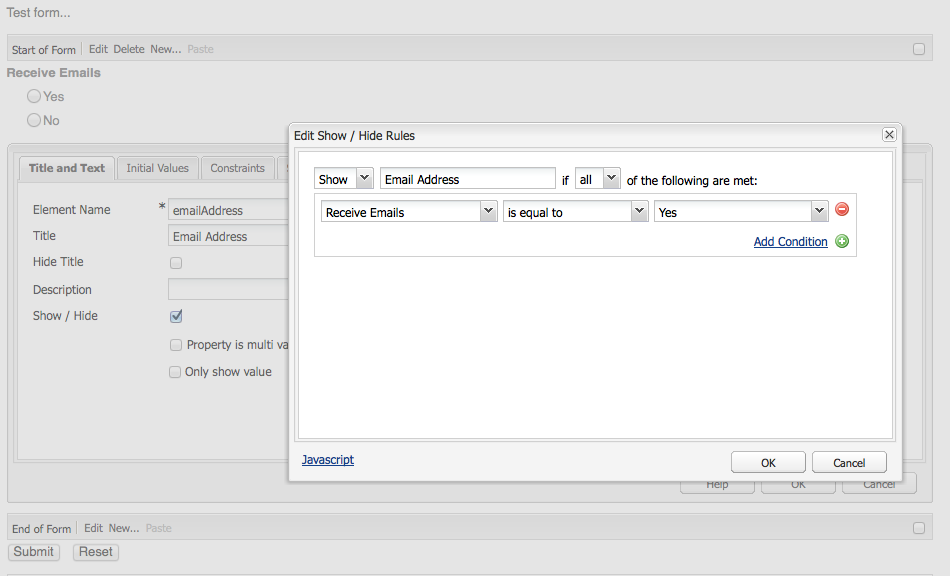

# Desenvolvimento do Forms (interface clássica){#developing-forms-classic-ui}

A estrutura básica de um formulário é:

* Start de formulário
* Elementos de formulário
* Fim do formulário

Todos eles são realizados com uma série de componentes [padrão do](/help/sites-authoring/default-components.md#form)Formulário, disponíveis em uma instalação padrão do AEM.

Além de [desenvolver novos componentes](/help/sites-developing/developing-components-samples.md) para uso em seus formulários, você também pode:

* [Pré-carregar seu formulário com valores](#preloading-form-values)
* [Pré-carregar (determinados) campos com vários valores](#preloading-form-fields-with-multiple-values)
* [Desenvolver novas ações](#developing-your-own-form-actions)
* [Desenvolver novas restrições](#developing-your-own-form-constraints)
* [Mostrar ou ocultar campos de formulário específicos](#showing-and-hiding-form-components)

[Uso de scripts](#developing-scripts-for-use-with-forms) para estender a funcionalidade quando necessário.

>[!NOTE]
>
>Este documento foca no desenvolvimento de formulários usando os Componentes  básicos na interface clássica. O Adobe recomenda aproveitar os novos Componentes  principais e [Ocultar condições](/help/sites-developing/hide-conditions.md) para o desenvolvimento de formulários na interface habilitada para toque.

## Pré-carregamento de valores de formulário {#preloading-form-values}

O componente de start de formulário fornece um campo para o Caminho **de** carga, um caminho opcional que aponta para um nó no repositório.

O Caminho de carga é o caminho para as propriedades do nó que é usado para carregar valores predefinidos em vários campos do formulário.

Isso é um campo opcional que especifica o caminho para um nó no repositório. Quando este nó tem propriedades que correspondem aos nomes do campo, os campos apropriados no formulário são pré-carregados com o valor dessas propriedades. Caso não exista nenhuma correspondência, o campo vai conter o valor padrão.

>[!NOTE]
>
>Uma ação [de](#developing-your-own-form-actions) formulário também pode definir o recurso a partir do qual os valores iniciais serão carregados. Isso é feito usando `FormsHelper#setFormLoadResource` o interior `init.jsp`.
>
>Somente se isso não for definido, o formulário será preenchido a partir do caminho definido no componente de formulário do start pelo autor.

### Preloading Form Fields with Multiple Values {#preloading-form-fields-with-multiple-values}

Vários campos de formulário também têm o Caminho **de carregamento de** itens, novamente um caminho opcional que aponta para um nó no repositório.

O Caminho **de carga de** itens é o caminho para as propriedades do nó que é usado para carregar valores predefinidos nesse campo específico no formulário, por exemplo, uma lista suspensa, um grupo [de caixas de](/help/sites-authoring/default-components-foundation.md#checkbox-group) seleção ou um grupo [de](/help/sites-authoring/default-components-foundation.md#radio-group)opções.

#### Exemplo - Pré-carregar uma Lista suspensa com vários valores {#example-preloading-a-dropdown-list-with-multiple-values}

Uma lista suspensa pode ser configurada com o intervalo de valores para a seleção.

O Caminho **de carregamento de** itens pode ser usado para acessar uma lista de uma pasta no repositório e pré-carregá-los no campo:

1. Crie uma nova pasta sling ( `sling:Folder`)por exemplo, `/etc/designs/<myDesign>/formlistvalues`

1. Adicione uma nova propriedade (por exemplo, `myList`) do tipo cadeia de caracteres de vários valores ( `String[]`) para conter a lista de itens suspensos. O conteúdo também pode ser importado usando um script, como com um script JSP ou cURL em um script shell.

1. Use o caminho completo no campo Caminho **de carga de** itens:
por exemplo, `/etc/designs/geometrixx/formlistvalues/myList`

Observe que, se os valores no `String[]` forem formatados da seguinte maneira:

* `AL=Alabama`
* `AK=Alaska`
* *etc.*

então AEM gerará a lista como:

* `<option value="AL">Alabama</option>`
* `<option value="AK">Alaska</option>`

Esse recurso pode, por exemplo, ser bem utilizado em uma configuração de vários idiomas.

### Desenvolver suas próprias ações de formulário {#developing-your-own-form-actions}

Um formulário exige uma ação. Uma ação define a operação executada quando o formulário é enviado com os dados do usuário.

Uma variedade de ações é fornecida com uma instalação AEM padrão, essas ações podem ser vistas em:

`/libs/foundation/components/form/actions`

e na lista **Action Type** do componente **Form** :

Esta seção aborda como você pode desenvolver sua própria ação de formulário para inclusão nesta lista.

Você pode adicionar sua própria ação da `/apps` seguinte maneira:

1. Crie um nó do tipo `sling:Folder`. Especifique um nome que reflita a ação a ser implementada.

   Por exemplo:

   `/apps/myProject/components/customFormAction`

1. Nesse nó, defina as seguintes propriedades e clique em **Salvar tudo** para continuar suas alterações:

   * `sling:resourceType` - definido como `foundation/components/form/action`

   * `componentGroup` - definir como `.hidden`

   * Opcionalmente:

      * `jcr:title` - especifique um título de sua escolha, que será exibido na lista de seleção suspensa. Se não estiver definido, o nome do nó será exibido

      * `jcr:description` - insira uma descrição de sua escolha

1. Na pasta, crie um nó de diálogo:

   1. Adicione campos para que o autor possa editar a caixa de diálogo de formulários depois que a ação for escolhida.

1. Na pasta, crie:

   1. Um script post.
O nome do script é `post.POST.<extension>`, por exemplo, `post.POST.jsp`O script post é chamado quando um formulário é enviado para processar o formulário, ele contém o código que manipula os dados que chegam do formulário 
`POST`.

   1. Adicione um script forward que é chamado quando o formulário é enviado.
O nome do script é `forward.<extension`>, por exemplo, `forward.jsp`esse script pode definir um caminho. A solicitação atual é encaminhada para o caminho especificado.
   A chamada necessária é `FormsHelper#setForwardPath` (2 variantes). Um caso típico é executar alguma validação, ou lógica, para encontrar o caminho do público alvo e, em seguida, avançar para esse caminho, permitindo que o servlet Sling POST faça o armazenamento real no JCR.

   Também pode haver outro servlet que faça o processamento real, nesse caso a ação do formulário e o servidor só `forward.jsp` atuariam como o código de &quot;cola&quot;. Um exemplo disso é a ação de email em `/libs/foundation/components/form/actions/mail`, que encaminha detalhes para `<currentpath>.mail.html`onde um servlet de email se situa.

   Então:

   * a `post.POST.jsp` é útil para pequenas operações totalmente realizadas pela própria ação
   * enquanto o `forward.jsp` é útil quando somente a delegação é necessária.

   A ordem de execução dos scripts é:

   * Ao renderizar o formulário ( `GET`):

      1. `init.jsp`
      1. para todas as restrições do campo: `clientvalidation.jsp`
      1. validationRT do formulário: `clientvalidation.jsp`
      1. o formulário é carregado por meio do recurso de carregamento se definido
      1. `addfields.jsp` durante a renderização `<form></form>`
   * ao manusear um formulário `POST`:

      1. `init.jsp`
      1. para todas as restrições do campo: `servervalidation.jsp`
      1. validationRT do formulário: `servervalidation.jsp`
      1. `forward.jsp`
      1. se um caminho de encaminhamento foi definido ( `FormsHelper.setForwardPath`), encaminhe a solicitação e chame `cleanup.jsp`

      1. se nenhum caminho de encaminhamento foi definido, chame `post.POST.jsp` (termina aqui, sem `cleanup.jsp` chamada)

1. Outra vez na pasta, opcionalmente, adicione:

   1. Um script para adicionar campos.
O nome do script é `addfields.<extension>`, por exemplo, `addfields.jsp`um script addfields é chamado imediatamente depois que o HTML do start de formulário é gravado. Isso permite que a ação adicione campos de entrada personalizados ou outro HTML desse tipo dentro do formulário.

   1. Um script de inicialização.
O nome do script é `init.<extension>`, por exemplo, `init.jsp`Esse script é chamado quando o formulário é renderizado. Ele pode ser usado para inicializar detalhes de ação. &quot;

   1. Um script de limpeza.
O nome do script é `cleanup.<extension>`, por exemplo, `cleanup.jsp`Este script pode ser usado para realizar a limpeza.

1. Use o componente **Forms** em um parsys. O menu suspenso Tipo **de** ação agora incluirá sua nova ação.

   >[!NOTE]
   >
   >Para ver as ações padrão que fazem parte do produto:
   >
   >
   >`/libs/foundation/components/form/actions`

### Desenvolver suas próprias restrições de formulário {#developing-your-own-form-constraints}

As restrições podem ser impostas em dois níveis:

* Para campos [individuais (consulte o procedimento a seguir)](#constraints-for-individual-fields)
* Como validação global de [formulário](#form-global-constraints)

#### Restrições para campos individuais {#constraints-for-individual-fields}

Você pode adicionar suas próprias restrições para um campo individual (abaixo `/apps`) da seguinte maneira:

1. Crie um nó do tipo `sling:Folder`. Especifique um nome que reflita a restrição a ser implementada.

   Por exemplo:

   `/apps/myProject/components/customFormConstraint`

1. Nesse nó, defina as seguintes propriedades e clique em **Salvar tudo** para continuar suas alterações:

   * `sling:resourceType` - definir para `foundation/components/form/constraint`

   * `constraintMessage` - uma mensagem personalizada que será exibida se o campo não for válido, de acordo com a restrição, quando o formulário for enviado

   * Opcionalmente:

      * `jcr:title` - especifique um título de sua escolha, que será exibido na lista de seleção. Se não estiver definido, o nome do nó será exibido
      * `hint` - informações adicionais, para o usuário, sobre como usar o campo

1. Dentro desta pasta, você pode precisar dos seguintes scripts:

   * Um script de validação de cliente:
O nome do script é `clientvalidation.<extension>`, por exemplo, `clientvalidation.jsp`isso é chamado quando o campo de formulário é renderizado. Ele pode ser usado para criar javascript cliente para validar o campo no cliente.

   * Um script de validação do servidor:
O nome do script é `servervalidation.<extension>`, por exemplo, `servervalidation.jsp`Isso é chamado quando o formulário é enviado. Ele pode ser usado para validar o campo no servidor depois que ele for enviado.

>[!NOTE]
>
>As restrições de amostra podem ser vistas em:
>
>`/libs/foundation/components/form/constraints`

#### Restrições de forma global {#form-global-constraints}

A validação global do formulário é especificada pela configuração de um tipo de recurso no componente de formulário do start ( `validationRT`). Por exemplo:

`apps/myProject/components/form/validation`

Em seguida, é possível definir:

* a `clientvalidation.jsp` - inserido após os scripts de validação do cliente do campo
* e um `servervalidation.jsp` - também chamado após as validações de servidor de campo individual em um `POST`.

### Showing and Hiding Form Components {#showing-and-hiding-form-components}

É possível configurar o formulário para mostrar ou ocultar componentes de formulário de acordo com o valor de outros campos no formulário.

Alterar a visibilidade de um campo do formulário é útil, quando o campo é necessário apenas em condições específicas. Por exemplo, em um formulário de feedback, uma pergunta faz com que os clientes queiram que as informações sobre o produto sejam enviadas por email. Ao selecionar sim, um campo de texto é exibido para permitir que o cliente digite seu endereço de email.

Use a caixa de diálogo **Editar Mostrar/Ocultar regras** para especificar as condições em que um componente de formulário é exibido ou oculto.

Use os campos na parte superior da caixa de diálogo para especificar as seguintes informações:

* Se você está especificando as condições para ocultar ou mostrar o componente.
* Se alguma ou todas as condições precisam ser verdadeiras para mostrar ou ocultar o componente.

Uma ou mais condições são exibidas abaixo desses campos. Uma condição compara o valor de outro componente de formulário (no mesmo formulário) a um valor. Se o valor real no campo atender à condição, ela será avaliada como true. As condições incluem as seguintes informações:

* O Título do campo de formulário testado.
* Um operador.
* Um valor em relação ao valor do campo é comparado.

Por exemplo, um componente de Grupo de opções com o título `Receive email notifications?`* * contém `Yes` e `No` botões de opção. Um componente de Campo de texto com o título de `Email Address` usa a seguinte condição para que fique visível se `Yes` estiver selecionado:

No Javascript, as condições usam o valor da propriedade Nome do elemento para fazer referência aos campos. No exemplo anterior, a propriedade Nome do elemento do componente Grupo de opções é `contact`. O código a seguir é o código JavaScript equivalente para esse exemplo:

`((contact == "Yes"))`

**Para mostrar ou ocultar um componente de formulário:**

1. Edite o componente de formulário específico.

1. Selecione **Mostrar/Ocultar** para abrir a caixa de diálogo **Editar Mostrar/Ocultar regras** :

   * Na primeira lista suspensa, selecione **Mostrar** ou **Ocultar** para especificar se suas condições determinam se o componente deve ser exibido ou ocultado.

   * Na lista suspensa no final da linha superior, selecione:

      * **all** - se todas as condições devem ser verdadeiras para mostrar ou ocultar o componente
      * **any** - se apenas uma ou mais condições devem ser verdadeiras para mostrar ou ocultar o componente
   * Na linha de condição (uma é apresentada como padrão), selecione um componente, um operador e especifique um valor.
   * Adicione mais condições, se necessário, clicando em **Adicionar condição**.

   Por exemplo:

   

1. Click **OK** to save the definition.

1. Depois de salvar sua definição, um link **Editar regras** é exibido ao lado da opção **Mostrar/ocultar** nas propriedades do componente de formulário. Clique neste link para abrir a caixa de diálogo **Editar Mostrar/Ocultar regras** para fazer alterações.

   Click **OK** to save all changes.

   

   >[!CAUTION]
   >
   >Os efeitos das definições Exibir/Ocultar podem ser vistos e testados:
   >
   >
   >
   >    * no modo de **Pré-visualização** no ambiente do autor (precisa de um recarregamento de página ao alternar pela primeira vez para a pré-visualização)
      >
      >    
   * no ambiente publish

#### Tratamento de referências de componentes quebrados {#handling-broken-component-references}

As condições de mostrar/ocultar usam o valor da propriedade Nome do elemento para referenciar outros componentes no formulário. A configuração Mostrar/Ocultar é inválida quando qualquer uma das condições se refere a um componente que é excluído ou teve a propriedade Nome do elemento alterada. Quando essa situação ocorre, é necessário atualizar manualmente as condições ou ocorre um erro quando o formulário é carregado.

Quando a configuração Exibir/Ocultar for inválida, a configuração será fornecida somente como código JavaScript. Edite o código para corrigir os problemas.O código usa a propriedade Nome do elemento que foi originalmente usada para fazer referência aos componentes.

### Desenvolvimento de scripts para uso com o Forms {#developing-scripts-for-use-with-forms}

Para obter mais informações sobre os elementos de API que podem ser usados ao gravar scripts, consulte os [javadocs relacionados aos formulários](https://helpx.adobe.com/experience-manager/6-5/sites/developing/using/reference-materials/javadoc/com/day/cq/wcm/foundation/forms/package-summary.html).

É possível usar isso para ações como chamar um serviço antes de o formulário ser enviado e cancelar o serviço em caso de falha:

* Definir o tipo de recurso de validação
* Incluir um script para validação:

   * Em seu JSP, chame o serviço da Web e crie um `com.day.cq.wcm.foundation.forms.ValidationInfo` objeto que contenha suas mensagens de erro. Se houver erros, os dados do formulário não serão publicados.
