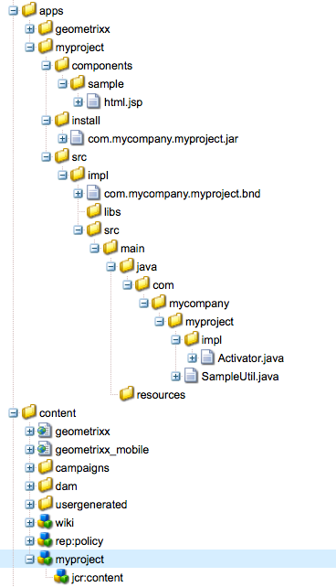

# Desenvolver com o CRXDE Lite{#developing-with-crxde-lite}

Esta seção descreve como desenvolver seu aplicativo AEM usando o CRXDE Lite.

Consulte a documentação de visão geral para obter mais informações sobre os diferentes ambientes de desenvolvimento disponíveis.

O CRXDE Lite está incorporado ao AEM e permite executar tarefas de desenvolvimento padrão no navegador. Com o CRXDE Lite, você pode criar um projeto, criar e editar arquivos (como .jsp e .java), pastas, modelos, componentes, caixas de diálogo, nós, propriedades e pacotes enquanto faz logon e integração com o SVN.
O CRXDE Lite é recomendado quando você não tem acesso direto ao servidor AEM, quando desenvolve um aplicativo, estendendo ou modificando os componentes predefinidos e os pacotes Java ou quando não precisa de um depurador dedicado, finalização de código e realce de sintaxe.

>[!NOTE]
>
>Por padrão, todos os usuários do AEM podem acessar o CRXDE Lite. Se desejar, [configure ACLs](/help/sites-administering/security.md#permissions-and-acls) para o seguinte nó, de modo que somente os desenvolvedores possam acessar o CRX DE Lite:
>
>`/libs/granite/crxde`

>[!NOTE]
>
>É recomendável usar as Ferramentas do desenvolvedor do [AEM para o Eclipse](/help/sites-developing/aem-eclipse.md) e a Extensão [dos suportes HTL do](/help/sites-developing/aem-brackets.md) AEM durante o desenvolvimento do projeto.

## Introdução ao CRXDE Lite {#getting-started-with-crxde-lite}

Para começar a usar o CRXDE Lite, proceda da seguinte forma:

1. Instale o AEM.
1. Em seu navegador, digite `https://<host>:<port>/crx/de`. Por padrão é `https://localhost:4502/crx/de`.
1. Digite seu **nome de usuário** e **senha**. Por padrão é `admin` e `admin`.

1. Clique em **OK**.

A interface do usuário CRXDE Lite é exibida da seguinte forma em seu navegador:


Agora você pode usar o CRXDE Lite para desenvolver seu aplicativo.

## Visão geral da interface do usuário {#overview-of-the-user-interface}

O CRXDE Lite oferece a seguinte funcionalidade:

<table>
 <tbody>
  <tr>
   <td>Barra do comutador superior</td>
   <td>Permite alternar rapidamente entre o CRXDE Lite, o Package Manager e o Package Share.</td>
  </tr>
  <tr>
   <td>Widget de caminho de nó</td>
   <td><p>Exibe o caminho para o nó atualmente selecionado.</p> <p>Você também pode usá-lo para pular para um nó, inserindo o caminho manualmente ou colando-o de outro lugar e pressionando Enter.</p> <p>Também oferece suporte para procurar nós com nome de nó específico. Digite o nome do nó que você deseja localizar e aguarde (ou pressione o símbolo de pesquisa no lado direito). Você pode tentar inserir, por exemplo, o <em>carvalho</em> de corda no widget para ver como ele funciona. Se um determinado nó ou nós forem carregados no painel explorador, a lista será exibida e você poderá selecionar o caminho e pressionar Enter para navegar até ele. Observe que ele só funciona para os nós carregados no momento no aplicativo cliente CRXDE no navegador. Se quiser pesquisar o repositório inteiro, use Ferramentas e, em seguida, Consulta.</p> </td>
  </tr>
  <tr>
   <td>Painel do Explorer</td>
   <td><p>Exibe uma árvore de todos os nós no repositório.</p> <p>Clique em um nó para exibir suas propriedades na guia <strong>Propriedades</strong> . Depois de clicar em um nó, você pode selecionar uma ação na barra de ferramentas. Clique no nó novamente para renomeá-lo.</p> <p>Filtro de navegação da árvore (ícone binocular): permite que você filtre os nós no repositório para os quais o nome contém o texto de entrada. Ela se aplica somente aos nós que foram carregados localmente.<br /> </p> </td>
  </tr>
  <tr>
   <td>Painel Editar</td>
   <td><p><strong>Guia Início</strong> : permite pesquisar conteúdo e/ou documentação e acessar recursos do desenvolvedor (documentação, blog do desenvolvedor, base de conhecimento) e suporte (página inicial e centro de suporte da Adobe).<br /> </p> <p>Clique duas vezes em um arquivo no painel <strong>do Explorer</strong> para exibir seu conteúdo; por exemplo, um arquivo .jsp ou .java. Você pode modificá-la e salvar as alterações.</p> <p>Depois que um arquivo é editado no painel <strong>Editar</strong> , as seguintes ferramentas ficam disponíveis na barra de ferramentas:<br /> </p> - <strong>Mostrar na árvore: mostra </strong>o arquivo na árvore do repositório.<br /> - <strong>Pesquisar/Substituir ...</strong>: faça pesquisa ou substitua.<br /> <br /> Clique duas vezes na linha de status do painel <strong>Editar</strong> para abrir a caixa de diálogo <strong>Ir para linha</strong> para que você possa digitar um número de linha específico para acessar.<br /> </td>
  </tr>
  <tr>
   <td>Guia Propriedades<br /> </td>
   <td>Exibe as propriedades do nó selecionado. É possível adicionar novas propriedades ou excluir as existentes.<br /> </td>
  </tr>
  <tr>
   <td>Guia Controle de acesso</td>
   <td><p>Exibir permissões com base no caminho atual, no nível do repositório ou no principal.</p> <p>As permissões são divididas em</p> <p>- Política <strong>De Controlo De Acesso</strong>Aplicável: As políticas que podem ser aplicadas à seleção atual.</p> <p>- Políticas <strong>de controlo de acesso</strong>local: As políticas atuais aplicadas localmente à seleção atual.</p> <p>- Políticas <strong></strong>eficazes de controlo do acesso: As políticas atuais aplicadas à seleção atual podem ser definidas localmente ou herdadas dos nós pais.</p> <p>Nota. Para poder ver as informações de Controle de acesso, o usuário conectado ao CRXDE Lite deve ter direitos de leitura das entradas ACL. O usuário anônimo não pode ver essas informações por padrão - faça logon como, por exemplo, administrador para ver as informações.</p> </td>
  </tr>
  <tr>
   <td>Guia Replicação</td>
   <td><p>Exibir o status de replicação do nó atual. É possível replicar e excluir o nó atual.</p> </td>
  </tr>
  <tr>
   <td>Guia Console<br /> </td>
   <td><p><strong>Logs do servidor</strong>:</p> <p>Exibe mensagens de registro. Você pode configurar o nível de log, limpar o console, fixar na posição de rolagem selecionada e ativar/desativar a exibição de mensagens.<br /> </p> <p><strong>Controle da versão</strong>:</p> <p>Exibe mensagens de controle de versão.<br /> </p> </td>
  </tr>
  <tr>
   <td>Guia Informações da criação<br /> </td>
   <td>Exibe informações quando um pacote está sendo criado.<br /> </td>
  </tr>
  <tr>
   <td>Atualizar<br /> </td>
   <td>Atualiza a seleção atual. As alterações de outros usuários são atualizadas na visualização do repositório. As alterações efetuadas não são afetadas.<br /> </td>
  </tr>
  <tr>
   <td>Salvar Tudo</td>
   <td><p><strong>Salvar Tudo</strong>:<br /> </p> <p>Salva todas as alterações feitas. Até clicar em salvar, as alterações serão temporárias e serão perdidas quando você sair do console.</p> <p><strong>Reverter</strong>:</p> <p>Descarta todas as alterações feitas no nó selecionado desde a última ação de salvamento e, em seguida, recarrega o estado atual do repositório para o nó selecionado.</p> <p><strong>Reverter tudo</strong>:</p> <p>Descarta todas as alterações feitas em todo o repositório desde a última ação de salvar e, em seguida, carrega o estado atual do repositório.</p> </td>
  </tr>
  <tr>
   <td>Criar ...<br /> </td>
   <td><p>Menu suspenso para criar o seguinte sob o nó selecionado:<br /> </p> <p>- <strong>Nó</strong>: um nó com um tipo de nó arbitrário<br /> </p> <p>- <strong>Arquivo</strong>: nt:nó de arquivo e seu subnó nt:resource</p> <p>- <strong>Pasta</strong>: nt:nó de pasta</p> <p>- <strong>Modelo</strong>: Modelo AEM</p> <p>- <strong>Componente</strong>: componente AEM</p> <p>- <strong>Diálogo</strong>: Caixa de diálogo AEM</p> </td>
  </tr>
  <tr>
   <td>Excluir<br /> </td>
   <td>Exclui o nó selecionado.<br /> </td>
  </tr>
  <tr>
   <td>Copiar</td>
   <td>Copia o nó selecionado.<br /> </td>
  </tr>
  <tr>
   <td>Colar<br /> </td>
   <td>Cola o nó copiado abaixo do nó selecionado.<br /> </td>
  </tr>
  <tr>
   <td>Mover ...<br /> </td>
   <td>Move o nó selecionado para o nó definido pela caixa de diálogo.</td>
  </tr>
  <tr>
   <td>Renomeie ...<br /> </td>
   <td>Renomeia o nó selecionado.<br /> </td>
  </tr>
  <tr>
   <td>Misturas ...<br /> </td>
   <td>Permite adicionar tipos de mixagem ao tipo de nó. Os tipos de mixin são usados para adicionar recursos avançados, como controle de versão, controle de acesso, referência e bloqueio ao nó.</td>
  </tr>
  <tr>
   <td>Equipe<br /> </td>
   <td><p>Menu suspenso para executar tarefas padrão de controle de versão:</p> <p>- <strong>Atualizar</strong> repositório do servidor SVN</p> <p>- <strong>Confirmar</strong> alterações locais no servidor SVN</p> <p>- Exibir <strong>status</strong> do nó atual</p> <p>- Exibir status <strong></strong> recursivo da subárvore do nó atual</p> <p>- <strong>Fazer check-out</strong> de uma cópia funcionando do servidor SVN</p> <p>- <strong>Exportar</strong> um projeto do servidor SVN (sem criar uma cópia funcional)</p> <p>- <strong>Importar</strong> um projeto do repositório para o servidor SVN<br /> </p> <p>Observe que você precisa estar conectado como usuário com permissões suficientes para poder executar algumas tarefas (especialmente aquelas que gravam no repositório local).<br /> </p> </td>
  </tr>
  <tr>
   <td>Ferramentas<br /> </td>
   <td><p>Menu suspenso com as seguintes ferramentas:</p> <p>- Configuração <strong>do servidor ...</strong>: para acessar o Console do Felix.</p> <p>- <strong>Consulta ...</strong>: para consultar o repositório.</p> <p>- <strong>Privilégios ...</strong>: para abrir o gerenciamento de privilégios, onde você pode exibir e adicionar privilégios.</p> <p>- <strong>Testar controlo de acesso ...</strong>: um local onde você pode testar a permissão para determinado caminho e/ou principal.</p> <p>- Tipo <strong>de nó de</strong>exportação: para exportar os tipos de nó no sistema como notação cnd.</p> <p>- Tipo de nó de <strong>importação ...</strong>: para importar tipos de nó usando a notação cnd.</p> <p>- <strong>Instalar o depurador do SiteCatalyst ...</strong>: instruções sobre como instalar o Analytics Debugger.</p> </td>
  </tr>
  <tr>
   <td>Widget de logon<br /> </td>
   <td><p>Exibe os usuários conectados no momento e o espaço de trabalho em que eles estão conectados, por exemplo, admin@crx.default.</p> <p>Clique para fazer logon ou login novamente como um usuário específico. Se você não especificar um espaço de trabalho para fazer logon, você estará conectado ao espaço de trabalho padrão, crx.default.</p> <p>Se quiser navegar no repositório como usuário Anônimo, use <strong>anônimo</strong> como nome de logon e qualquer senha (por exemplo, um espaço ou um ponto).<br /> </p> <p>Se sua autorização não for mais válida (por exemplo, ela expirou), o widget de logon exibirá "<strong>Não autorizado - Logon...</strong>". Clique nele para fazer logon novamente.</p> </td>
  </tr>
 </tbody>
</table>

## Criação de um projeto {#creating-a-project}

Com o CRXDE Lite, você pode criar um projeto em funcionamento com três cliques. O assistente de projeto cria um novo projeto em `/apps`, algum conteúdo sob `/conten`ele e um pacote que envolve todo o projeto no qual o conteúdo está `/etc/packages`. O projeto pode ser usado imediatamente para renderizar uma página de amostra exibindo **Hello World**, com base em um script jsp que renderiza uma propriedade do repositório e chama uma classe Java para renderizar algum texto.

Para criar um projeto com o CRXDE Lite:

1. Abra o CRXDE Lite no seu navegador da 
1. **No painel de Navegação, clique com o botão direito do mouse em um nó, selecione** Criar ...**, em seguida,**Criar projeto ... .
Observação: você pode clicar com o botão direito do mouse em qualquer nó na navegação em árvore, como os novos nós do projeto são, por padrão, criados abaixo `/apps,` e `/content` `/etc/packages`.

1. Definir:

   * **Nome** do projeto - o nome do projeto é usado para criar os novos nós e o pacote, por exemplo, `myproject`.

   * **Pacote** Java - o prefixo do nome do pacote Java, por exemplo, `com.mycompany`.

1. Clique em **Criar**.
1. Clique em **Salvar tudo** para salvar as alterações no servidor.

Para acessar a página de amostra exibindo **Hello World**, aponte o navegador para:

`https://localhost:4502/content/<project-name>.html`

A página **Hello World** é baseada em um nó de conteúdo, que chama um script jsp pela `sling:resourceType` propriedade. O script lê a `jcr:title` propriedade do repositório e obtém o conteúdo do corpo chamando um método da classe SampleUtil, que está disponível no conjunto de projetos.

Os seguintes nós são criados:

* `/apps/<project-name>`: o contêiner do aplicativo.
* `/apps/<project-name>/components`: o contêiner de componentes, que contém o arquivo html.jsp de amostra, usado para renderizar uma página.

* `/apps/<project-name>/src`: o contêiner de pacotes, que contém um conjunto de projetos de amostra.

* `/apps/<project-name>/install`: o contêiner de pacotes compilados, que contém o conjunto de projetos de amostra compilado.
* `/content/<project-name>`: o contêiner de conteúdo.
* /etc/packages/&lt;java-suffix>/&lt;project-name>.zip, um pacote que envolve todo o aplicativo e o conteúdo do projeto. Você pode usá-lo para recriar o projeto para implantação adicional (por exemplo, para outros ambientes) ou para compartilhamento por meio do Compartilhamento de pacotes.

A estrutura tem a seguinte aparência no CRXDE Lite com um projeto chamado **myproject** e um sufixo de pacote java chamado **mycompany**:




## Creating a Folder {#creating-a-folder}

Para criar uma pasta com o CRXDE Lite:

1. Abra o CRXDE Lite no seu navegador da 
1. **No painel Navegação, clique com o botão direito do mouse na pasta sob a qual deseja criar a nova pasta, selecione** Criar ...**e, em seguida,** Criar pasta ... .

1. Digite o **Nome** da pasta e clique em **OK**.

1. Clique em **Salvar tudo** para salvar as alterações no servidor.

## Creating a Template {#creating-a-template}

Para criar um modelo com o CRXDE Lite:

1. Abra o CRXDE Lite no seu navegador da 
1. **No painel de Navegação, clique com o botão direito do mouse na pasta em que deseja criar o modelo, selecione** Criar ...**, em seguida,** Criar modelo ... .

1. Informe o **Rótulo**, **Título**, **Descrição**, Tipo **de** Recurso e **Classificação** do modelo. Clique em **Avançar**.

1. Esta etapa é opcional: defina os Caminhos **permitidos**. Clique em **Avançar**

1. Esta etapa é opcional: defina os pais **permitidos**. Clique em **Avançar**.

1. Esta etapa é opcional: defina os filhos **permitidos**. Clique em **OK**.

1. Clique em **Salvar tudo** para salvar as alterações no servidor.

Cria:

* Um nó do tipo `cq:Template` com propriedades de Modelo

* Um nó filho do tipo `cq:PageContent` com propriedades de Conteúdo da página

É possível adicionar propriedades ao modelo: consulte a seção [Criação de uma propriedade](#creating-a-property) .

## Criação de um componente {#creating-a-component}

O recurso descrito aqui só estará disponível se o CQ5 estiver instalado, isto é, se o tipo de nó `cq:Component` estiver disponível no repositório.

Para criar um componente com CRXDE Lite:

1. Abra o CRXDE Lite no seu navegador da 
1. **No painel de Navegação, clique com o botão direito do mouse na pasta em que deseja criar o componente, selecione** Criar ...**, em seguida,** Criar componente ... .

1. Informe o **Rótulo**, o **Título**, a **Descrição**, o Tipo **de** Super Recurso e o **Grupo** do componente. Clique em **Avançar**.

1. Esta etapa é opcional: defina as propriedades do componente **É contêiner,** **Sem decoração**, Nome **da** célula e Caminho **da** caixa de diálogo. Clique em **Avançar**.

1. Esta etapa é opcional: defina a propriedade do componente **Permitidos pais**. Clique em **Avançar**.

1. Esta etapa é opcional: defina a propriedade do componente **Filhos** permitidos. Clique em **OK**.

1. Clique em **Salvar tudo** para salvar as alterações no servidor.

Cria:

* Um nó do tipo `cq:Component`
* Propriedades do componente
* Um script .jsp componente

## Criando uma caixa de diálogo {#creating-a-dialog}

Para criar uma caixa de diálogo com o CRXDE Lite:

1. Abra o CRXDE Lite no seu navegador da 
1. **No painel Navegação, clique com o botão direito do mouse no componente no qual deseja criar a caixa de diálogo, selecione** Criar ...**e, em seguida,** Criar caixa de diálogo ... .

1. Insira o **Rótulo** e o **Título**. Clique em **OK**.

1. Clique em **Salvar** tudo para salvar as alterações no servidor.

Cria um diálogo com a seguinte estrutura:

`dialog[cq:Dialog]/items[cq:Widget]/items[cq:WidgetCollection]/tab1[cq:Panel]`

Agora você pode adaptar a caixa de diálogo às suas necessidades modificando as propriedades ou criando novos nós.

Você também pode usar o Editor de diálogo para editar uma caixa de diálogo. Clicar duas vezes no nó de diálogo no CRXDE Lite exibirá o editor. Mais informações sobre o Editor de diálogo podem ser encontradas [aqui](/help/sites-developing/dialog-editor.md).

## Criação de um nó {#creating-a-node}

Para criar um nó com CRXDE Lite:

1. Abra o CRXDE Lite no seu navegador da 
1. **No painel Navegação, clique com o botão direito do mouse no nó onde deseja criar o novo nó, selecione** Criar ...**e, em seguida,** Criar nó ... .
1. Insira o **Nome** e o **Tipo**. Clique em **OK**.
1. Clique em **Salvar tudo** para salvar as alterações no servidor.

Agora você pode adaptar o nó às suas necessidades modificando as propriedades ou criando novos nós.

>[!NOTE]
>
>A maioria das operações de edição, incluindo Criar nó, mantém todas as alterações na memória e só as armazena no repositório ao salvar (por meio do botão &quot;Salvar tudo&quot;). No entanto, algumas operações como mover são automaticamente persistentes.
>
>A validação para determinar se o nó recém-criado é permitido pelo tipo de nó do nó pai também é realizada pelo repositório JCR primeiro ao salvar alterações. Se você receber uma mensagem de erro ao salvar um nó, verifique se a estrutura de conteúdo é válida (por exemplo, não é possível criar um `nt:unstructured` nó como filho de `nt:folder` nó).

## Criação de uma propriedade {#creating-a-property}

Para criar uma propriedade com CRXDE Lite:

1. Abra o CRXDE Lite no seu navegador da 
1. No painel Navegação, selecione o nó no qual deseja adicionar a nova propriedade.
1. Na guia **Propriedades** , no painel inferior, digite o **Nome**, o **Tipo** e o **Valor**. Clique em **Adicionar**.

1. Clique em **Salvar tudo** para salvar as alterações no servidor.

## Criação de um script {#creating-a-script}

Para criar um novo script:

1. Abra o CRXDE Lite no seu navegador da 
1. **No painel de Navegação, clique com o botão direito do mouse no componente no qual deseja criar o script, selecione** Criar ...**, em seguida,** Criar arquivo ... .

1. Insira o **Nome** do arquivo, incluindo sua extensão. Clique em **OK**.

1. O novo arquivo é aberto como uma guia no painel Editar.
1. Edite o arquivo.
1. Clique em **Salvar tudo** para salvar as alterações.

## Gerenciar um pacote {#managing-a-bundle}

Com o CRXDE Lite, é fácil criar um pacote OSGI, adicionar classes Java e criá-lo. O pacote é instalado automaticamente e iniciado no contêiner OSGI.

Esta seção descreve como criar um `Test` pacote com uma classe `HelloWorld` Java que exibe **Hello World!** no seu navegador quando o recurso for solicitado.

### Criação de um pacote {#creating-a-bundle}

Para criar o conjunto de testes com o CRXDE Lite:

1. No CRXDE Lite, crie um `myapp` projeto com o assistente [de](#creating-a-project)projeto. Entre outros, os seguintes nós são criados:

   * `/apps/myapp/src`
   * `/apps/myapp/install`

1. `/apps/myapp/src`Clique com o botão direito do mouse na pasta `Test` que conterá o **pacote, selecione** Criar ...**e** Criar pacote ... .

1. Defina as propriedades do pacote da seguinte maneira:

   * Nome do pacote simbólico: `com.mycompany.test.TestBundle`

   * Nome do pacote: `Test Bundle`
   * Descrição do pacote:

      ```
      This is my Test Bundle
      ```

   * Pacote:

      ```
      com.mycompany.test
      ```
   Clique em **OK**.

1. Clique em **Salvar tudo** para salvar as alterações no servidor.

O assistente cria os seguintes elementos:

* O nó `com.mycompany.test.TestBundle` do tipo `nt:folder.` É o nó do contêiner de conjunto.

* O arquivo `com.mycompany.test.TestBundle.bnd`. Ele atua como descritor de deployment para seu pacote e consiste em um conjunto de cabeçalhos.

* As estruturas de pastas:

   * `src/main/java/com/mycompany/test`. Ele conterá os pacotes e as classes Java.

   * `src/main/resources`. Ele conterá os recursos usados dentro do pacote.

* O `Activator.java` arquivo. É a classe de listener opcional para ser notificada sobre eventos de início e parada de pacotes.

A tabela a seguir lista todas as propriedades do arquivo .bnd, seus valores e descrições:

<table>
 <tbody>
  <tr>
   <td><strong>Propriedade</strong></td>
   <td><strong>Valor (na criação do pacote)<br /> </strong></td>
   <td><strong>Descrição</strong></td>
  </tr>
  <tr>
   <td>Pacote de exportação:</td>
   <td><p>*</p> <p>Observação: este valor deve ser adaptado para refletir a especificidade do pacote.</p> </td>
   <td>O cabeçalho Export-Package define os pacotes exportados do pacote (lista de pacotes separada por vírgulas). Os pacotes exportados constituem a exibição pública<br /> do pacote.<br /> </td>
  </tr>
  <tr>
   <td>Pacote de importação:</td>
   <td><p>*</p> <p>Observação: este valor deve ser adaptado para refletir a especificidade do pacote.</p> </td>
   <td>O cabeçalho Import-Package define os pacotes importados para o pacote (lista de pacotes separada por vírgulas)</td>
  </tr>
  <tr>
   <td>Pacote privado:</td>
   <td><p>*</p> <p>Observação: este valor deve ser adaptado para refletir a especificidade do pacote.</p> </td>
   <td>O cabeçalho Private-Package define pacotes privados para o pacote (lista de pacotes separada por vírgulas). Os pacotes privados constituem a execução interna.<br /> </td>
  </tr>
  <tr>
   <td>Nome do pacote:</td>
   <td>Testar conjunto</td>
   <td>Define um nome curto e legível para o grupo</td>
  </tr>
  <tr>
   <td>Descrição do pacote:</td>
   <td>Este é o meu pacote de testes</td>
   <td>Define uma descrição curta e legível para o grupo</td>
  </tr>
  <tr>
   <td>Bundle-SymbaticName:</td>
   <td>com.mycompany.test.TestBundle</td>
   <td>Especifica um nome exclusivo e não localizável para o conjunto</td>
  </tr>
  <tr>
   <td>Versão do pacote:</td>
   <td>1.0.0-SNAPSHOT</td>
   <td>Especifica a versão do pacote</td>
  </tr>
  <tr>
   <td>Bundle-Ativator:</td>
   <td>com.mycompany.test.Activator</td>
   <td>Especifica o nome da classe listener opcional a ser notificado sobre eventos de início e interrupção de conjunto</td>
  </tr>
 </tbody>
</table>

Para obter mais informações sobre o formato de lance, consulte o utilitário [de](https://bndtools.org/) lance usado pelo CRXDE para criar pacotes OSGI.

### Criação de uma classe Java {#creating-a-java-class}

Para criar a classe `HelloWorld` Java no conjunto de testes:

1. Abra o CRXDE Lite no seu navegador da 
1. `Activator.java`No painel Navegação, clique com o botão direito do mouse no nó que contém o `/apps/myapp/src/com.mycompany.test.TestBundle/src/main/java` arquivo ( **), selecione** Criar ...**e, em seguida,** Criar arquivo ... .

1. Nomeie o arquivo `HelloWorld.java`. Clique em **OK**.

1. O `HelloWorld.java` arquivo é aberto no painel Editar.
1. Adicione as seguintes linhas em `HelloWorld.java`:

   ```
     package com.mycompany.test;
   
     public class HelloWorld {
     public String getString(){
     return "Hello World!";
     }
     }
   ```

1. Clique em **Salvar tudo** para salvar as alterações no servidor.

### Construção de um pacote {#building-a-bundle}

Para criar o conjunto de testes:

1. Abra o CRXDE Lite no seu navegador da 
1. No painel Navegação, clique com o botão direito do mouse no arquivo .bnd, selecione **Ferramentas** e, em seguida **, Pacote**.

O assistente para Criar pacote:

* Compila as classes Java.
* Cria o arquivo .jar contendo as classes Java compiladas e os recursos e o coloca na `myapp/install` pasta.
* Instala e inicia o pacote no contêiner OSGI.

Para ver o efeito do conjunto de testes, crie um componente que use o método Java HelloWorld.getString() e um recurso que é renderizado por esse componente:

1. Crie o componente `mycomp` em `myapp/components`.

1. Edite `mycomp.jsp` e substitua o código pelas seguintes linhas:

   ```
     <%@ page import="com.mycompany.test.HelloWorld"%><%
     %><%@ include file="/libs/foundation/global.jsp"%><%
     %><% HelloWorld hello = new HelloWorld();%><%
     %>
     <html>
     <body>
     <b><%= hello.getString() %></b><br>
     </body>
     </html>
   ```

1. Crie o recurso `test_node` do tipo `nt:unstructured` em `/content`.

1. Para `test_node`, crie a seguinte propriedade: Nome = `sling:resourceType`, Tipo = `String`, Valor = `myapp/components/mycomp`.

1. Clique em **Salvar tudo** para salvar as alterações no servidor.

1. Em seu navegador, solicite `test_node`: `https://<hostname>:<port>/content/test_node.html`.

1. Uma página é exibida com o **Hello World!** message.

## Exportação e importação de tipos de nó {#exporting-and-importing-node-types}

Com o CRXDE Lite, é possível importar e/ou exportar definições de tipo de nó na notação [CND (Compact Namespace e Node Type Definition)](https://jackrabbit.apache.org/jcr/node-type-notation.html).

Para exportar uma definição de tipo de nó:

1. Abra o CRXDE Lite no seu navegador da 
1. Selecione o nó desejado.
1. Selecione **Ferramentas** e, em seguida, **Exportar tipo** de nó.

1. A definição, em notação cnd, será exibida no seu navegador. Salve as informações, se necessário.

Para importar uma definição de tipo de nó:

1. Abra o CRXDE Lite no seu navegador da 
1. **Selecione** Ferramentas **e, em seguida,** Importar Tipo de Nó... .

1. Insira a notação CND para a definição na caixa de texto.
1. Marque **Permitir atualização** se estiver atualizando uma definição existente.
1. Clique em **Importar**.

## Registro {#logging}

Com o CRXDE Lite, é possível exibir o arquivo `error.log` localizado no sistema de arquivos em `<crx-install-dir>/crx-quickstart/server/logs` e filtrá-lo com o nível de log apropriado. Proceda do seguinte modo:

1. Abra o CRXDE Lite no seu navegador da 
1. Na guia **Console** , na parte inferior da janela, no menu suspenso à direita, selecione **Server Logs (Logs** de servidor).

1. Clique no ícone **Parar** para exibir as mensagens.

É possível:

* Ajuste os parâmetros de log no Console do Felix clicando no ícone Configurações **de** log.
* Limpe as mensagens clicando no ícone **Pincel** .
* Fixar a mensagem na seleção atual clicando no ícone **Fixar** .
* Ative ou desative a exibição de mensagens clicando no ícone **Parar** .

## Controle de acesso {#access-control}

>[!NOTE]
>
>Consulte [Usuários, grupos e administração](/help/sites-administering/user-group-ac-admin.md) de direitos de acesso para obter mais informações.
