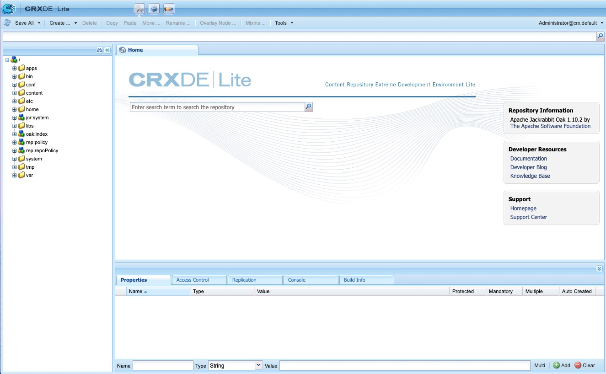

# Desenvolvimento com o CRXDE Lite{#developing-with-crxde-lite}

Esta seção descreve como desenvolver seu aplicativo AEM usando o CRXDE Lite.

Consulte a documentação de visão geral para obter mais informações sobre os diferentes ambientes de desenvolvimento disponíveis.

o CRXDE Lite é incorporado ao AEM e permite executar tarefas de desenvolvimento padrão no navegador. Com o CRXDE Lite, você pode criar um projeto, criar e editar arquivos (como .jsp e .java), pastas, modelos, componentes, caixas de diálogo, nós, propriedades e pacotes ao fazer logon.
O CRXDE Lite é recomendado quando você não tem acesso direto ao servidor AEM, quando você desenvolve um aplicativo estendendo ou modificando os componentes prontos para uso e pacotes Java ou quando não precisa de um depurador dedicado, autocompletar de código e realce de sintaxe.

>[!NOTE]
>
>A partir do AEM 6.5.5.0, o acesso anônimo ao CRXDE Lite não é mais possível.
>Os usuários são redirecionados para a tela de logon.

>[!NOTE]
>
>É recomendável usar a variável [Ferramentas de desenvolvedor de AEM para Eclipse](/help/sites-developing/aem-eclipse.md) e a variável [Extensão de colchetes HTL para AEM](/help/sites-developing/aem-brackets.md) durante o desenvolvimento do projeto.

## Introdução ao CRXDE Lite {#getting-started-with-crxde-lite}

Para começar a usar o CRXDE Lite, proceda da seguinte maneira:

1. Instale o AEM.
1. No navegador, digite `https://<host>:<port>/crx/de`. Por padrão, é `https://localhost:4502/crx/de`.
1. Insira seu **nome de usuário** e **senha**. Por padrão, é `admin` e `admin`.

1. Clique em **OK**.

No seu navegador, a interface de usuário do CRXDE Lite é semelhante a:

Agora você pode usar o CRXDE Lite para desenvolver seu aplicativo.

## Visão geral da interface do usuário {#overview-of-the-user-interface}

O CRXDE Lite oferece a seguinte funcionalidade:

<table>
 <tbody>
  <tr>
   <td>Barra do seletor superior</td>
   <td>Permite alternar rapidamente entre o CRXDE Lite, o Gerenciador de pacotes e o Compartilhamento de pacotes.</td>
  </tr>
  <tr>
   <td>Widget de caminho de nó</td>
   <td>
Exibe o caminho para o nó atualmente selecionado.
 
Você também pode usá-lo para pular para um nó, inserindo o caminho manualmente ou colando-o de outro lugar e pressionando Enter.
 
Também oferece suporte para procurar nós com nomes de nó específicos. Insira o nome do nó que deseja localizar e aguarde (ou pressione o símbolo de pesquisa no lado direito). Você pode tentar inserir, por exemplo, a string <em>carvalho</em> no widget para ver como funciona. Se um determinado nó ou nós forem carregados no painel do explorador, a lista será exibida, e você poderá selecionar o caminho e pressionar Enter para navegar até ele. Observe que isso só funciona para os nós atualmente carregados no aplicativo cliente CRXDE no navegador. Se quiser pesquisar todo o repositório, use Ferramentas e, em seguida, Consulta.
 </td>
  </tr>
  <tr>
   <td>Painel do Explorer</td>
   <td>
Exibe uma árvore de todos os nós no repositório.
 
Clique em um nó para exibir suas propriedades na <strong>Propriedades</strong> guia. Depois de clicar em um nó, você pode selecionar uma ação na barra de ferramentas. Clique no nó novamente para renomeá-lo.
 
Filtro de navegação em árvore (ícone binocular): permite filtrar os nós no repositório cujo nome contém o texto de entrada. Ela se aplica somente a nós que foram carregados localmente.  
 </td>
  </tr>
  <tr>
   <td>Editar painel</td>
   <td>
<strong>Início</strong> guia: permite pesquisar conteúdo e/ou documentação e acessar recursos do desenvolvedor (documentação, blog do desenvolvedor, base de conhecimento) e suporte (página inicial e centro de suporte do Adobe).  
 
Clique duas vezes em um arquivo na <strong>Explorer</strong> para exibir seu conteúdo; como por exemplo um arquivo .jsp ou .java. Em seguida, você pode modificá-lo e salvar as alterações.
 
Quando um arquivo for editado na variável <strong>Editar</strong> as seguintes ferramentas estão disponíveis na barra de ferramentas:  
 - <strong>Mostrar na árvore: </strong>mostra o arquivo na árvore do repositório.  - <strong>Pesquisar/Substituir...</strong>: pesquisar ou substituir.    Clique duas vezes na linha de status da <strong>Editar</strong> painel abre a <strong>Ir para a linha</strong> para que você possa inserir um número de linha específico para acessar.  </td>
  </tr>
  <tr>
   <td>Guia Propriedades  </td>
   <td>Exibe as propriedades do nó selecionado. É possível adicionar novas propriedades ou excluir propriedades existentes.  </td>
  </tr>
  <tr>
   <td>Guia Controle de acesso</td>
   <td>
Exibir permissões com base no caminho, nível de repositório ou principal atual.
 
As permissões são divididas em
 
- <strong>Política do controle de acesso aplicável</strong>: as políticas que podem ser aplicadas à seleção atual.
 
- <strong>Políticas do controle de acesso local</strong>: as políticas atuais aplicadas localmente à seleção atual.
 
- <strong>Políticas do controle de acesso efetivo</strong>: as políticas atuais aplicadas à seleção atual podem ser definidas localmente ou herdadas dos nós principais.
 
Nota. Para poder ver as informações de Controle de acesso, o usuário conectado ao CRXDE Lite deve ter direitos de leitura das entradas de ACL. O usuário anônimo não pode ver essas informações por padrão. Faça logon como, por exemplo, administrador para ver as informações.
 </td>
  </tr>
  <tr>
   <td>Guia Replicação</td>
   <td>
Exibir o status de replicação do nó atual. É possível replicar e replicar e excluir o nó atual.
 </td>
  </tr>
  <tr>
   <td>Guia Console  </td>
   <td>
<strong>Logs do servidor</strong>:
 
Exibe mensagens de logs. Você pode configurar o nível de log, limpar o console, fixar na posição de rolagem selecionada e ativar/desativar a exibição de mensagens.  
 
<strong>Controle da versão</strong>:
 
Exibe mensagens de controle de versão.  
 </td>
  </tr>
  <tr>
   <td>Guia Criar informações  </td>
   <td>Exibe informações quando um pacote está sendo criado.  </td>
  </tr>
  <tr>
   <td>Atualizar  </td>
   <td>Atualiza a seleção atual. As alterações de outros usuários são atualizadas na sua visualização do repositório. As alterações feitas não serão afetadas.  </td>
  </tr>
  <tr>
   <td>Salvar Tudo</td>
   <td>
<strong>Salvar Tudo</strong>:  
 
Salva todas as alterações feitas. Até que você clique em Salvar, as alterações serão temporárias e serão perdidas quando você sair do console.
 
<strong>Reverter</strong>:
 
Descarta todas as alterações feitas no nó selecionado desde a última ação de salvamento e, em seguida, recarrega o estado atual do repositório para o nó selecionado.
 
<strong>Reverter tudo</strong>:
 
Descarta todas as alterações feitas em todo o repositório desde a última ação de salvamento e recarrega o estado atual do repositório.
 </td>
  </tr>
  <tr>
   <td>Criar ...  </td>
   <td>
Menu suspenso para criar o seguinte no nó selecionado:  
 
- <strong>Nó</strong>: um nó com um tipo de nó arbitrário  
 
- <strong>Arquivo</strong>: nó nt:file e seu subnó nt:resource
 
- <strong>Pasta</strong>: nt:nó de pasta
 
- <strong>Modelo</strong>: modelo AEM
 
- <strong>Componente</strong>: componente AEM
 
- <strong>Caixa de diálogo</strong>: Caixa de diálogo do AEM
 </td>
  </tr>
  <tr>
   <td>Excluir  </td>
   <td>Exclui o nó selecionado.  </td>
  </tr>
  <tr>
   <td>Copiar</td>
   <td>Copia o nó selecionado.  </td>
  </tr>
  <tr>
   <td>Colar  </td>
   <td>Cola o nó copiado sob o nó selecionado.  </td>
  </tr>
  <tr>
   <td>Mover ...  </td>
   <td>Move o nó selecionado para o nó definido na caixa de diálogo.</td>
  </tr>
  <tr>
   <td>Renomear ...  </td>
   <td>Renomeia o nó selecionado.  </td>
  </tr>
  <tr>
   <td>Misturas ...  </td>
   <td>Permite adicionar tipos de mixin ao tipo de nó. Os tipos de mixin são usados principalmente para adicionar recursos avançados, como controle de versão, controle de acesso, referência e bloqueio ao nó.</td>
  </tr>
  <tr>
   <td>Ferramentas  </td>
   <td>
Menu suspenso com as seguintes ferramentas:
 
- <strong>Configuração do servidor...</strong>: para acessar o Felix Console.
 
- <strong>Consulta ...</strong>: para consultar o repositório.
 
- <strong>Privilégios ...</strong>: para abrir o gerenciamento de privilégios, onde você pode exibir e adicionar privilégios.
 
- <strong>Testar o controle de acesso...</strong>: um local onde você pode testar a permissão para determinado caminho e/ou principal.
 
- <strong>Exportar tipo de nó</strong>: para exportar tipos de nó no sistema como notação cnd.
 
- <strong>Importar tipo de nó ...</strong>: para importar tipos de nó usando a notação cnd.
 
- <strong>Instalar o SiteCatalyst Debugger...</strong>: instruções sobre como instalar o Analytics Debugger.
 </td>
  </tr>
  <tr>
   <td>Widget de logon  </td>
   <td>
Exibe os usuários conectados no momento e o espaço de trabalho no qual eles estão conectados, por exemplo, admin@crx.default.
 
Clique nele para fazer logon ou refazer logon como um usuário específico. Se você não especificar um espaço de trabalho para fazer logon, você será conectado ao espaço de trabalho padrão, crx.default.
 
Se quiser navegar pelo repositório como um usuário anônimo, use <strong>anônimo</strong> como o nome de logon e qualquer senha (por exemplo, um espaço ou um ponto).  
 
Se sua autorização não for mais válida (por exemplo, se tiver expirado), o widget de logon exibirá "<strong>Não autorizado - Login...</strong>". Clique para fazer logon novamente.
 </td>
  </tr>
 </tbody>
</table>

## Criação de pastas {#creating-a-folder}

Para criar uma pasta com o CRXDE Lite:

1. Abra o CRXDE Lite no navegador.
1. No painel Navegação, clique com o botão direito do mouse na pasta em que deseja criar a nova pasta, selecione **Criar ...**, depois **Criar pasta ...**.

1. Insira a pasta **Nome** e clique em **OK**.

1. Clique em **Salvar tudo** para salvar as alterações no servidor.

## Criação de um modelo {#creating-a-template}

Para criar um template com CRXDE Lite:

1. Abra o CRXDE Lite no navegador.
1. No painel Navegação, clique com o botão direito do mouse na pasta onde deseja criar o modelo e selecione **Criar ...**, depois **Criar modelo ...**.

1. Insira o **Rótulo**, **Título**, **Descrição**, **Tipo de recurso** e **Classificação** do modelo. Clique em **Avançar**.

1. Esta etapa é opcional: defina a **Caminhos permitidos**. Clique em **Avançar**

1. Esta etapa é opcional: defina a **Pais permitidos**. Clique em **Avançar**.

1. Esta etapa é opcional: defina a **Filhos permitidos**. Clique em **OK**.

1. Clique em **Salvar tudo** para salvar as alterações no servidor.

Ele cria:

* Um nó do tipo `cq:Template` com propriedades do modelo

* Um nó filho do tipo `cq:PageContent` com propriedades de Conteúdo da página

É possível adicionar propriedades ao template: consulte a [Criação de uma propriedade](#creating-a-property) seção.

## Criação de um componente {#creating-a-component}

O recurso descrito aqui só estará disponível se o CQ5 estiver instalado, ou seja, se o tipo de nó `cq:Component` está disponível no repositório.

Para criar um componente com CRXDE Lite:

1. Abra o CRXDE Lite no navegador.
1. No painel Navegação, clique com o botão direito do mouse na pasta em que deseja criar o componente, selecione **Criar ...**, depois **Criar componente...**.

1. Insira o **Rótulo**, **Título**, **Descrição**, **Tipo de Super Resource** e **Grupo** do componente. Clique em **Avançar**.

1. Esta etapa é opcional: definir as propriedades do componente **É Contêiner,** **Sem decoração**, **Nome da célula** e **Caminho da caixa de diálogo**. Clique em **Avançar**.

1. Esta etapa é opcional: defina a propriedade do componente **Pais permitidos**. Clique em **Avançar**.

1. Esta etapa é opcional: defina a propriedade do componente **Filhos permitidos**. Clique em **OK**.

1. Clique em **Salvar tudo** para salvar as alterações no servidor.

Ele cria:

* Um nó do tipo `cq:Component`
* Propriedades do componente
* Um componente script .jsp

## Criando uma caixa de diálogo {#creating-a-dialog}

Para criar uma caixa de diálogo com o CRXDE Lite:

1. Abra o CRXDE Lite no navegador.
1. No painel Navegação, clique com o botão direito do mouse no componente em que deseja criar a caixa de diálogo, selecione **Criar ...**, depois **Criar caixa de diálogo...**.

1. Insira o **Rótulo** e a variável **Título**. Clique em **OK**.

1. Clique em **Salvar tudo** l para salvar as alterações no servidor.

Ele cria uma caixa de diálogo com a seguinte estrutura:

`dialog[cq:Dialog]/items[cq:Widget]/items[cq:WidgetCollection]/tab1[cq:Panel]`

Agora você pode adaptar a caixa de diálogo às suas necessidades modificando propriedades ou criando novos nós.

Você também pode usar o Editor de diálogo para editar um diálogo. Clicar duas vezes no nó da caixa de diálogo no CRXDE Lite exibirá o editor. Mais informações sobre o Editor de diálogo podem ser encontradas [aqui](/help/sites-developing/dialog-editor.md).

## Criando um nó {#creating-a-node}

Para criar um nó com CRXDE Lite:

1. Abra o CRXDE Lite no navegador.
1. No painel Navegação, clique com o botão direito do mouse no nó em que deseja criar o novo nó, selecione **Criar ...**, depois **Criar nó ...**.
1. Insira o **Nome** e a variável **Tipo**. Clique em **OK**.
1. Clique em **Salvar tudo** para salvar as alterações no servidor.

Agora você pode adaptar o nó às suas necessidades modificando propriedades ou criando novos nós.

>[!NOTE]
>
>A maioria das operações de edição, incluindo Criar nó, mantém todas as alterações na memória e só as armazena no repositório após salvar (por meio do botão &quot;Salvar tudo&quot;). No entanto, algumas operações, como mover, são automaticamente mantidas.
>
>A validação em relação ao fato de o nó recém-criado ser permitido pelo tipo de nó do nó principal também é realizada pelo repositório JCR primeiro ao salvar as alterações. Se você receber uma mensagem de erro ao salvar um nó, verifique se a estrutura do conteúdo é válida (por exemplo, não é possível criar um `nt:unstructured` nó como filho de `nt:folder` nó).

## Criação de uma propriedade {#creating-a-property}

Para criar uma propriedade com o CRXDE Lite:

1. Abra o CRXDE Lite no navegador.
1. No painel Navegação, selecione o nó ao qual deseja adicionar a nova propriedade.
1. No **Propriedades** no painel inferior, digite a **Nome**, o **Tipo** e a variável **Valor**. Clique em **Adicionar**.

1. Clique em **Salvar tudo** para salvar as alterações no servidor.

## Criação de um script {#creating-a-script}

Para criar um novo script:

1. Abra o CRXDE Lite no navegador.
1. No painel Navegação, clique com o botão direito do mouse no componente em que deseja criar o script, selecione **Criar ...**, depois **Criar arquivo...**.

1. Insira o arquivo **Nome** incluindo a sua extensão. Clique em **OK**.

1. O novo arquivo é aberto como uma guia no painel Editar.
1. Edite o arquivo.
1. Clique em **Salvar tudo** para salvar as alterações.

## Exportando e importando tipos de nós {#exporting-and-importing-node-types}

Com o CRXDE Lite, você pode importar e/ou exportar definições de tipo de nó no [Notação CND (Compact Namespace and Node Type Definition)](https://jackrabbit.apache.org/jcr/node-type-notation.html).

Para exportar uma definição de tipo de nó:

1. Abra o CRXDE Lite no navegador.
1. Selecione o nó desejado.
1. Selecionar **Ferramentas** depois **Exportar tipo de nó**.

1. A definição na notação cnd será exibida no navegador. Salve as informações, se necessário.

Para importar uma definição de tipo de nó:

1. Abra o CRXDE Lite no navegador.
1. Selecionar **Ferramentas** depois **Importar tipo de nó...**.

1. Insira a notação CND para a definição na caixa de texto.
1. Marcar **Permitir atualização** se estiver atualizando uma definição existente.
1. Clique em **Importar**.

## Logs {#logging}

Com o CRXDE Lite, é possível exibir o arquivo `error.log` que está localizado no sistema de arquivos em `<crx-install-dir>/crx-quickstart/server/logs` e filtrá-lo com o nível de log apropriado. Proceda da seguinte forma:

1. Abra o CRXDE Lite no navegador.
1. No **Console** na parte inferior da janela, no menu suspenso à direita, selecione **Logs do servidor**.

1. Clique em **Parar** ícone para exibir as mensagens.

É possível:

* Ajuste os parâmetros de log no Felix Console clicando no ícone **Configurações de registro** ícone.
* Limpe as mensagens clicando no ícone **Pincel** ícone.
* Fixar a mensagem na seleção atual clicando no **Fixar** ícone.
* Ative ou desative a exibição de mensagens clicando no link **Parar** ícone.

## Controle de acesso {#access-control}

>[!NOTE]
>
>Consulte [Administração de usuários, grupos e direitos de acesso](/help/sites-administering/user-group-ac-admin.md) para obter mais informações.
