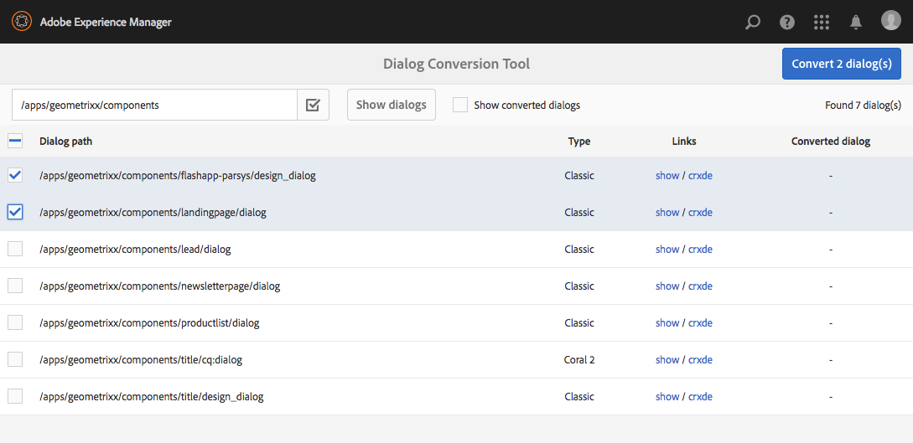

# Ferramenta de conversão de diálogo{#dialog-conversion-tool}

A ferramenta de conversão da caixa de diálogo é fornecida para ajudar a estender os componentes existentes que têm apenas uma caixa de diálogo definida para a interface clássica (baseada em ExtJS) ou com base na interface de usuário Granite e Coral 2. A ferramenta usa a caixa de diálogo original para criar uma caixa de diálogo de duplicado projetada para a interface padrão, com base na interface do usuário Granite e no Coral 3.

A meta dessa ferramenta é automatizar o upgrade o máximo possível, aumentar a eficiência e reduzir os erros. No entanto, como a ferramenta não pode abranger todos os cenários, o processo não pode ser totalmente automatizado e o usuário deve revisar as caixas de diálogo convertidas e possivelmente fazer ajustes adicionais. A ferramenta é uma ajuda para ajudá-lo a start do processo de conversão, mas não é destinada a assumir o controle total da conversão.

A ferramenta criará a nova caixa de diálogo usando a interface padrão, a interface do usuário com base em Granite e a interface do usuário com base em Coral 3, mas ignorará o que não pode ser convertido. Portanto, a caixa de diálogo resultante pode conter nós da caixa de diálogo original copiados como estão, se nenhuma regra correspondesse a esse componente específico. Além disso, um componente convertido pode ter algumas propriedades não convertidas, pois não havia uma regra apropriada para convertê-las.

>[!CAUTION]
>
>A ferramenta não pode abranger todos os cenários, pois suas regras de conversão não são exaustivas e funcionam na base do melhor esforço. Ele converte os elementos e as propriedades usados com mais frequência, mas a conversão estará incompleta ao lidar com personalizações ou caixas de diálogo altamente especializadas. **As caixas de diálogo convertidas podem exigir ajustes adicionais e todas as conversões devem ser revisadas.**

>[!NOTE]
>
>Como a interface clássica não está mais sendo desenvolvida ou aprimorada, o Adobe recomenda que os clientes atualizem para a interface de usuário padrão da interface de usuário Granite para se beneficiar da tecnologia mais recente.
>
>Embora seja uma prática recomendada migrar para a plataforma mais recente, migrar do Coral 2 para o Coral 3 não é crítico. No entanto, qualquer novo projeto deve ser iniciado com base no Coral 3.

## Baixe e instale a Ferramenta de conversão de diálogo {#download-and-install-the-dialog-conversion-tool}

A ferramenta de conversão da caixa de diálogo tornou-se de código aberto e pode ser acessada por meio do GitHub.

CÓDIGO NO GITHUB

Você pode encontrar o código desta página no GitHub

* [Abrir projeto aem-dialog-conversion no GitHub](https://github.com/Adobe-Marketing-Cloud/aem-dialog-conversion)
* Baixe o projeto como [um arquivo ZIP](https://github.com/Adobe-Marketing-Cloud/aem-dialog-conversion/archive/master.zip)

>[!NOTE]
>
>AEM não é enviado com a ferramenta de conversão de diálogo. Você deve baixá-lo e instalá-lo para usá-lo.

Siga estas etapas para instalar a ferramenta de conversão de diálogo.

1. Baixe o pacote do projeto GitHub da Ferramenta de conversão de caixa de diálogo [.](https://github.com/Adobe-Marketing-Cloud/aem-dialog-conversion/releases)
1. Instale o pacote em sua instância. Para obter detalhes sobre o gerenciamento de pacotes, consulte [Como trabalhar com pacotes](/help/sites-administering/package-manager.md).

## Convertendo uma caixa de diálogo {#converting-a-dialog}

A ferramenta converte caixas de diálogo criando uma caixa de diálogo correspondente da interface do usuário Granite / Coral 3 no mesmo local da caixa de diálogo original na árvore de conteúdo. No caso de caixas de diálogo IU Granite / Coral 2, elas são copiadas para um local de backup (um sufixo `.coral2` é anexado ao nome do nó de diálogo) para não serem substituídas. A ferramenta pode converter caixas de diálogo de design e editar caixas de diálogo.

Use as seguintes etapas para converter uma ou mais caixas de diálogo:

1. Abra o console **Conversão de Diálogo**, acessível a partir de **Navegação Global** -> **Ferramentas** -> **Operações**:

   `https://<hostname>:<port>/libs/cq/dialogconversion/content/console.html`

   

1. Insira o caminho necessário, como `/apps/geometrixx/components`. Você também pode inserir um caminho direto para uma única caixa de diálogo, como `/apps/geometrixx/components/lead`.

   

1. Selecione **Mostrar caixas de diálogo** para exibir todas as caixas de diálogo abaixo desse local.

   

   A tabela lista todas as caixas de diálogo herdadas existentes abaixo do caminho inserido. Cada caixa de diálogo tem seu Tipo listado. Os tipos incluem:

   * **Clássico:** Nós do tipo  `cq:Dialog` que têm nome de nó  `dialog` ou  `design_dialog`
   * **Coral 2:** Nós nomeados  `cq:dialog` ou  `cq:design_dialog` que têm um tipo de recurso de IU Granite / Coral 2 em seu nó de conteúdo filho

   Cada linha contém um link para visualização da caixa de diálogo e um link para CRXDE Lite para visualização de sua estrutura de nó.

   >[!NOTE]
   >
   >Os componentes que não têm uma caixa de diálogo para a interface clássica ou Coral 2 (isto é, eles projetados com a interface do usuário Granite / Coral 3) não são listados.

1. Selecione uma ou mais caixas de diálogo para conversão e clique ou toque em **Converter caixas de diálogo X** para start do processo de conversão.

   

1. As caixas de diálogo selecionadas são listadas com os resultados de suas conversões. Se a conversão tiver sido bem-sucedida, a linha conterá links para visualização da caixa de diálogo convertida ou para abri-la no CRXDE Lite.

   Clique ou toque em **Voltar** para retornar à Ferramenta de conversão de diálogo.

   

1. De volta à Ferramenta de conversão de diálogo, as caixas de diálogo convertidas não são mais exibidas na lista. Entretanto, observe que o número total de caixas de diálogo encontradas ainda está listado, incluindo aquelas já convertidas, ou seja, o número de linhas na tabela não corresponde necessariamente ao número encontrado.

   

1. Marque a opção **Mostrar caixas de diálogo convertidas** para mostrar as caixas de diálogo localizadas no caminho especificado que já foram convertidas.

   

   Se a caixa de diálogo já estiver convertida, os links também serão fornecidos para a caixa de diálogo convertida. Uma caixa de diálogo é considerada convertida se já houver uma caixa de diálogo irmão Granite UI / Coral 3 disponível.

## Regras de regravação da caixa de diálogo {#dialog-rewrite-rules}

A ferramenta de conversão de diálogo se baseia no conceito de **regravação de gráfico**, que consiste em transformar um gráfico de assunto aplicando regras de regravação. Uma regra de regravação é o emparelhamento de um padrão com um gráfico de substituição. A regra corresponde às ocorrências de um determinado subgráfico no gráfico de assunto e as substitui subsequentemente. Consulte também [https://en.wikipedia.org/wiki/Graph_rewriting](https://en.wikipedia.org/wiki/Graph_rewriting) para obter detalhes sobre a regravação de gráficos.

A ferramenta de conversão de diálogo usa essa abordagem para reescrever uma determinada árvore de diálogo herdada (IU clássica ou granulada / Coral 2) para sua interface de usuário Granite / Coral 3. Isso tem a vantagem de que a conversão é altamente flexível e pode levar em conta até mesmo componentes complexos, já que a correspondência é feita em subárvores reais e não apenas nós únicos ou propriedades.

### Algoritmo {#algorithm}

O algoritmo de regravação utiliza como parâmetro a árvore a ser regravada e um conjunto de regras de regravação. Ele cruza a árvore na pré-ordem e, para cada nó, verifica se uma regra se aplica à subárvore raiz nesse nó. A primeira regra correspondente é aplicada a essa subárvore para regravá-la. O traversal então reinicia a partir da raiz. O algoritmo é interrompido assim que a árvore inteira for atravessada e nenhuma regra corresponder a nenhuma subárvore. Como medida de otimização, o algoritmo mantém o controle de um conjunto de nós que são finais e, portanto, não precisam ser verificados novamente para correspondências em versões posteriores. Cabe às regras de regravação definir quais nós da árvore regravada são finais e quais devem ser revisitados por passagens futuras do algoritmo.

O ponto de entrada para a conversão é `DialogConversionServlet`, que é registrado nas solicitações de POST para `/libs/cq/dialogconversion/content/convert.json`. Ele aceita um parâmetro de solicitação de caminho, que é uma matriz que contém os caminhos para as caixas de diálogo que devem ser convertidos. Para cada caixa de diálogo, o servlet regrava a árvore de diálogo correspondente aplicando todas as regras de regravação da caixa de diálogo definidas.

### Reescrever Tipos de Regra {#rewrite-rule-types}

As regras de regravação podem ser definidas de duas maneiras diferentes, como:

* Estruturas de nó JCR - [Regras de regravação Baseadas em Nó](/help/sites-developing/dialog-conversion.md#node-based-rewrite-rules)

* Classes Java que implementam uma interface específica - [Regras de regravação baseadas em Java](/help/sites-developing/dialog-conversion.md#java-based-rewrite-rules)

Alguns são [fornecidos prontos para uso](#provided-rewrite-rules), mas você também pode definir suas próprias regras personalizadas. [As ](/help/sites-developing/dialog-conversion.md#sample-rewrite-rules) regras de regravação de amostra também estão disponíveis.

Normalmente, uma única regra de regravação de caixa de diálogo é responsável por regravar um único elemento de caixa de diálogo, por exemplo, o campo de entrada do navegador de caminho.

>[!CAUTION]
>
>Os loops de regravação não são detectados pelo algoritmo, portanto, as **regras de regravação não devem regravar árvores de forma circular**.

### Regras de regravação baseadas em nós {#node-based-rewrite-rules}

Uma regra de regravação da caixa de diálogo pode ser definida em termos de nós e propriedades.

```xml
rule
  - jcr:primaryType = nt:unstructured
  - cq:rewriteRanking = 4
  + patterns
    - jcr:primaryType = nt:unstructured
    + foo
      - ...
      + ...
    + foo1
      - ...
      + ...
  + replacement
    + bar
      - ...
      + ...
```

Este exemplo define uma regra que contém dois **padrões** (as árvores têm raízes em `foo` e `foo1`) e uma **substituição** (a árvore tem raízes em `bar`). O padrão e as árvores de substituição são árvores arbitrárias que contêm nós e propriedades. A regra corresponde a uma subárvore se qualquer um dos padrões definidos corresponder. Para que um padrão corresponda, a árvore de assunto deve conter os mesmos nós do padrão (nomes correspondentes) e todas as propriedades definidas no padrão devem corresponder às propriedades da árvore.

No caso de uma correspondência, a subárvore correspondente (chamada de árvore original) será substituída pela substituição. A árvore de substituição pode definir propriedades mapeadas que herdarão o valor de uma propriedade na árvore original. Eles precisam ser do tipo `String` e ter o seguinte formato:

`${<path>}`

Se a propriedade referenciada não existir na árvore original, então a propriedade será omitida. Como alternativa, um valor padrão pode ser especificado para esse caso (somente possível para propriedades de sequência de caracteres):

`${<path>:<default>}`

As propriedades que contêm os caracteres &#39; `:`&#39; podem ser aspas simples para evitar conflitos com o fornecimento de um valor padrão. As propriedades booleanas são negadas se a expressão tiver o prefixo &#39; `!`&#39;. As propriedades mapeadas podem ter vários valores, caso em que serão atribuídas ao valor da primeira propriedade existente na árvore correspondente.

Por exemplo, a seguinte propriedade `one` receberá o valor da propriedade `./two/three` da árvore original correspondente.

```xml
...
  + replacement
    + bar
      - one = ${./two/three}
      - negated = !${./some/boolean/prop}
      - default = ${./some/prop:default}
      - multi = [${./prop1}, ${./prop2}]
```

As regras também suportam as seguintes propriedades opcionais.

* `cq:rewriteOptional` (boolean)

   Defina essa propriedade em um nó de padrão para indicar que o nó não precisa estar presente para que o padrão corresponda

* `cq:rewriteRanking` (integer)

   Defina essa propriedade no nó da regra para afetar a ordem pela qual as regras são aplicadas. Isso pode ser útil para garantir que as regras que lidam com estruturas mais específicas não sejam substituídas por estruturas mais gerais. Regras com classificação inferior têm prioridade sobre as com classificação superior. Todas as regras por padrão recebem `Integer.MAX_VALUE` como sua classificação.

A árvore de substituição também suporta as seguintes propriedades especiais (nomeadas começando com `cq:rewrite`):

* `cq:rewriteMapChildren` (sequência de caracteres)

   O nó que contém essa propriedade receberá uma cópia dos filhos do nó na árvore original referenciada pelo valor da propriedade (por exemplo, `cq:rewriteMapChildren=./items`).

* `cq:rewriteFinal` (booleano)

   Esta é uma medida de otimização que informa ao algoritmo que o nó que contém essa propriedade é final e não precisa ser verificado novamente para obter as regras de regravação correspondentes. Quando colocado no nó de substituição propriamente dito, toda a árvore de substituição é considerada final.
* `cq:rewriteCommonAttrs` (booleano)

   Defina essa propriedade no nó de substituição ( `rule`/ `replacement`) para mapear propriedades relevantes do nó raiz original para equivalentes de atributos comuns Granite na raiz de cópia. Ele lidará com os atributos de dados copiando/criando o subnó `granite:data` no público alvo e escrevendo as propriedades `data-*` ali.
* `cq:rewriteRenderCondition` (booleano)

   Defina essa propriedade no nó de substituição ( `rule`/ `replacement`) para copiar qualquer condição filho de renderização Granite ( `rendercondition` ou `granite:rendercondition`) do nó raiz original para um filho `granite:rendercondition` da raiz de cópia.

Além disso, um nó `cq:rewriteProperties` pode ser adicionado a um nó substituto para definir regravações de string para propriedades mapeadas no resultado. O nó é removido da substituição. As propriedades do nó `cq:rewriteProperties` devem ser nomeadas como as que estão sendo regravadas e aceitam uma matriz de sequência com dois parâmetros:

* `pattern`: Regex para corresponder, por exemplo,  `"(?:coral-Icon-)(.+)"`

* `replacement`: Fornecido para a  `replaceAll` função de correspondência, por exemplo,  `"$1"`

A seguir está um exemplo de regravação das propriedades do ícone Coral 2 para equivalentes Coral 3:

```xml
...
  + replacement
    + bar
      - icon = ${./icon}
      + cq:rewriteProperties
       - icon = [(?:coral-Icon--)(.+), $1]
```

#### Definindo suas Próprias Regras de Regravação Baseadas em Nó {#defining-your-own-node-based-rewrite-rules}

As regras de regravação fornecidas são definidas em:

`/libs/cq/dialogconversion/rules`

As regras são divididas posteriormente neste local em pastas para regras de regravação clássicas e regras de regravação do Coral 2:

`/libs/cq/dialogconversion/rules/classic`

`/libs/cq/dialogconversion/rules/coral2`

Essas regras podem ser substituídas fornecendo um conjunto de regras em:

`/apps/cq/dialogconversion/rules`

Você pode copiar `/libs/cq/dialogconversion/rules` para `/apps` e modificar as regras existentes e/ou adicionar novas regras a esta nova instância &quot;.

### Regras de regravação baseadas em Java {#java-based-rewrite-rules}

Regras de regravação mais complexas podem ser definidas como classes Java que expõem um serviço OSGi da interface `com.adobe.cq.dialogconversion.DialogRewriteRule`.

Essa classe deve implementar os seguintes métodos:

```java
boolean matches(Node root) throws RepositoryException;
Node applyTo(Node root, Set<Node> finalNodes) throws DialogRewriteException, RepositoryException;
int getRanking();
```

O método `matches` deve retornar `true` se a regra corresponder à subárvore raiz no nó raiz fornecido. Se a regra corresponder, o algoritmo de regravação de árvore chamará subsequentemente o método `applyTo`, que deve regravar a subárvore enraizada no nó raiz especificado. Normalmente, esse método renomeará temporariamente a árvore original, criará a nova árvore como um novo filho do nó pai da árvore original (usando seus nós e propriedades) e, por fim, removerá a árvore original. Informações mais detalhadas podem ser encontradas no Javadoc da interface `com.adobe.cq.dialogconversion.DialogRewriteRule`.

#### Informações adicionais - Javadocs {#further-information-javadocs}

Para obter mais informações, consulte o arquivo Javadocs para [`com.adobe.cq.dialogconversion`](https://adobe-marketing-cloud.github.io/aem-touchui-dialogconversion-samples/javadoc/).

#### Definindo suas próprias regras de regravação baseadas em Java {#defining-your-own-java-based-rewrite-rules}

A classe a seguir mostra um exemplo de uma regra de regravação personalizada que implementa a interface `com.adobe.cq.dialogconversion.DialogRewriteRule`.

```java
@Component
@Service
public class CustomDialogRewriteRule implements DialogRewriteRule {

    public boolean matches(Node root) throws RepositoryException {
        // ...
    }

    public Node applyTo(Node root, Set<Node> finalNodes) throws DialogRewriteException, RepositoryException {
        // ...
    }

    int getRanking() {
        // ...
    }

}
```

Como alternativa, você pode estender `com.adobe.cq.dialogconversion.AbstractDialogRewriteRule` conforme abaixo. A classe abstrata implementa o método `getRanking` e usa a propriedade `service.ranking` OSGi do serviço para determinar a classificação da regra.

```java
@Component
@Service
@Properties({
        @Property(name="service.ranking", intValue = 10)
})
public class CustomDialogRewriteRule extends AbstractDialogRewriteRule {

    public boolean matches(Node root) throws RepositoryException {
        // ...
    }

    public Node applyTo(Node root, Set<Node> finalNodes) throws RewriteException, RepositoryException {
        // ...
    }

}
```

### Regras de regravação fornecidas {#provided-rewrite-rules}

O pacote `cq-dialog-conversion-content` contém várias regras de regravação predefinidas. Para widgets de interface clássica, consulte [Usar xtypes](/help/sites-developing/xtypes.md) para obter mais informações).

<table>
 <tbody>
  <tr>
   <td><strong>Regra</strong></td>
   <td><strong>Componente herdado</strong></td>
   <td><strong>Substituição de IU Granite / Coral 3</strong></td>
  </tr>
  <tr>
   <td><code>com.adobe.cq.dialogconversion.rules.CqDialogRewriteRule</code></td>
   <td>Nó do tipo <code>cq:Dialog</code>, lida com diferentes subestruturas</td>
   <td><p>Um <code>granite/ui/components/foundation/container</code> usando um layout <code>fixedcolumns</code> ou <code>tabs</code></p> <p>Os componentes reais da caixa de diálogo são copiados e regravados em passagens subsequentes do algoritmo.</p> </td>
  </tr>
  <tr>
   <td><code>com.adobe.cq.dialogconversion.rules.IncludeRule</code></td>
   <td>xtype = <code>cqinclude</code></td>
   <td>O nó referenciado é copiado para a caixa de diálogo IU Granite / Coral 3 e (possivelmente) reescrito posteriormente pelo algoritmo.</td>
  </tr>
  <tr>
   <td><code>com.adobe.cq.dialogconversion.rules.MultifieldRewriteRule</code></td>
   <td>xtype = <code>multifield</code></td>
   <td><p>A <code>granite/ui/components/coral/foundation/form/multifield</code></p> <p>O nó filho <code>fieldConfig</code> (se houver) é regravado separadamente, não limitando os componentes suportados.</p> </td>
  </tr>
  <tr>
   <td><code>/libs/cq/dialogconversion/rules/classic</code></td>
   <td><code class="code">button
      checkbox
      colorfield
      combobox
      componentselector
      datetime
      fieldset
      fileupload
      hidden
      numberfield
      panel
      password
      pathfield
      radio
      radiogroup
      select
      sizefield
      tabpanel
      tags
      textarea
      textfield</code></td>
   <td> </td>
  </tr>
  <tr>
   <td><code>/libs/cq/dialogconversion/rules/coral2</code></td>
   <td><code class="code">actionfield
      autocomplete
      button
      checkbox
      collapsible
      colorpicker
      container
      datepicker
      fieldset
      fileupload
      fixedcolumns
      heading
      hidden
      hyperlink
      include
      multifield
      nestedcheckboxlist
      nestedcheckboxlist-checkbox
      numberfield
      password
      pathbrowser
      radio
      radiogroup
      reset
      select
      submit
      switch
      tabs
      tags
      text
      textarea
      textfield
      userpicker
      well</code></td>
   <td> </td>
  </tr>
 </tbody>
</table>

### Exemplo de regras de regravação {#sample-rewrite-rules}

CÓDIGO NO GITHUB

Você pode encontrar o código desta página no GitHub

* [Abrir projeto aem-touchui-dialogconversion-samples no GitHub](https://github.com/Adobe-Marketing-Cloud/aem-touchui-dialogconversion-samples)
* Baixe o projeto como [um arquivo ZIP](https://github.com/Adobe-Marketing-Cloud/aem-touchui-dialogconversion-samples/archive/master.zip)

