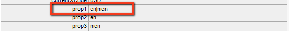

# Personalização da Adobe Analytics Framework{#customizing-the-adobe-analytics-framework}

A estrutura do Adobe Analytics determina as informações que são rastreadas com o Adobe Analytics. Para personalizar a estrutura padrão, use o javascript para adicionar rastreamento personalizado, integrar plug-ins do Adobe Analytics e alterar as configurações gerais na estrutura usada para rastreamento.

## Sobre o javascript gerado para Frameworks {#about-the-generated-javascript-for-frameworks}

Quando uma página é associada a uma estrutura do Adobe Analytics e a página inclui [referências ao módulo do Analytics](/help/sites-administering/adobeanalytics.md), um arquivo analytics.sitecatalyst.js é gerado automaticamente para a página.

O javascript na página cria um objeto `s_gi`que a biblioteca Adobe Analytics s_code.js define) e atribui valores a suas propriedades. O nome da instância do objeto é `s`. Os exemplos de código apresentados nesta seção fazem várias referências a essa variável `s`.

O código de exemplo a seguir é semelhante ao código em um arquivo analytics.sitecatalyst.js:

```
var s_account = "my_sitecatalyst_account";
var s = s_gi(s_account);
s.fpCookieDomainPeriods = "3";
s.currencyCode= 'USD';
s.trackInlineStats= true;
s.linkTrackVars= 'None';
s.charSet= 'UTF-8';
s.linkLeaveQueryString= false;
s.linkExternalFilters= '';
s.linkTrackEvents= 'None';
s.trackExternalLinks= true;
s.linkDownloadFileTypes= 'exe,zip,wav,mp3,mov,mpg,avi,wmv,doc,pdf,xls';
s.linkInternalFilters= 'javascript:,'+window.location.hostname;
s.trackDownloadLinks= true;

s.visitorNamespace = "mynamespace";
s.trackingServer = "xxxxxxx.net";
s.trackingServerSecure = "xxxxxxx.net";

/* Plugin Config */
/*
s.usePlugins=false;
function s_doPlugins(s) {
    //add your custom plugin code here
}
s.doPlugins=s_doPlugins;
*/
```

Ao usar o código javascript personalizado para personalizar a estrutura, você altera o conteúdo desse arquivo.

## Configuração das propriedades do Adobe Analytics {#configuring-adobe-analytics-properties}

Há várias variáveis predefinidas no Adobe Analytics que podem ser configuradas em uma estrutura. As variáveis **charset**, **cookieLifetime**, **currencyCode** e **trackInlineStats** são incluídas na lista **Configurações Gerais do Analytics** por padrão.


É possível adicionar nomes e valores de variáveis à lista. Essas variáveis predefinidas e quaisquer variáveis adicionadas são usadas para configurar as propriedades do objeto `s` no arquivo analytics.sitecatalyst.js . O exemplo a seguir mostra como a propriedade `prop10` adicionada do valor `CONSTANT` é representada no código javascript:

```
var s_account = "my_sitecatalyst_account";
var s = s_gi(s_account);
s.fpCookieDomainPeriods = "3";
s.currencyCode= 'USD';
s.trackInlineStats= true;
s.linkTrackVars= 'None';
s.charSet= 'UTF-8';
s.linkLeaveQueryString= false;
s.linkExternalFilters= '';
s.linkTrackEvents= 'None';
s.trackExternalLinks= true;
s.linkDownloadFileTypes= 'exe,zip,wav,mp3,mov,mpg,avi,wmv,doc,pdf,xls';
s.prop10= 'CONSTANT';
s.linkInternalFilters= 'javascript:,'+window.location.hostname;
s.trackDownloadLinks= true;

s.visitorNamespace = "mynamespace";
s.trackingServer = "xxxxxxx.net";
s.trackingServerSecure = "xxxxxxx.net";
```

Use o procedimento a seguir para adicionar variáveis à lista:

1. Na página de estrutura do Adobe Analytics , expanda a área **Configurações gerais do Analytics**.
1. Abaixo da lista de variáveis, clique em Adicionar item para adicionar uma nova variável à lista.
1. Na célula do lado esquerdo, digite um nome para a variável, por exemplo `prop10`.

1. Na coluna à direita, insira um valor para a variável , por exemplo `CONSTANT`.

1. Para remover uma variável, clique no botão (-) ao lado da variável .

>[!NOTE]
>
>Ao inserir variáveis e valores, verifique se eles estão formatados e com ortografia corretamente, ou as chamadas **não serão enviadas** com o par de valor/variável correto. Variáveis e valores com erro ortográfico podem mesmo impedir a ocorrência de chamadas.
>
>Consulte seu representante da Adobe Analytics para verificar se essas variáveis estão definidas corretamente.

>[!CAUTION]
>
>Algumas das variáveis nesta lista são **mandatory** para que as chamadas do Adobe Analytics funcionem corretamente (por exemplo, **currencyCode**, **charSet**)
>
>Assim, mesmo que sejam removidos da estrutura propriamente dita, eles ainda serão anexados com um valor padrão quando a chamada do Adobe Analytics for feita.

### Adicionar javascript personalizado a uma Adobe Analytics Framework {#adding-custom-javascript-to-an-adobe-analytics-framework}

A caixa javascript livre na área **Configurações gerais do Analytics** permite adicionar código personalizado a uma estrutura do Adobe Analytics.


O código adicionado é anexado ao arquivo analytics.sitecatalyst.js. Portanto, você pode acessar a variável `s`, que é uma instância do objeto javascript `s_gi` definido em `s_code.js`. Por exemplo, adicionar o seguinte código equivale a adicionar uma variável chamada `prop10` do valor `CONSTANT`, que é o exemplo na seção anterior:

`s.prop10= 'CONSTANT';`

O código no arquivo [analytics.sitecatalyst.js](/help/sites-developing/extending-analytics-components.md) (que inclui o conteúdo do arquivo Adobe Analytics `s-code.js`) contém o seguinte código:

`if (s.usePlugins) s.doPlugins(s)`

O procedimento a seguir demonstra como usar a caixa javascript para personalizar o rastreamento do Adobe Analytics. Se o javascript precisar usar plug-ins do Adobe Analytics, [integre-os](/help/sites-administering/adobeanalytics.md) ao AEM.

1. Adicione o seguinte código javascript à caixa para que `s.doPlugins` seja executado:

   ```
   s.usePlugins=true;
   function s_doPlugins(s) {
       //add your custom code here
   }
   s.doPlugins=s_doPlugins;
   ```

   >[!CAUTION]
   >
   >Esse código é necessário se você deseja enviar variáveis em uma chamada do Adobe Analytics que foram personalizadas de alguma forma que não podem ser feitas por meio da interface básica de arrastar e soltar OU por meio de javascript em linha no Adobe Analytics View.
   >
   >Se as variáveis personalizadas estiverem fora da função s_doPlugins , elas serão enviadas como *indefinido *na chamada do Adobe Analytics

1. Adicione seu código javascript na função **s_doPlugins**.

O exemplo a seguir concatena os dados capturados em uma página em ordem hierárquica, usando um separador comum de &quot;|&quot;.

Uma estrutura do Adobe Analytics tem as seguintes configurações:

* A variável `prop2` do Adobe Analytics é mapeada para a propriedade do site `pagedata.sitesection`.

* A variável `prop3` do Adobe Analytics é mapeada para a propriedade do site `pagedata.subsection`.

* O código a seguir é adicionado à caixa de javascript livre:

   ```
   s.usePlugins=true;
    function s_doPlugins(s) {
    s.prop1 = s.prop2+'|'+s.prop3;
    }
    s.doPlugins=s_doPlugins;
   ```

* Quando a página da Web que usa a estrutura é visitada (ou, no modo de edição, a página é recarregada ou visualizada), as chamadas para o Adobe Analytics são executadas.

Por exemplo, os seguintes valores são gerados no Adobe Analytics:



### Adicionar código personalizado global para todas as Frameworks Adobe Analytics {#adding-global-custom-code-for-all-adobe-analytics-frameworks}

Forneça um código javascript personalizado integrado em todas as estruturas da Adobe Analytics. Quando a estrutura Adobe Analytics de uma página não contém [javascript de forma livre ](/help/sites-administering/adobeanalytics.md) personalizado, o javascript gerado pelo script /libs/cq/analytics/components/sitecatalyst/config.js.jsp é anexado ao arquivo [analytics.sitecatalyst.js](/help/sites-administering/adobeanalytics.md). Por padrão, o script não tem efeito porque é comentado. O código também define `s.usePlugins` como `false`:

```
/* Plugin Config */
/*
s.usePlugins=false;
function s_doPlugins(s) {
    //add your custom plugin code here
}
s.doPlugins=s_doPlugins;
*/
```

O código no arquivo analytics.sitecatalyst.js (que inclui o conteúdo do arquivo s_code.js do Adobe Analytics) contém o seguinte código:

if (s.usePlugins) s.doPlugins(s)

Portanto, seu javascript deve definir `s.usePlugins` como `true` para que qualquer código na função `s_doPlugins` seja executado. Para personalizar o código, sobreponha o arquivo config.js.jsp por um que use seu próprio javascript. Se o javascript precisar usar plug-ins do Adobe Analytics, [integre-os](/help/sites-administering/adobeanalytics.md) ao AEM.

>[!NOTE]
>
>Não edite o arquivo /libs/cq/analytics/components/sitecatalyst/config.js.jsp. Determinadas tarefas de atualização ou manutenção de AEM podem reinstalar o arquivo original, removendo as alterações.

1. No CRXDE Lite, crie a estrutura de pastas /apps/cq/analytics/components:

   1. Clique com o botão direito do mouse na pasta /apps e clique em Criar > Criar pasta.
   1. Especifique `cq` como o nome da pasta e clique em OK.
   1. Da mesma forma, crie as pastas `analytics` e `components` .

1. Clique com o botão direito do mouse na pasta `components` que acabou de criar e clique em Criar > Criar componente. Especifique os seguintes valores de propriedade:

   * Etiqueta: `sitecatalyst`
   * Título: `sitecatalyst`
   * Super Type: `/libs/cq/analytics/components/sitecatalyst`
   * Grupo: `hidden`

1. Clique em Avançar repetidamente até que o botão OK seja ativado e clique em OK.

   O componente do sitecatalyst contém o arquivo sitecatalyst.jsp criado automaticamente.

1. Clique com o botão direito do mouse no arquivo sitecatalyst.jsp e clique em Excluir.

1. Clique com o botão direito do mouse no componente sitecatalyst e clique em Criar > Criar arquivo. Especifique o nome `config.js.jsp` e clique em OK.

   O arquivo config.js.jsp é aberto automaticamente para edição.

1. Adicione o seguinte texto ao arquivo e clique em Salvar tudo:

   ```java
   <%@page session="true"%>
   /* Plugin Config */
   s.usePlugins=true;
   function s_doPlugins(s) {
       //add your custom plugin code here
   }
   s.doPlugins=s_doPlugins;
   ```

   O código javascript gerado pelo script /apps/cq/analytics/components/sitecatalyst/config.js.jsp agora é inserido no arquivo analytics.sitecatalyst.js para todas as páginas que usam uma estrutura Adobe Analytics.

1. Adicione o código javascript que deseja executar na função `s_doPlugins` e clique em Salvar tudo.

>[!CAUTION]
>
>Se algum texto estiver presente no javascript de forma livre de uma estrutura de página (mesmo somente em espaço em branco), config.js.jsp será ignorado.

### Usar plug-ins do Adobe Analytics no AEM {#using-adobe-analytics-plugins-in-aem}

Obtenha o código javascript para plug-ins do Adobe Analytics e integre-os à estrutura do Adobe Analytics no AEM. Adicione o código a uma pasta da biblioteca do cliente da categoria `sitecatalyst.plugins` para que ele esteja disponível para seu código javascript personalizado.

Por exemplo, se você integrar o plug-in `getQueryParams`, poderá chamar o plug-in da função `s_doPlugins` do javascript personalizado. O código de exemplo a seguir envia a sequência de consulta em **&quot;pid&quot;** do URL do referenciador como **eVar1**, quando uma chamada Adobe Analytics é acionada.

```
s.usePlugins=true;
function s_doPlugins(s) {
   // take the query string from the referrer
   s.eVar1=s.getQueryParam('pid','',document.referrer);
}
s.doPlugins=s_doPlugins;
```

AEM instala os seguintes plug-ins do Adobe Analytics, para que eles estejam disponíveis por padrão:

* getQueryParam()
* getPreviousValue()
* split()

A pasta da biblioteca do cliente /libs/cq/analytics/clientlibs/sitecatalyst/plugins inclui esses plug-ins na categoria sitecatalyst.plugins.

>[!NOTE]
>
>Crie uma nova pasta da biblioteca do cliente para seus plug-ins. Não adicione plug-ins à pasta `/libs/cq/analytics/clientlibs/sitecatalyst/plugins`. Essa prática garante que sua contribuição para a categoria `sitecatalyst.plugins` não seja substituída durante AEM reinstalações ou tarefas de atualização.

Use o procedimento a seguir para criar a pasta da biblioteca do cliente para seus plug-ins. Você só precisa executar esse procedimento uma vez. Para adicionar um plug-in à pasta da biblioteca do cliente, use o procedimento subsequente.

1. Em um navegador da Web, abra o CRXDE Lite. ([http://localhost:4502/crx/de](http://localhost:4502/crx/de))

1. Clique com o botão direito do mouse na pasta /apps/my-app/clientlibs e clique em Criar > Criar nó. Insira os seguintes valores de propriedade e clique em OK:

   * Nome: Um nome para a pasta da biblioteca do cliente, como my-plugins

   * Tipo: cq:ClientLibraryFolder

1. Selecione a pasta da biblioteca de clientes que acabou de criar e use a barra de propriedades inferior direita para adicionar a seguinte propriedade:

   * Nome: categorias
   * Tipo: String
   * Valor: sitecatalyst.plugins
   * Várias: selecionado

   Clique em OK na janela Edit para confirmar o valor da propriedade.

1. Clique com o botão direito do mouse na pasta da biblioteca de clientes que acabou de criar e clique em Criar > Criar arquivo. Para o nome do arquivo, digite js.txt e clique em OK.

1. Clique em Salvar tudo.

Use o procedimento a seguir para obter o código do plug-in, armazenar o código no repositório de AEM e adicionar o código à pasta da biblioteca do cliente.

1. Faça logon em [sc.omniture.com](https://sc.omniture.com) usando sua conta Adobe Analytics.
1. Na página de aterrissagem, acesse Ajuda > Página inicial da Ajuda.
1. No índice à esquerda, clique em Plug-ins de implementação.
1. Clique no link para o plug-in que deseja adicionar e, quando a página for aberta, localize o código-fonte do javascript para o plug-in, selecione o código e copie-o.

1. Clique com o botão direito do mouse na pasta da biblioteca de clientes e clique em Criar > Criar arquivo. Para o nome do arquivo, digite o nome do plug-in que você está integrando, seguido por .js, e clique em OK. Por exemplo, se estiver integrando o plug-in getQueryParam , nomeie o arquivo getQueryParam.js.

   Ao criar o arquivo, ele é aberto para edição.

1. Cole o código javascript do plug-in no arquivo, clique em Salvar tudo e feche o arquivo.

1. Abra o arquivo js.txt da pasta da biblioteca do cliente.

1. Em uma nova linha, adicione o nome do arquivo que contém o plug-in, por exemplo getQueryParam.js. Em seguida, clique em Salvar tudo e feche o arquivo.

>[!NOTE]
>
>Ao usar plug-ins, certifique-se de integrar todos os plug-ins de suporte também, caso contrário, o javascript do plug-in não reconhecerá as chamadas feitas para as funções no plug-in de suporte. Por exemplo, o plug-in getPreviousValue() requer o plug-in split() para funcionar corretamente.
>
>O nome do plug-in de suporte também precisa ser adicionado a **js.txt**.
