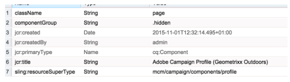

# Criando modelo de página AEM personalizado com componentes de formulário Adobe Campaign{#creating-custom-aem-page-template-with-adobe-campaign-form-components}

Esta página explica como criar um modelo de página personalizado que usa [componentes do Adobe Campaign Form](/help/sites-authoring/adobe-campaign-components.md) examinando como o modelo do Geometrixx-outdoors ( `/apps/geometrixx-outdoors/components/page_campaign_profile`) é implementado e aponta para as informações importantes de que você pode precisar ao criar seu próprio modelo personalizado.

>[!NOTE]
>
>[As amostras de e-mail e formulário estão disponíveis somente no Geometrixx](/help/sites-developing/we-retail.md). Baixe o conteúdo de amostra do Geometrixx pelo Compartilhamento de pacotes.

Para criar um modelo de página AEM personalizado usando componentes de Formulário Adobe Campaign, verifique se você tem o seguinte:

1. **Corrija resourceSuperType**

   Verifique se o componente da página herda de `mcm/campaign/components/profile`.

   Isso é necessário para que os servlets obtenham e salvem informações

   * `com.day.cq.mcm.campaign.servlets.TemplateListServlet`
   * `com.day.cq.mcm.campaign.servlets.SaveProfileServlet`

   

1. **Configurações do ClientContext**

   Ao observar as configurações clientcontext ( `/etc/designs/geometrixx-outdoors/jcr:content/page_campaign_profile`), você verá as seguintes configurações:

   * ClientContext aponta para `/etc/clientcontext/campaign`
   * Também há um nó extra *config*.

   

1. **head.jsp (/apps/geometrixx-outdoors/components/page_campaign_profile/head.jsp)**

   Em **head.jsp**, você verá as seguintes linhas que usam **clientcontext-config** e **cloudservice-hook**:

   ```
   <cq:include path="config" resourceType="cq/personalization/components/clientcontext_optimized/config"/>
   <sling:include path="contexthub" resourceType="granite/contexthub/components/contexthub"/>
   <cq:include script="/libs/cq/cloudserviceconfigs/components/servicelibs/servicelibs.jsp"/>
   ```

1. **body.jsp (/apps/geometrixx-outdoors/components/page_campaign_profile/body.jsp)**

   Em **body.jsp**, os serviços em nuvem são carregados na parte inferior da página:

   ```
   <cq:include path="cloudservices" resourceType="cq/cloudserviceconfigs/components/servicecomponents"/>
   ```

1. **Propriedades da página de campanha**

   Para poder selecionar um modelo do Adobe Campaign, as propriedades da página são estendidas com a guia **Campanha**:

   `/apps/geometrixx-outdoors/components/page_campaign_profile/dialog/items/tabs/items/campaign`

   

1. **Configurações** do modelo.

   No modelo ( `/apps/geometrixx-outdoors/templates/campaign_profile/jcr:content`) você verá os seguintes valores padrão:

   | **acMapping** | mapRecipient (para Adobe Campaign 6.1), perfil (para Adobe Campaign Standard) |
   |---|---|
   | **acTemplateId** | correio |

   

