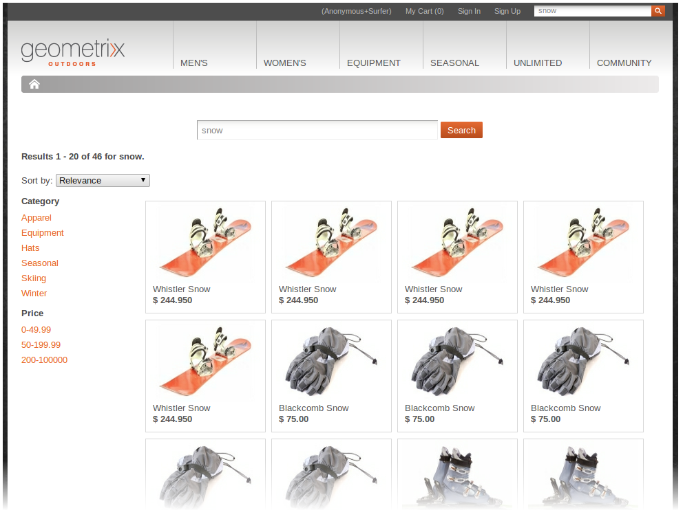

# Desenvolvimento (genérico){#developing-generic}

>[!NOTE]
>
>[A documentação](/help/sites-developing/ecommerce.md#api-documentation) da API também está disponível.

A estrutura de integração inclui uma camada de integração com uma API. Isso permite que você crie componentes do AEM para recursos de comércio eletrônico (independentemente do seu mecanismo de comércio eletrônico específico). Ele também permite que você use o banco de dados CRX interno ou conecte um sistema de comércio eletrônico e extraia dados do produto para o AEM.

Vários componentes prontos para uso do AEM são fornecidos para usar a camada de integração. Atualmente, eles são:

* Um componente de exibição de produto
* Um carrinho de compras
* Promoções e comprovantes
* Modelos de catálogo e seção
* Check-out
* Pesquisar  

Para pesquisar, é fornecido um gancho de integração que permite usar a pesquisa do AEM, uma pesquisa de terceiros (como Search&amp;Promote) ou uma combinação de uma pesquisa.

## Seleção do mecanismo de comércio eletrônico {#ecommerce-engine-selection}

A estrutura eCommerce pode ser usada com qualquer solução de eCommerce, o mecanismo usado precisa ser identificado pelo AEM - mesmo quando o mecanismo genérico AEM é usado:

* Os mecanismos de comércio eletrônico são serviços OSGi que oferecem suporte à `CommerceService` interface

   * Os mecanismos podem ser diferenciados por uma propriedade `commerceProvider` de serviço

* Suporte ao AEM `Resource.adaptTo()` para `CommerceService` e `Product`

   * A `adaptTo` implementação procura uma `cq:commerceProvider` propriedade na hierarquia do recurso:

      * Se encontrado, o valor é usado para filtrar a pesquisa do serviço de comércio.
      * Se não for encontrado, o serviço de comércio classificado mais alto será usado.
   * Uma `cq:Commerce` combinação é usada para que o `cq:commerceProvider` possa ser adicionado a recursos com um tipo muito restrito.


* A `cq:commerceProvider` propriedade é também utilizada para fazer referência à definição de fábrica de comércio adequada.

   * Por exemplo, uma `cq:commerceProvider` propriedade com o valor geometrixx corresponderá à configuração OSGi para o **Day CQ Commerce Fatory para Geometrixx-Outdoors** (`com.adobe.cq.commerce.hybris.impl.GeoCommerceServiceFactory`) - onde o parâmetro `commerceProvider` também tem o valor `geometrixx`.
   * Aqui, outras propriedades podem ser configuradas (quando apropriado e disponível).

Em uma instalação padrão do AEM, uma implementação específica é necessária, por exemplo:

|  |  |
|---|---|
| `cq:commerceProvider = geometrixx` | exemplo geometrixx; isso inclui extensões mínimas para a API genérica |

### Exemplo {#example}

```shell
/etc/commerce/products/geometrixx-outdoors
+ cq:commerceProvider = geometrixx
  + adobe-logo-shirt
    + cq:commerceType = product
    + price = 12.50
  + adobe-logo-shirt_S
    + cq:commerceType = variant
    + size = S
  + adobe-logo-shirt_XL
    + cq:commerceType = variant
    + size = XL
    + price = 14.50
```

>[!NOTE]
>
>Usando o CRXDE Lite, você pode ver como isso é tratado no componente do produto para a implementação genérica do AEM:
>
>`/apps/geometrixx-outdoors/components/product`

### Manuseio de sessão {#session-handling}

Uma sessão para armazenar informações relacionadas ao carrinho de compras do cliente.

A **CommerceSession**:

* Possui o carrinho de **compras**

   * realiza add/remove/etc
   * realiza os vários cálculos no carrinho;

      `commerceSession.getProductPriceInfo(Product product, Predicate filter)`

* Possui persistência dos dados do **pedido** :

   `CommerceSession.getUserContext()`

* Pode recuperar/atualizar detalhes do delivery usando `updateOrder(Map<String, Object> delta)`
* Também possui a conexão de processamento de **pagamento**
* Também possui a conexão de **execução**

### Arquitetura {#architecture}

#### Arquitetura de produtos e variantes {#architecture-of-product-and-variants}

Um único produto pode apresentar variações múltiplas; por exemplo, pode variar de acordo com a cor e/ou o tamanho. Um produto deve definir as propriedades que determinam a variação; chamamos estes eixos *variantes*.

No entanto, nem todas as propriedades são eixos variantes. As variações também podem afetar outras propriedades; por exemplo, o preço pode depender do tamanho. Estas propriedades não podem ser selecionadas pelo comprador, pelo que não são consideradas eixos variantes.

Cada produto e/ou variante é representado por um recurso e, portanto, mapeia 1:1 para um nó de repositório. É corolário que um produto e/ou variante específicos possam ser identificados exclusivamente pelo seu caminho.

Qualquer recurso de produto pode ser representado por um `Product API`. A maioria das chamadas na API do produto é específica para variações (embora as variações possam herdar valores compartilhados de um ancestral), mas também há chamadas que listas o conjunto de variações ( `getVariantAxes()`, `getVariants()`, etc.).

>[!NOTE]
>
>Com efeito, os eixos variantes são determinados pelo que quer que `Product.getVariantAxes()` retorne:
>
>* para a implementação genérica, o AEM o lê de uma propriedade nos dados do produto ( `cq:productVariantAxes`)
>
>
Embora os produtos (em geral) possam ter vários eixos variantes, o componente de produto pronto para uso trata apenas de dois:
>
>1. `size`
>1. mais um
>
>   
Esta variante adicional é selecionada através da `variationAxis` propriedade da referência do produto (geralmente `color` para Geometrixx Outdoors).

#### Referências do produto e dados PIM {#product-references-and-pim-data}

Em geral:

* Os dados do PIM estão localizados em `/etc`

* Referências de produto em `/content`.

Deve haver um mapa 1:1 entre variações do produto e nós de dados do produto.

As referências de produto também devem ter um nó para cada variação apresentada - mas não há necessidade de apresentar todas as variações. Por exemplo, se um produto tem variações S, M, L, os dados do produto podem ser:

```shell
etc
  commerce
    products
      shirt
        shirt-s
        shirt-m
        shirt-l
```

Enquanto um catálogo &quot;Grande e Alto&quot; pode ter apenas:

```shell
content
  big-and-tall
    shirt
      shirt-l
```

Por fim, não há necessidade de usar os dados do produto. É possível colocar todos os dados do produto sob as referências no catálogo; mas não é possível ter vários catálogos sem duplicar todos os dados do produto.

**API**

#### com.adobe.cq.commerce.api.Interface do produto {#com-adobe-cq-commerce-api-product-interface}

```java
public interface Product extends Adaptable {

    public String getPath();            // path to specific variation
    public String getPagePath();        // path to presentation page for all variations
    public String getSKU();             // unique ID of specific variation

    public String getTitle();           // shortcut to getProperty(TITLE)
    public String getDescription();     // shortcut to getProperty(DESCRIPTION)
    public String getImageUrl();        // shortcut to getProperty(IMAGE_URL)
    public String getThumbnailUrl();    // shortcut to getProperty(THUMBNAIL_URL)

    public <T> T getProperty(String name, Class<T> type);

    public Iterator<String> getVariantAxes();
    public boolean axisIsVariant(String axis);
    public Iterator<Product> getVariants(VariantFilter filter) throws CommerceException;
}
```

#### com.adobe.cq.commerce.api.VariantFilter  {#com-adobe-cq-commerce-api-variantfilter}

```java
/**
 * Interface for filtering variants and AxisFilter provided as common implementation
 *
 * The <code>VariantFilter</code> is used to filter variants,
 * e.g. when using {@link Product#getVariants(VariantFilter filter)}.
 */
public interface VariantFilter {
    public boolean includes(Product product);
}

/**
 * A {@link VariantFilter} for filtering variants by the given
 * axis and value. The following example returns a list of
 * variant products that have a value of <i>blue</i> on the
 * <i>color</i> axis.
 *
 * <p>
 * <code>product.getVariants(new AxisFilter("color", "blue"));</code>
 */
public class AxisFilter implements VariantFilter {

    private String axis;
    private String value;

    public AxisFilter(String axis, String value) {
        this.axis = axis;
        this.value = value;
    }

    /**
     * {@inheritDoc}
     */
    public boolean includes(Product product) {
        ValueMap values = product.adaptTo(ValueMap.class);

        if(values != null) {
            String v = values.get(axis, String.class);

            return v != null && v == value;
        }

        return false;
    }
}
```

* **Mecanismo geral de Armazenamento**

   * Os nós do produto não são:não estruturados.
   * Um nó de produto pode ser:

      * Uma referência, com os dados do produto armazenados em outro lugar:

         * As referências do produto contêm uma `productData` propriedade, que aponta para os dados do produto (normalmente em `/etc/commerce/products`).
         * Os dados do produto são hierárquicos; os atributos do produto são herdados dos ancestrais de um nó de dados do produto.
         * As referências de produtos também podem conter propriedades locais, que substituem as especificadas nos dados de seus produtos.
      * Um produto em si:

         * Sem uma `productData` propriedade.
         * Um nó de produto que contém todas as propriedades localmente (e não contém uma propriedade productData) herda os atributos de produto diretamente de seus próprios ancestrais.


* **Estrutura do produto genérico AEM**

   * Cada variante deve ter seu próprio nó de folha.
   * A interface do produto representa produtos e variantes, mas o nó do repositório relacionado é específico sobre o qual ele é.
   * O nó product descreve os atributos do produto e os eixos variantes.

#### Exemplo {#example-1}

```shell
+ banyan_shirt
    - cq:commerceType = product
    - cq:productAttributes = [jcr:title, jcr:description, size, price, color]
    - cq:productVariantAxes = [color, size]
    - jcr:title = Banyan Shirt
    - jcr:description = Flowery, all-cotton shirt.
    - price = 14.00
    + banyan_shirt_s
        - cq:commerceType = variant
        - size = S
        + banyan_shirt_s_red
            - cq:commerceType = variant
            - color = red
        + banyan_shirt_s_blue
            - cq:commerceType = variant
            - color = blue
    + banyan_shirt_m
        - cq:commerceType = variant
        - size = M
        + banyan_shirt_m_red
            - cq:commerceType = variant
            - color = red
        + banyan_shirt_m_blue
            - cq:commerceType = variant
            - color = blue
    + banyan_shirt_l
        - cq:commerceType = variant
        - size = L
        + banyan_shirt_l_red
            - cq:commerceType = variant
            - color = red
        + banyan_shirt_l_blue
            - cq:commerceType = variant
            - color = blue
    + banyan_shirt_xl
        - cq:commerceType = variant
        - size = XL
        - price = 18.00
```

#### Arquitetura do carrinho de compras {#architecture-of-the-shopping-cart}

**Componentes**

* O carrinho de compras é de propriedade da `CommerceSession:`

   * O `CommerceSession` executa add, remove etc.
   * O `CommerceSession` também realiza os vários cálculos no carrinho.
   * O `CommerceSession` também aplica vales e promoções que dispararam para o carrinho.

* Embora não esteja diretamente relacionado ao carrinho, o usuário também `CommerceSession` deve fornecer informações de preços do catálogo (já que ele possui preços)

   * O preço pode ter vários modificadores:

      * Descontos de quantidade.
      * Moedas diferentes.
      * IVA e sem IVA.
   * Os modificadores são completamente abertos com a seguinte interface:

      * `int CommerceSession.getQuantityBreakpoints(Product product)`
      * `String CommerceSession.getProductPrice(Product product)`


**Armazenamento**

* Armazenamento

   * Nos carrinhos de caso genéricos do AEM são armazenados no [ClientContext](/help/sites-administering/client-context.md)

**Personalização**

* A personalização deve sempre ser conduzida pelo [ClientContext](/help/sites-administering/client-context.md).
* Um ClientContext `/version/` do carrinho é criado em todos os casos:

   * Os produtos devem ser adicionados utilizando o `CommerceSession.addCartEntry()` método.

* A seguir está um exemplo de informações do carrinho no carrinho ClientContext:


#### Arquitetura do Check-out {#architecture-of-checkout}

**Dados do carrinho e pedido**

Os três elementos `CommerceSession` são os seguintes:

1. **Conteúdo do carrinho**

   O schema de conteúdo do carrinho é corrigido pela API:

   ```java
       public void addCartEntry(Product product, int quantity);
       public void modifyCartEntry(int entryNumber, int quantity);
       public void deleteCartEntry(int entryNumber);
   ```

1. **Preços**

   O schema de preços também é corrigido pela API:

   ```java
       public String getCartPreTaxPrice();
       public String getCartTax();
       public String getCartTotalPrice();
       public String getOrderShipping();
       public String getOrderTotalTax();
       public String getOrderTotalPrice();
   ```

1. **Detalhes do pedido**

   No entanto, os detalhes do pedido *não* são corrigidos pela API:

   ```java
       public void updateOrderDetails(Map<String, String> orderDetails);
       public Map<String, String> getOrderDetails();
       public void submitOrder();
   ```

**Cálculos de Envio**

* Os formulários de pedido geralmente precisam apresentar várias opções de envio (e preços).
* Os preços podem se basear em itens e detalhes do pedido, como peso e/ou endereço do delivery.
* O `CommerceSession` tem acesso a todas as dependências, portanto, pode ser tratado de maneira semelhante ao preço do produto:

   * O `CommerceSession` proprietário é o preço de remessa.
   * Use `updateOrder(Map<String, Object> delta)` para recuperar/atualizar os detalhes do delivery.

### Definição de pesquisa {#search-definition}

Seguindo o modelo padrão de API de serviço, o projeto de eCommerce fornece um conjunto de APIs relacionadas à pesquisa que podem ser implementadas por mecanismos de comércio individuais.

>[!NOTE]
>
>Atualmente, somente o mecanismo hybris implementa a API de pesquisa prontamente.
>
>No entanto, a API de pesquisa é genérica e pode ser implementada por cada CommerceService individualmente.
>
>Portanto, embora a implementação genérica fornecida prontamente não implemente essa API, você pode estendê-la e adicionar a funcionalidade de pesquisa.

O projeto eCommerce contém um componente de pesquisa padrão, localizado em:

`/libs/commerce/components/search`



Isso usa a API de pesquisa para query do mecanismo de comércio selecionado (consulte Seleção [do mecanismo de](#ecommerce-engine-selection)comércio eletrônico):

#### API de pesquisa {#search-api}

Há várias classes genéricas/auxiliares fornecidas pelo projeto principal:

1. `CommerceQuery`

   É usado para descrever um query de pesquisa (contém informações sobre o texto do query, a página atual, o tamanho da página, a classificação e as facetas selecionadas). Todos os serviços de comércio eletrônico que implementam a API de pesquisa receberão instâncias desta classe para realizar sua pesquisa. Um objeto `CommerceQuery` pode ser instanciado a partir de um objeto de solicitação ( `HttpServletRequest`).

1. `FacetParamHelper`

   É uma classe de utilitário que fornece um método estático - `toParams` - que é usado para gerar strings de `GET` parâmetro de uma lista de aspectos e um valor alternado. Isso é útil na interface do usuário, onde é necessário exibir um hiperlink para cada valor de cada aspecto, de modo que quando o usuário clica no hiperlink o respectivo valor é alternado (isto é, se foi selecionado, ele é removido do query, caso contrário é adicionado). Isso cuida de toda a lógica de lidar com facetas múltiplas/de valor único, valores sobrepostos etc.

O ponto de entrada da API de pesquisa é o `CommerceService#search` método que retorna um `CommerceResult` objeto. Consulte a Documentação da API para obter mais informações sobre este tópico.

### Desenvolvimento de promoções e vouchers {#developing-promotions-and-vouchers}

* Vouchers:

   * Um Comprovante é um componente baseado em página criado/editado com o console Sites e armazenado em:

      `/content/campaigns`

   * Fornecimento de cupons:

      * Um código de comprovante (a ser digitado no carrinho pelo comprador).
      * Um rótulo de comprovante (a ser exibido depois que o comprador o tiver inserido no carrinho).
      * Um caminho de promoção (que define a ação que o comprovante aplica).
   * Os vendedores não têm data/hora de entrada e saída próprias, mas usam as campanhas pai.
   * Os motores de comércio externo também podem fornecer vales; estes requisitos requerem, no mínimo, o seguinte:

      * Um código de comprovante
      * Um `isValid()` método
   * O componente **Voucher** ( `/libs/commerce/components/voucher`) fornece:

      * Um renderizador para a administração de comprovantes; isso mostra os vales que estão atualmente no carrinho.
      * As caixas de diálogo de edição (formulário) para administrar (adicionar/remover) os comprovantes.
      * As ações necessárias para adicionar/remover comprovantes de/para o carrinho.


* Promoções:

   * Uma Promoção é um componente baseado em página que é criado/editado com o console Sites e armazenado em:

      `/content/campaigns`

   * Promoção da oferta:

      * Uma prioridade
      * Um caminho do manipulador de promoção
   * Você pode conectar promoções a uma campanha para definir a data/hora de ativação/desativação.
   * Você pode conectar promoções a uma experiência para definir seus segmentos.
   * As promoções que não estão ligadas a uma experiência não serão acionadas por si mesmas, mas ainda poderão ser acionadas por um Voucher.
   * O componente de Promoção ( `/libs/commerce/components/promotion`) contém:

      * renderizadores e diálogos para administração de promoção
      * subcomponentes para renderizar e editar parâmetros de configuração específicos para os manipuladores de promoção
   * Dois manipuladores de promoção são fornecidos da caixa:

      * `DiscountPromotionHandler`, que aplica um desconto absoluto ou percentual em todo o carrinho
      * `PerfectPartnerPromotionHandler`, que aplica um desconto de produto absoluto ou percentual se o produto parceiro também estiver no carrinho
   * O ClientContext `SegmentMgr` resolve segmentos e o ClientContext `CartMgr` resolve promoções. Cada promoção sujeita a pelo menos um segmento resolvido será acionada.

      * As promoções por cabo são enviadas de volta ao servidor por meio de uma chamada AJAX para recalcular o carrinho.
      * Promoções com Fired (e Vouchers adicionados) também são mostrados no painel ClientContext.


A adição/remoção de um comprovante de um carrinho é realizada por meio da `CommerceSession` API:

```java
/**
 * Apply a voucher to this session's cart.
 *
 * @param code the voucher's code
 * @throws CommerceException
 */
public void addVoucher(String code) throws CommerceException;

/**
 * Remove a voucher that was previously added with {@link #addVoucher(String)}.
 *
 * @param code the voucher's code
 * @throws CommerceException
 */
public void removeVoucher(String code) throws CommerceException;

/**
 * Get a list of vouchers that were added to this cart via {@link #addVoucher(String)}.
 *
 * @throws CommerceException
 */
public List<Voucher> getVouchers() throws CommerceException;
```

Dessa forma, o usuário `CommerceSession` é responsável por verificar se um comprovante existe e se ele pode ser aplicado ou não. Tal pode aplicar-se aos cupões que só podem ser aplicados se for preenchida uma determinada condição; por exemplo, quando o preço total do carrinho é maior que US$ 100). Se um comprovante não puder ser aplicado por qualquer motivo, o `addVoucher` método lançará uma exceção. Além disso, o `CommerceSession` é responsável por atualizar os preços do carrinho depois que um comprovante é adicionado/removido.

A classe `Voucher` é semelhante a bean que contém campos para:

* Código de cupom
* Uma breve descrição
* Referência à promoção relacionada que indica o tipo de desconto e o valor

Os `AbstractJcrCommerceSession` vales fornecidos podem ser aplicados. Os comprovantes retornados pela classe `getVouchers()` são instâncias de `cq:Page` contendo um nó jcr:content com as seguintes propriedades (entre outras):

* `sling:resourceType` (String) - isso precisa ser `commerce/components/voucher`

* `jcr:title` (String) - para a descrição do comprovante
* `code` (String) - o código que o usuário deve digitar para aplicar este comprovante
* `promotion` (String) - a promoção a ser aplicada; por exemplo, `/content/campaigns/geometrixx-outdoors/article/10-bucks-off`

Os manipuladores de promoção são serviços OSGi que modificam o carrinho de compras. O carrinho suportará vários ganchos que serão definidos na `PromotionHandler` interface.

```java
/**
 * Apply promotion to a cart line item. The method returns a discount
 * <code>PriceInfo</code> instance or <code>null</code> if no discount
 * was applied.
 * @param commerceSession The commerce session
 * @param promotion The configured promotion
 * @param cartEntry The cart line item
 * @return A discounted <code>PriceInfo</code> or <code>null</code>
 */
public PriceInfo applyCartEntryPromotion(CommerceSession commerceSession,
                                         Promotion promotion, CartEntry cartEntry)
    throws CommerceException;

/**
 * Apply promotion to an order. The method returns a discount
 * <code>PriceInfo</code> instance or <code>null</code> if no discount
 * was applied.
 * @param commerceSession The commerce session
 * @param promotion The configured promotion
 * @return A discounted <code>PriceInfo</code> or <code>null</code>
 */
public PriceInfo applyOrderPromotion(CommerceSession commerceSession, Promotion promotion)
    throws CommerceException;

public PriceInfo applyShippingPromotion(CommerceSession commerceSession, Promotion promotion)
    throws CommerceException;

/**
 * Allows a promotion handler to define a custom, author-oriented message for a promotion.
 * The {@link com.adobe.cq.commerce.common.promotion.PerfectPartnerPromotionHandler}, for instance,
 * uses this to list the qualifying pairs of products in the current cart.
 * @param commerceSession
 * @param promotion
 * @return A message to display
 * @throws CommerceException
 */
public String getMessage(SlingHttpServletRequest request, CommerceSession commerceSession, Promotion promotion) throws CommerceException;

/**
 * Informs the promotion handler that something under the promotions root has been edited, and the handler
 * should invalidate any caches it might be keeping.
 */
public void invalidateCaches();
```

Três manipuladores de promoção são fornecidos da caixa:

* `DiscountPromotionHandler` aplica um desconto absoluto ou percentual em todo o carrinho
* `PerfectPartnerPromotionHandler` aplica um desconto absoluto ou percentual do produto se o parceiro do produto também estiver no carrinho
* `FreeShippingPromotionHandler` aplica frete gratuito

