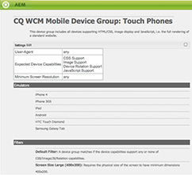

# Criando filtros do grupo de dispositivos{#creating-device-group-filters}

>[!NOTE]
>
>A Adobe recomenda o uso do Editor SPA para projetos que exigem renderização no lado do cliente baseada em estrutura de aplicativo de página única (por exemplo, React). [Saiba mais](/help/sites-developing/spa-overview.md).

Crie um filtro de grupo de dispositivos para definir um conjunto de requisitos de recursos do dispositivo. Crie quantos filtros forem necessários para direcionar os grupos necessários de recursos do dispositivo.

Crie seus filtros para poder usar combinações deles para definir os grupos de recursos. Normalmente, há uma sobreposição das capacidades de diferentes grupos de dispositivos. Portanto, você pode usar alguns filtros com várias definições de grupo de dispositivos.

Depois de criar um filtro, você pode usá-lo na [configuração do grupo.](/help/sites-developing/mobile.md#creating-a-device-group)

## A classe Filter Java™ {#the-filter-java-class}

Um filtro de grupo de dispositivos é um componente OSGi que implementa o [com.day.cq.wcm.mobile.api.device.DeviceGroupFilter](https://developer.adobe.com/experience-manager/reference-materials/6-5/javadoc/index.html?com/day/cq/wcm/mobile/api/device/DeviceGroupFilter.html) interface. Quando implantada, a classe de implementação fornece um serviço de filtro que está disponível para configurações de grupos de dispositivos.

A solução descrita neste artigo usa o plug-in Apache Felix Maven SCR para facilitar o desenvolvimento do componente e do serviço. Portanto, a classe Java™ de exemplo usa a variável `@Component`e `@Service` anotações. A classe tem a seguinte estrutura:

```java
package com.adobe.example.myapp;

import java.util.Map;

import com.day.cq.wcm.mobile.api.device.DeviceGroup;
import com.day.cq.wcm.mobile.api.device.DeviceGroupFilter;

import org.apache.felix.scr.annotations.Component;
import org.apache.felix.scr.annotations.Service;

@Component(metatype = false)
@Service
public class myDeviceGroupFilter implements DeviceGroupFilter {

       public String getDescription() {
  return null;
 }

 public String getTitle() {
  return null;
 }

 public boolean matches(DeviceGroup arg0, String arg1, Map arg2) {
  return false;
 }

}
```

Forneça o código para os seguintes métodos:

* `getDescription`: retorna a descrição do filtro. A descrição aparece na caixa de diálogo de configuração do Grupo de dispositivos.
* `getTitle`: retorna o nome do filtro. O nome aparece ao selecionar filtros para o grupo de dispositivos.
* `matches`: determina se o dispositivo tem os recursos necessários.

### Fornecer o nome e a descrição do filtro {#providing-the-filter-name-and-description}

A variável `getTitle` e `getDescription` Os métodos do retornam o nome e a descrição do filtro, respectivamente. O código a seguir ilustra a implementação mais simples:

```java
public String getDescription() {
    return "An example device group filter";
}

public String getTitle() {
 return "myFilter";
}
```

A codificação rígida do nome e do texto de descrição é suficiente para ambientes de criação unilíngues. Considere a externalização das cadeias de caracteres para uso multilíngue ou para habilitar a alteração de cadeias de caracteres sem recompilar o código-fonte.

### Avaliando em Relação aos Critérios de Filtro {#evaluating-against-filter-criteria}

A variável `matches` função retorna `true` se os recursos do dispositivo atenderem a todos os critérios de filtro. Avalie as informações fornecidas nos argumentos de método para determinar se o dispositivo pertence ao grupo. Os seguintes valores são fornecidos como argumentos:

* Um objeto DeviceGroup
* O nome do agente do usuário
* Um objeto Map que contém os recursos do dispositivo. As chaves Map são os nomes do recurso WURFL™ e os valores são os valores correspondentes do banco de dados WURFL™.

A variável [com.day.cq.wcm.mobile.api.devicespecs.DeviceSpecsConstants](https://developer.adobe.com/experience-manager/reference-materials/6-5/javadoc/index.html?com/day/cq/wcm/mobile/api/device/DeviceGroupFilter.html) A interface contém um subconjunto dos nomes de recursos WURFL™ em campos estáticos. Use essas constantes de campo como chaves ao recuperar valores do Mapa de recursos do dispositivo.

Por exemplo, o código de exemplo a seguir determina se o dispositivo oferece suporte a CSS:

```xml
boolean cssSupport = true;
cssSupport = NumberUtils.toInt(capabilities.get(DeviceSpecsConstants.DSPEC_XHTML_SUPPORT_LEVEL)) > 1;
```

A variável `org.apache.commons.lang.math` O pacote fornece o `NumberUtils` classe.

>[!NOTE]
>
>Verifique se o banco de dados WURFL™ implantado no AEM inclui os recursos que você usa como critérios de filtragem. (Consulte [Detecção de dispositivo](/help/sites-developing/mobile.md#server-side-device-detection).)

### Exemplo De Filtro Para Tamanho De Tela {#example-filter-for-screen-size}

O exemplo de implementação DeviceGroupFilter a seguir determina se o tamanho físico do dispositivo atende aos requisitos mínimos. Esse filtro destina-se a adicionar granularidade ao grupo de dispositivos de toque. O tamanho dos botões na interface do aplicativo deve ser o mesmo, independentemente do tamanho da tela física. O tamanho de outros itens, como texto, pode variar. O filtro permite a seleção dinâmica de um CSS específico que controla o tamanho dos elementos da interface.

Este filtro aplica critérios de tamanho ao `physical_screen_height` e `physical_screen_width` Nomes de propriedade WURFL™.

```java
package com.adobe.example.myapp;

import java.util.Map;

import com.day.cq.wcm.mobile.api.device.DeviceGroup;
import com.day.cq.wcm.mobile.api.device.DeviceGroupFilter;

import org.apache.commons.lang.math.NumberUtils;
import org.apache.felix.scr.annotations.Component;
import org.apache.felix.scr.annotations.Service;

@Component(metatype = false)
@Service
@SuppressWarnings("unused")
public class ScreenSizeLarge implements DeviceGroupFilter {
    private int len=400;
    private int wid=200;
    public String getDescription() {

        return "Requires the physical size of the screen to have minimum dimensions " + len + "x" + wid+".";
    }

    public String getTitle() {
        return "Screen Size Large ("+len + "x" + wid+")";
    }

    public boolean matches(DeviceGroup deviceGroup, String userAgent,
            Map<String, String> deviceCapabilities) {

        boolean longEnough=true;
        boolean wideEnough=false;
        int dimension1=NumberUtils.toInt(deviceCapabilities.get("physical_screen_height"));
        int dimension2=NumberUtils.toInt(deviceCapabilities.get("physical_screen_width"));
        if(dimension1>dimension2){
            longEnough=dimension1>=len;
            wideEnough=dimension2>=wid;
        }else{
            longEnough=dimension2>=len;
            wideEnough=dimension1>=wid;
        }

        return longEnough && wideEnough;
    }
}
```

O valor String retornado pelo método getTitle aparece na lista suspensa das propriedades do grupo de dispositivos.


Os valores de String retornados pelos métodos getTitle e getDescription estão incluídos na parte inferior da página de resumo do grupo de dispositivos.



### O arquivo POM Maven {#the-maven-pom-file}

O código POM a seguir é útil se você usar o Maven para criar seus aplicativos. O POM faz referência a vários plug-ins e dependências necessários.

**Plug-ins:**

* Plug-in do compilador Apache Maven: compila classes Java™ do código-fonte.
* Plug-in de pacote Apache Felix Maven: cria o pacote e o manifesto
* Plug-in SCR Apache Felix Maven: cria o arquivo de descritor do componente e configura o cabeçalho de manifesto do componente de serviço.

**Dependências:**

* `cq-wcm-mobile-api-5.5.2.jar`: Fornece as interfaces DeviceGroup e DeviceGroupFilter.

* `org.apache.felix.scr.annotations.jar`: fornece as anotações de Componente e Serviço.

As interfaces DeviceGroup e DeviceGroupFilter estão incluídas no pacote da API móvel WCM do Comunicado do dia 5. As anotações Felix estão incluídas no pacote do Apache Felix Declarative Services. Você pode obter esse arquivo JAR do repositório Adobe público.

No momento da criação, a 5.5.2 é a versão do pacote da API do WCM Mobile que está na versão mais recente do AEM. Usar o console da Web do Adobe ([https://localhost:4502/system/console/bundles](https://localhost:4502/system/console/bundles)) para garantir que essa seja a versão do pacote implantada em seu ambiente.

**POM:** (Seu POM usa um groupId e uma versão diferentes.)

```xml
<project xmlns="https://maven.apache.org/POM/4.0.0"
        xmlns:xsi="https://www.w3.org/2001/XMLSchema-instance"
        xsi:schemaLocation="https://maven.apache.org/POM/4.0.0 https://maven.apache.org/xsd/maven-4.0.0.xsd">
      <modelVersion>4.0.0</modelVersion>
      <groupId>com.adobe.example.myapp</groupId>
      <artifactId>devicefilter</artifactId>
      <version>0.0.1-SNAPSHOT</version>
      <name>my app device filter</name>
      <url>https://dev.day.com/docs/en/cq/current.html</url>
  <packaging>bundle</packaging>
<build>
    <plugins>
        <plugin>
            <groupId>org.apache.maven.plugins</groupId>
            <artifactId>maven-compiler-plugin</artifactId>
            <configuration>
                <source>1.5</source>
                <target>1.5</target>
            </configuration>
        </plugin>
        <plugin>
            <groupId>org.apache.felix</groupId>
            <artifactId>maven-scr-plugin</artifactId>
            <executions>
                  <execution>
                    <id>generate-scr-scrdescriptor</id>
                    <goals>
                          <goal>scr</goal>
                    </goals>
                  </execution>
            </executions>
          </plugin>
        <plugin>
            <groupId>org.apache.felix</groupId>
            <artifactId>maven-bundle-plugin</artifactId>
            <version>1.4.3</version>
            <extensions>true</extensions>
            <configuration>
                <instructions>
                    <Export-Package>com.adobe.example.myapp.*;version=${project.version}</Export-Package>
                </instructions>
            </configuration>
        </plugin>
    </plugins>
</build>
<dependencies>
     <dependency>
         <groupId>com.day.cq.wcm</groupId>
         <artifactId>cq-wcm-mobile-api</artifactId>
         <version>5.5.2</version>
         <scope>provided</scope>
     </dependency>
     <dependency>
        <groupId>org.apache.felix</groupId>
        <artifactId>org.apache.felix.scr.annotations</artifactId>
        <version>1.6.0</version>
        <scope>compile</scope>
    </dependency>
</dependencies>
</project>
```

Adicione o perfil que a [Obter o plug-in Maven do pacote de conteúdo](/help/sites-developing/vlt-mavenplugin.md) A seção fornece ao arquivo de configurações maven o uso do repositório Adobe público.
