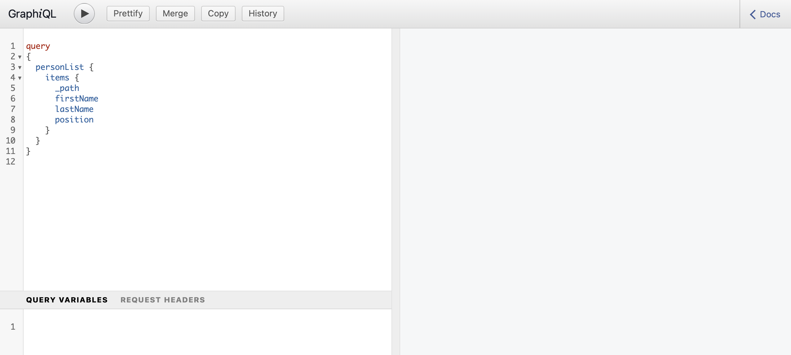

# Guia de início rápido sem cabeçalho para acessar e entregar fragmentos de conteúdo {#accessing-delivering-content-fragments}

Saiba como usar AEM API REST de ativos para gerenciar Fragmentos de conteúdo e a API do GraphQL para entrega sem interface do conteúdo do Fragmento de conteúdo.

## O que são as APIs REST do GraphQL e do Assets? {#what-are-the-apis}

[Agora que criou alguns fragmentos de conteúdo,](create-content-fragment.md) você pode usar as APIs do AEM para entregá-los de forma headless.

* [A API GraphQL](/help/assets/content-fragments/graphql-api-content-fragments.md) permite criar solicitações para acessar e fornecer Fragmentos de conteúdo.
   * Para usar isso, [os endpoints precisam ser definidos e ativados no AEM](/help/assets/content-fragments/graphql-api-content-fragments.md#enabling-graphql-endpoint) e, se necessário, a [Interface GraphiQL precisa ser instalada](/help/assets/content-fragments/graphql-api-content-fragments.md#installing-graphiql-interface).
* [A API REST do Assets](/help/assets/assets-api-content-fragments.md) permite criar e modificar Fragmentos de conteúdo (e outros ativos).

O restante deste guia terá como foco o acesso ao GraphQL e a entrega de Fragmento de conteúdo.

## Como fornecer um fragmento de conteúdo usando o GraphQL {#how-to-deliver-a-content-fragment}

Os arquitetos da informação precisarão projetar consultas para seus endpoints de canal para fornecer conteúdo. Geralmente, essas consultas só precisarão ser consideradas uma vez por endpoint por modelo. Para os fins deste guia de introdução, só será necessário criar uma.

1. Faça logon no AEM e acesse o [Interface GraphiQL](/help/assets/content-fragments/graphiql-ide.md):
   * Por exemplo: `http://<host>:<port>/aem/graphiql.html`.

1. O GraphiQL é um editor de consultas no navegador para GraphQL. Você pode usá-lo para criar consultas para recuperar Fragmentos de conteúdo e entregá-los de forma headless como JSON.
   * O painel esquerdo permite criar a consulta.
   * O painel direito exibe os resultados.
   * O Editor de consultas tem recursos de autocompletar código e teclas de atalho para executar a consulta com facilidade.
      

1. Supondo que o modelo que criamos era chamado `person`, com os campos `firstName`, `lastName` e `position`, podemos criar uma consulta simples para recuperar o conteúdo do Fragmento de conteúdo.

   ```text
   query 
   {
     personList {
       items {
         _path
         firstName
         lastName
         position
       }
     }
   }
   ```

1. Insira a consulta no painel esquerdo.

<!--
   
-->

1. Clique no botão **Executar Consulta** (seta para a direita) ou use o ícone `Ctrl-Enter` A tecla de atalho e os resultados são exibidos como JSON no painel direito.
   

1. Clique em:
   * **Documentação** na parte superior direita da página para mostrar a documentação contextual para ajudá-lo a criar suas consultas que se adaptam aos seus próprios modelos.
   * **Histórico** na barra de ferramentas superior para mostrar consultas anteriores.
   * **Salvar como** e **Salvar** para salvar suas consultas, depois disso você pode listá-las e recuperá-las do **Consultas Persistentes** painel e **Publicar**.
      

O GraphQL permite consultas estruturadas que podem direcionar não apenas conjuntos de dados específicos ou objetos de dados individuais, mas também fornecer elementos específicos dos objetos, resultados aninhados, oferecer suporte para variáveis de consulta e muito mais.

O GraphQL pode evitar solicitações de API iterativas, bem como a entrega excessiva e, em vez disso, permite a entrega em massa do que é necessário para renderização como resposta a uma única consulta de API. O JSON resultante pode ser usado para fornecer dados a outros sites ou aplicativos.

## Próximas etapas {#next-steps}

Pronto! Agora você tem uma compreensão básica do gerenciamento de conteúdo headless no AEM. É claro que há muito mais recursos onde você pode se aprofundar para obter um entendimento abrangente dos recursos disponíveis.

* **[Navegador de configuração](create-configuration.md)** - Para obter detalhes sobre o Navegador de configuração de AEM
* **[Fragmentos de conteúdo](/help/assets/content-fragments/content-fragments.md)** - Para obter detalhes sobre a criação e o gerenciamento dos Fragmentos de conteúdo
* **[GraphiQL IDE](/help/assets/content-fragments/graphiql-ide.md)** para obter mais detalhes sobre o uso do GraphiQL IDE
* **[Consultas Persistentes](/help/assets/content-fragments/persisted-queries.md)** para obter mais detalhes de Consultas Persistentes
* **[Suporte a fragmentos de conteúdo na API HTTP do AEM Assets](/help/assets/assets-api-content-fragments.md)** - Para obter detalhes sobre como acessar conteúdo do AEM diretamente pela API HTTP, por meio de operações CRUD (Criar, Ler, Atualizar, Excluir)
* **[API GraphQL](/help/assets/content-fragments/graphql-api-content-fragments.md)** - Para obter detalhes sobre como fornecer Fragmentos de conteúdo de forma headless
