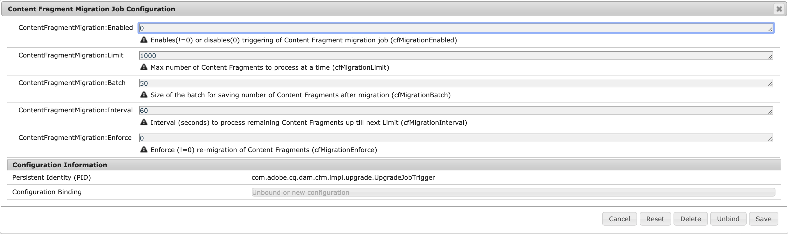

# Atualizar fragmentos de conteúdo para a filtragem otimizada de GraphQL {#updating-content-fragments-for-optimized-graphql-filtering}

Para otimizar o desempenho dos filtros do GraphQL, execute um procedimento para atualizar os Fragmentos de conteúdo.

>[!NOTE]
>
>Depois de atualizar os fragmentos de conteúdo, você pode seguir as recomendações para [Otimizar consultas do GraphQL](/help/sites-developing/headless/graphql-api/graphql-optimization.md).

## Pré-requisitos {#prerequisites}

Certifique-se de que você tenha um mínimo da versão 6.5.17.0 do AEM.

## Atualização dos fragmentos de conteúdo {#updating-content-fragments}

Para executar o procedimento, siga as etapas abaixo:

1. [Defina as configurações de OSGi](/help/sites-deploying/configuring-osgi.md) para a **Configuração do Trabalho de Migração de Fragmento de Conteúdo**:

   

1. Na caixa de diálogo do, defina esses dois parâmetros da seguinte maneira:

   * **ContentFragmentMigration:Enabled** : `1`
   * **MigraçãoDeFragmentoDeConteúdo:Impor** : `1`

1. **Salve** as especificações - o procedimento de atualização é iniciado.

1. Aguarde até que o procedimento seja concluído. O procedimento é concluído quando a propriedade `cfGlobalVersion` aparece em `/content/dam` e está definida como `1`.

1. Retorne à configuração do OSGi para desativar o procedimento.

   Na caixa de diálogo da **Configuração do trabalho de migração de fragmento de conteúdo**, defina estes dois parâmetros da seguinte maneira:

   * **ContentFragmentMigration:Enabled** : `0`
   * **MigraçãoDeFragmentoDeConteúdo:Impor** : `0`

## Limitações {#limitations}

Observe as seguintes limitações:

* A otimização do desempenho dos filtros de GraphQL só será possível após uma atualização completa de todos os fragmentos de conteúdo (indicada pela presença da propriedade `cfGlobalVersion` no nó `/content/dam` do JCR)

* Se os fragmentos de conteúdo forem importados de um pacote de conteúdo (usando `crx/de`) depois que o procedimento de atualização for executado, esses fragmentos de conteúdo não serão considerados nos resultados da consulta de GraphQL até que o procedimento de atualização seja executado novamente.
