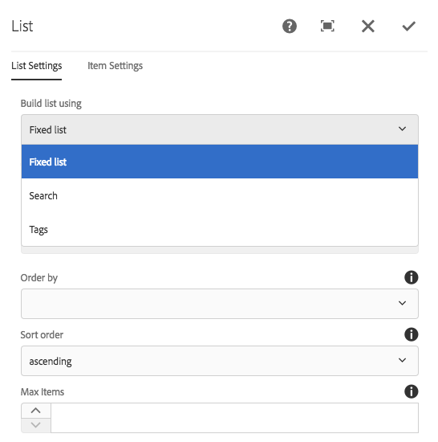

# Uso de condições de ocultação {#using-hide-conditions}

As condições Ocultar podem ser usadas para determinar se um recurso de componente é renderizado ou não. Um exemplo disso seria quando um autor de modelo configura o Componente principal [componente de lista](https://helpx.adobe.com/experience-manager/core-components/using/list.html) no [editor de modelos](/help/sites-authoring/templates.md) e decide desabilitar as opções para criar a lista com base em páginas filhas. Desativar essa opção na caixa de diálogo de design define uma propriedade para que, quando o componente de lista for renderizado, a condição de ocultação seja avaliada e a opção para mostrar páginas filhas não seja exibida.

## Visão geral {#overview}

As caixas de diálogo podem se tornar muito complexas, com várias opções para o usuário, que só pode usar uma fração das opções que estão à sua disposição. Isso pode resultar em experiências esmagadoras da interface do usuário para os usuários.

Ao usar condições de ocultação, administradores, desenvolvedores e superusuários têm uma maneira de ocultar recursos com base em um conjunto de regras. Esse recurso permite que eles decidam quais recursos devem ser exibidos quando um autor editar o conteúdo.

>[!NOTE]
>
>Ocultar um recurso com base em uma expressão não substitui permissões de ACL. O conteúdo permanece editável, mas simplesmente não é exibido.

## Detalhes de implementação e uso {#implementation-and-usage-details}

`com.adobe.granite.ui.components.FilteringResourceWrapper` é responsável por filtrar os recursos com base na existência e no valor da variável `granite:hide` , localizada no campo a ser filtrado. A execução do `/libs/cq/gui/components/authoring/dialog/dialog.jsp` inclui uma instância de `FilteringResourceWrapper.`

A implementação utiliza o Granite [API ELResolver](https://helpx.adobe.com/experience-manager/6-5/sites/developing/using/reference-materials/granite-ui/api/jcr_root/libs/granite/ui/docs/server/el.html) e adiciona uma `cqDesign` variável personalizada por meio do ExpressionCustomizer.

Veja alguns exemplos de condições de ocultação em um nó de design localizado em `etc/design` ou como uma Política de conteúdo.

```
${cqDesign.myProperty}
${!cqDesign.myProperty}
${cqDesign.myProperty == 'someText'}
${cqDesign.myProperty != 'someText'}
${cqDesign.myProperty == true}
${cqDesign.myProperty == true}
${cqDesign.property1 == 'someText' && cqDesign.property2 || cqDesign.property3 != 1 || header.myHeader}
```

Ao definir sua expressão de ocultação, lembre-se:

* Para ser válido, o escopo no qual a propriedade é encontrada deve ser expresso (por exemplo, `cqDesign.myProperty`).
* Os valores são somente leitura.
* As funções (se necessário) devem limitar-se a um determinado conjunto fornecido pelo serviço.

## Exemplo {#example}

Exemplos de condições de ocultação podem ser encontrados em todo o AEM e no [componentes principais](https://experienceleague.adobe.com/docs/experience-manager-core-components/using/introduction.html?lang=pt-BR) em especial. Por exemplo, considere a variável [componente principal da lista](https://helpx.adobe.com/experience-manager/core-components/using/list.html).

[Uso do editor de modelo](/help/sites-authoring/templates.md), o autor do modelo pode definir na caixa de diálogo de design quais opções do componente de lista estão disponíveis para o autor da página. Opções como permitir que a lista seja uma lista estática, uma lista de páginas filhas, uma lista de páginas marcadas etc. pode ser ativado ou desativado.

Se um autor de modelo optar por desativar a opção páginas filhas, uma propriedade de design será definida e uma condição de ocultação será avaliada em relação a ela, o que fará com que a opção não seja renderizada para o autor da página.

1. Por padrão, o autor da página pode usar o componente principal da lista para criar uma lista usando páginas secundárias escolhendo a opção **Páginas secundárias**.

   

1. Na caixa de diálogo de design do componente principal da lista, o autor do modelo pode escolher a opção **Desativar Filhos** para impedir que a opção de gerar uma lista baseada em páginas filhas seja exibida ao autor da página.

   

1. Um nó de política é criado em `/conf/we-retail/settings/wcm/policies/weretail/components/content/list` com uma propriedade `disableChildren` defina como `true`.
1. A condição de ocultação é definida como o valor de um `granite:hide` propriedade no nó de propriedade da caixa de diálogo `/conf/we-retail/settings/wcm/policies/weretail/components/content/list`

   

1. O valor de `disableChildren` é extraída da configuração do design e da expressão `${cqDesign.disableChildren}` resulta em `false`, o que significa que a opção não será renderizada como parte do componente.

   Você pode exibir a expressão de ocultação como o valor da variável `granite:hide` propriedade [no GitHub aqui](https://github.com/Adobe-Marketing-Cloud/aem-core-wcm-components/blob/master/content/src/content/jcr_root/apps/core/wcm/components/list/v1/list/_cq_dialog/.content.xml#L40).

1. A opção **Páginas secundárias** não é mais renderizado para o autor da página ao usar o componente de lista.

   
