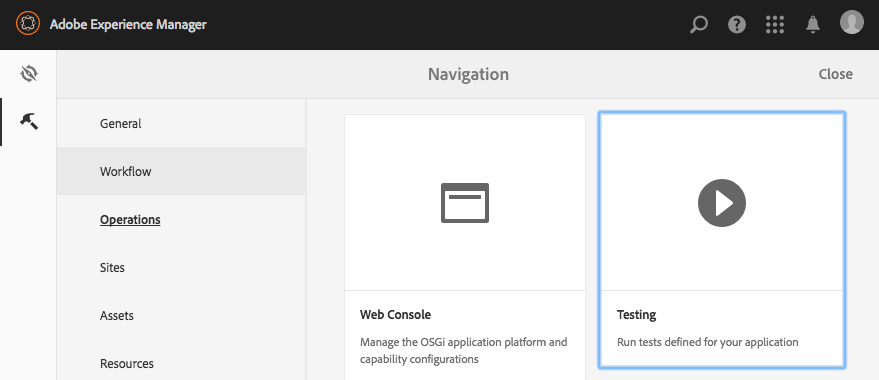

# Testando sua interface de usuário{#testing-your-ui}

>[!NOTE]
>
>A partir AEM 6.5, a estrutura de teste da interface do usuário do hobbes.js está obsoleta. A Adobe não planeja fazer mais aprimoramentos e recomenda que os clientes usem a automação Selenium.
>
>See [Deprecated and Removed Features](/help/release-notes/deprecated-removed-features.md).

AEM fornece uma estrutura para automatizar testes para sua interface AEM. Usando a estrutura, você grava e executa testes de interface diretamente em um navegador da Web. A estrutura fornece uma API javascript para a criação de testes.

A estrutura de teste AEM usa Hobbes.js, uma biblioteca de testes escrita em Javascript. A estrutura do Hobbes.js foi desenvolvida para testar AEM como parte do processo de desenvolvimento. A estrutura agora está disponível para uso público para testar seus aplicativos AEM.

>[!NOTE]
>
>Consulte a [documentação](https://helpx.adobe.com/experience-manager/6-5/sites/developing/using/reference-materials/test-api/index.html) do Hobbes.js para obter detalhes completos da API.

## Estrutura dos ensaios {#structure-of-tests}

Ao usar testes automatizados em AEM, os seguintes termos são importantes para entender:

| Ação | Uma **ação** é uma atividade específica em uma página da Web, como clicar em um link ou em um botão. |
|---|---|
| Caso de teste | Um caso **de** teste é uma situação específica que pode ser composta por uma ou mais **ações**. |
| Test Suite | Um **Test Suite** é um grupo de casos **de** teste relacionados que, juntos, testam um caso de uso específico. |

## Execução de testes {#executing-tests}

### Exibindo conjuntos de testes {#viewing-test-suites}

Abra o console de teste para ver os conjuntos de teste registrados. O painel Testes contém uma lista de conjuntos de teste e seus casos de teste.

Navegue até o console Ferramentas por meio de Navegação **global -> Ferramentas > Operações -> Teste**.



Ao abrir o console, os Conjuntos de teste são listados à esquerda, juntamente com uma opção para executar todos eles sequencialmente. O espaço à direita mostrado com um plano de fundo verificado é um espaço reservado para mostrar o conteúdo da página à medida que os testes são executados.


### Execução de um único Test Suite {#running-a-single-test-suite}

Os Conjuntos de testes podem ser executados individualmente. Quando você executa um Test Suite, a página é alterada à medida que os Casos de teste e suas Ações são executados e os resultados são exibidos após a conclusão do teste. Os ícones indicam os resultados.

Um ícone de marca de seleção indica um teste aprovado:


Um ícone &quot;X&quot; indica uma falha no teste:


Para executar um Test Suite:

1. No painel Testes, clique ou toque no nome do caso de teste que você deseja executar para expandir os detalhes das ações.

   

1. Clique ou toque no botão **Executar teste** .

   

1. O espaço reservado é substituído pelo conteúdo da página à medida que o teste é executado.

   

1. Revise os resultados do caso de teste tocando ou clicando na descrição para abrir o painel **Resultado** . Tocar ou clicar no nome do caso de teste no painel **Resultado** mostra todos os detalhes.

   

### Execução de vários testes {#running-multiple-tests}

Os conjuntos de testes são executados sequencialmente na ordem em que são exibidos no console. Você pode detalhar um teste para ver os resultados detalhados.


1. No painel Testes, toque ou clique no botão **Executar todos os testes** ou no botão **Executar testes** abaixo do título do Test Suite que você deseja executar.

   

1. Para visualização dos resultados de cada caso de teste, toque ou clique no título do caso de teste. Tocar ou clicar no nome do teste no painel **Resultado** mostra todos os detalhes.

   

## Criação e uso de um conjunto de testes simples {#creating-and-using-a-simple-test-suite}

O procedimento a seguir o orienta pela criação e execução de um Test Suite usando o conteúdo [](/help/sites-developing/we-retail.md)We.Retail, mas você pode modificar facilmente o teste para usar uma página da Web diferente.

Para obter detalhes completos sobre como criar seus próprios Conjuntos de testes, consulte a documentação [da API](https://helpx.adobe.com/experience-manager/6-5/sites/developing/using/reference-materials/test-api/index.html)Hobbes.js.

1. Abra o CRXDE Lite. ([https://localhost:4502/crx/de](https://localhost:4502/crx/de))
1. Clique com o botão direito do mouse na `/etc/clientlibs` pasta e clique em **Criar > Criar pasta**. Digite `myTests` o nome e clique em **OK**.
1. Clique com o botão direito do mouse na `/etc/clientlibs/myTests` pasta e clique em **Criar > Criar nó**. Use os seguintes valores de propriedade e clique em **OK**:

   * Nome: `myFirstTest`
   * Tipo: `cq:ClientLibraryFolder`

1. Adicione as seguintes propriedades ao nó myFirstTest:

   | Nome | Tipo | Valor |
   |---|---|---|
   | `categories` | Sequência de caracteres[] | `granite.testing.hobbes.tests` |
   | `dependencies` | Sequência de caracteres[] | `granite.testing.hobbes.testrunner` |

   >[!NOTE]
   >
   >**Somente AEM Forms**
   >
   >
   >Para testar formulários adaptáveis, adicione os seguintes valores às categorias e dependências. Por exemplo:
   >
   >
   >**categorias**: `granite.testing.hobbes.tests, granite.testing.hobbes.af.commons`
   >
   >
   >**dependências**: `granite.testing.hobbes.testrunner, granite.testing.hobbes.af`

1. Clique em **Salvar tudo**.
1. Clique com o botão direito do mouse no `myFirstTest` nó e clique em **Criar > Criar arquivo**. Name the file `js.txt` and click **OK**.
1. No `js.txt` arquivo, insira o seguinte texto:

   ```
   #base=.
   myTestSuite.js
   ```

1. Clique em **Salvar tudo** e feche o `js.txt` arquivo.
1. Clique com o botão direito do mouse no `myFirstTest` nó e clique em **Criar > Criar arquivo**. Name the file `myTestSuite.js` and click **OK**.
1. Copie o seguinte código para o `myTestSuite.js` arquivo e salve o arquivo:

   ```
   new hobs.TestSuite("Experience Content Test Suite", {path:"/etc/clientlibs/myTests/myFirstTest/myTestSuite.js"})
      .addTestCase(new hobs.TestCase("Navigate to Experience Content")
         .navigateTo("/content/we-retail/us/en/experience/arctic-surfing-in-lofoten.html")
      )
      .addTestCase(new hobs.TestCase("Hover Over Topnav")
         .mouseover("li.visible-xs")
      )
      .addTestCase(new hobs.TestCase("Click Topnav Link")
         .click("li.active a")
   );
   ```

1. Navegue até o console **Testes** para testar seu conjunto de testes.
