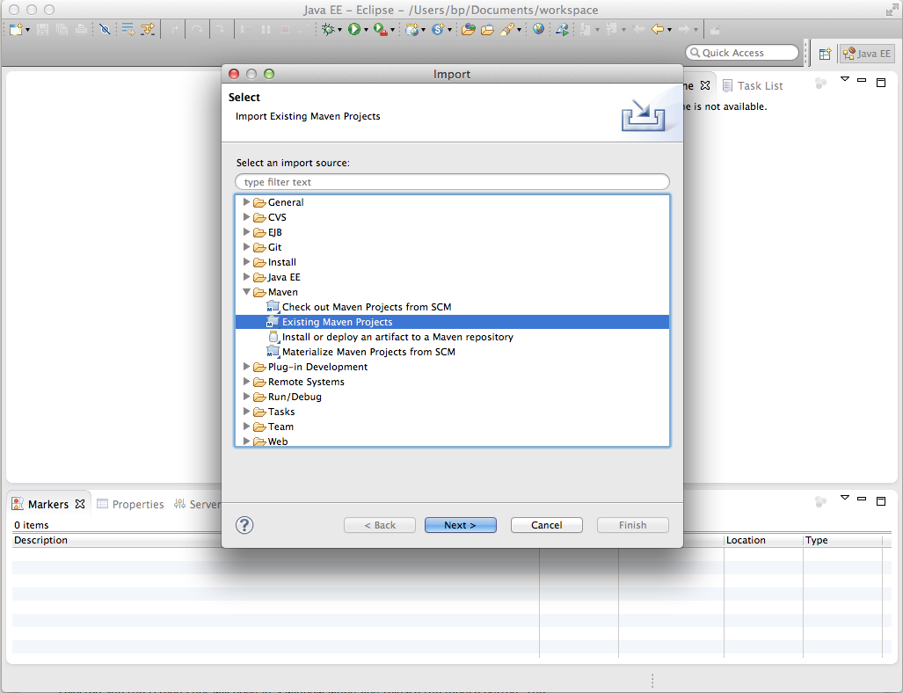

# Como desenvolver projetos AEM usando o Eclipse{#how-to-develop-aem-projects-using-eclipse}

Este guia descreve como usar o Eclipse para desenvolver projetos baseados em AEM.

>[!NOTE]
>
>O Adobe agora fornece a variável [Ferramentas de desenvolvimento de AEM para o Eclipse](/help/sites-developing/aem-eclipse.md) o que ajuda a desenvolver soluções AEM com o Eclipse.

## Visão geral {#overview}

Para começar a usar AEM desenvolvimento no Eclipse, as etapas a seguir são necessárias.

Cada um deles é explicado mais detalhadamente no restante deste &quot;Como&quot;.

* Instalar o Eclipse 4.3 (Kepler)
* Configure seu projeto de AEM com base em Maven
* Prepare o suporte JSP para o Eclipse no Maven POM
* Importar o projeto Maven para o Eclipse

>[!NOTE]
>
>Este guia é baseado no Eclipse 4.3 (Kepler) e no AEM 5.6.1.

## Instalar o Eclipse {#install-eclipse}

Baixe o &quot;Eclipse IDE para desenvolvedores Java EE&quot; no [Página Downloads do Eclipse](https://www.eclipse.org/downloads/).

Instale o Eclipse após a [Instruções de instalação](https://wiki.eclipse.org/Eclipse/Installation).

## Configure seu projeto de AEM com base em Maven {#set-up-your-aem-project-based-on-maven}

Em seguida, configure o seu projeto usando o Maven, conforme descrito em [Como criar projetos AEM usando o Apache Maven](/help/sites-developing/ht-projects-maven.md).

## Preparar o suporte JSP para o Eclipse {#prepare-jsp-support-for-eclipse}

O Eclipse também pode fornecer suporte ao trabalhar com o JSP, por exemplo

* preenchimento automático de bibliotecas de tags
* Conscientização do Eclipse de objetos definidos pelo &lt;cq:defineobjects /> e &lt;sling:defineobjects />

Para que isso funcione:

1. Siga as instruções em [Como trabalhar com JSPs](/help/sites-developing/ht-projects-maven.md#how-to-work-with-jsps) em [Como criar projetos AEM usando o Apache Maven](/help/sites-developing/ht-projects-maven.md).
1. Adicione o seguinte ao &lt;build /> no POM do módulo de conteúdo.

   O plug-in de suporte Maven do Eclipse, m2e, não fornece suporte para o maven-jspc-plugin, e essa configuração informa ao m2e para ignorar o plug-in e a tarefa relacionada de limpar os resultados da compilação temporária.

   Isso não é um problema: conforme observado em [Como trabalhar com JSPs](/help/sites-developing/ht-projects-maven.md#how-to-work-with-jsps), o maven-jspc-plugin nessa configuração é usado apenas para validar que os JSPs sejam compilados como parte do processo de compilação. O Eclipse já relata problemas em JSPs e não depende desse plug-in Maven para poder fazer isso.

   **myproject/content/pom.xml**

   ```xml
   <build>
     <!-- ... -->
     <pluginManagement>
       <plugins>
         <!--This plugin's configuration is used to store Eclipse m2e settings only. It has no influence on the Maven build itself.-->
         <plugin>
           <groupId>org.eclipse.m2e</groupId>
           <artifactId>lifecycle-mapping</artifactId>
           <version>1.0.0</version>
           <configuration>
             <lifecycleMappingMetadata>
               <pluginExecutions>
                 <pluginExecution>
                   <pluginExecutionFilter>
                     <groupId>org.apache.sling</groupId>
                     <artifactId>maven-jspc-plugin</artifactId>
                     <versionRange>[2.0.6,)</versionRange>
                     <goals>
                       <goal>jspc</goal>
                     </goals>
                   </pluginExecutionFilter>
                   <action>
                     <ignore/>
                   </action>
                 </pluginExecution>
                 <pluginExecution>
                   <pluginExecutionFilter>
                     <groupId>org.apache.maven.plugins</groupId>
                     <artifactId>maven-clean-plugin</artifactId>
                     <versionRange>[2.4.1,)</versionRange>
                     <goals>
                       <goal>clean</goal>
                     </goals>
                   </pluginExecutionFilter>
                   <action>
                     <ignore/>
                   </action>
                 </pluginExecution>
               </pluginExecutions>
             </lifecycleMappingMetadata>
           </configuration>
         </plugin>
       </plugins>
     </pluginManagement>
   </build>
   ```

### Importar o projeto Maven para o Eclipse {#import-the-maven-project-into-eclipse}

1. No Eclipse, escolha Arquivo > Importar...
1. Na caixa de diálogo Importar, escolha Maven > Projetos Maven existentes e clique em &quot;Próximo&quot;.

   

1. Insira o caminho para a pasta de nível superior do projeto, em seguida, clique em &quot;Selecionar tudo&quot; e &quot;Concluir&quot;.

   

1. Agora, todos estão configurados para usar o Eclipse para desenvolver seu projeto de AEM, incluindo o autopreenchimento do JSP.

   

   >[!NOTE]
   >
   >Se você incluir `/libs/foundation/global.jsp` ou outros JSPs em `/libs`, será necessário copiar para o projeto, para que o Eclipse possa resolver a inclusão. Ao mesmo tempo, você precisa garantir que ele não esteja incluído em seu pacote de conteúdo pelo Maven. Como fazer isso está descrito em [Como criar projetos AEM usando o Apache Maven](/help/sites-developing/ht-projects-maven.md).
