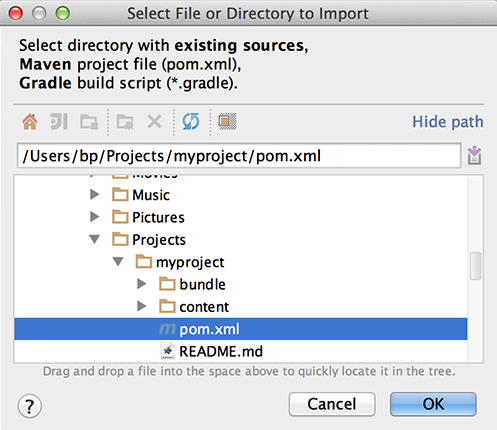

# Como desenvolver projetos AEM usando o IntelliJ IDEA{#how-to-develop-aem-projects-using-intellij-idea}

## Visão geral {#overview}

Para começar a usar AEM desenvolvimento no IntelliJ, as etapas a seguir são necessárias.

Cada um deles é explicado mais detalhadamente no restante deste &quot;Como&quot;.

* Instalar o IntelliJ
* Configure seu projeto de AEM com base em Maven
* Preparar o suporte JSP para IntelliJ no POM Maven
* Importar o projeto Maven para o IntelliJ

>[!NOTE]
>
>Este guia é baseado no IntelliJ IDEA Ultimate Edition 12.1.4 e no AEM 5.6.1.

### Instalar o IntelliJ IDEA {#install-intellij-idea}

Baixe o IntelliJ IDEA a partir de [a página Downloads no JetBrains](https://www.jetbrains.com/idea/download/index.html).

Em seguida, siga as instruções de instalação nessa página.

### Configure seu projeto de AEM com base em Maven {#set-up-your-aem-project-based-on-maven}

Em seguida, configure o seu projeto usando o Maven, conforme descrito em [Como criar projetos AEM usando o Apache Maven](/help/sites-developing/ht-projects-maven.md).

Para começar a trabalhar com projetos AEM no IntelliJ IDEA, a configuração básica em [Introdução em 5 minutos](https://maven.apache.org/guides/getting-started/maven-in-five-minutes.html) for suficiente.

### Preparar suporte JSP para IntelliJ IDEA {#prepare-jsp-support-for-intellij-idea}

O IntelliJ IDEA também pode fornecer suporte ao trabalhar com o JSP, por exemplo

* preenchimento automático de bibliotecas de tags
* conhecimento dos objetos definidos pelo `<cq:defineObjects />` e `<sling:defineObjects />`

Para que isso funcione, siga as instruções em [Como trabalhar com JSPs](/help/sites-developing/ht-projects-maven.md#how-to-work-with-jsps) em [Como criar projetos AEM usando o Apache Maven](/help/sites-developing/ht-projects-maven.md).

### Importar o projeto Maven {#import-the-maven-project}

1. Abra o **Importar** diálogo no IntelliJ IDEA por

   * seleção **Importar projeto** na tela de boas-vindas se você ainda não tiver nenhum projeto aberto
   * seleção **Arquivo -> Importar projeto** no menu principal

1. Na caixa de diálogo Importar, selecione o arquivo POM do seu projeto.

   

1. Continue com as configurações padrão, conforme mostrado na caixa de diálogo abaixo.

   

1. Continue pelas caixas de diálogo a seguir clicando em **Próximo** e **Concluir**.
1. Agora você está configurado para Desenvolvimento de AEM usando o IntelliJ IDEA

   

### Depuração de JSPs com IntelliJ IDEA {#debugging-jsps-with-intellij-idea}

As etapas a seguir são necessárias para depurar JSPs com IntelliJ IDEA

* Configurar uma faceta da Web no projeto
* Instalar o plug-in de suporte JSR45
* Configurar um perfil de depuração
* Configurar AEM para o modo de depuração

#### Configurar uma faceta da Web no projeto {#set-up-a-web-facet-in-the-project}

O IntelliJ IDEA precisa entender onde encontrar os JSPs para depuração. Como o IDEA não pode interpretar o `content-package-maven-plugin` , isso precisa ser configurado manualmente.

1. Ir para **Arquivo -> Estrutura do projeto**
1. Selecione o **Conteúdo** módulo
1. Clique em **+** acima da lista de módulos e selecione **Web**
1. Como o Diretório de Recursos da Web, selecione o `content/src/main/content/jcr_root subdirectory` do seu projeto, como mostrado na captura de tela abaixo.


#### Instalar o plug-in de suporte JSR45 {#install-the-jsr-support-plugin}

1. Vá para o **Plug-ins** painel nas configurações do IntelliJ IDEA
1. Navegue até o **Integração JSR45** Plug-in e marque a caixa de seleção ao lado dele
1. Clique em **Aplicar**
1. Reinicie o IntelliJ IDEA quando solicitado


#### Configurar um perfil de depuração {#configure-a-debug-profile}

1. Ir para **Executar -> Editar configurações**
1. Ocorra o **+** e selecione **Remoto JSR45**
1. Na caixa de diálogo de configuração, selecione **Configurar** ao lado de **Servidor de aplicativos** e configurar um servidor Genérico
1. Defina a página inicial como um URL apropriado se desejar abrir um navegador quando você começar a depurar
1. Remover tudo **Antes do lançamento** tarefas se você usar vlt autosync ou configurar as tarefas apropriadas do Maven se você não
1. No **Inicialização/Conexão** ajustar a porta, se necessário
1. Copie os argumentos da linha de comando que o IntelliJ IDEA propõe

 

#### Configurar AEM para o modo de depuração {#configure-aem-for-debug-mode}

A última etapa necessária é iniciar o AEM com as opções da JVM propostas pelo IntelliJ IDEA.

Você pode fazer isso iniciando o arquivo jar AEM diretamente e adicionando essas opções, por exemplo, com a seguinte linha de comando:

`java -Xdebug -Xrunjdwp:transport=dt_socket,address=58242,suspend=n,server=y -Xmx1024m -XX:MaxPermSize=256M -jar cq-quickstart-5.6.1.jar`

Também é possível adicionar essas opções ao script de início em `crx-quickstart/bin/start` conforme mostrado abaixo.

```shell
# ...

# default JVM options
if [ -z "$CQ_JVM_OPTS" ]; then
 CQ_JVM_OPTS='-server -Xmx1024m -XX:MaxPermSize=256M -Djava.awt.headless=true'
fi

CQ_JVM_OPTS="$CQ_JVM_OPTS -Xdebug -Xrunjdwp:transport=dt_socket,address=58242,suspend=n,server=y"

# ...
```

#### Iniciar depuração {#start-debugging}

Agora, todos os usuários estão configurados para depurar os JSPs no AEM.

1. Selecionar **Executar -> Depurar -> Seu Perfil De Depuração**
1. Definir pontos de interrupção no código do componente
1. Acesse uma página no navegador


### Depuração de pacotes com IntelliJ IDEA {#debugging-bundles-with-intellij-idea}

O código em pacotes pode ser depurado usando uma conexão de depuração remota genérica padrão. Você pode seguir o [Documentação do Jetrain sobre depuração remota](https://www.jetbrains.com/idea/webhelp/run-debug-configuration-remote.html).
