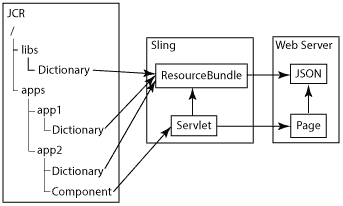

# Internacionalizar componentes{#internationalizing-components}

Internacionalize seus componentes e caixas de diálogo para que suas cadeias de caracteres da interface do usuário possam ser apresentadas em idiomas diferentes. Os componentes projetados para internacionalização permitem que as sequências de caracteres da interface sejam externalizadas, traduzidas e, em seguida, importadas para o repositório. No tempo de execução, as preferências de idioma do usuário ou o local da página determinam qual idioma é exibido na interface do usuário.

Use o processo a seguir para internacionalizar seus componentes e fornecer a interface do usuário em diferentes idiomas:

1. [Implemente seus componentes usando um código que internacionalize cadeias de caracteres.](/help/sites-developing/i18n-dev.md) Seu código identifica as cadeias de caracteres a serem traduzidas e seleciona o idioma a ser apresentado no tempo de execução.
1. [Crie dicionários](/help/sites-developing/i18n-translator.md#creating-a-dictionary) e [adicione](/help/sites-developing/i18n-translator.md#adding-changing-and-removing-strings) as cadeias de caracteres em inglês para traduzir.

1. [Exporte](/help/sites-developing/i18n-translator.md#exporting-a-dictionary) o dicionário para o formato XLIFF, traduza as cadeias de caracteres e [importe](/help/sites-developing/i18n-translator.md#importing-a-dictionary) os arquivos XLIFF de volta para o AEM. Como alternativa, você pode [adicionar traduções](/help/sites-developing/i18n-translator.md#editing-translated-strings) manualmente ao dicionário.

1. [Incorpore o dicionário ao processo de gerenciamento de versões do seu aplicativo](/help/sites-developing/i18n-translator.md#publishing-dictionaries).

>[!NOTE]
>
>Os métodos descritos aqui para internacionalizar componentes destinam-se a traduzir strings estáticas. Quando espera-se que as cadeias de caracteres do componente mudem, você deve usar fluxos de trabalho de tradução convencionais. Por exemplo, quando os autores podem editar uma sequência de caracteres da interface usando propriedades na caixa de diálogo Editar de um componente, você não deve usar um dicionário de idioma para internacionalizar a sequência.

## Dicionários de idiomas {#language-dictionaries}

A estrutura de internacionalização do AEM usa dicionários no repositório para armazenar strings em inglês e suas traduções em outros idiomas. A estrutura usa inglês como idioma padrão. As cadeias de caracteres são identificadas usando a versão em inglês. Normalmente, as estruturas de internacionalização usam IDs alfanuméricas para strings de interface. O uso da versão em inglês da string como ID tem várias vantagens:

* O código é fácil de ler.
* O idioma padrão está sempre disponível.

As cadeias de caracteres localizadas podem ser armazenadas em vários dicionários no repositório. Os dicionários do sistema AEM estão localizados abaixo do nó `/libs`. Você pode criar dicionários para seus componentes abaixo do nó `/apps`. A estrutura de internacionalização do AEM combina os dicionários e os disponibiliza no Sling como um único objeto `ResourceBundle`. Quando os componentes são renderizados, eles recuperam as strings traduzidas do conjunto de recursos. Os dicionários combinados também são implantados no servidor da Web em formato JSON para fornecer strings traduzidas para o código JavaScript em páginas da Web.

Além disso, a [ferramenta de Tradução](/help/sites-developing/i18n-translator.md) permite gerenciar todos os dicionários de um local central.

>[!NOTE]
>
>Não modifique os dicionários do sistema AEM localizados abaixo do nó `/libs`.

### Sobreposição de strings em dicionários do sistema {#overlaying-strings-in-system-dictionaries}

As cadeias de caracteres nos dicionários abaixo do nó `/apps` substituem as cadeias de caracteres duplicadas nos dicionários abaixo do nó `/libs`. Se os componentes usarem strings incluídas nos dicionários do sistema AEM, duplique a string no seu próprio dicionário. Todos os componentes usarão as strings do seu dicionário.

Observe que você não pode prever qual tradução é usada quando as cadeias de caracteres são duplicadas em dicionários localizados abaixo do nó `/apps`.
