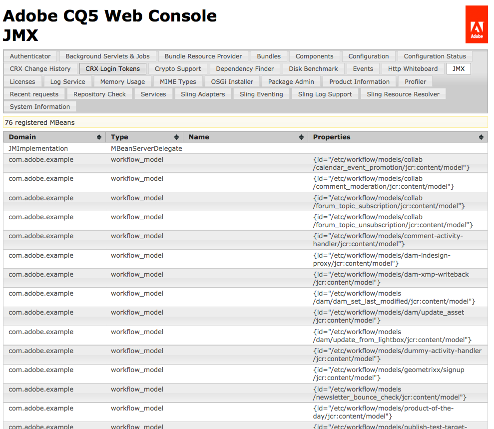

# Integração de serviços com o console JMX{#integrating-services-with-the-jmx-console}

Crie e implante MBeans para gerenciar serviços usando o Console JMX. Exponha os atributos e operações do serviço para permitir a execução de tarefas administrativas.

Para obter informações sobre como usar o Console JMX, consulte [Monitorar recursos do servidor usando o Console JMX](/help/sites-administering/jmx-console.md).

## A estrutura JMX no Felix e CQ5 {#the-jmx-framework-in-felix-and-cq}

Na plataforma Apache Felix, você implanta MBeans como serviços OSGi. Quando um serviço MBean é registrado no Registro de serviço OSGi, o módulo de Quadro de comunicações Aries JMX registra automaticamente o MBean no servidor MBean. O MBean fica então disponível para o Console JMX, que expõe os atributos públicos e as operações.


## Criação de MBeans para CQ5 e CRX {#creating-mbeans-for-cq-and-crx}

Os MBeans que você cria para gerenciar os recursos do CQ5 ou do CRX são baseados na interface javax.management.DynamicMBean. Para criá-los, siga os padrões de design habituais definidos na especificação JMX:

* Crie a interface de gerenciamento, incluindo get, set e is methods para definir atributos e outros métodos para definir operações.
* Crie a classe de implementação. A classe deve implementar DynamicMBean ou estender uma classe de implementação do DynamicMBean.
* Siga a convenção de nomenclatura padrão para que o nome da classe de implementação seja o nome da interface com o sufixo MBean.

Além de definir a interface de gerenciamento, a interface também define a interface do serviço OSGi. A classe de implementação implementa o serviço OSGi.

### Uso de anotações para fornecer informações ao MBean {#using-annotations-to-provide-mbean-information}

O pacote [com.adobe.granite.jmx.annotation](https://helpx.adobe.com/experience-manager/6-5/sites/developing/using/reference-materials/javadoc/com/adobe/granite/jmx/annotation/package-summary.html) fornece várias anotações e classes para fornecer facilmente metadados MBean ao console JMX. Use essas anotações e classes em vez de adicionar informações diretamente ao objeto MBeanInfo do MBean.

**Anotações**

Adicione anotações à interface de gerenciamento para especificar metadados MBean. As informações aparecem no console JMX para cada classe de implementação que é implantada. As anotações a seguir estão disponíveis (para obter informações completas, consulte o [com.adobe.granite.jmx.annotation JavaDocs](https://helpx.adobe.com/experience-manager/6-5/sites/developing/using/reference-materials/javadoc/com/adobe/granite/jmx/annotation/package-summary.html)):

* **Descrição:** Fornece uma descrição da classe ou método MBean. Quando usada na declaração de classe, a descrição é exibida na página Console JMX do MBean. Quando usada em um método, a descrição aparece como texto com o mouse para o atributo ou operação correspondente.
* **Impacto:** o impacto de um método. Valores de parâmetro válidos são os campos definidos por [javax.management.MBeanOperationInfo](https://docs.oracle.com/javase/1.5.0/docs/api/javax/management/MBeanOperationInfo.html).

* **Nome:** Especifica o nome a ser exibido para um parâmetro de operação. Use essa anotação para substituir o nome real do parâmetro de método usado na interface.
* **OpenTypeInfo:** Especifica a classe a ser usada para representar dados compostos ou dados tabulares no Console JMX. Para uso com Open MBeans
* **TabularTypeInfo:** usado para anotar a classe usada para representar dados tabulares.

**Classes**

As classes são fornecidas para a criação de MBeans dinâmicos que consomem as anotações adicionadas às interfaces:

* **AnnotatedStandardMBean:** uma subclasse da classe javax.management.StandardMBean que fornece automaticamente o Console JMX com os metadados de anotação.
* **OpenAnnotatedStandardMBean:** uma subclasse da classe AnnotatedStandardMBean para criar Mbeans abertos que consomem a anotação OpenTypeInfo.

### Desenvolvimento de MBeans {#developing-mbeans}

Normalmente, seu MBean é um reflexo do serviço OSGi que você deseja gerenciar. Na plataforma Felix, você cria o MBean da mesma forma que criaria para implantação em outras plataformas de servidor Java. Uma diferença principal é que você pode usar anotações para especificar informações do MBean:

* Interface de gerenciamento: Define atributos usando métodos getter, setter e is. Define operações usando qualquer outro método público. Usa anotações para fornecer metadados para o objeto BeanInfo .
* Classe MBean: Implementa a interface de gerenciamento. Estende a classe AnnotatedStandardMBean para processar as anotações na interface.

O seguinte exemplo de MBean fornece informações sobre o repositório CRX. A interface usa a anotação Descrição para fornecer informações ao console JMX.

#### Interface de gerenciamento {#management-interface}

```java
package com.adobe.example.myapp;

import com.adobe.granite.jmx.annotation.Description;

@Description("Example MBean that exposes repository properties.")
public interface ExampleMBean {

    @Description("The name of the repository.")
    String getRepositoryName();

    @Description("The vendor of the repository.")
    String   getRepositoryVendor();

    @Description("The URL of repository vendor.")
    String getVendorUrl();
}
```

A classe de implementação usa o serviço SlingRepository para recuperar informações sobre o repositório CRX.

#### Classe de implementação MBean {#mbean-implementation-class}

```java
package com.adobe.example.myapp;

import org.apache.felix.scr.annotations.*;
import org.apache.sling.jcr.api.SlingRepository;

import com.adobe.granite.jmx.annotation.AnnotatedStandardMBean;

import javax.management.*;

public class ExampleMBeanImpl extends AnnotatedStandardMBean implements ExampleMBean {

    @Reference(cardinality = ReferenceCardinality.OPTIONAL_UNARY)
    private SlingRepository repository;

    public ExampleMBeanImpl() throws NotCompliantMBeanException {
        super(ExampleMBean.class);
    }

    public String getRepositoryName() {
        return repository.getDescriptor("jcr.repository.name");
    }

    public String getRepositoryVendor() {
        return repository.getDescriptor("jcr.repository.vendor");
    }

    public String getVendorUrl() {
        return repository.getDescriptor("jcr.repository.vendor.url");
    }
}
```

O gráfico a seguir mostra a página deste MBean no Console JMX.


### Registrando MBeans {#registering-mbeans}

Ao registrar MBeans como um serviço OSGi, eles são automaticamente registrados no Servidor MBean. Para instalar um MBean no CQ5, inclua-o em um pacote e exporte o serviço MBean como você faria com qualquer outro serviço OSGi.

Além dos metadados relacionados ao OSGi, você também deve fornecer metadados exigidos pelo módulo de quadro de comunicações JMX da Aries para registrar o MBean no servidor MBean:

* **O nome da interface DynamicMBean:** declare que o serviço MBean implementa a interface  `javax.management.DynamicMBea`n. Esta declaração notifica o módulo de quadro de comunicações Aries JMX de que o serviço é um serviço MBean.

* **O domínio MBean e as principais propriedades:** no Felix, você fornece essas informações como uma propriedade do serviço OSGi do MBean. Essas são as mesmas informações que você normalmente fornece ao Servidor MBean em um objeto `javax.management.ObjectName`.

Quando seu MBean é um reflexo de um serviço singular, somente uma única instância do serviço MBean é necessária. Nesse caso, se você usar o plug-in Felix SCR Maven, poderá usar as anotações Apache Felix Service Component Runtime (SCR) na classe de implementação MBean para especificar os metadados relacionados a JMX. Para instanciar várias instâncias do MBean, você pode criar outra classe que executa esse registro do serviço OSGi do MBean. Nesse caso, os metadados relacionados ao JMX são gerados no tempo de execução.

**MBean único**

MBeans para os quais você pode definir todos os atributos e operações no momento do projeto podem ser implantadas usando anotações SCR na classe de implementação MBean. No exemplo a seguir, o atributo `value` da anotação `Service` declara que o serviço implementa a interface `DynamicMBean`. O atributo `name` da anotação `Property` especifica o domínio JMX e as propriedades da chave.

#### Classe de Implementação MBean com Anotações SCR {#mbean-implementation-class-with-scr-annotations}

```java
package com.adobe.example.myapp;

import org.apache.felix.scr.annotations.*;
import org.apache.sling.jcr.api.SlingRepository;

import com.adobe.granite.jmx.annotation.AnnotatedStandardMBean;

import javax.management.*;

@Component(immediate = true)
@Property(name = "jmx.objectname", value="com.adobe.example:type=CRX")
@Service(value = DynamicMBean.class)
public class ExampleMBeanImpl extends AnnotatedStandardMBean implements ExampleMBean {

    @Reference(cardinality = ReferenceCardinality.OPTIONAL_UNARY)
    private SlingRepository repository;

    public ExampleMBeanImpl() throws NotCompliantMBeanException {
        super(ExampleMBean.class);
    }

    public String getRepositoryName() {
        return repository.getDescriptor("jcr.repository.name");
    }

    public String getRepositoryVendor() {
        return repository.getDescriptor("jcr.repository.vendor");
    }

    public String getVendorUrl() {
        return repository.getDescriptor("jcr.repository.vendor.url");
    }
}
```

**Várias instâncias de serviço do MBean**

Para gerenciar várias instâncias de um serviço gerenciado, crie várias instâncias do serviço MBean correspondente. Além disso, as instâncias do serviço MBean devem ser criadas ou removidas quando as instâncias gerenciadas são iniciadas ou interrompidas. Você pode criar uma classe de gerenciador MBean para instanciar serviços MBean em tempo de execução e gerenciar o ciclo de vida do serviço.

Use o BundleContext para registrar o MBean como um serviço OSGi. Inclua as informações relacionadas ao JMX no objeto Dictionary usado como argumento do método BundleContext.registerService .

No código de exemplo a seguir, o serviço ExampleMBean é registrado programaticamente. O objeto componentContext é o ComponentContext, que fornece acesso a BundleContext.

#### Snippet do código: Registro do serviço MBean programático {#code-snippet-programmatic-mbean-service-registration}

```java
Dictionary mbeanProps = new Hashtable();
mbeanProps.put("jmx.objectname", "com.adobe.example:type=CRX");
ExampleMBeanImpl mbean = new ExampleMBeanImpl();
ServiceRegistration serviceregistration =
            componentContext.getBundleContext().registerService(DynamicMBean.class.getName(), mbean, mbeanProps);
```

O MBean de exemplo na próxima seção fornece mais detalhes.

Um gerenciador de serviços MBean é útil quando configurações de serviço são armazenadas no repositório. O gerente pode recuperar informações do serviço e usá-las para configurar e criar o MBean correspondente. A classe de gerenciador também pode acompanhar eventos de alteração de repositório e atualizar os serviços MBean de acordo.

## Exemplo: Monitorar modelos de fluxo de trabalho usando JMX {#example-monitoring-workflow-models-using-jmx}

O MBean neste exemplo fornece informações sobre os modelos de fluxo de trabalho do CQ5 que são armazenados no repositório. Uma classe de gerenciador MBean cria MBeans com base em modelos de Workflow que são armazenados no repositório e registra seu serviço OSGi no tempo de execução. Este exemplo consiste em um único pacote contendo os seguintes membros:

* WorkflowMBean: A interface de gerenciamento.
* WorkflowMBeanImpl: A classe de implementação MBean.
* WorkflowMBeanManager: A interface da classe de gerenciador MBean.
* WorkflowMBeanManagerImpl: A classe de implementação do gerenciador MBean.

**Observação:** para simplificar, o código neste exemplo não executa o registro ou reage às exceções lançadas.

WorkflowMBeanManagerImpl inclui um método de ativação de componente. Quando o componente é ativado, o método executa as seguintes tarefas:

* Obtém um BundleContext para o pacote.
* Consulta o repositório para obter os caminhos dos modelos de Fluxo de Trabalho existentes.
* Cria MBeans para cada modelo de Fluxo de trabalho.
* Registra os MBeans no registro do serviço OSGi.

Os metadados MBean aparecem no Console JMX com o domínio com.adobe.example, o tipo workflow_model e Propriedades é o caminho do nó de configuração do modelo de fluxo de trabalho.



### O exemplo MBean {#the-example-mbean}

Este exemplo requer uma interface MBean e uma implementação que é um reflexo na interface `com.day.cq.workflow.model.WorkflowModel`. O MBean é muito simples para que o exemplo possa se concentrar nos aspectos de configuração e implantação do design. O MBean expõe um único atributo, o nome do modelo.

#### Interface WorkflowMBean {#workflowmbean-interface}

```java
package com.adobe.example.myapp.api;

import com.adobe.granite.jmx.annotation.Description;

@Description("Example MBean that exposes Workflow model properties.")
public interface WorkflowMBean {

 @Description("The name of the Workflow model.")
 String getModelName();
}
```

#### WorkflowMBeanImpl {#workflowmbeanimpl}

```java
package com.adobe.example.myapp.impl;

import javax.management.NotCompliantMBeanException;

import com.day.cq.workflow.model.WorkflowModel;
import com.adobe.example.myapp.api.WorkflowMBean;
import com.adobe.granite.jmx.annotation.AnnotatedStandardMBean;

public class WorkflowMBeanImpl extends AnnotatedStandardMBean implements WorkflowMBean {

 WorkflowModel model;

 protected WorkflowMBeanImpl(WorkflowModel inmodel)
   throws NotCompliantMBeanException {
  super(WorkflowMBean.class);
  model=inmodel;
 }

 public String getModelName() {
  return model.getTitle();
 }
}
```

### O exemplo do Gerenciador MBean {#the-example-mbean-manager}

O serviço WorkflowMBeanManager inclui o método de ativação de componente que cria serviços WorkflowMBean. A implementação do serviço inclui os seguintes métodos:

* ativar: O ativador de componentes. Cria a sessão JCR para ler os nós de configuração do WorkflowModel. O nó raiz onde as configurações de modelo são armazenadas é definido em um campo estático. O nome do nó de configuração também é definido em um campo estático. Este método chama outros métodos que obtêm os caminhos do modelo de nó e criam o modelo WorkflowMBeans.
* getModelIds: Atravessa o repositório abaixo do nó raiz e recupera o caminho de cada nó do modelo.
* makeMBean: Usa o caminho do modelo para criar um objeto WorkflowModel, cria um WorkflowMBean para ele e registra seu serviço OSGi.

>[!NOTE]
>
>A implementação WorkflowMBeanManager cria apenas serviços MBean para configurações de modelo que existem quando o componente é ativado. Uma implementação mais robusta escuta os eventos do repositório relacionados às novas configurações do modelo e às alterações ou exclusões da configuração do modelo existente. Quando ocorre uma alteração, o gerente pode criar, modificar ou remover o serviço WorkflowMBean correspondente.

#### Interface WorkflowMBeanManager {#workflowmbeanmanager-interface}

```java
package com.adobe.example.myapp.api;

public interface WorkflowMBeanManager {

}
```

#### WorkflowMBeanManagerImpl {#workflowmbeanmanagerimpl}

```java
package com.adobe.example.myapp.impl;

import java.util.*;

import org.apache.felix.scr.annotations.*;

import javax.jcr.Session;
import javax.jcr.Node;
import javax.jcr.NodeIterator;
import javax.jcr.RepositoryException;
import javax.management.ObjectName;

import org.apache.sling.jcr.api.SlingRepository;
import org.osgi.framework.ServiceRegistration;
import org.osgi.service.component.ComponentContext;

import org.slf4j.Logger;
import org.slf4j.LoggerFactory;

import com.day.cq.workflow.WorkflowService;
import com.day.cq.workflow.WorkflowSession;
import com.adobe.example.myapp.api.WorkflowMBean;
import com.adobe.example.myapp.api.WorkflowMBeanManager;

/**Instantiates and registers WorkflowMBean services */
@Component(immediate=true)
@Service(value=WorkflowMBeanManager.class)
public class WorkflowMBeanManagerImpl implements WorkflowMBeanManager {
 //The ComponentContext provides access to the BundleContext
 private ComponentContext componentContext;

 //Use the SlingRepository service to read model nodes
 @Reference
        private SlingRepository repository = null;

 //Use the WorkflowService service to create WorkflowModel objects
 @Reference
 private WorkflowService workflowservice = null;

  private Session session;

         //Details about model nodes
  private static final String MODEL_ROOT ="/etc/workflow/models";
  private static final String MODEL_NODE = "model";

  private Set<String> modelIds = new HashSet<String>();

        //Storage for ServiceRegistrations for MBean services
  private Collection<ServiceRegistration> mbeanRegistrations= new Vector<ServiceRegistration>(0,1);

 @Activate
        protected void activate(ComponentContext ctx) {
             //Traverse the repository and load the model nodes
             try {
                   session = repository.loginAdministrative(null);
                   // load and store model node paths
                   if (session.nodeExists(MODEL_ROOT)) {
                          getModelIds(session.getNode(MODEL_ROOT));
                   }
                   //Create MBeans for each model
                   for(String modid: modelIds){
                    makeMBean(modid);
                    }
             }catch(Exception e){ }
          }

        /**
         * Add JMX domain and key properties to a collection
         * Instantiate a WorkflowModel and its WorkflowMBeanImpl object
         * Register the MBean OSGi service
         */
 private void makeMBean(String modelId) {
             // create MBean for the model
             try {
                 Dictionary<String, String> mbeanProps = new Hashtable<String, String>();
                 //These properties appear on the JMX Console home page
                 mbeanProps.put("jmx.objectname", "com.adobe.example:type=workflow_model,id=" + ObjectName.quote(modelId));
                 WorkflowSession wfsession = workflowservice.getWorkflowSession(session);
                 WorkflowMBeanImpl mbean = new WorkflowMBeanImpl(wfsession.getModel(modelId));

                ServiceRegistration serviceregistration = componentContext.getBundleContext().registerService(WorkflowMBean.class.getName(), mbean, mbeanProps);
                //Store the ServiceRegistration objects for deactivation
                mbeanRegistrations.add(serviceregistration);
             } catch (Throwable t) {}
         }

        /**
         * Traverses the repository branch below a given Node. Stores the path of each model node.
         */
 private void getModelIds(Node node) throws RepositoryException {
  try{
                     NodeIterator iter = node.getNodes();
                     while (iter.hasNext()) {
                           Node n = iter.nextNode();
                           //Look for "jcr:content" nodes
                           if (n.getName().equals("jcr:content")) {
                                //get the path of the model node and save it
                                if(n.hasNode(MODEL_NODE)){
                                      modelIds.add(n.getNode(MODEL_NODE).getPath());
                                 }
                           } else{
                                   //Scan child nodes
                                   getModelIds(n);
                           }
                       }
  }catch(Exception e){ }
       }

        /**
         * Log out of the JCR session and unregister WorkflowMBean services
         */
        @Deactivate
        protected void deactivate() {
          session.logout();
          session=null;
          for(ServiceRegistration sr:mbeanRegistrations){
         sr.unregister();
          }
        }
}
```

### O arquivo POM para o exemplo de MBean {#the-pom-file-for-the-example-mbean}

Para sua conveniência, você pode copiar e colar o seguinte código XML no arquivo pom.xml do projeto para criar o pacote de componentes. O POM faz referência a vários plug-ins e dependências necessários.

**Plug-ins:**

* Plug-in do Apache Maven Compiler: Compila classes Java do código-fonte.
* Plug-in do pacote Apache Felix Maven: Cria o pacote e o manifesto
* Plug-in SCR do Apache Felix Maven: Cria o arquivo de descritor de componente e configura o cabeçalho de manifesto service-component.

**Observação:** no momento da escrita, o plug-in scr maven não é compatível com o plug-in m2e para o Eclipse. (Consulte [Bug Felix 3170](https://issues.apache.org/jira/browse/FELIX-3170).) Para usar o Eclipse IDE, instale o Maven e use a interface de linha de comando para executar builds.

#### Exemplo de arquivo POM {#example-pom-file}

```xml
<project xmlns="https://maven.apache.org/POM/4.0.0"
  xmlns:xsi="https://www.w3.org/2001/XMLSchema-instance"
  xsi:schemaLocation="https://maven.apache.org/POM/4.0.0 https://maven.apache.org/xsd/maven-4.0.0.xsd">
  <modelVersion>4.0.0</modelVersion>
  <groupId>com.adobe.example.myapp</groupId>
  <artifactId>workflow-mbean</artifactId>
  <version>0.0.2-SNAPSHOT</version>
  <name>mbean-simple</name>
  <url>www.adobe.com</url>
  <description>A simple MBean</description>
  <packaging>bundle</packaging>
    <properties>
        <project.build.sourceEncoding>UTF-8</project.build.sourceEncoding>
    </properties>
    <build>
        <plugins>
        <plugin>
            <groupId>org.apache.maven.plugins</groupId>
            <artifactId>maven-compiler-plugin</artifactId>
            <configuration>
                <source>1.5</source>
                <target>1.5</target>
            </configuration>
        </plugin>
            <plugin>
                <groupId>org.apache.felix</groupId>
                <artifactId>maven-scr-plugin</artifactId>
                <version>1.7.2</version>
                <executions>
                    <execution>
                        <id>generate-scr-scrdescriptor</id>
              <goals>
                 <goal>scr</goal>
              </goals>
            </execution>
         </executions>
            </plugin>
             <plugin>
            <groupId>org.apache.felix</groupId>
            <artifactId>maven-bundle-plugin</artifactId>
            <version>1.4.3</version>
            <extensions>true</extensions>
            <configuration>
                <instructions>
                    <Export-Package>com.adobe.example.myapp.*;version=${project.version}</Export-Package>
                </instructions>
            </configuration>
        </plugin>
        </plugins>
    </build>
    <dependencies>
        <dependency>
            <groupId>org.apache.felix</groupId>
            <artifactId>org.apache.felix.scr.annotations</artifactId>
            <version>1.6.0</version>
            <scope>provided</scope>
        </dependency>
         <dependency>
            <groupId>org.apache.sling</groupId>
            <artifactId>org.apache.sling.api</artifactId>
            <version>2.0.8</version>
            <scope>provided</scope>
        </dependency>
         <dependency>
            <groupId>org.apache.felix</groupId>
            <artifactId>org.apache.felix.scr</artifactId>
            <version>1.6.1-R1236132</version>
            <scope>provided</scope>
        </dependency>
        <dependency>
            <groupId>org.apache.sling</groupId>
            <artifactId>org.apache.sling.jcr.api</artifactId>
            <version>2.0.4</version>
        </dependency>
        <dependency>
            <groupId>com.adobe.granite</groupId>
            <artifactId>com.adobe.granite.jmx</artifactId>
            <version>0.1.6</version>
            <scope>provided</scope>
        </dependency>
        <dependency>
       <groupId>com.day.cq.wcm</groupId>
       <artifactId>cq-wcm-mobile-api</artifactId>
       <version>5.5.2</version>
       <scope>provided</scope>
      </dependency>
      <dependency>
       <groupId>com.day.cq.workflow</groupId>
       <artifactId>cq-workflow-api</artifactId>
       <version>5.5.0</version>
       <scope>provided</scope>
      </dependency>
      <dependency>
       <groupId>javax.jcr</groupId>
       <artifactId>jcr</artifactId>
       <version>2.0</version>
       <scope>provided</scope>
      </dependency>
      <dependency>
                <groupId>org.slf4j</groupId>
  <artifactId>slf4j-api</artifactId>
  <version>1.6.4</version>
  <scope>provided</scope>
 </dependency>
    </dependencies>
</project>
```

Adicione o seguinte perfil ao arquivo de configurações maven para usar o repositório Adobe público.

#### Perfil Maven {#maven-profile}

```xml
<profile>
    <id>adobe-public</id>
    <activation>
         <activeByDefault>false</activeByDefault>
    </activation>
    <properties>
         <releaseRepository-Id>adobe-public-releases</releaseRepository-Id>
         <releaseRepository-Name>Adobe Public Releases</releaseRepository-Name>
         <releaseRepository-URL>https://repo1.maven.org/maven2/com/adobe/</releaseRepository-URL>
    </properties>
    <repositories>
         <repository>
             <id>adobe-public-releases</id>
             <name>Adobe  Public Repository</name>
             <url>https://repo1.maven.org/maven2/com/adobe/</url>
             <releases>
                 <enabled>true</enabled>
                 <updatePolicy>never</updatePolicy>
             </releases>
             <snapshots>
                 <enabled>false</enabled>
             </snapshots>
         </repository>
     </repositories>
     <pluginRepositories>
         <pluginRepository>
             <id>adobe-public-releases</id>
             <name>Adobe Public Repository</name>
             <url>https://repo1.maven.org/maven2/com/adobe/</url>
             <releases>
                 <enabled>true</enabled>
                 <updatePolicy>never</updatePolicy>
             </releases>
             <snapshots>
                 <enabled>false</enabled>
             </snapshots>
         </pluginRepository>
     </pluginRepositories>
</profile>
```
