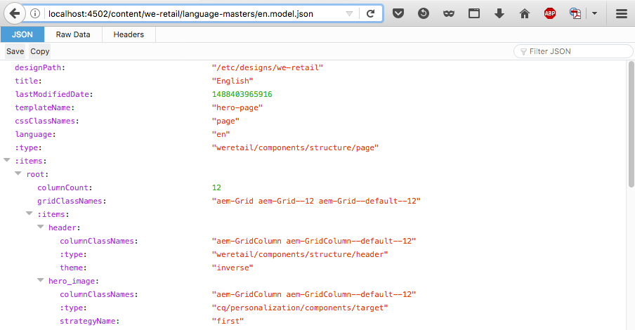

# Exportador JSON para serviços de conteúdo{#json-exporter-for-content-services}

Os serviços de conteúdo do AEM foram criados para generalizar a descrição e o delivery do conteúdo de/para o AEM, além do foco nas páginas da Web.

Eles fornecem o delivery do conteúdo para canais que não são páginas da Web tradicionais do AEM, usando métodos padronizados que podem ser consumidos por qualquer cliente. Esses canais podem incluir:

* [Aplicativos de página única](spa-walkthrough.md)
* Aplicativos móveis nativos
* outros canais e pontos de contato externos ao AEM

Com fragmentos de conteúdo que usam conteúdo estruturado, você pode fornecer serviços de conteúdo usando o exportador JSON para fornecer o conteúdo de uma página AEM (y) no formato de modelo de dados JSON. Isso pode ser consumido por seus próprios aplicativos.

>[!NOTE]
>
>A funcionalidade descrita aqui está disponível para todos os Componentes principais desde a [versão 1.1.0 dos Componentes](https://docs.adobe.com/content/docs/en/core-components/v1.html)principais.

## Exportador JSON com componentes principais do fragmento de conteúdo {#json-exporter-with-content-fragment-core-components}

Usando o exportador JSON AEM, você pode fornecer o conteúdo de uma página AEM (y) no formato de modelo de dados JSON. Isso pode ser consumido por seus próprios aplicativos.

No AEM, o delivery é obtido usando o seletor `model` e a `.json` extensão.

`.model.json`

1. Por exemplo, um URL como:

   ```shell
   http://localhost:4502/content/we-retail/language-masters/en.model.json
   ```

1. Fornecerá conteúdo como:

   

Como alternativa, é possível fornecer o conteúdo de um fragmento de conteúdo estruturado, direcionando-o especificamente.

Isso é feito usando todo o caminho até o fragmento (por meio do `jcr:content`); por exemplo, com um sufixo como.

`.../jcr:content/root/responsivegrid/contentfragment.model.json`

Sua página pode conter um único fragmento de conteúdo ou vários componentes de vários tipos. Você também pode usar mecanismos como componentes de lista para pesquisar automaticamente o conteúdo relevante.

* Por exemplo, um URL como:

   ```shell
   http://localhost:4502/content/we-retail/language-masters/en/manchester-airport/jcr:content/root/responsivegrid/contentfragment.model.json
   ```

* Fornecerá conteúdo como:

   

   >[!NOTE]
   >
   >Você pode [adaptar seus próprios componentes](/help/sites-developing/json-exporter-components.md) para acessar e usar esses dados.

   >[!NOTE]
   >
   >Embora não seja uma implementação padrão, há suporte para [vários seletores,](json-exporter-components.md#multiple-selectors) mas eles `model` devem ser os primeiros.

### Informações adicionais {#further-information}

Consulte também:

* API HTTP de ativos

   * [API HTTP de ativos](/help/assets/mac-api-assets.md)

* Modelos Sling:

   * [Modelos Sling - Associando uma classe de modelo a um tipo de recurso desde 130](https://sling.apache.org/documentation/bundles/models.html#associating-a-model-class-with-a-resource-type-since-130)

* AEM com JSON:

   * [Obter informações da página no formato JSON](/help/sites-developing/pageinfo.md)

## Related Documentation {#related-documentation}

Para mais informações, consulte:

* O tópico Fragmentos [de conteúdo no guia do usuário Ativos](https://helpx.adobe.com/experience-manager/6-4/assets/user-guide.html?topic=/experience-manager/6-4/assets/morehelp/content-fragments.ug.js)

* [Modelos de fragmentos do conteúdo](/help/assets/content-fragments-models.md)
* [Criação com fragmentos de conteúdo](/help/sites-authoring/content-fragments.md)
* [Ativando a exportação JSON para um componente](/help/sites-developing/json-exporter-components.md)

* [Componentes](https://docs.adobe.com/content/help/br/experience-manager-core-components/using/introduction.html) principais e o componente Fragmento [do conteúdo](https://helpx.adobe.com/experience-manager/core-components/using/content-fragment-component.html)

