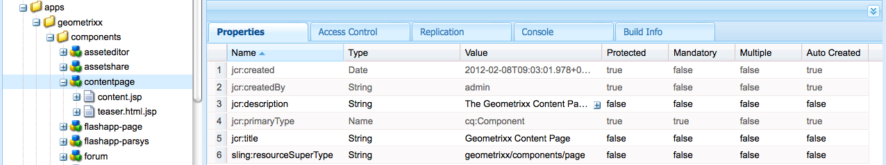

# Modelos de página - Estáticos{#page-templates-static}

Um Modelo é usado para criar uma Página e define quais componentes podem ser usados dentro do escopo selecionado. Um modelo é uma hierarquia de nós que tem a mesma estrutura da página a ser criada, mas sem nenhum conteúdo real.

Cada modelo apresenta uma seleção de componentes disponíveis para uso.

* Modelos são compilados de [Componentes](/help/sites-developing/components.md);
* Os componentes usam e permitem acesso a Widgets e eles são usados para renderizar o Conteúdo.

>[!NOTE]
>
>[Modelos editáveis](/help/sites-developing/page-templates-editable.md) também estão disponíveis e são o tipo recomendado de modelos para maior flexibilidade e os recursos mais recentes.

## Propriedades e nós filhos de um modelo {#properties-and-child-nodes-of-a-template}

Um modelo é um nó do tipo cq:Template e tem as seguintes propriedades e nós filhos:

<table>
 <tbody>
  <tr>
   <td><strong>Nome   </strong></td>
   <td><strong>Tipo   </strong></td>
   <td><strong>Descrição   </strong></td>
  </tr>
  <tr>
   <td>.   </td>
   <td> cq:Template</td>
   <td>Modelo atual. Um modelo é do tipo de nó cq:Template.  </td>
  </tr>
  <tr>
   <td> allowedChildren </td>
   <td> String[]</td>
   <td>Caminho de um modelo que tem permissão para ser um filho deste modelo.  </td>
  </tr>
  <tr>
   <td> allowedParents</td>
   <td> String[]</td>
   <td>Caminho de um modelo que tem permissão para ser um pai deste modelo.  </td>
  </tr>
  <tr>
   <td> allowedPaths</td>
   <td> String[]</td>
   <td>Caminho de uma página que pode ser baseada neste modelo.  </td>
  </tr>
  <tr>
   <td> jcr:created</td>
   <td> Data</td>
   <td>Data de criação do modelo.  </td>
  </tr>
  <tr>
   <td> jcr:description</td>
   <td> String</td>
   <td>Descrição do modelo.  </td>
  </tr>
  <tr>
   <td> jcr:title</td>
   <td> String</td>
   <td>Título do modelo.  </td>
  </tr>
  <tr>
   <td> classificação</td>
   <td> Longo</td>
   <td>Classificação do modelo. Usado para exibir o modelo na Interface do Usuário.  </td>
  </tr>
  <tr>
   <td> jcr:content</td>
   <td> cq:PageContent</td>
   <td>Nó que contém o conteúdo do modelo.  </td>
  </tr>
  <tr>
   <td> thumbnail.png</td>
   <td> nt:arquivo</td>
   <td>Miniatura do modelo.  </td>
  </tr>
  <tr>
   <td> icon.png</td>
   <td> nt:arquivo</td>
   <td>Ícone do modelo.  </td>
  </tr>
 </tbody>
</table>

Um modelo é a base de uma página.

Para criar uma página, o modelo deve ser copiado (árvore de nó `/apps/<myapp>/template/<mytemplate>`) para a posição correspondente na árvore do site: isso é o que acontece se uma página é criada usando a guia **Sites**.

Essa ação de cópia também fornece à página seu conteúdo inicial (geralmente, Conteúdo de nível superior somente) e a propriedade sling:resourceType, o caminho para o componente de página usado para renderizar a página (tudo no nó filho jcr:content).

## Como os modelos são estruturados {#how-templates-are-structured}

Há dois aspectos a considerar:

* a estrutura do próprio modelo
* a estrutura do conteúdo produzido quando um template é usado

### A estrutura de um modelo {#the-structure-of-a-template}

Um Modelo foi criado em um nó do tipo **cq:Template**.

Várias propriedades podem ser definidas, em particular:

* **jcr:title** - título do modelo; aparece na caixa de diálogo ao criar uma página.
* **jcr:description** - descrição do modelo; aparece na caixa de diálogo ao criar uma página.

Este nó contém um nó jcr:content (cq:PageContent) que é usado como base para o nó de conteúdo das páginas resultantes; faz referência, usando sling:resourceType, ao componente a ser usado para renderizar o conteúdo real de uma nova página.

Esse componente é usado para definir a estrutura e o design do conteúdo quando uma nova página é criada.

### O conteúdo produzido por um Template {#the-content-produced-by-a-template}

Os modelos são usados para criar páginas do tipo `cq:Page` (como mencionado anteriormente, uma página é um tipo especial de componente). Cada página AEM tem um nó estruturado `jcr:content`. Isto:

* é do tipo cq:PageContent
* é um nó estruturado-tipo que contém uma definição de conteúdo definida
* tem uma propriedade `sling:resourceType` para referenciar o componente que contém os scripts sling usados para renderizar o conteúdo

### Modelos padrão {#default-templates}

O AEM vem com vários modelos padrão disponíveis imediatamente. Às vezes, você pode querer usar os modelos como estão. Nesse caso, você deve garantir que o modelo esteja disponível para o seu site.

Por exemplo, o AEM vem com vários modelos, incluindo uma página de conteúdo e uma página inicial.

| **Título** | **Componente** | **Local** | **Finalidade** |
|---|---|---|---|
| Página inicial | homepage | geometrixx | O modelo da página inicial do Geometrixx. |
| Página de conteúdo | contentpage | geometrixx | O modelo da página de conteúdo do Geometrixx. |

#### Exibição de Modelos Padrão {#displaying-default-templates}

Para ver uma lista de todos os modelos no repositório, proceda da seguinte maneira:

1. No CRXDE Lite, abra o menu **Ferramentas** e clique em **Consulta**.

1. Na guia Query
1. Como **Tipo**, selecione **XPath**.

1. No campo de entrada **Consulta**, digite a seguinte cadeia de caracteres:
//element(&#42;, cq:Template)

1. Clique em **Executar**. A lista é exibida na caixa de resultados.

Normalmente, você pega um modelo existente e desenvolve um novo para uso próprio. Consulte [Desenvolvendo modelos de página](#developing-page-templates) para obter mais informações.

Para habilitar um modelo existente para o seu site e exibi-lo na caixa de diálogo **Criar Página** ao criar uma página diretamente em **Sites** a partir do console **Sites**, defina a propriedade allowedPaths do nó de modelo como: **/content(/.&#42;)?**

## Como os designs de modelo são aplicados {#how-template-designs-are-applied}

Quando os estilos são definidos na interface do usuário usando o [Modo de Design](/help/sites-authoring/default-components-designmode.md), o design é mantido no caminho exato do nó de conteúdo para o qual o estilo está sendo definido.

>[!CAUTION]
>
>A Adobe recomenda aplicar somente designs ao [Modo de Design](/help/sites-authoring/default-components-designmode.md).
>
>A modificação de designs no CRXDE Lite, por exemplo, não é uma prática recomendada e a aplicação de tais designs pode variar do comportamento esperado.

Se os designs forem aplicados usando apenas o Modo de Design, as seguintes seções: [Resolução do Caminho de Design](/help/sites-developing/page-templates-static.md#design-path-resolution), [Árvore de Decisão](/help/sites-developing/page-templates-static.md#decision-tree) e [Exemplo](/help/sites-developing/page-templates-static.md#example) não serão aplicáveis.

### Resolução do caminho de design {#design-path-resolution}

Ao renderizar o conteúdo com base em um modelo estático, o AEM tenta aplicar o design e os estilos mais relevantes ao conteúdo com base em uma passagem da hierarquia de conteúdo.

O AEM determina o estilo mais relevante para um nó de conteúdo na seguinte ordem:

* Se houver um design para o caminho completo e exato do nó de conteúdo (como quando o design é definido no Modo de design), use esse design.
* Se houver um design para o nó de conteúdo do pai, use esse design.
* Se houver um design para qualquer nó no caminho do nó de conteúdo, use esse design.

Nos dois últimos casos, se houver mais de um design aplicável, use o mais próximo do nó de conteúdo.

### Árvore de decisão {#decision-tree}

Esta é uma representação gráfica da lógica de [Resolução do Caminho de Design](/help/sites-developing/page-templates-static.md#design-path-resolution).

### Exemplo {#example}

Considere uma estrutura de conteúdo simples, como a seguir, em que um design pode ser aplicado a qualquer um dos nós:

`/root/branch/leaf`

A tabela a seguir descreve como o AEM escolhe um design.

<table>
 <tbody>
  <tr>
   <td><strong>Localizando design para  </strong></td>
   <td><strong>Existem Designs Para  </strong></td>
   <td><strong>Design escolhido  </strong></td>
   <td><strong>Comentar</strong></td>
  </tr>
  <tr>
   <td><code class="code">leaf
      </code></td>
   <td>
<code>root</code>
 
<code>branch</code>
 
<code>leaf</code>
 </td>
   <td><code>leaf</code></td>
   <td>A correspondência mais exata sempre é feita.  </td>
  </tr>
  <tr>
   <td><code>leaf</code></td>
   <td>
<code>root</code>
 
<code>branch</code>
 </td>
   <td><code>branch</code></td>
   <td>Volte para a correspondência mais próxima mais abaixo na árvore.</td>
  </tr>
  <tr>
   <td><code>leaf</code></td>
   <td><code>root</code></td>
   <td><code>root</code></td>
   <td>Se tudo mais falhar, pegue o que resta.  </td>
  </tr>
  <tr>
   <td><code>branch</code></td>
   <td><code>branch</code></td>
   <td><code>branch</code></td>
   <td> </td>
  </tr>
  <tr>
   <td><code>branch</code></td>
   <td>
<code>branch</code>
 
<code class="code">leaf
       </code>
 </td>
   <td><code>branch</code></td>
   <td> </td>
  </tr>
  <tr>
   <td><code>branch</code></td>
   <td>
<code>root</code>
 
<code class="code">branch
       </code>
 </td>
   <td><code>branch</code></td>
   <td> </td>
  </tr>
  <tr>
   <td><code>branch</code></td>
   <td>
<code>root</code>
 
<code class="code">leaf
       </code>
 </td>
   <td><code>root</code></td>
   <td>
Se não houver uma correspondência exata, use a inferior na árvore.
 
A suposição é que isso sempre será aplicável, mas um nível mais alto da árvore pode ser muito específico.  
 </td>
  </tr>
 </tbody>
</table>

## Desenvolvimento de modelos de página {#developing-page-templates}

Modelos de página AEM são simplesmente modelos usados para criar páginas. Eles podem conter pouco ou tanto conteúdo inicial quanto necessário, sendo sua função criar as estruturas de nó iniciais corretas, com as propriedades necessárias (principalmente sling:resourceType) definidas para permitir edição e renderização.

### Criação de um modelo (com base em um modelo existente) {#creating-a-new-template-based-on-an-existing-template}

Um novo modelo pode ser criado completamente do zero, mas geralmente um modelo existente é copiado e atualizado para economizar seu tempo e esforço. Por exemplo, os templates no Geometrixx podem ser usados para começar.

Para criar um modelo com base em um modelo existente:

1. Copie um template existente (de preferência com uma definição o mais próximo possível do que você deseja alcançar) em um novo nó.

   Os modelos são armazenados em **/apps/&lt;nome-do-site>/templates/&lt;nome-do-modelo>**.

   >[!NOTE]
   >
   >A lista de modelos disponíveis depende do local da nova página e das restrições de posicionamento especificadas em cada modelo. Consulte [Disponibilidade de Modelo](#templateavailibility).

1. Altere o **jcr:title** do novo nó de modelo para refletir sua nova função. Você também pode atualizar a **jcr:description**, se apropriado. Altere a disponibilidade do modelo da página, conforme apropriado.

   >[!NOTE]
   >
   >Se você quiser que seu modelo seja exibido na caixa de diálogo **Criar Página** ao criar uma página diretamente em **Sites** do console **Sites**, defina a propriedade `allowedPaths` do nó de modelo como: `/content(/.*)?`

   

1. Copie o componente no qual o modelo é baseado (isso é indicado pela propriedade **sling:resourceType** do nó **jcr:content** no modelo) para criar uma instância.

   Os componentes são armazenados em **/apps/&lt;nome-do-site>/components/&lt;nome-do-componente>**.

1. Atualize a **jcr:title** e a **jcr:description** do novo componente.
1. Substitua thumbnail.png se desejar que uma nova imagem em miniatura seja mostrada na lista de seleção do modelo (tamanho 128 x 98 px).
1. Atualize o **sling:resourceType** do nó **jcr:content** do modelo para fazer referência ao novo componente.
1. Faça alterações adicionais na funcionalidade ou no design do modelo, no componente subjacente ou em ambos.

   >[!NOTE]
   >
   >As alterações feitas no nó **/apps/&lt;site>/templates/&lt;nome-modelo>** afetam a instância do modelo (como na lista de seleção).
   >
   >
   As alterações feitas no nó **/apps/&lt;site>/components/&lt;nome-do-componente>** afetam a página de conteúdo criada quando o modelo é usado.

   Agora você pode criar uma página em seu site usando o novo modelo.

>[!NOTE]
>
A biblioteca cliente do editor presume a presença do namespace `cq.shared` nas páginas de conteúdo e, se estiver ausente, o erro de JavaScript `Uncaught TypeError: Cannot read property 'shared' of undefined` ocorrerá.
>
Todas as páginas de conteúdo de exemplo contêm `cq.shared`, portanto, qualquer conteúdo baseado nelas inclui automaticamente `cq.shared`. No entanto, se você decidir criar suas próprias páginas de conteúdo do zero sem baseá-las no conteúdo de exemplo, certifique-se de incluir o namespace `cq.shared`.
>
Consulte [Usando bibliotecas do lado do cliente](/help/sites-developing/clientlibs.md) para obter mais informações.

## Disponibilizar um modelo existente {#making-an-existing-template-available}

Este exemplo ilustra como permitir que um modelo seja usado para determinados caminhos de conteúdo. Os modelos disponíveis para o autor da página ao criar páginas são determinados pela lógica definida em [Disponibilidade de Modelo](/help/sites-developing/templates.md#template-availability).

1. No CRXDE Lite, navegue até o modelo que deseja usar para a página, por exemplo, o modelo Boletim informativo.
1. Altere a propriedade `allowedPaths` e outras propriedades usadas para [disponibilidade de modelo](/help/sites-developing/templates.md#template-availability). Por exemplo, `allowedPaths`: `/content/geometrixx-outdoors/[^/]+(/.*)?` significa que este modelo é permitido em qualquer caminho sob `/content/geometrixx-outdoors`.

   
