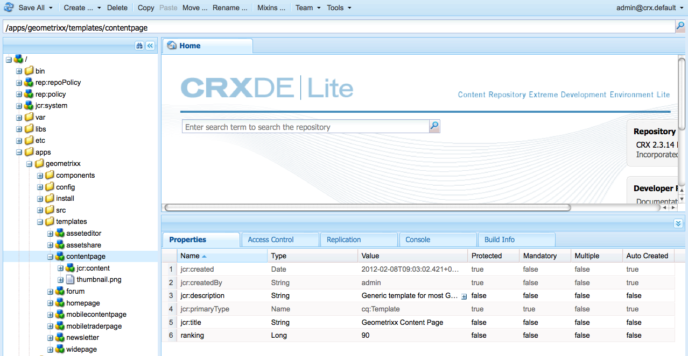

# Modelos de página - Estático{#page-templates-static}

Um Modelo é usado para criar uma Página e define quais componentes podem ser usados dentro do escopo selecionado. Um modelo é uma hierarquia de nós que tem a mesma estrutura que a página a ser criada, mas sem nenhum conteúdo real.

Cada modelo apresentará a você uma seleção de componentes disponíveis para uso.

* Os modelos são criados de [Componentes](/help/sites-developing/components.md);
* Os componentes usam e permitem acesso a widgets, e eles são usados para renderizar o Conteúdo.

>[!NOTE]
>
>[Modelos editáveis](/help/sites-developing/page-templates-editable.md) também estão disponíveis e são o tipo recomendado de modelos para maior flexibilidade e os recursos mais recentes.

## Propriedades e nós secundários de um modelo {#properties-and-child-nodes-of-a-template}

Um modelo é um nó do tipo cq:Template e tem as seguintes propriedades e nós secundários:

<table>
 <tbody>
  <tr>
   <td><strong>Nome   </strong></td>
   <td><strong>Tipo   </strong></td>
   <td><strong>Descrição   </strong></td>
  </tr>
  <tr>
   <td>.   </td>
   <td> cq:Template</td>
   <td>Modelo atual. Um modelo é do tipo de nó cq:Template.  </td>
  </tr>
  <tr>
   <td> allowedChildren </td>
   <td> Sequência de caracteres[]</td>
   <td>Caminho de um modelo que pode ser filho desse modelo.  </td>
  </tr>
  <tr>
   <td> allowedParents</td>
   <td> Sequência de caracteres[]</td>
   <td>Caminho de um modelo que pode ser um pai desse modelo.  </td>
  </tr>
  <tr>
   <td> allowedPaths</td>
   <td> Sequência de caracteres[]</td>
   <td>Caminho de uma página que pode ser baseada neste modelo.  </td>
  </tr>
  <tr>
   <td> jcr:created</td>
   <td> Data</td>
   <td>Data de criação do template.  </td>
  </tr>
  <tr>
   <td> jcr:description</td>
   <td> Sequência de caracteres</td>
   <td>Descrição do modelo.  </td>
  </tr>
  <tr>
   <td> jcr:title</td>
   <td> Sequência de caracteres</td>
   <td>Título do modelo.  </td>
  </tr>
  <tr>
   <td> classificação</td>
   <td> Longo</td>
   <td>Classificação do modelo. Usado para exibir o modelo na Interface do usuário do .  </td>
  </tr>
  <tr>
   <td> jcr:content</td>
   <td> cq:PageContent</td>
   <td>Nó contendo o conteúdo do template.  </td>
  </tr>
  <tr>
   <td> thumbnail.png</td>
   <td> nt:file</td>
   <td>Miniatura do modelo.  </td>
  </tr>
  <tr>
   <td> icon.png</td>
   <td> nt:file</td>
   <td>Ícone do modelo.  </td>
  </tr>
 </tbody>
</table>

Um modelo é a base de uma página.

Para criar uma página, o modelo deve ser copiado (árvore de nó) `/apps/<myapp>/template/<mytemplate>`) para a posição correspondente na árvore do site: isso é o que acontece se uma página é criada usando o **Sites** guia .

Essa ação de cópia também fornece à página o conteúdo inicial (geralmente somente Conteúdo de nível superior) e a propriedade sling:resourceType, o caminho para o componente de página que é usado para renderizar a página (tudo no nó filho jcr:content).

## Como os Modelos são estruturados {#how-templates-are-structured}

Há dois aspectos a considerar:

* a estrutura do próprio modelo
* a estrutura do conteúdo produzido quando um modelo é usado

### A estrutura de um modelo {#the-structure-of-a-template}

Um Modelo é criado em um nó do tipo **cq:Template**.

Várias propriedades podem ser definidas, em particular:

* **jcr:title** - título do modelo; aparece na caixa de diálogo ao criar uma página.
* **jcr:description** - descrição do modelo; aparece na caixa de diálogo ao criar uma página.

Esse nó contém um nó jcr:content (cq:PageContent) que pode ser usado como a base para o nó de conteúdo das páginas resultantes; isso faz referência, usando sling:resourceType, ao componente a ser usado para renderizar o conteúdo real de uma nova página.

Esse componente é usado para definir a estrutura e o design do conteúdo quando uma nova página é criada.

### O conteúdo produzido por um Modelo {#the-content-produced-by-a-template}

Os modelos são usados para criar páginas do tipo `cq:Page` (como mencionado anteriormente, uma página é um tipo especial de componente). Cada Página AEM tem um nó estruturado `jcr:content`. Isso:

* é do tipo cq:PageContent
* é um tipo de nó estruturado com uma definição de conteúdo definida
* tem uma propriedade `sling:resourceType` para fazer referência ao componente que contém os scripts sling usados para renderizar o conteúdo

### Modelos padrão {#default-templates}

AEM vem com vários templates padrão disponíveis para uso imediato. Em alguns casos, convém usar os modelos como estão. Nesse caso, é necessário garantir que o modelo esteja disponível para seu site.

Por exemplo, AEM vem com vários modelos, incluindo uma página de conteúdo e uma página inicial.

| **Título** | **Componente** | **Local** | **Propósito** |
|---|---|---|---|
| Página Inicial | homepage | geometrixx | O modelo da página inicial do Geometrixx. |
| Página de conteúdo | contentpage | geometrixx | O modelo da página de conteúdo do Geometrixx. |

#### Exibição de modelos padrão {#displaying-default-templates}

Para ver uma lista de todos os modelos no repositório, proceda da seguinte maneira:

1. No CRXDE Lite, abra o **Ferramentas** e clique em **Query**.

1. Na guia Query
1. As **Tipo**, selecione **XPath**.

1. No **Query** campo de entrada, digite a seguinte string: //element(&#42;, cq:Template)

1. Clique em **Executar**. A lista é exibida na caixa de resultados.

Na maioria dos casos, você pega um template existente e desenvolve um novo para seu próprio uso. Consulte [Desenvolvendo modelos de página](#developing-page-templates) para obter mais informações.

Para habilitar um modelo existente para o seu site e deseja que ele seja exibido na **Criar página** ao criar uma página diretamente em **Sites** do **Sites** no console, defina a propriedade allowedPaths do nó do modelo para: **/content(/.&#42;)?**

## Como os designs de modelo são aplicados {#how-template-designs-are-applied}

Quando os estilos são definidos na interface do usuário usando [Modo Design](/help/sites-authoring/default-components-designmode.md), o design é mantido no caminho exato do nó de conteúdo para o qual o estilo está sendo definido.

>[!CAUTION]
>
>O Adobe recomenda aplicar somente designs por meio de [Modo Design](/help/sites-authoring/default-components-designmode.md).
>
>A modificação de designs no CRX DE por exemplo não uma prática recomendada e a aplicação desses designs pode variar do comportamento esperado.

Se os designs forem aplicados apenas usando o Modo Design, as seguintes seções: [Resolução do Caminho de Design](/help/sites-developing/page-templates-static.md#design-path-resolution), [Árvore de decisão](/help/sites-developing/page-templates-static.md#decision-tree)e o [Exemplo](/help/sites-developing/page-templates-static.md#example) não são aplicáveis.

### Resolução do Caminho de Design {#design-path-resolution}

Ao renderizar o conteúdo com base em um template estático, o AEM tentará aplicar o design e os estilos mais relevantes ao conteúdo com base em uma travessia da hierarquia de conteúdo.

AEM determina o estilo mais relevante para um nó de conteúdo na seguinte ordem:

* Se houver um design para o caminho completo e exato do nó de conteúdo (como quando o design é definido no Modo de design), use esse design.
* Se houver um design para o nó de conteúdo do pai, use esse design.
* Se houver um design para qualquer nó no caminho do nó de conteúdo, use esse design.

Nos últimos dois casos, se houver mais de um design aplicável, use o mais próximo do nó de conteúdo.

### Árvore de decisão {#decision-tree}

Essa é uma representação gráfica da variável [Resolução do Caminho de Design](/help/sites-developing/page-templates-static.md#design-path-resolution) lógica.

### Exemplo {#example}

Considere uma estrutura de conteúdo simples da seguinte maneira, onde um design pode se aplicar a qualquer um dos nós:

`/root/branch/leaf`

A tabela a seguir descreve como o AEM escolherá um design.

<table>
 <tbody>
  <tr>
   <td><strong>Encontrar Design Para  </strong></td>
   <td><strong>Existem Designs Para  </strong></td>
   <td><strong>Design Escolhido  </strong></td>
   <td><strong>Comentar</strong></td>
  </tr>
  <tr>
   <td><code class="code">leaf
      </code></td>
   <td>
<code>root</code>
 
<code>branch</code>
 
<code>leaf</code>
 </td>
   <td><code>leaf</code></td>
   <td>A correspondência mais exata é sempre feita.  </td>
  </tr>
  <tr>
   <td><code>leaf</code></td>
   <td>
<code>root</code>
 
<code>branch</code>
 </td>
   <td><code>branch</code></td>
   <td>Volte para a correspondência mais próxima abaixo da árvore.</td>
  </tr>
  <tr>
   <td><code>leaf</code></td>
   <td><code>root</code></td>
   <td><code>root</code></td>
   <td>Se tudo o resto falhar, veja o que resta.  </td>
  </tr>
  <tr>
   <td><code>branch</code></td>
   <td><code>branch</code></td>
   <td><code>branch</code></td>
   <td> </td>
  </tr>
  <tr>
   <td><code>branch</code></td>
   <td>
<code>branch</code>
 
<code class="code">leaf
       </code>
 </td>
   <td><code>branch</code></td>
   <td> </td>
  </tr>
  <tr>
   <td><code>branch</code></td>
   <td>
<code>root</code>
 
<code class="code">branch
       </code>
 </td>
   <td><code>branch</code></td>
   <td> </td>
  </tr>
  <tr>
   <td><code>branch</code></td>
   <td>
<code>root</code>
 
<code class="code">leaf
       </code>
 </td>
   <td><code>root</code></td>
   <td>
Se não houver uma correspondência exata, use a que estiver abaixo na árvore.
 
Pressupõe-se que isso sempre será aplicável, mas mais acima da árvore pode ser muito específico.  
 </td>
  </tr>
 </tbody>
</table>

## Desenvolvendo modelos de página {#developing-page-templates}

AEM modelos de página são simplesmente modelos usados para criar novas páginas. Eles podem conter o mínimo ou o máximo necessário de conteúdo inicial, sendo que a função deles é criar as estruturas de nó iniciais corretas, com as propriedades necessárias (principalmente sling:resourceType) definidas para permitir a edição e renderização.

### Criação de um novo modelo (com base em um modelo existente) {#creating-a-new-template-based-on-an-existing-template}

Escusado será dizer que um novo modelo pode ser criado completamente do zero, mas geralmente um modelo existente será copiado e atualizado para poupar tempo e esforço. Por exemplo, os modelos no Geometrixx podem ser usados para começar.

Para criar um novo template baseado em um template existente:

1. Copie um template existente (de preferência, com uma definição o mais próxima possível do que você deseja alcançar) em um novo nó.

   Normalmente, os modelos são armazenados em **/apps/&lt;website-name>/templates/&lt;template-name>**.

   >[!NOTE]
   >
   >A lista de modelos disponíveis depende do local da nova página e das restrições de posicionamento especificadas em cada modelo. Consulte [Disponibilidade do modelo](#templateavailibility).

1. Altere o **jcr:title** do novo nó template para refletir sua nova função. Você também pode atualizar o **jcr:description** se for caso disso. Certifique-se de alterar a disponibilidade do modelo da página, conforme apropriado.

   >[!NOTE]
   >
   >Se desejar que seu modelo seja exibido na variável **Criar página** ao criar uma página diretamente em **Sites** do **Sites** , defina o `allowedPaths` propriedade do nó do modelo para: `/content(/.*)?`

   

1. Copie o componente no qual o modelo se baseia (isso é indicado pela variável **sling:resourceType** da **jcr:content** no modelo ) para criar uma nova instância.

   Os componentes geralmente são armazenados em **/apps/&lt;website-name>/componentes/&lt;component-name>**.

1. Atualize o **jcr:title** e **jcr:description** do novo componente.
1. Substitua thumbnail.png se quiser que uma nova imagem em miniatura seja mostrada na lista de seleção do modelo (tamanho 128 x 98 px).
1. Atualize o **sling:resourceType** do modelo **jcr:content** para fazer referência ao novo componente.
1. Faça outras alterações na funcionalidade ou no design do modelo e/ou seu componente subjacente.

   >[!NOTE]
   >
   >Alterações feitas na **/apps/&lt;website>/templates/&lt;template-name>** afetará a instância do template (como na lista de seleção).
   Alterações feitas na **/apps/&lt;website>/componentes/&lt;component-name>** afetará a página de conteúdo criada quando o modelo for usado.

   Agora é possível criar uma página no seu site usando o novo modelo.

>[!NOTE]
A biblioteca cliente do editor assume a presença do `cq.shared` namespace nas páginas de conteúdo e se estiver ausente do erro de JavaScript `Uncaught TypeError: Cannot read property 'shared' of undefined` resultará em .
Todas as páginas de conteúdo de exemplo contêm `cq.shared`, portanto, qualquer conteúdo baseado neles inclui automaticamente `cq.shared`. No entanto, se você decidir criar suas próprias páginas de conteúdo do zero sem basear-nas no conteúdo de amostra, deverá incluir a variável `cq.shared` namespace.
Consulte [Usar bibliotecas do lado do cliente](/help/sites-developing/clientlibs.md) para obter mais informações.

## Disponibilizar um modelo existente {#making-an-existing-template-available}

Este exemplo ilustra como permitir que um modelo seja usado para determinados caminhos de conteúdo. Os modelos que estão disponíveis para o autor da página ao criar novas páginas são determinados pela lógica definida em [Disponibilidade do modelo](/help/sites-developing/templates.md#template-availability).

1. No CRXDE Lite, navegue até o modelo que deseja usar para a página, por exemplo, o modelo Informativo.
1. Altere o `allowedPaths` propriedade e outras propriedades usadas para [disponibilidade do modelo](/help/sites-developing/templates.md#template-availability). Por exemplo, `allowedPaths`: `/content/geometrixx-outdoors/[^/]+(/.*)?` significa que este modelo é permitido em qualquer caminho em `/content/geometrixx-outdoors`.

   
