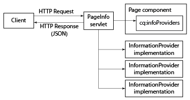

# Obter informações da página no formato JSON{#obtaining-page-information-in-json-format}

Para obter as informações da página, envie uma solicitação ao servlet PageInfo para obter os metadados da página no formato JSON.

O servlet PageInfo retorna informações sobre recursos no repositório. O servlet está vinculado ao URL `https://<server>:<port>/libs/wcm/core/content/pageinfo.json` e usa o parâmetro `path` para identificar o recurso. O URL de exemplo a seguir retorna informações sobre o nó `/content/we-retail/us/en`:

```shell
http://localhost:4502/libs/wcm/core/content/pageinfo.json?path=/content/we-retail/us/en
```

>[!NOTE]
>
>Se você precisar de informações de página no formato JSON para fornecer o delivery do conteúdo a canais que não são tradicionais AEM páginas da Web, como:
>
>* Aplicativos de página única
>* Aplicativos móveis nativos
>* Outros canais e pontos de contato externos ao AEM

>
>
Consulte o documento [Exportador JSON para Content Services](/help/sites-developing/json-exporter.md).

## Provedores de Informações da Página {#page-information-providers}

Os componentes da página podem ser associados a um ou mais serviços `com.day.cq.wcm.api.PageInfoProvider` que geram metadados da página. O servlet PageInfo chama cada serviço PageInfoProvider e agregação os metadados:

1. O cliente HTTP envia uma solicitação para o servlet PageInfo, que inclui o URL da página.
1. O servlet PageInfo descobre qual componente renderiza a página.
1. O servlet PageInfo chama cada PageInfoProvider associado ao componente.
1. O servlet agregação os metadados que cada PageInfoProvider retorna e adiciona os metadados à resposta HTTP em um objeto JSON.



>[!NOTE]
>
>Semelhante a PageInfoProviders, use ListInfoProviders para atualizar listas de informações no formato JSON. (Consulte [Personalizando o Console de Administração de Sites](/help/sites-developing/customizing-siteadmin.md).)

## Provedores de Informações de Página Padrão {#default-page-information-providers}

O componente `/libs/foundation/components/page` está associado aos seguintes serviços PageInfoProvider:

* **Provedor de status de página padrão:** informações sobre o status da página, como se ela está bloqueada, se a página é a carga de um fluxo de trabalho ativo e quais workflows estão disponíveis para a página.
* **Provedor de Informações de Relacionamento ao Vivo:** informações sobre o Gerenciamento de Vários Sites (MSM), como se a página faz parte de uma Impressão Azul e se é uma Cópia ao Vivo.
* **Servlet de Idioma de Conteúdo:** O idioma da página atual e as informações sobre cada idioma no qual a página está disponível.
* **Provedor de status do fluxo de trabalho:informações** de status sobre o fluxo de trabalho em execução que tem a página como uma carga.
* **Provedor de informações do pacote de fluxo de trabalho:** informações sobre cada pacote de fluxo de trabalho armazenado no repositório e se cada pacote contém o recurso atual.
* **Provedor de informações do emulador:** informações sobre os emuladores de dispositivo móvel disponíveis para este recurso. Se o componente de página não renderizar páginas móveis, nenhum emulador estará disponível.
* **Provedor de informações de anotações:** informações sobre anotações que estão na página.

Por exemplo, o servlet PageInfo retorna a seguinte resposta JSON para o nó `/content/we-retail/us/en`:

```
{
   "status":{
      "path":"/content/we-retail/us/en",
      "isLocked":false,
      "lockOwner":"",
      "canUnlock":false,
      "lastModified":1467202845038,
      "lastModifiedBy":"admin",
      "timeUntilValid":0,
      "onTime":0,
      "offTime":0,
      "replication":{
         "numQueued":0
      },
      "isDesignable":true,
      "isDeveloper":true
   },
   "isPage":true,
   "pageResourceType":"weretail/components/structure/page",
   "enableFragmentIdentifier":false,
   "workflow":{
      "isRunning":false
   },
   "workflows":{
      "wcm":{
         "models":[
            {
               "wid":"/etc/workflow/models/dam/adddamsize/jcr:content/model",
               "label":"Add Asset Size",
               "label_xss":"Add Asset Size"
            },
            {
               "wid":"/etc/workflow/models/ac-newsletter-workflow-simple/jcr:content/model",
               "label":"Approve for Adobe Campaign",
               "label_xss":"Approve for Adobe Campaign"
            },
            {
               "wid":"/etc/workflow/models/dam/dam-autotag-assets/jcr:content/model",
               "label":"DAM Smart Tag Assets",
               "label_xss":"DAM Smart Tag Assets"
            },
            {
               "wid":"/etc/workflow/models/dam/update_asset/jcr:content/model",
               "label":"DAM Update Asset",
               "label_xss":"DAM Update Asset"
            },
            {
               "wid":"/etc/workflow/models/cloudservices/DTM_bundle_download/jcr:content/model",
               "label":"Default DTM Bundle Download",
               "label_xss":"Default DTM Bundle Download"
            },
            {
               "wid":"/etc/workflow/models/dam/dam_download_asset/jcr:content/model",
               "label":"Download Asset",
               "label_xss":"Download Asset"
            },
            {
               "wid":"/etc/workflow/models/dam/dynamic-media-video-thumbnail-replacement/jcr:content/model",
               "label":"Dynamic Media Video Thumbnail Replacement",
               "label_xss":"Dynamic Media Video Thumbnail Replacement"
            },
            {
               "wid":"/etc/workflow/models/dam/dynamic-media-video-user-uploaded-thumbnail/jcr:content/model",
               "label":"Dynamic Media Video User Uploaded Thumbnail Process",
               "label_xss":"Dynamic Media Video User Uploaded Thumbnail Process"
            },
            {
               "wid":"/etc/workflow/models/projects/approval_workflow/jcr:content/model",
               "label":"Project Approval Workflow",
               "label_xss":"Project Approval Workflow"
            },
            {
               "wid":"/etc/workflow/models/publish_example/jcr:content/model",
               "label":"Publish Example",
               "label_xss":"Publish Example"
            },
            {
               "wid":"/etc/workflow/models/publish_to_campaign/jcr:content/model",
               "label":"Publish to Adobe Campaign",
               "label_xss":"Publish to Adobe Campaign"
            },
            {
               "wid":"/etc/workflow/models/s7dam/request_to_publish_to_youtube/jcr:content/model",
               "label":"Publish to YouTube",
               "label_xss":"Publish to YouTube"
            },
            {
               "wid":"/etc/workflow/models/projects/request_copy/jcr:content/model",
               "label":"Request Copy",
               "label_xss":"Request Copy"
            },
            {
               "wid":"/etc/workflow/models/request_for_activation/jcr:content/model",
               "label":"Request for Activation",
               "label_xss":"Request for Activation"
            },
            {
               "wid":"/etc/workflow/models/request_for_deactivation/jcr:content/model",
               "label":"Request for Deactivation",
               "label_xss":"Request for Deactivation"
            },
            {
               "wid":"/etc/workflow/models/request_for_deletion/jcr:content/model",
               "label":"Request for Deletion",
               "label_xss":"Request for Deletion"
            },
            {
               "wid":"/etc/workflow/models/request_to_complete_move_operation/jcr:content/model",
               "label":"Request to complete Move operation",
               "label_xss":"Request to complete Move operation"
            },
            {
               "wid":"/etc/workflow/models/screens-update-asset/jcr:content/model",
               "label":"Screens Update Asset",
               "label_xss":"Screens Update Asset"
            },
            {
               "wid":"/etc/workflow/models/s7dam/request_to_remove_from_youtube/jcr:content/model",
               "label":"Unpublish from YouTube",
               "label_xss":"Unpublish from YouTube"
            },
            {
               "wid":"/etc/workflow/models/wcm-translation/create_language_copy/jcr:content/model",
               "label":"WCM: Create Language Copy",
               "label_xss":"WCM: Create Language Copy"
            },
            {
               "wid":"/etc/workflow/models/wcm-translation/prepare_translation_project/jcr:content/model",
               "label":"WCM: Prepare Translation Project",
               "label_xss":"WCM: Prepare Translation Project"
            },
            {
               "wid":"/etc/workflow/models/wcm-translation/translate-i18n-dictionary/jcr:content/model",
               "label":"WCM: Prepare and Translate I18n-Dictionary",
               "label_xss":"WCM: Prepare and Translate I18n-Dictionary"
            },
            {
               "wid":"/etc/workflow/models/wcm-translation/sync_translation_job/jcr:content/model",
               "label":"WCM: Sync Translation Job",
               "label_xss":"WCM: Sync Translation Job"
            },
            {
               "wid":"/etc/workflow/models/wcm-translation/update_language_copy/jcr:content/model",
               "label":"WCM: Update Language Copy",
               "label_xss":"WCM: Update Language Copy"
            }
         ]
      },
      "translation":{
         "models":[
            {
               "wid":"/etc/workflow/models/dam/adddamsize/jcr:content/model",
               "label":"Add Asset Size",
               "label_xss":"Add Asset Size"
            },
            {
               "wid":"/etc/workflow/models/ac-newsletter-workflow-simple/jcr:content/model",
               "label":"Approve for Adobe Campaign",
               "label_xss":"Approve for Adobe Campaign"
            },
            {
               "wid":"/etc/workflow/models/dam/dam-autotag-assets/jcr:content/model",
               "label":"DAM Smart Tag Assets",
               "label_xss":"DAM Smart Tag Assets"
            },
            {
               "wid":"/etc/workflow/models/cloudservices/DTM_bundle_download/jcr:content/model",
               "label":"Default DTM Bundle Download",
               "label_xss":"Default DTM Bundle Download"
            },
            {
               "wid":"/etc/workflow/models/dam/dam_download_asset/jcr:content/model",
               "label":"Download Asset",
               "label_xss":"Download Asset"
            },
            {
               "wid":"/etc/workflow/models/dam/dynamic-media-video-thumbnail-replacement/jcr:content/model",
               "label":"Dynamic Media Video Thumbnail Replacement",
               "label_xss":"Dynamic Media Video Thumbnail Replacement"
            },
            {
               "wid":"/etc/workflow/models/dam/dynamic-media-video-user-uploaded-thumbnail/jcr:content/model",
               "label":"Dynamic Media Video User Uploaded Thumbnail Process",
               "label_xss":"Dynamic Media Video User Uploaded Thumbnail Process"
            },
            {
               "wid":"/etc/workflow/models/projects/approval_workflow/jcr:content/model",
               "label":"Project Approval Workflow",
               "label_xss":"Project Approval Workflow"
            },
            {
               "wid":"/etc/workflow/models/publish_to_campaign/jcr:content/model",
               "label":"Publish to Adobe Campaign",
               "label_xss":"Publish to Adobe Campaign"
            },
            {
               "wid":"/etc/workflow/models/s7dam/request_to_publish_to_youtube/jcr:content/model",
               "label":"Publish to YouTube",
               "label_xss":"Publish to YouTube"
            },
            {
               "wid":"/etc/workflow/models/projects/request_copy/jcr:content/model",
               "label":"Request Copy",
               "label_xss":"Request Copy"
            },
            {
               "wid":"/etc/workflow/models/request_for_deletion/jcr:content/model",
               "label":"Request for Deletion",
               "label_xss":"Request for Deletion"
            },
            {
               "wid":"/etc/workflow/models/request_to_complete_move_operation/jcr:content/model",
               "label":"Request to complete Move operation",
               "label_xss":"Request to complete Move operation"
            },
            {
               "wid":"/etc/workflow/models/screens-update-asset/jcr:content/model",
               "label":"Screens Update Asset",
               "label_xss":"Screens Update Asset"
            },
            {
               "wid":"/etc/workflow/models/translation/jcr:content/model",
               "label":"Translation Prepare",
               "label_xss":"Translation Prepare"
            },
            {
               "wid":"/etc/workflow/models/s7dam/request_to_remove_from_youtube/jcr:content/model",
               "label":"Unpublish from YouTube",
               "label_xss":"Unpublish from YouTube"
            }
         ]
      }
   },
   "translation":{

   },
   "design":{
      "path":"/conf/we-retail/settings/wcm/templates/hero-page/policies",
      "lastModified":0
   },
   "componentsRef":"/libs/wcm/core/content/components.1497341312569.json",
   "editableTemplate":"/conf/we-retail/settings/wcm/templates/hero-page",
   "msm":{
      "msm:isLiveCopy":true,
      "msm:isInBlueprint":false,
      "msm:isSource":false
   },
   "launches":{
      "isLaunch":false,
      "isInLaunch":false
   },
   "language":"en",
   "languages":{
      "rows":[
         {
            "path":"/content/we-retail/us/en",
            "exists":true,
            "hasContent":true,
            "lastModified":0,
            "iso":"en",
            "country":"gb",
            "language":"English"
         },
         {
            "path":"/content/we-retail/us/es",
            "exists":true,
            "hasContent":true,
            "lastModified":0,
            "iso":"es",
            "country":"es",
            "language":"Spanish"
         }
      ]
   },
   "workflowInfo":{
      "isRunning":false
   },
   "workflowPackageInfo":{
      "workflowPackages":[

      ],
      "selectedWorkflowPackages":[

      ],
      "runningSelectedWorkflowPackages":[

      ]
   },
   "emulators":{
      "groups":{
         "responsive":{
            "title":"Responsive Devices",
            "description":"The devices in this group are able to display a website built using responsive design patterns.",
            "path":"/etc/mobile/groups/responsive",
            "galaxy5":{
               "text":"Galaxy S5",
               "action":"start",
               "path":"/libs/wcm/mobile/components/emulators/galaxy5",
               "canRotate":true,
               "hasTouchScrolling":true,
               "contentCssPath":"/etc/mobile/groups/responsive/static.css",
               "width":1080,
               "height":1920,
               "device-pixel-ratio":3
            },
            "ipad":{
               "text":"iPad",
               "action":"start",
               "path":"/libs/wcm/mobile/components/emulators/ios/ipad",
               "canRotate":true,
               "hasTouchScrolling":true,
               "contentCssPath":"/etc/mobile/groups/responsive/static.css",
               "width":768,
               "height":1024,
               "device-pixel-ratio":1
            },
            "iphone5":{
               "text":"iPhone 5",
               "action":"start",
               "path":"/libs/wcm/mobile/components/emulators/ios/iphone5",
               "canRotate":true,
               "hasTouchScrolling":true,
               "contentCssPath":"/etc/mobile/groups/responsive/static.css",
               "width":640,
               "height":1136,
               "device-pixel-ratio":2
            },
            "iphone6":{
               "text":"iPhone 6",
               "action":"start",
               "path":"/libs/wcm/mobile/components/emulators/ios/iphone6",
               "canRotate":true,
               "hasTouchScrolling":true,
               "contentCssPath":"/etc/mobile/groups/responsive/static.css",
               "width":750,
               "height":1334,
               "device-pixel-ratio":2
            },
            "iphone4":{
               "text":"iPhone 4",
               "action":"start",
               "path":"/libs/wcm/mobile/components/emulators/ios/iphone4",
               "canRotate":true,
               "hasTouchScrolling":true,
               "contentCssPath":"/etc/mobile/groups/responsive/static.css",
               "width":640,
               "height":960,
               "device-pixel-ratio":2
            },
            "iphone6plus":{
               "text":"iPhone 6 Plus",
               "action":"start",
               "path":"/libs/wcm/mobile/components/emulators/ios/iphone6plus",
               "canRotate":true,
               "hasTouchScrolling":true,
               "contentCssPath":"/etc/mobile/groups/responsive/static.css",
               "width":1080,
               "height":1920,
               "device-pixel-ratio":2.6
            },
            "nexuss":{
               "text":"Nexus S",
               "action":"start",
               "path":"/libs/wcm/mobile/components/emulators/nexuss",
               "canRotate":true,
               "hasTouchScrolling":true,
               "contentCssPath":"/etc/mobile/groups/responsive/static.css",
               "width":320,
               "height":533,
               "device-pixel-ratio":1
            }
         }
      }
   },
   "annotations":[

   ],
   "permissions":{
      "modify":true,
      "replicate":true,
      "read":true,
      "create":true,
      "delete":true,
      "acl_read":true,
      "acl_edit":true
   },
   "isTargetable":"true",
   "responsive":{
      "breakpoints":{
         "phone":{
            "width":650,
            "title":"Smaller Screen"
         },
         "tablet":{
            "width":1200,
            "title":"Tablet"
         }
      }
   }
}
```

## Filtrando informações do pacote do fluxo de trabalho {#filtering-workflow-package-information}

Configure o serviço Provedor de Informações do Pacote de Fluxo de Trabalho do Day CQ WCM para que ele retorne informações somente sobre os pacotes de fluxo de trabalho nos quais você está interessado. Por padrão, o serviço Workflow Package Info Provider retorna informações sobre cada pacote de fluxo de trabalho no repositório. Iterar sobre um subconjunto de pacotes de fluxo de trabalho usa menos recursos do servidor.

>[!NOTE]
>
>A guia Fluxo de trabalho do Sidekick usa o servlet PageInfo para obter uma lista de pacotes de fluxo de trabalho. Na lista, você pode selecionar o pacote ao qual adicionar a página atual. Os filtros criados afetam essa lista.


A ID do serviço é `com.day.cq.wcm.workflow.impl.WorkflowPackageInfoProvider`. Para criar um filtro, especifique um valor para uma propriedade `workflowpackageinfoprovider.filter`.

Os valores de propriedade recebem o prefixo + ou - caractere seguido pelo caminho do pacote:

* O caminho é o caminho do nó raiz do pacote de fluxo de trabalho. O caminho usa a sintaxe FileVault.
* Para incluir um pacote, use o prefixo +.
* Para excluir um pacote, use o prefixo -.

O serviço aplica o resultado cumulativo de todos os filtros. Por exemplo, os seguintes valores de filtro excluem todos os pacotes de fluxo de trabalho, exceto os da pasta Edições:

```
-/etc/workflow/packages(/.*)?
+/etc/workflow/packages/Editions(/.&ast;)?
```

>[!NOTE]
>
>Ao trabalhar com AEM existem vários métodos de gerenciamento das configurações para esses serviços. Consulte [Configurando o OSGi](/help/sites-deploying/configuring-osgi.md) para obter detalhes completos.

Por exemplo, para configurar o serviço usando o CRXDE Lite:

1. Abra CRXDE Lite ([http://localhost:4502/crx/de](http://localhost:4502/crx/de)).
1. Na pasta de configuração do aplicativo, crie um nó:

   * Nome: `com.day.cq.wcm.workflow.impl.WorkflowPackageInfoProvider`
   * Tipo: `sling:OsgiConfig`

1. Selecione o nó e adicione uma propriedade:

   * Nome: `workflowpackageinfoprovider.filter`
   * Tipo: `String[]`
   * Valor: O caminho para o pacote de fluxo de trabalho usando o formato correto.

1. Clique em Salvar tudo.

Para configurar o serviço na origem do projeto:

1. Localize ou crie a pasta de configuração para seu aplicativo AEM na fonte do projeto.

   Por exemplo, se você usou o arquétipo de vários módulos do Plug-in Content Package Maven para criar seu projeto, o caminho da pasta será `<projectroot>/content/src/ for example content/src/main/content/jcr_root/apps/<appname>/config`.
1. Na pasta de configuração, crie um arquivo de texto chamado com.day.cq.wcm.workflow.impl.WorkflowPackageInfoProvider.xml
1. Copie o seguinte texto para o arquivo:

   ```
   <?xml version="1.0" encoding="UTF-8"?>
    <jcr:root xmlns:sling="https://sling.apache.org/jcr/sling/1.0"
    xmlns:jcr="https://www.jcp.org/jcr/1.0"
    jcr:primaryType="sling:OsgiConfig"
    workflowpackageinfoprovider.filter="[]"/>
   ```

1. Dentro dos colchetes (`[]`) que delimitam a propriedade `workflowpackageinfoprovider.filter`, digite uma lista separada por vírgulas de valores de filtro semelhante ao exemplo a seguir:

   `workflowpackageinfoprovider.filter="[-/etc/workflow/packages(/.*)?,+/etc/workflow/packages/Editions(/.*)?]"/>`

1. Salve o arquivo.

## Criando um Provedor de Informações de Página {#creating-a-page-information-provider}

Crie um serviço de Provedor de informações de página personalizado para adicionar metadados de página que seu aplicativo pode obter facilmente.

1. Implemente a interface `com.day.cq.wcm.api.PageInfoProvider`.
1. Compacte e implante a classe como um serviço OSGi.
1. Crie um componente de página em seu aplicativo. Use `foundation/components/page` como o valor da propriedade `sling:resourceSuperType`.

1. Adicione um nó abaixo do nó do componente chamado `cq:infoProviders`.
1. Abaixo do nó `cq:infoProviders`, adicione um nó ao serviço PageInfoProvider. Você pode especificar qualquer nome para o nó.
1. Adicione a seguinte propriedade ao nó PageInfoProvider:

   * Nome: className
   * Tipo: String
   * Valor: O PID do serviço PageInfoProvider.

Para recursos que usam o componente de página do aplicativo como `sling:resourceType`, o servlet PageInfo retorna os metadados personalizados PageInfoProvider além dos metadados padrão PageInfoProvider.

### Exemplo de implementação do PageInfoProvider {#example-pageinfoprovider-implementation}

A classe Java a seguir implementa [PageInfoProvider](https://helpx.adobe.com/experience-manager/6-5/sites/developing/using/reference-materials/javadoc/index.html) e retorna o URL publicado do recurso de página atual.

```java
package com.adobe.example;

import org.apache.felix.scr.annotations.Component;
import org.apache.felix.scr.annotations.Properties;
import org.apache.felix.scr.annotations.Property;
import org.apache.felix.scr.annotations.ReferenceCardinality;
import org.apache.felix.scr.annotations.Service;
import org.apache.felix.scr.annotations.Reference;

import org.apache.sling.api.SlingHttpServletRequest;
import org.apache.sling.api.resource.Resource;
import org.apache.sling.api.resource.ResourceResolver;

import org.apache.sling.commons.json.JSONException;
import org.apache.sling.commons.json.JSONObject;

import com.day.cq.wcm.api.Page;
import com.day.cq.wcm.api.PageInfoProvider;

@Component(metatype = false)
@Properties({
 @Property(name="service.description", value="Returns the public URL of a resource.")
})
@Service
public class PageUrlInfoProvider implements PageInfoProvider {

 @Reference(cardinality = ReferenceCardinality.OPTIONAL_UNARY)
 private com.day.cq.commons.Externalizer externalizer;

 private String fetchExternalUrl(ResourceResolver rr, String path) {
  return externalizer.publishLink(rr, path);
 }

 public void updatePageInfo(SlingHttpServletRequest request, JSONObject info, Resource resource)
   throws JSONException {

  Page page = resource.adaptTo(Page.class);
  JSONObject urlinfo = new JSONObject();
  urlinfo.put("publishURL", fetchExternalUrl(null,page.getPath()));
  info.put("URLs",urlinfo);
 }
}
```

O exemplo a seguir, no CRXDE Lite, mostra o componente de página configurado para usar o serviço PageUrlInfoProvider:


O serviço PageUrlInfoProvider retorna os seguintes dados para o nó `/content/we-retail/us/en`:

```xml
"URLs": {
    "publishURL": "http://localhost:4503/content/we-retail/us/en"
}
```

