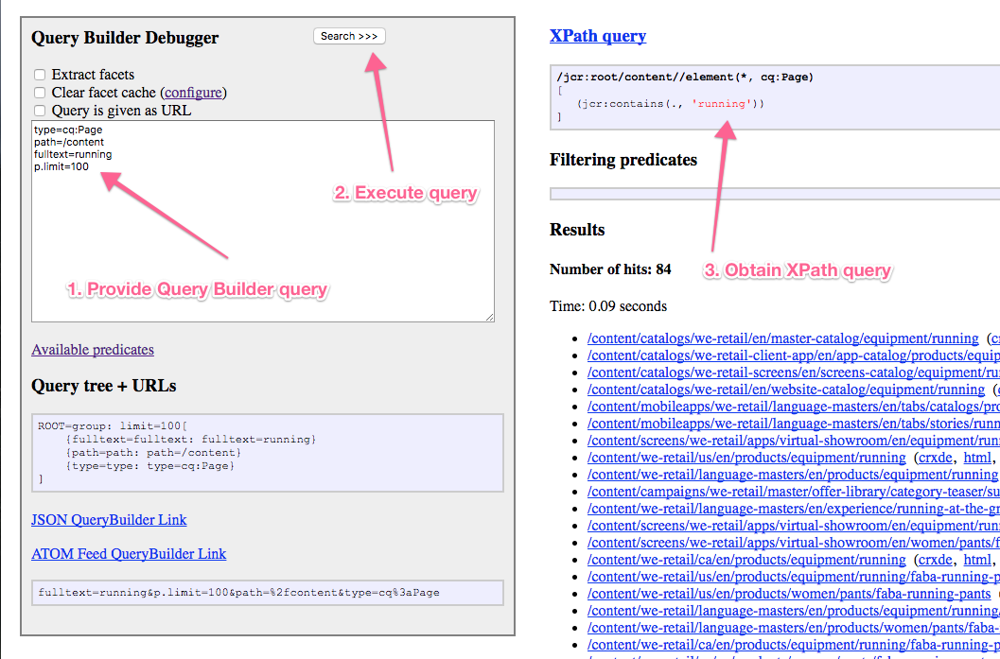

# API do Construtor de consulta{#query-builder-api}

A funcionalidade do [Criador de consultas de compartilhamento de ativos](/help/assets/assets-finder-editor.md) O é exposto por meio de uma API Java e uma API REST. Esta seção descreve essas APIs.

O construtor de consultas do lado do servidor ( [`QueryBuilder`](https://helpx.adobe.com/experience-manager/6-5/sites/developing/using/reference-materials/javadoc/com/day/cq/search/QueryBuilder.html)) aceitará uma descrição de consulta, criará e executará uma consulta XPath, filtrará opcionalmente o conjunto de resultados e também extrairá facetas, se desejar.

A descrição da consulta é simplesmente um conjunto de predicados ([`Predicate`](https://helpx.adobe.com/experience-manager/6-5/sites/developing/using/reference-materials/javadoc/com/day/cq/search/Predicate.html)). Os exemplos incluem um predicado de texto completo, que corresponde à variável `jcr:contains()` no XPath.

Para cada tipo de predicado, há um componente de avaliador ([`PredicateEvaluator`](https://helpx.adobe.com/experience-manager/6-5/sites/developing/using/reference-materials/javadoc/com/day/cq/search/eval/PredicateEvaluator.html)) que sabe como lidar com esse predicado específico para XPath, filtragem e extração de facetas. É muito fácil criar avaliadores personalizados, que são conectados por meio do tempo de execução do componente OSGi.

A API REST fornece acesso exatamente aos mesmos recursos por meio do HTTP, com respostas sendo enviadas em JSON.

>[!NOTE]
>
>A API do QueryBuilder é criada usando a API JCR. Você também pode consultar o JCR do Adobe Experience Manager usando a API JCR de um pacote OSGi. Para obter informações, consulte [Adobe Experience Manager usando a API JCR](https://experienceleague.adobe.com/docs/experience-manager-65/developing/platform/access-jcr.html?lang=en).

## Sessão Gem {#gem-session}

[Gems AEM](https://experienceleague.adobe.com/docs/experience-manager-gems-events/gems/overview.html) é uma série de aprofundamentos técnicos no Adobe Experience Manager oferecidos por especialistas do Adobe. Essa sessão dedicada ao construtor de consultas é muito útil para obter uma visão geral e usar a ferramenta.

>[!NOTE]
>
>Ver a sessão Gem AEM [Os formulários de busca ficaram simples com o AEM querybuilder](https://experienceleague.adobe.com/docs/experience-manager-gems-events/gems/gems2017/aem-search-forms-using-querybuilder.html) para obter uma visão geral detalhada do construtor de consultas.

## Exemplos de consulta {#sample-queries}

Essas amostras são fornecidas na notação de estilo das propriedades Java. Para usá-los com a API Java, use uma API Java `HashMap` como na amostra de API a seguir.

Para o `QueryBuilder` JSON Servlet, cada exemplo inclui um link para a instalação do CQ local (no local padrão, `http://localhost:4502`). Observe que é necessário fazer logon na instância do CQ antes de usar esses links.

>[!CAUTION]
>
>Por padrão, o servlet json do construtor de consultas exibe no máximo 10 ocorrências.
>
>Adicionar o seguinte parâmetro permite que o servlet exiba todos os resultados da consulta:
>
>**`p.limit=-1`**

>[!NOTE]
>
>Para visualizar os dados JSON retornados em seu navegador, você pode usar um plug-in, como o JSONView para Firefox.

### Retornando todos os resultados {#returning-all-results}

A consulta a seguir **retornar dez resultados** (ou seja, um máximo de dez), mas informe você sobre a **Número de ocorrências:** que estão efetivamente disponíveis:

`http://localhost:4502/bin/querybuilder.json?path=/content&1_property=sling:resourceType&1_property.value=foundation/components/text&1_property.operation=like&orderby=path`

```xml
path=/content
1_property=sling:resourceType
1_property.value=foundation/components/text
1_property.operation=like
orderby=path
```

A mesma consulta (com o parâmetro `p.limit=-1`) fará **retornar todos os resultados** (esse pode ser um número alto, dependendo da sua instância):

`http://localhost:4502/bin/querybuilder.json?path=/content&1_property=sling:resourceType&1_property.value=foundation/components/text&1_property.operation=like&p.limit=-1&orderby=path`

```xml
path=/content
1_property=sling:resourceType
1_property.value=foundation/components/text
1_property.operation=like
p.limit=-1
orderby=path
```

### Uso de p.guessTotal para retornar os resultados {#using-p-guesstotal-to-return-the-results}

O objetivo da `p.guessTotal` O parâmetro é retornar o número apropriado de resultados que podem ser mostrados ao combinar os valores mínimos viáveis de p.offset e p.limit. A vantagem de usar esse parâmetro é o melhor desempenho com conjuntos de resultados grandes. Isso evita calcular o total completo (por exemplo, chamar result.getSize()) e ler todo o conjunto de resultados, otimizado até o mecanismo e índice do OAK. Essa pode ser uma diferença significativa quando há 100 milhares de resultados, tanto em tempo de execução quanto em uso de memória.

A desvantagem do parâmetro é que os usuários não veem o total exato. Mas você pode definir um número mínimo como p.guessTotal=1000 para que sempre seja lido até 1000, portanto, você obtém totais exatos para conjuntos de resultados menores, mas se for mais do que isso, você só pode mostrar &quot;e mais&quot;.

Adicionar `p.guessTotal=true` consulte a consulta abaixo para ver como funciona:

`http://localhost:4502/bin/querybuilder.json?path=/content&1_property=sling:resourceType&1_property.value=foundation/components/text&1_property.operation=like&p.guessTotal=true&orderby=path`

```xml
path=/content
1_property=sling:resourceType
1_property.value=foundation/components/text
1_property.operation=like
p.guessTotal=true
orderby=path
```

A consulta retornará a variável `p.limit` padrão de `10` resultados com um `0` deslocamento:

```xml
"success": true,
"results": 10,
"total": 10,
"more": true,
"offset": 0,
```

A partir do AEM 6.0 SP2, você também pode usar um valor numérico para contar até um número personalizado de resultados máximos. Use a mesma query acima, mas altere o valor de `p.guessTotal` para `50`:

`http://localhost:4502/bin/querybuilder.json?path=/content&1_property=sling:resourceType&1_property.value=foundation/components/text&1_property.operation=like&p.guessTotal=50&orderby=path`

Ele retornará um número com o mesmo limite padrão de 10 resultados com um deslocamento 0, mas exibirá apenas um máximo de 50 resultados:

```xml
"success": true,
"results": 10,
"total": 50,
"more": true,
"offset": 0,
```

### Implementação de paginação {#implementing-pagination}

Por padrão, o Query Builder também forneceria o número de ocorrências. Dependendo do tamanho do resultado, isso pode levar muito tempo, já que a determinação da contagem precisa envolve a verificação de cada resultado por controle de acesso. Geralmente, o total é usado para implementar a paginação para a interface do usuário final. Como a determinação da contagem exata pode ser lenta, é recomendável usar o recurso guessTotal para implementar a paginação.

Por exemplo, a interface pode adaptar a seguinte abordagem:

* Obtenha e exiba a contagem precisa do número total de ocorrências ([SearchResult.getTotalMatches()](https://helpx.adobe.com/experience-manager/6-5/sites/developing/using/reference-materials/javadoc/com/day/cq/search/result/SearchResult.html#gettotalmatches) ou total na resposta querybuilder.json) são menores ou iguais a 100;
* Definir `guessTotal` para 100 ao fazer a chamada para o Construtor de consultas.

* A resposta pode ter o seguinte resultado:

   * `total=43`, `more=false` - Indica que o número total de ocorrências é 43. A interface do usuário pode mostrar até dez resultados como parte da primeira página e fornecer paginação para as próximas três páginas. Você também pode usar essa implementação para exibir um texto descritivo como **&quot;43 resultados encontrados&quot;**.
   * `total=100`, `more=true` - Indica que o número total de ocorrências é maior que 100 e a contagem exata não é conhecida. A interface do usuário pode exibir até dez como parte da primeira página e fornecer paginação para as próximas dez páginas. Também é possível usar para exibir um texto como **&quot;mais de 100 resultados encontrados&quot;**. Conforme o usuário vai para as próximas páginas, as chamadas feitas para o Construtor de consultas aumentariam o limite de `guessTotal` e também da `offset` e `limit` parâmetros.

`guessTotal` também devem ser usados nos casos em que a interface do usuário precisa usar rolagem infinita, para evitar que o Construtor de consultas determine a contagem exata de ocorrências.

### Localize os arquivos jar e ordene-os, os mais recentes primeiro {#find-jar-files-and-order-them-newest-first}

`http://localhost:4502/bin/querybuilder.json?type=nt:file&nodename=*.jar&orderby=@jcr:content/jcr:lastModified&orderby.sort=desc`

```xml
type=nt:file
nodename=*.jar
orderby=@jcr:content/jcr:lastModified
orderby.sort=desc
```

### Localizar todas as páginas e ordená-las pela última modificação {#find-all-pages-and-order-them-by-last-modified}

`http://localhost:4502/bin/querybuilder.json?type=cq:Page&orderby=@jcr:content/cq:lastModified`

```xml
type=cq:Page
orderby=@jcr:content/cq:lastModified
```

### Localizar todas as páginas e ordená-las por última modificação, mas decrescente {#find-all-pages-and-order-them-by-last-modified-but-descending}

`http://localhost:4502/bin/querybuilder.json?type=cq:Page&orderby=@jcr:content/cq:lastModified&orderby.sort=desc]`

```xml
type=cq:Page
orderby=@jcr:content/cq:lastModified
orderby.sort=desc
```

### Pesquisa de texto completo, ordenada por pontuação {#fulltext-search-ordered-by-score}

`http://localhost:4502/bin/querybuilder.json?fulltext=Management&orderby=@jcr:score&orderby.sort=desc`

```xml
fulltext=Management
orderby=@jcr:score
orderby.sort=desc
```

### Pesquisar páginas marcadas com uma determinada tag {#search-for-pages-tagged-with-a-certain-tag}

`http://localhost:4502/bin/querybuilder.json?type=cq:Page&tagid=marketing:interest/product&tagid.property=jcr:content/cq:tags`

```xml
type=cq:Page
tagid=marketing:interest/product
tagid.property=jcr:content/cq:tags
```

Use o `tagid` predicado como no exemplo, se você souber a ID de tag explícita.

Use o `tag` para o caminho do título da tag (sem espaços).

Porque, no exemplo anterior, você está procurando por páginas ( `cq:Page` nós), é necessário usar o caminho relativo desse nó para a variável `tagid.property` predicado, que é `jcr:content/cq:tags`. Por padrão, a variável `tagid.property` seria simplesmente `cq:tags`.

### Pesquisar em vários caminhos (usando grupos) {#search-under-multiple-paths-using-groups}

`http://localhost:4502/bin/querybuilder.json?fulltext=Management&group.1_path=/content/geometrixx/en/company/management&group.2_path=/content/geometrixx/en/company/bod&group.p.or=true`

```xml
fulltext=Management
group.p.or=true
group.1_path=/content/geometrixx/en/company/management
group.2_path=/content/geometrixx/en/company/bod
```

Esta consulta usa um *grupo* (nomeado como &quot; `group`&quot;), que atua para delimitar subexpressões em um query, da mesma forma que os parênteses em notações mais padrão. Por exemplo, a consulta anterior pode ser expressa em um estilo mais familiar como:

`"Management" and ("/content/geometrixx/en/company/management" or "/content/geometrixx/en/company/bod")`

No grupo no exemplo, a variável `path` o predicado é usado várias vezes. Para diferenciar e ordenar as duas instâncias do predicado (a ordenação é necessária para alguns predicados), você deve adicionar prefixos aos predicados com *N* `_ where`*N* é o índice de ordenação. No exemplo anterior, os predicados resultantes são `1_path` e `2_path`.

A variável `p` in `p.or` é um delimitador especial que indica que o que se segue (neste caso, um `or`) é um *parâmetro* do grupo, em oposição a um subpredicado do grupo, como `1_path`.

Se não `p.or` é fornecido então todos os predicados são ANDed juntos, ou seja, cada resultado deve satisfazer todos os predicados.

>[!NOTE]
>
>Não é possível usar o mesmo prefixo numérico em uma única consulta, mesmo para predicados diferentes.

### Pesquisar propriedades {#search-for-properties}

Aqui você está pesquisando todas as páginas de um determinado modelo, usando o `cq:template` propriedade:

`http://localhost:4502/bin/querybuilder.json?property=cq%3atemplate&property.value=%2fapps%2fgeometrixx%2ftemplates%2fhomepage&type=cq%3aPageContent`

```xml
type=cq:PageContent
property=cq:template
property.value=/apps/geometrixx/templates/homepage
```

Isso tem a desvantagem de que a `jcr:content` Os nós das páginas, não as próprias páginas, são retornados. Para resolver isso, você pode pesquisar por caminho relativo:

`http://localhost:4502/bin/querybuilder.json?property=jcr%3acontent%2fcq%3atemplate&property.value=%2fapps%2fgeometrixx%2ftemplates%2fhomepage&type=cq%3aPage`

```xml
type=cq:Page
property=jcr:content/cq:template
property.value=/apps/geometrixx/templates/homepage
```

### Pesquisar várias propriedades {#search-for-multiple-properties}

Ao usar o predicado da propriedade várias vezes, é necessário adicionar os prefixos de número novamente:

`http://localhost:4502/bin/querybuilder.json?1_property=jcr%3acontent%2fcq%3atemplate&1_property.value=%2fapps%2fgeometrixx%2ftemplates%2fhomepage&2_property=jcr%3acontent%2fjcr%3atitle&2_property.value=English&type=cq%3aPage`

```xml
type=cq:Page
1_property=jcr:content/cq:template
1_property.value=/apps/geometrixx/templates/homepage
2_property=jcr:content/jcr:title
2_property.value=English
```

### Pesquisar por vários valores de propriedade {#search-for-multiple-property-values}

Para evitar grupos grandes quando quiser procurar vários valores de uma propriedade ( `"A" or "B" or "C"`), você pode fornecer vários valores para a variável `property` predicado:

`http://localhost:4502/bin/querybuilder.json?property=jcr%3atitle&property.1_value=Products&property.2_value=Square&property.3_value=Events`

```xml
property=jcr:title
property.1_value=Products
property.2_value=Square
property.3_value=Events
```

Para propriedades com vários valores, também é possível exigir que vários valores correspondam ( `"A" and "B" and "C"`):

`http://localhost:4502/bin/querybuilder.json?property=jcr%3atitle&property.and=true&property.1_value=test&property.2_value=foo&property.3_value=bar`

```xml
property=jcr:title
property.and=true
property.1_value=test
property.2_value=foo
property.3_value=bar
```

## Refinar O Que É Retornado {#refining-what-is-returned}

Por padrão, o Servlet JSON do QueryBuilder retornará um conjunto padrão de propriedades para cada nó no resultado da pesquisa (por exemplo, caminho, nome, título etc.). Para obter controle sobre quais propriedades são retornadas, você pode executar um dos seguintes procedimentos:

Especifique

```
p.hits=full
```

nesse caso, todas as propriedades serão incluídas para cada nó:

`http://localhost:4502/bin/querybuilder.json?p.hits=full&property=jcr%3atitle&property.value=Triangle`

```xml
property=jcr:title
property.value=Triangle
p.hits=full
```

Utilização

```
p.hits=selective
```

e especifique as propriedades que deseja obter em

```
p.properties
```

separados por um espaço:

`http://localhost:4502/bin/querybuilder.json?p.hits=selective&property=jcr%3atitle&property.value=Triangle`

[ `http://localhost:4502/bin/querybuilder.json?`](http://localhost:4502/bin/querybuilder.json?p.hits=selective&amp;p.properties=sling%3aresourceType%20jcr%3aprimaryType&amp;property=jcr%3atitle&amp;property.value=Triangle) [p.hits=selective&amp;](http://localhost:4502/bin/querybuilder.json?p.hits=selective&amp;p.nodedepth=5&amp;p.properties=sling%3aresourceType%20jcr%3apath&amp;property=jcr%3atitle&amp;property.value=Triangle)p.properties=sling%3aresourceType%20jcr%3aprimaryType&amp;property=jcr%3atitle&amp;property.value=Triangle

```xml
property=jcr:title
property.value=Triangle
p.hits=selective
p.properties=sling:resourceType jcr:primaryType
```

Outra coisa que você pode fazer é incluir nós secundários na resposta do QueryBuilder. Para fazer isso, é necessário especificar

```
p.nodedepth=n
```

onde `n` é o número de níveis que você deseja que a consulta retorne. Observe que, para que um nó filho seja retornado, ele deve ser especificado pelo seletor de propriedades

```
p.hits=full
```

Exemplo:

`http://localhost:4502/bin/querybuilder.json?p.hits=full&p.nodedepth=5&property=jcr%3atitle&property.value=Triangle`

```xml
property=jcr:title
property.value=Triangle
p.hits=full
p.nodedepth=5
```

## Mais predicados {#morepredicates}

Para obter mais predicados, consulte a [Página Referência de predicado do Query Builder](/help/sites-developing/querybuilder-predicate-reference.md).

Você também pode verificar o [Javadoc para o `PredicateEvaluator` classes](https://helpx.adobe.com/experience-manager/6-5/sites/developing/using/reference-materials/javadoc/com/day/cq/search/eval/PredicateEvaluator.html). O Javadoc dessas classes contém a lista de propriedades que podem ser usadas.

O prefixo do nome da classe (por exemplo, &quot; `similar`&quot; em [`SimilarityPredicateEvaluator`](https://helpx.adobe.com/experience-manager/6-5/sites/developing/using/reference-materials/javadoc/com/day/cq/search/eval/SimilarityPredicateEvaluator.html)) é o *propriedade principal* da classe. Essa propriedade também é o nome do predicado a ser usado na query (em minúsculas).

Para essas propriedades principais, você pode encurtar a consulta e usar &quot; `similar=/content/en`&quot; em vez da variante totalmente qualificada &quot; `similar.similar=/content/en`&quot;. O formulário totalmente qualificado deve ser usado para todas as propriedades não principais de uma classe.

## Exemplo de uso da API do Query Builder {#example-query-builder-api-usage}

```java
   String fulltextSearchTerm = "Geometrixx";

    // create query description as hash map (simplest way, same as form post)
    Map<String, String> map = new HashMap<String, String>();

// create query description as hash map (simplest way, same as form post)
    map.put("path", "/content");
    map.put("type", "cq:Page");
    map.put("group.p.or", "true"); // combine this group with OR
    map.put("group.1_fulltext", fulltextSearchTerm);
    map.put("group.1_fulltext.relPath", "jcr:content");
    map.put("group.2_fulltext", fulltextSearchTerm);
    map.put("group.2_fulltext.relPath", "jcr:content/@cq:tags");

    // can be done in map or with Query methods
    map.put("p.offset", "0"); // same as query.setStart(0) below
    map.put("p.limit", "20"); // same as query.setHitsPerPage(20) below

    Query query = builder.createQuery(PredicateGroup.create(map), session);
    query.setStart(0);
    query.setHitsPerPage(20);

    SearchResult result = query.getResult();

    // paging metadata
    int hitsPerPage = result.getHits().size(); // 20 (set above) or lower
    long totalMatches = result.getTotalMatches();
    long offset = result.getStartIndex();
    long numberOfPages = totalMatches / 20;

    //Place the results in XML to return to client
    DocumentBuilderFactory factory =     DocumentBuilderFactory.newInstance();
    DocumentBuilder builder = factory.newDocumentBuilder();
    Document doc = builder.newDocument();

    //Start building the XML to pass back to the AEM client
    Element root = doc.createElement( "results" );
    doc.appendChild( root );

    // iterating over the results
    for (Hit hit : result.getHits()) {
       String path = hit.getPath();

      //Create a result element
      Element resultel = doc.createElement( "result" );
      root.appendChild( resultel );

      Element pathel = doc.createElement( "path" );
      pathel.appendChild( doc.createTextNode(path ) );
      resultel.appendChild( pathel );
    }
```

>[!NOTE]
>
>Para saber como criar um pacote OSGi que use a API do QueryBuilder e usar esse pacote OSGi em um aplicativo do Adobe Experience Manager, consulte [Criação de pacotes OSGi do Adobe CQ que usam o AP do Query Builder](https://helpx.adobe.com/experience-manager/using/using-query-builder-api.html)I.

A mesma consulta executada por HTTP usando o Servlet do Construtor de consultas (JSON):

`http://localhost:4502/bin/querybuilder.json?path=/content&type=cq:Page&group.p.or=true&group.1_fulltext=Geometrixx&group.1_fulltext.relPath=jcr:content&group.2_fulltext=Geometrixx&group.2_fulltext.relPath=jcr:content/@cq:tags&p.offset=0&p.limit=20`

## Armazenamento e carregamento de consultas {#storing-and-loading-queries}

As consultas podem ser armazenadas no repositório para que você possa usá-las posteriormente. A variável `QueryBuilder` fornece o &quot; `storeQuery` com a seguinte assinatura:

```java
void storeQuery(Query query, String path, boolean createFile, Session session) throws RepositoryException, IOException;
```

Ao usar o [ `QueryBuilder#storeQuery`](https://helpx.adobe.com/experience-manager/6-5/sites/developing/using/reference-materials/javadoc/com/day/cq/search/QueryBuilder.html#storequerycomdaycqsearchqueryjavalangstringbooleanjavaxjcrsession) método, o dado `Query` é armazenado no repositório como um arquivo ou como uma propriedade de acordo com a variável `createFile` valor do argumento. O exemplo a seguir mostra como salvar um `Query` ao caminho `/mypath/getfiles` como um arquivo:

```java
builder.storeQuery(query, "/mypath/getfiles", true, session);
```

Quaisquer consultas armazenadas anteriormente podem ser carregadas do repositório usando o [`QueryBuilder#loadQuery`](https://helpx.adobe.com/experience-manager/6-5/sites/developing/using/reference-materials/javadoc/com/day/cq/search/QueryBuilder.html#loadqueryjavalangstringjavaxjcrsession) método:

```java
Query loadQuery(String path, Session session) throws RepositoryException, IOException
```

Por exemplo, uma variável `Query` armazenado no caminho `/mypath/getfiles` pode ser carregado pelo seguinte trecho:

```java
Query loadedQuery = builder.loadQuery("/mypath/getfiles", session);
```

## Teste e depuração {#testing-and-debugging}

Para executar e depurar consultas do querybuilder, você pode usar o console do depurador do QueryBuilder em

`http://localhost:4502/libs/cq/search/content/querydebug.html`

ou, como alternativa, o servlet json querybuilder em

`http://localhost:4502/bin/querybuilder.json?path=/tmp`

( `path=/tmp` é apenas um exemplo).

### Depuração geral do Recommendations {#general-debugging-recommendations}

### Obter XPath explicável via registro {#obtain-explain-able-xpath-via-logging}

Explicar **all** consultas durante o ciclo de desenvolvimento em relação ao índice de destino definido.

* Habilitar logs DEBUG para o QueryBuilder a fim de obter consulta XPath subjacente e explicável

   * Navegue até https://&lt;serveraddress>:&lt;serverport>/system/console/slinglog. Criar um novo agente para `com.day.cq.search.impl.builder.QueryImpl` em **DEPURAR**.

* Depois que DEBUG for habilitado para a classe acima, os logs exibirão o XPath gerado pelo Construtor de consultas.
* Copie a consulta XPath da entrada de log da consulta QueryBuilder associada. Por exemplo:

   * `com.day.cq.search.impl.builder.QueryImpl XPath query: /jcr:root/content//element(*, cq:Page)[(jcr:contains(jcr:content, "Geometrixx") or jcr:contains(jcr:content/@cq:tags, "Geometrixx"))]`

* Cole a consulta XPath em [Explicar consulta](/help/sites-administering/operations-dashboard.md#explain-query) como XPath para obter o plano de consulta

### Obter XPath explicável por meio do depurador do Construtor de consultas {#obtain-explain-able-xpath-via-the-query-builder-debugger}

* Use o depurador AEM QueryBuilder para gerar uma consulta XPath explicável:

Explicar **all** consultas durante o ciclo de desenvolvimento em relação ao índice de destino definido.

**Obter XPath explicável via registro**

* Habilitar logs DEBUG para o QueryBuilder a fim de obter consulta XPath subjacente e explicável

   * Navegue até https://&lt;serveraddress>:&lt;serverport>/system/console/slinglog. Criar um novo agente para `com.day.cq.search.impl.builder.QueryImpl` em **DEPURAR**.

* Depois que DEBUG for habilitado para a classe acima, os logs exibirão o XPath gerado pelo Construtor de consultas.
* Copie a consulta XPath da entrada de log da consulta QueryBuilder associada. Por exemplo:

   * `com.day.cq.search.impl.builder.QueryImpl XPath query: /jcr:root/content//element(*, cq:Page)[(jcr:contains(jcr:content, "Geometrixx") or jcr:contains(jcr:content/@cq:tags, "Geometrixx"))]`

* Cole a consulta XPath em [Explicar consulta](/help/sites-administering/operations-dashboard.md#explain-query) como XPath para obter o plano de consulta

**Obter XPath explicável por meio do depurador do Construtor de consultas**

* Use o depurador AEM QueryBuilder para gerar uma consulta XPath explicável:



1. Fornecer a consulta do Construtor de consultas no depurador do Construtor de consultas
1. Executar a pesquisa
1. Obter o XPath gerado
1. Cole a consulta XPath na Explicar consulta como XPath para obter o plano de consulta

>[!NOTE]
>
>Consultas que não são do construtor de consultas (XPath, JCR-SQL2) podem ser fornecidas diretamente para Explicar consulta.

Para obter um resumo sobre como depurar consultas com o QueryBuilder, consulte o vídeo abaixo.

>[!NOTE]
>
>[https://www.youtube.com/watch?v=BnyXjhRKYKc](https://www.youtube.com/watch?v=BnyXjhRKYKc)

## Depuração de consultas com registro {#debugging-queries-with-logging}

>[!NOTE]
>
>A configuração dos registradores é descrita na seção [Criar seus próprios registradores e gravadores](/help/sites-deploying/configure-logging.md#creating-your-own-loggers-and-writers).

A saída de log (nível INFO) da implementação do construtor de consultas ao executar a consulta descrita em Teste e depuração:

```xml
com.day.cq.search.impl.builder.QueryImpl executing query (predicate tree):
null=group: limit=20, offset=0[
    {group=group: or=true[
        {1_fulltext=fulltext: fulltext=Geometrixx, relPath=jcr:content}
        {2_fulltext=fulltext: fulltext=Geometrixx, relPath=jcr:content/@cq:tags}
    ]}
    {path=path: path=/content}
    {type=type: type=cq:Page}
]
com.day.cq.search.impl.builder.QueryImpl XPath query: /jcr:root/content//element(*, cq:Page)[(jcr:contains(jcr:content, "Geometrixx") or jcr:contains(jcr:content/@cq:tags, "Geometrixx"))]
com.day.cq.search.impl.builder.QueryImpl no filtering predicates
com.day.cq.search.impl.builder.QueryImpl query execution took 69 ms
```

Se você tiver uma consulta usando avaliadores de predicado que filtram ou que usam uma ordem personalizada por comparador, isso também será observado na consulta:

```xml
com.day.cq.search.impl.builder.QueryImpl executing query (predicate tree):
null=group: [
    {nodename=nodename: nodename=*.jar}
    {orderby=orderby: orderby=@jcr:content/jcr:lastModified}
    {type=type: type=nt:file}
]
com.day.cq.search.impl.builder.QueryImpl custom order by comparator: jcr:content/jcr:lastModified
com.day.cq.search.impl.builder.QueryImpl XPath query: //element(*, nt:file)
com.day.cq.search.impl.builder.QueryImpl filtering predicates: {nodename=nodename: nodename=*.jar}
com.day.cq.search.impl.builder.QueryImpl query execution took 272 ms
```

## Links Javadoc {#javadoc-links}

| **Javadoc** | **Descrição** |
|---|---|
| [com.day.cq.search](https://helpx.adobe.com/experience-manager/6-5/sites/developing/using/reference-materials/javadoc/com/day/cq/search/package-summary.html) | QueryBuilder básico e API de consulta |
| [com.day.cq.search.result](https://helpx.adobe.com/experience-manager/6-5/sites/developing/using/reference-materials/javadoc/com/day/cq/search/result/package-summary.html) | API de resultado |
| [com.day.cq.search.facets](https://helpx.adobe.com/experience-manager/6-5/sites/developing/using/reference-materials/javadoc/com/day/cq/search/facets/package-summary.html) | Facetas |
| [com.day.cq.search.facets.buckets](https://helpx.adobe.com/experience-manager/6-5/sites/developing/using/reference-materials/javadoc/com/day/cq/search/facets/buckets/package-summary.html) | Compartimentos (contidos nas facetas) |
| [com.day.cq.search.eval](https://helpx.adobe.com/experience-manager/6-5/sites/developing/using/reference-materials/javadoc/com/day/cq/search/eval/package-summary.html) | Avaliadores de predicado |
| [com.day.cq.search.facets.extractors](https://helpx.adobe.com/experience-manager/6-5/sites/developing/using/reference-materials/javadoc/com/day/cq/search/facets/extractors/package-summary.html) | Extratores de facetas (para avaliadores) |
| [com.day.cq.search.writer](https://helpx.adobe.com/experience-manager/6-5/sites/developing/using/reference-materials/javadoc/com/day/cq/search/writer/package-summary.html) | Gravador de ocorrência de resultado JSON para o servlet Querybuilder (/bin/querybuilder.json) |
