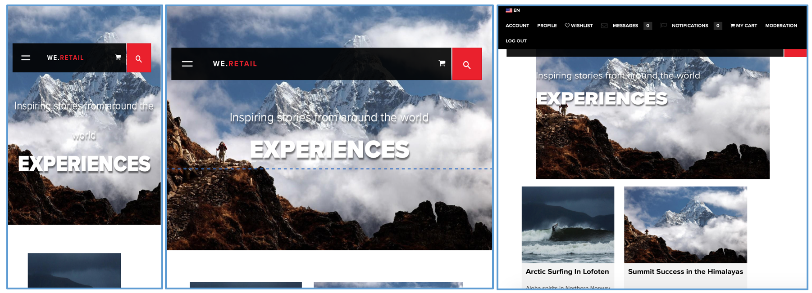

# Design responsivo para páginas da Web{#responsive-design-for-web-pages}

>[!NOTE]
>
>A Adobe recomenda usar o Editor SPA para projetos que exigem renderização do lado do cliente baseada em estrutura de aplicativo de página única (como _Reagir_). [Saiba mais](/help/sites-developing/spa-overview.md).


Projete suas páginas da Web para que elas se adaptem ao visor do cliente no qual são exibidas. Com o design responsivo, as mesmas páginas podem ser exibidas com eficiência em vários dispositivos em ambas as orientações. A imagem a seguir demonstra algumas maneiras pelas quais uma página pode responder às alterações no tamanho do visor:

* Layout: Use layouts de coluna única para visualizações menores e layouts de várias colunas para visualizações maiores.
* Tamanho do texto: Use um tamanho de texto maior (quando apropriado, como cabeçalhos) em visualizações maiores.
* Conteúdo: Inclua somente o conteúdo mais importante ao exibir em dispositivos menores.
* Navegação: Ferramentas específicas do dispositivo são fornecidas para acessar outras páginas.
* Imagens: Servindo representações de imagem apropriadas para o visor do cliente. de acordo com as dimensões da janela.



Desenvolva aplicativos Adobe Experience Manager (AEM) que gerem páginas HTML5 que se adaptam a vários tamanhos de janela e orientações. Por exemplo, os seguintes intervalos de larguras do visor correspondem a vários tipos de dispositivos e orientações

* Largura máxima de 480 pixels (telefone, retrato)
* Largura máxima de 767 pixels (telefone, paisagem)
* Largura entre 768 pixels e 979 pixels (tablet, retrato)
* Largura entre 980 pixels e 1199 pixels (tablet, paisagem)
* Largura de 1200px ou superior (desktop)

Consulte os seguintes tópicos para obter informações sobre como implementar o comportamento de design responsivo:

* [query de mídia](/help/sites-developing/responsive.md#using-media-queries)
* [Grades fluidas](/help/sites-developing/responsive.md#developing-a-fluid-grid)
* [Imagens adaptativas](/help/sites-developing/responsive.md#using-adaptive-images)

Ao projetar, use o **[!UICONTROL Sidekick]** para pré-visualização de suas páginas para vários tamanhos de tela.

## Antes de desenvolver {#before-you-develop}

Antes de desenvolver o aplicativo AEM que suporta suas páginas da Web, várias decisões de design devem ser tomadas. Por exemplo, você precisa ter as seguintes informações:

* Os dispositivos que você está definindo como meta.
* O tamanho do visor do público alvo.
* Os layouts de página para cada tamanho de visor direcionado.

### Estrutura do aplicativo {#application-structure}

A estrutura típica do aplicativo AEM suporta todas as implementações de design responsivo:

* Os componentes da página ficam abaixo de /apps/*application_name*/components
* Os modelos residem abaixo de /apps/*application_name*/models
* Designs residem abaixo de /etc/designs

## Uso de query de mídia {#using-media-queries}

Os query de mídia permitem o uso seletivo de estilos CSS para renderização de página. As ferramentas e os recursos de desenvolvimento do AEM permitem que você implemente de modo eficiente e eficaz query de mídia em seus aplicativos.

O grupo W3C fornece a recomendação de Query [de](https://www.w3.org/TR/css3-mediaqueries/) mídia que descreve esse recurso CSS3 e a sintaxe.

### Criação do arquivo CSS {#creating-the-css-file}

No arquivo CSS, defina query de mídia com base nas propriedades dos dispositivos que você está definindo como meta. A seguinte estratégia de implementação é eficaz para gerenciar estilos para cada query de mídia:

* Use ClientLibraryFolder para definir o CSS que é montado quando a página é renderizada.
* Defina cada query de mídia e os estilos associados em arquivos CSS separados. É útil usar nomes de arquivos que representem os recursos do dispositivo do query de mídia.
* Defina estilos comuns a todos os dispositivos em um arquivo CSS separado.
* No arquivo css.txt da ClientLibraryFolder, solicite os arquivos CSS de lista, conforme necessário no arquivo CSS montado.

A amostra de mídia We.Retail usa essa estratégia para definir estilos no design do site. O arquivo CSS usado por We.Retail está localizado em `*/apps/weretail/clientlibs/clientlib-site/less/grid.less`.

A tabela a seguir lista os arquivos na pasta filho css.

<table>
 <tbody>
  <tr>
   <th>Nome do arquivo</th>
   <th>Descrição</th>
   <th>Query de mídia</th>
  </tr>
  <tr>
   <td>style.css</td>
   <td>Estilos comuns.</td>
   <td>N/A</td>
  </tr>
  <tr>
   <td>bootstrap.css</td>
   <td>Estilos comuns, definidos pelo Bootstrap do Twitter.</td>
   <td>N/A</td>
  </tr>
  <tr>
   <td>responsive-1200px.css</td>
   <td>Estilos para todas as mídias com 1200 pixels de largura ou mais larga.</td>
   <td><p>@media (largura mínima: 1200px) {<br /> ...<br /> }</p> </td>
  </tr>
  <tr>
   <td>responsive-980px-1199px.css</td>
   <td>Estilos para mídia com 980 pixels e largura de 1199 pixels.</td>
   <td><p>@media (largura mínima: 980px) e (largura máxima: 1199px) {<br /> ...<br /> }</p> </td>
  </tr>
  <tr>
   <td>responsive-768px-979px.css</td>
   <td>Estilos para mídia com largura entre 768 pixels e 979 pixels. </td>
   <td><p>@media (largura mínima: 768px) e (largura máxima: 979px) {<br /> ...<br /> }</p> </td>
  </tr>
  <tr>
   <td>responsive-767px-max.css</td>
   <td>Estilos para todas as mídias com menos de 768 pixels de largura.</td>
   <td><p>@media (largura máxima: 767px) {<br /> ...<br /> }</p> </td>
  </tr>
  <tr>
   <td>responsive-480px.css</td>
   <td>Estilos para todas as mídias com menos de 481 pixels de largura.</td>
   <td>@media (largura máxima: 480) {<br /> ...<br /> }</td>
  </tr>
 </tbody>
</table>

O arquivo css.txt na `/etc/designs/weretail/clientlibs` pasta lista os arquivos CSS que a pasta da biblioteca do cliente inclui. A ordem dos arquivos implementa a precedência do estilo. Os estilos são mais específicos à medida que o tamanho do dispositivo diminui.

`#base=css`

```
style.css
 bootstrap.css
```

```
responsive-1200px.css
 responsive-980px-1199px.css
 responsive-768px-979px.css
 responsive-767px-max.css
 responsive-480px.css
```

**Dica**: Nomes de arquivos descritivos permitem identificar facilmente o tamanho do visor direcionado.

### Usar Query de mídia com páginas do AEM {#using-media-queries-with-aem-pages}

Inclua a pasta da biblioteca do cliente no script JSP do componente da página para gerar o arquivo CSS que inclui os query de mídia e para fazer referência ao arquivo.

```xml
<ui:includeClientLib categories="apps.weretail.all"/>
```

>[!NOTE]
>
>A pasta da biblioteca do `apps.weretail.all` cliente incorpora a biblioteca clientlibs.

O script JSP gera o seguinte código HTML que faz referência às folhas de estilos:

```xml
<link rel="stylesheet" href="/etc/designs/weretail/clientlibs-all.css" type="text/css">
<link href="/etc/designs/weretail.css" rel="stylesheet" type="text/css">
```

## Visualização para dispositivos específicos {#previewing-for-specific-devices}

Consulte pré-visualizações de suas páginas em diferentes tamanhos de visor para testar o comportamento do design responsivo. No modo **[!UICONTROL Pré-visualização]** , o **[!UICONTROL Sidekick]** inclui um menu suspenso **[!UICONTROL Dispositivos]** que você usa para selecionar um dispositivo. Quando você seleciona um dispositivo, a página muda para se adaptar ao tamanho do visor.


Para ativar a pré-visualização do dispositivo no **[!UICONTROL Sidekick]**, configure a página e o serviço **[!UICONTROL MobileEmulatorProvider]** . Outra configuração de página controla a lista dos dispositivos que aparecem na lista **[!UICONTROL Dispositivos]** .

### Adicionando a Lista Dispositivos {#adding-the-devices-list}

A lista **[!UICONTROL Dispositivos]** é exibida no **[!UICONTROL Sidekick]** quando a página inclui o script JSP que renderiza a lista **[!UICONTROL Dispositivos]** . Para adicionar a lista **[!UICONTROL Dispositivos]** ao **[!UICONTROL Sidekick]**, inclua o `/libs/wcm/mobile/components/simulator/simulator.jsp` script na `head` seção da página.

Inclua o seguinte código no JSP que define a `head` seção:

`<cq:include script="/libs/wcm/mobile/components/simulator/simulator.jsp"/>`

Para ver um exemplo, abra o `/apps/weretail/components/page/head.jsp` arquivo no CRXDE Lite.

### Registrando componentes da página para simulação {#registering-page-components-for-simulation}

Para permitir que o simulador do dispositivo suporte suas páginas, registre os componentes da página com o serviço de fábrica MobileEmulatorProvider e defina a `mobile.resourceTypes` propriedade.

When working with AEM there are several methods of managing the configuration settings for such services; see [Configuring OSGi](/help/sites-deploying/configuring-osgi.md) for full details.

Por exemplo, para criar um ` [sling:OsgiConfig](/help/sites-deploying/configuring-osgi.md#adding-a-new-configuration-to-the-repository)` nó em seu aplicativo:

* Parent folder: `/apps/application_name/config`
* Nome: `com.day.cq.wcm.mobile.core.impl.MobileEmulatorProvider-*alias*`

   O sufixo - `*alias*` é necessário porque o serviço MobileEmulatorProvider é um serviço de fábrica. Use qualquer alias exclusivo para esta fábrica.

* jcr:primaryType: `sling:OsgiConfig`

Adicione a seguinte propriedade de nó:

* Nome: `mobile.resourceTypes`
* Tipo: `String[]`
* Valor: Os caminhos para os componentes da página que renderizam suas páginas da Web. Por exemplo, o aplicativo geometrixx-media usa os seguintes valores:

   ```
   geometrixx-media/components/page
    geometrixx-unlimited/components/pages/page
    geometrixx-unlimited/components/pages/coverpage
    geometrixx-unlimited/components/pages/issue
   ```

### Especificação dos grupos de dispositivos {#specifying-the-device-groups}

Para especificar os grupos de dispositivos que aparecem na lista Dispositivos, adicione uma `cq:deviceGroups` propriedade ao `jcr:content` nó da página raiz do site. O valor da propriedade é uma matriz de caminhos para os nós do grupo de dispositivos.

Os nós do grupo de dispositivos estão localizados na `/etc/mobile/groups` pasta.

Por exemplo, a página raiz do site de mídia Geometrixx é `/content/geometrixx-media`. O `/content/geometrixx-media/jcr:content` nó inclui a seguinte propriedade:

* Nome: `cq:deviceGroups`
* Tipo: `String[]`
* Valor: `/etc/mobile/groups/responsive`

Use o console Ferramentas para [criar e editar grupos](/help/sites-developing/groupfilters.md)de dispositivos.

>[!NOTE]
>
>Para grupos de dispositivos que você usa para o design responsivo, edite o grupo de dispositivos e, na guia Geral, selecione Desativar emulador. Essa opção impede que o carrossel do emulador seja exibido, o que não é relevante para o design responsivo.


## Uso de imagens adaptáveis {#using-adaptive-images}

Você pode usar query de mídia para selecionar um recurso de imagem a ser exibido na página. No entanto, todos os recursos que usam um query de mídia para condicionar seu uso são baixados para o cliente. O query de mídia apenas determina se o recurso baixado é exibido.

Para grandes recursos, como imagens, baixar todos os recursos não é um uso eficiente do pipeline de dados do cliente. Para baixar seletivamente os recursos, use o javascript para iniciar a solicitação de recurso depois que os query de mídia fizerem a seleção.

A estratégia a seguir carrega um único recurso que é escolhido usando query de mídia:

1. Adicione um elemento DIV para cada versão do recurso. Inclua o URI do recurso como o valor de um valor de atributo. O navegador não interpreta o atributo como um recurso.
1. Adicione um query de mídia a cada elemento DIV apropriado para o recurso.
1. Quando o documento é carregado ou a janela é redimensionada, o código javascript testa o query de mídia de cada elemento DIV.
1. Com base nos resultados dos query, determine qual recurso incluir.
1. Insira um elemento HTML no DOM que faz referência ao recurso.

### Avaliação de query de mídia usando Javascript {#evaluating-media-queries-using-javascript}

As implementações da interface [](https://dev.w3.org/csswg/cssom-view/#the-mediaquerylist-interface) MediaQueryList definida pelo W3C permitem avaliar query de mídia usando javascript. Você pode aplicar lógica aos resultados do query de mídia e executar scripts direcionados para a janela atual:

* Os navegadores que implementam a interface MediaQueryList suportam a `window.matchMedia()` função. Essa função testa query de mídia em relação a uma determinada string. A função retorna um `MediaQueryList` objeto que fornece acesso aos resultados do query.

* Para navegadores que não implementam a interface, você pode usar um `matchMedia()` polifill, como [matchMedia.js](https://github.com/paulirish/matchMedia.js), uma biblioteca javascript disponível gratuitamente.

#### Seleção de recursos específicos de mídia {#selecting-media-specific-resources}

O elemento [de](https://picture.responsiveimages.org/) imagem proposto pelo W3C usa query de mídia para determinar a fonte a ser usada para elementos de imagem. O elemento picture usa atributos de elemento para associar query de mídia a caminhos de imagem.

A biblioteca [](https://github.com/scottjehl/picturefill) picturefill.js disponível livremente oferece funcionalidade semelhante ao `picture` elemento proposto e usa uma estratégia semelhante. A biblioteca picturefill.js chama `window.matchMedia` para avaliar os query de mídia definidos para um conjunto de `div` elementos. Cada `div` elemento também especifica uma fonte de imagem. A fonte é usada quando o query de mídia do `div` elemento retorna `true`.

A `picturefill.js` biblioteca exige um código HTML semelhante ao seguinte exemplo:

```xml
<div data-picture>
    <div data-src='path to default image'></div>
    <div data-src='path to small image'    data-media="(media query for phone)"></div>
    <div data-src='path to medium image'   data-media="(media query for tablet)"></div>
    <div data-src='path to large image'     data-media="(media query for monitor)"></div>
</div>
```

Quando a página é renderizada, Picturefull.js insere um `img` elemento como o último filho do `<div data-picture>` elemento:

```xml
<div data-picture>
    <div data-src='path to default image'></div>
    <div data-src='path to small image'    data-media="(media query for phone)"></div>
    <div data-src='path to medium image'   data-media="(media query for tablet)"></div>
    <div data-src='path to large image'     data-media="(media query for monitor)"></div>
    
</div>
```

Em uma página do AEM, o valor do `data-src` atributo é o caminho para um recurso no repositório.

### Implementação de imagens adaptáveis no AEM {#implementing-adaptive-images-in-aem}

Para implementar imagens adaptáveis em seu aplicativo AEM, é necessário adicionar as bibliotecas de javascript necessárias e incluir a marcação HTML necessária em suas páginas.

**Bibliotecas**

Obtenha as seguintes bibliotecas de javascript e as inclua em uma pasta da biblioteca do cliente:

* [matchMedia.js](https://github.com/paulirish/matchMedia.js) (para navegadores que não implementam a interface MediaQueryList)
* [picturefill.js](https://github.com/scottjehl/picturefill)
* jquery.js (disponível por meio da pasta da biblioteca do `/etc/clientlibs/granite/jquery` cliente) (categoria = jquery)
* [jquery.debouncedresize.js](https://github.com/louisremi/jquery-smartresize) (um evento jquery que ocorre uma vez após a janela ser redimensionada)

**Dica:** É possível concatenar automaticamente várias pastas da biblioteca do cliente [incorporando](/help/sites-developing/clientlibs.md#embedding-code-from-other-libraries).

**HTML**

Crie um componente que gera os elementos div necessários que o código picturefill.js espera. Em uma página do AEM, o valor do atributo data-src é o caminho para um recurso no repositório. Por exemplo, um componente de página pode codificar os query de mídia e os caminhos associados para execuções de imagem no DAM. Ou crie um componente de Imagem personalizado que permita aos autores selecionar representações de imagem ou especificar opções de renderização de tempo de execução.

O exemplo de HTML a seguir seleciona a partir de 2 execuções de DAM da mesma imagem.

```xml
<div data-picture>
    <div data-src='/content/dam/geometrixx-media/articles/meridien.png'></div>
    <div data-src='/content/dam/geometrixx-media/articles/meridien.png/jcr:content/renditions/cq5dam.thumbnail.319.319.png'    data-media="(min-width: 769px)"></div>
    <div data-src='/content/dam/geometrixx-media/articles/meridien.png/jcr:content/renditions/cq5dam.thumbnail.140.100.png'   data-media="(min-width: 481px)"></div>
</div>
```

>[!NOTE]
>
>O componente de base da Imagem adaptativa implementa imagens adaptativas:
>
>* Pasta da biblioteca do cliente: `/libs/foundation/components/adaptiveimage/clientlibs`
>* Script que gera o HTML: `/libs/foundation/components/adaptiveimage/adaptiveimage.jsp`
>
>
A seção subsequente fornece detalhes sobre esse componente.


### Compreensão da renderização de imagem no AEM {#understanding-image-rendering-in-aem}

Para personalizar a renderização da imagem, você deve entender a implementação padrão de renderização de imagem estática do AEM. O AEM fornece o componente de Imagem e um servlet de renderização de imagem que trabalham juntos para renderizar imagens para a página da Web. A seguinte sequência de eventos ocorre quando o componente de Imagem é incluído no sistema de parágrafo da página:

1. Criação: Os autores editam o componente de Imagem para especificar o arquivo de imagem a ser incluído em uma página HTML. O caminho do arquivo é armazenado como um valor de propriedade do nó do componente de Imagem.
1. Solicitação de página: O JSP do componente de página gera o código HTML. O JSP do componente de Imagem gera e adiciona um elemento img à página.
1. Solicitação de imagem: O navegador da Web carrega a página e solicita a imagem de acordo com o atributo src do elemento img.
1. Renderização de imagem: O servlet de renderização de imagem retorna a imagem para o navegador da Web.


Por exemplo, o JSP do componente de Imagem gera o seguinte elemento HTML:

``

Quando o navegador carrega a página, ele solicita a imagem usando o valor do atributo src como URL. O Sling decompõe o URL:

* Recurso: `/content/mywebsite/en/_jcr_content/par/image_0`
* Extensão do nome do arquivo: `.jpg`
* Seletor: `img`
* Sufixo: `1358372073597.jpg`

O `image_0` nó tem um `jcr:resourceType` valor de `foundation/components/image`, que tem um `sling:resourceSuperType` valor de `foundation/components/parbase`. O componente parbase inclui o script img.GET.java que corresponde ao seletor e a extensão do nome do arquivo do URL da solicitação. O CQ usa esse script (servlet) para renderizar a imagem.

Para ver o código fonte do script, use o CRXDE Lite para abrir o `/libs/foundation/components/parbase/img.GET.java`arquivo.

## Dimensionamento de imagens para o tamanho do visor atual {#scaling-images-for-the-current-viewport-size}

Dimensione imagens em tempo de execução de acordo com as características do visor do cliente para fornecer imagens que estejam em conformidade com os princípios do design responsivo. Use o mesmo padrão de design que a renderização de imagem estática, usando um servlet e um componente de criação.

O componente precisa executar as seguintes tarefas:

* Armazene o caminho e as dimensões desejadas do recurso de imagem como valores de propriedade.
* Gere `div` elementos que contêm seletores de mídia e chamadas de serviço para renderizar a imagem.

>[!NOTE]
>
>O cliente Web usa as bibliotecas de javascript matchMedia e Picturefill (ou bibliotecas semelhantes) para avaliar os seletores de mídia.


O servlet que processa a solicitação de imagem precisa executar as seguintes tarefas:

* Recupere o caminho e as dimensões da imagem das propriedades do componente.
* Dimensione a imagem de acordo com as propriedades e retorne a imagem.

**Soluções disponíveis**

O AEM instala as seguintes implementações que você pode usar ou estender.

* O componente básico da Imagem adaptativa que gera query de mídia e solicitações HTTP para o Servlet do componente de imagem adaptativa que dimensiona as imagens.
* O pacote Geometrixx Commons instala os servlets de amostra do Servlet de modificação de referência de imagem que alteram a resolução da imagem.

### Como entender o componente da Imagem adaptativa {#understanding-the-adaptive-image-component}

O componente de Imagem adaptativa gera chamadas para o Servlet do componente de imagem adaptativa para renderizar uma imagem que é dimensionada de acordo com a tela do dispositivo. O componente inclui os seguintes recursos:

* JSP: Adiciona elementos div que associam query de mídia a chamadas para o Servlet do componente de imagem adaptável.
* Bibliotecas do cliente: A pasta clientlibs é uma pasta `cq:ClientLibraryFolder` que monta a biblioteca javascript matchMedia polyfill e uma biblioteca javascript Picturefill modificada.
* Caixa de diálogo Editar: O `cq:editConfig` nó substitui o componente de imagem de base do CQ para que o público alvo soltar crie um componente de imagem adaptativa em vez de um componente de imagem de base.

#### Adicionar os elementos DIV {#adding-the-div-elements}

O script adaptive-image.jsp inclui o seguinte código que gera elementos div e query de mídia:

```
<div data-picture data-alt='<%= alt %>'>
    <div data-src='<%= path + ".img.320.low." + extension + suffix %>'       data-media="(min-width: 1px)"></div>                                        <%-- Small mobile --%>
    <div data-src='<%= path + ".img.320.medium." + extension + suffix %>'    data-media="(min-width: 320px)"></div>  <%-- Portrait mobile --%>
    <div data-src='<%= path + ".img.480.medium." + extension + suffix %>'    data-media="(min-width: 321px)"></div>  <%-- Landscape mobile --%>
    <div data-src='<%= path + ".img.476.high." + extension + suffix %>'      data-media="(min-width: 481px)"></div>   <%-- Portrait iPad --%>
    <div data-src='<%= path + ".img.620.high." + extension + suffix %>'      data-media="(min-width: 769px)"></div>  <%-- Landscape iPad --%>
    <div data-src='<%= path + ".img.full.high." + extension + suffix %>'     data-media="(min-width: 1025px)"></div> <%-- Desktop --%>

    <%-- Fallback content for non-JS browsers. Same img src as the initial, unqualified source element. --%>
    <noscript>
        ' alt='<%= alt %>'>
    </noscript>
</div>
```

A `path` variável contém o caminho do recurso atual (o nó do componente de imagem adaptativa). O código gera uma série de `div` elementos com a seguinte estrutura:

`<div data-scr = "*path-to-parent-node*.adaptive-image.adapt.*width*.*quality*.jpg" data-media="*media query*"></div>`

O valor do `data-scr` atributo é um URL que Sling resolve para o servlet do componente de imagem adaptável que renderiza a imagem. O atributo data-media contém o query de mídia que é avaliado em relação às propriedades do cliente.

O código HTML a seguir é um exemplo dos `div` elementos gerados pelo JSP:

```xml
<div data-src='/content/geometrixx-media/en/events/the-lineup-you-ve-been-waiting-for/jcr:content/article-content-par/adaptive_image.adapt.320.low.jpg'></div>
    <div data-src='/content/geometrixx-media/en/events/the-lineup-you-ve-been-waiting-for/jcr:content/article-content-par/adaptive_image.adapt.320.medium.jpg'    data-media="(min-width: 320px)"></div>
    <div data-src='/content/geometrixx-media/en/events/the-lineup-you-ve-been-waiting-for/jcr:content/article-content-par/adaptive_image.adapt.480.medium.jpg'    data-media="(min-width: 321px)"></div>
    <div data-src='/content/geometrixx-media/en/events/the-lineup-you-ve-been-waiting-for/jcr:content/article-content-par/adaptive_image.adapt.476.high.jpg'     data-media="(min-width: 481px)"></div>
    <div data-src='/content/geometrixx-media/en/events/the-lineup-you-ve-been-waiting-for/jcr:content/article-content-par/adaptive_image.adapt.620.high.jpg'     data-media="(min-width: 769px)"></div>
    <div data-src='/content/geometrixx-media/en/events/the-lineup-you-ve-been-waiting-for/jcr:content/article-content-par/adaptive_image.adapt.full.high.jpg'     data-media="(min-width: 1025px)"></div>
```

#### Alteração dos seletores de tamanho de imagem {#changing-the-image-size-selectors}

Se você personalizar o componente de Imagem adaptativa e alterar os seletores de largura, também deverá configurar o Servlet do componente de imagem adaptativa para suportar as larguras.

### Como entender o servlet do componente de imagem adaptativa {#understanding-the-adaptive-image-component-servlet}

O Servlet do componente de imagem adaptativa redimensiona uma imagem JPEG de acordo com uma largura especificada e define a qualidade JPEG.

#### A interface do servlet do componente de imagem adaptativa {#the-interface-of-the-adaptive-image-component-servlet}

O Servlet do componente de imagem adaptativa está vinculado ao servlet Sling padrão e oferece suporte às extensões de arquivos .jpg, .jpeg, .gif e .png. O seletor de servlet é img.

>[!CAUTION]
>
>Arquivos .gif animados não são suportados no AEM para renderizações adaptativas.

Portanto, o Sling resolve URLs de solicitação HTTP do seguinte formato para este servlet:

`*path-to-node*.img.*extension*`

Por exemplo, Enviar solicitações HTTP com o URL `http://localhost:4502/content/geometrixx/adaptiveImage.img.jpg` para o servlet do componente de imagem adaptável.

Dois seletores adicionais especificam a largura da imagem solicitada e a qualidade JPEG. O exemplo a seguir solicita uma imagem de largura de 480 pixels e qualidade média:

`http://localhost:4502/content/geometrixx/adaptiveImage.adapt.480.MEDIUM.jpg`

**Propriedades de imagens suportadas**

O servlet aceita um número finito de larguras e qualidades de imagens. As seguintes larguras são suportadas por padrão (em pixels):

* completo
* 320
* 480
* 476
* 620

O valor completo indica que não há escala.

Os seguintes valores para a qualidade JPEG são suportados:

* BAIXO
* MÉDIO
* ALTO

Os valores numéricos são 0,4, 0,82 e 1,0, respectivamente.

**Alteração das larguras suportadas padrão**

Use o Console da Web ([http://localhost:4502/system/console/configMgr](http://localhost:4502/system/console/configMgr)) ou um nó sling:OsgiConfig para configurar as larguras compatíveis do Servlet do Componente de Imagem Adaptável do Adobe CQ.

Para obter informações sobre como configurar os serviços AEM, consulte [Configuração do OSGi](/help/sites-deploying/configuring-osgi.md).

<table>
 <tbody>
  <tr>
   <th> </th>
   <th>Console da Web</th>
   <th>sling:OsgiConfig</th>
  </tr>
  <tr>
   <th>Nome do serviço ou do nó</th>
   <td>O nome do serviço na guia Configuração é Servlet do componente de imagem adaptável do Adobe CQ</td>
   <td>com.day.cq.wcm.foundation.impl. AdaptiveImageComponentServlet</td>
  </tr>
  <tr>
   <th>Propriedade</th>
   <td><p>Larguras suportadas</p>
    <ul>
     <li>Para adicionar uma largura compatível, clique em um botão + e insira um número inteiro positivo.</li>
     <li>Para remover uma largura compatível, clique no botão - associado.</li>
     <li>Para modificar uma largura compatível, edite o valor do campo.</li>
    </ul> </td>
   <td><p>adapt.supported.widths</p>
    <ul>
     <li>A propriedade é um valor String com vários valores.</li>
    </ul> </td>
  </tr>
 </tbody>
</table>

#### Detalhes da implementação {#implementation-details}

A `com.day.cq.wcm.foundation.impl.AdaptiveImageComponentServlet` classe estende a classe [AbstractImageServlet](https://helpx.adobe.com/experience-manager/6-5/sites/developing/using/reference-materials/javadoc/com/day/cq/wcm/commons/AbstractImageServlet.html) . O código fonte AdaptiveImageComponentServlet está localizado na `/libs/foundation/src/impl/src/com/day/cq/wcm/foundation/impl` pasta.

A classe usa anotações Felix SCR para configurar o tipo de recurso e a extensão do arquivo ao qual o servlet está associado e o nome do primeiro seletor.

```java
@Component(metatype = true, label = "Adobe CQ Adaptive Image Component Servlet",
        description = "Render adaptive images in a variety of qualities")
@Service
@Properties(value = {
    @Property(name = "sling.servlet.resourceTypes", value = "foundation/components/adaptiveimage", propertyPrivate = true),
    @Property(name = "sling.servlet.selectors", value = "img", propertyPrivate = true),
    @Property(name = "sling.servlet.extensions", value ={
            "jpg",
            "jpeg",
            "png",
            "gif"
    }, propertyPrivate = true)
})
```

O servlet usa a anotação SCR de propriedade para definir a qualidade e as dimensões padrão da imagem suportada.

```java
@Property(value = {
            "320", // iPhone portrait
            "480", // iPhone landscape
            "476", // iPad portrait
            "620" // iPad landscape
    },
            label = "Supported Widths",
            description = "List of widths this component is permitted to generate.")
```

A `AbstractImageServlet` classe fornece o `doGet` método que processa a solicitação HTTP. Esse método determina o recurso associado à solicitação, recupera as propriedades do recurso do repositório e as retorna em um objeto [ImageContext](https://helpx.adobe.com/experience-manager/6-5/sites/developing/using/reference-materials/javadoc/com/day/cq/wcm/commons/AbstractImageServlet.ImageContext.html) .

>[!NOTE]
>
>A classe [com.day.cq.commons.DownloadResource](https://helpx.adobe.com/experience-manager/6-5/sites/developing/using/reference-materials/javadoc/com/day/cq/commons/DownloadResource.html) fornece o `getFileReference method`, que recupera o valor da `fileReference` propriedade do recurso.

A `AdaptiveImageComponentServlet` classe substitui o `createLayer` método. O método obtém o caminho do recurso de imagem e a largura da imagem solicitada do `ImageContext` objeto. Em seguida, chama os métodos da `info.geometrixx.commons.impl.AdaptiveImageHelper` classe, que executa o dimensionamento de imagem real.

A classe AdaptiveImageComponentServlet também substitui o método writeLayer. Este método aplica a qualidade JPEG à imagem.

### Servlet de modificação de referência de imagem (Geometrixx Common) {#image-reference-modification-servlet-geometrixx-common}

O Servlet de modificação de referência de imagem de amostra gera atributos de tamanho para o elemento img para dimensionar uma imagem na página da Web.

#### Ligar para o servlet {#calling-the-servlet}

O servlet está vinculado aos `cq:page` recursos e oferece suporte à extensão de arquivo .jpg. O seletor de servlet é `image`. Portanto, o Sling resolve URLs de solicitação HTTP do seguinte formato para este servlet:

`path-to-page-node.image.jpg`

Por exemplo, Enviar solicitações HTTP com o URL `http://localhost:4502/content/geometrixx/en.image.jpg` para o Servlet de modificação de referência de imagem.

Três seletores adicionais especificam a largura, a altura e a qualidade (opcionalmente) da imagem solicitada. O exemplo a seguir solicita uma imagem de 770 pixels de largura, 360 pixels de altura e de qualidade média.

`http://localhost:4502/content/geometrixx/en.image.770.360.MEDIUM.jpg`

**Propriedades de imagens suportadas**

O servlet aceita um número finito de dimensões de imagem e valores de qualidade.

Os seguintes valores são suportados por padrão (widthxheight):

* 256x192
* 370x150
* 480x200
* 127x127
* 770x360
* 620x290
* 480x225
* 320x150
* 375x175
* 303x142
* 1170x400
* 940x340
* 770x300
* 480x190

Os seguintes valores para qualidade de imagem são suportados:

* low
* médio
* alto

When working with AEM there are several methods of managing the configuration settings for such services; see [Configuring OSGi](/help/sites-deploying/configuring-osgi.md) for full details.

#### Especificação do recurso de imagem {#specifying-the-image-resource}

O caminho da imagem, as dimensões e os valores de qualidade devem ser armazenados como propriedades de um nó no repositório:

* The node name is `image`.
* O nó pai é o `jcr:content` nó de um `cq:page` recurso.

* O caminho da imagem é armazenado como o valor de uma propriedade chamada `fileReference`.

Ao criar uma página, use o **Sidekick** para especificar a imagem e adicionar o `image` nó às propriedades da página:

1. In **Sidekick**, click the **Page** tab, and then click **Page Properties**.
1. Clique na guia **Imagem** e especifique a imagem.
1. Clique em **OK**.

#### Detalhes da implementação {#implementation-details-1}

A classe info.geometrixx.commons.impl.servlets.ImageReferenceModificationServlet estende a classe [AbstractImageServlet](https://helpx.adobe.com/experience-manager/6-5/sites/developing/using/reference-materials/javadoc/com/day/cq/wcm/commons/AbstractImageServlet.html) . Se o pacote cq-geometrixx-commons-pkg estiver instalado, o código de origem ImageReferenceModificationServlet estará localizado na `/apps/geometrixx-commons/src/core/src/main/java/info/geometrixx/commons/impl/servlets` pasta.

A classe usa anotações Felix SCR para configurar o tipo de recurso e a extensão do arquivo ao qual o servlet está associado e o nome do primeiro seletor.

```java
@Component(metatype = true, label = "Adobe CQ Image Reference Modification Servlet",
        description = "Render the image associated with a page in a variety of dimensions and qualities")
@Service
@Properties(value = {
    @Property(name = "sling.servlet.resourceTypes", value = NameConstants.NT_PAGE, propertyPrivate = true),
    @Property(name = "sling.servlet.selectors", value = "image", propertyPrivate = true),
    @Property(name = "sling.servlet.extensions", value = "jpg", propertyPrivate = true)
})
```

O servlet usa a anotação SCR de propriedade para definir a qualidade e as dimensões padrão da imagem suportada.

```java
@Property(label = "Image Quality",
            description = "Quality must be a double between 0.0 and 1.0", value = "0.82")
@Property(value = {
                "256x192", // Category page article list images
                "370x150", // "Most popular" desktop & iPad & carousel min-width: 1px
                "480x200", // "Most popular" phone
                "127x127", // article summary phone square images
                "770x360", // article summary, desktop
                "620x290", // article summary, tablet
                "480x225", // article summary, phone (landscape)
                "320x150", // article summary, phone (portrait) and fallback
                "375x175", // 2-column article summary, desktop
                "303x142", // 2-column article summary, tablet
                "1170x400", // carousel, full
                "940x340",  // carousel min-width: 980px
                "770x300",  // carousel min-width: 768px
                "480x190"   // carousel min-width: 480px
            },
            label = "Supported Resolutions",
            description = "List of resolutions this component is permitted to generate.")
```

A `AbstractImageServlet` classe fornece o `doGet` método que processa a solicitação HTTP. Esse método determina o recurso associado à chamada, recupera as propriedades do recurso do repositório e as salva em um objeto [ImageContext](https://helpx.adobe.com/experience-manager/6-5/sites/developing/using/reference-materials/javadoc/com/day/cq/wcm/commons/AbstractImageServlet.ImageContext.html) .

A `ImageReferenceModificationServlet` classe substitui o `createLayer` método e implementa a lógica que determina o recurso de imagem a ser renderizado. O método recupera um nó filho do `jcr:content` nó da página chamado `image`. Um objeto [Image](https://helpx.adobe.com/experience-manager/6-5/sites/developing/using/reference-materials/javadoc/com/day/cq/wcm/foundation/Image.html) é criado a partir desse `image` nó e o `getFileReference` método retorna o caminho para o arquivo de imagem a partir da `fileReference` propriedade do nó de imagem.

>[!NOTE]
>A classe [com.day.cq.commons.DownloadResource](https://helpx.adobe.com/experience-manager/6-5/sites/developing/using/reference-materials/javadoc/com/day/cq/commons/DownloadResource.html) fornece o método getFileReferencemethod.


## Desenvolvimento de uma grade fluida {#developing-a-fluid-grid}

O AEM permite que você implemente grades fluidas com eficiência. Esta página explica como você pode integrar sua grade fluida ou uma implementação de grade existente (como o [Bootstrap](https://twitter.github.com/bootstrap/)) no aplicativo AEM.

Se você não estiver familiarizado com as grades fluidas, consulte a seção [Introdução às grades](/help/sites-developing/responsive.md#developing-a-fluid-grid) fluidas na parte inferior desta página. Esta introdução fornece uma visão geral das grades fluidas e orientação para projetá-las.

### Definição da grade usando um componente de Página {#defining-the-grid-using-a-page-component}

Use componentes de página para gerar os elementos HTML que definem os blocos de conteúdo da página. A ClientLibraryFolder à qual a página faz referência fornece o CSS que controla o layout dos blocos de conteúdo:

* Componente da página: Adiciona elementos div que representam linhas de blocos de conteúdo. Os elementos div que representam os blocos de conteúdo incluem um componente parsys no qual os autores adicionam conteúdo.
* Pasta da biblioteca do cliente: Fornece o arquivo CSS que inclui query de mídia e estilos para os elementos div.

Por exemplo, o aplicativo geometrixx-media de amostra contém o componente media-home. Este componente de página insere dois scripts, que geram dois `div` elementos da classe `row-fluid`:

* A primeira linha contém um `div` elemento da classe `span12` (o conteúdo se estende por 12 colunas). O `div` elemento contém o componente parsys.

* A segunda linha contém dois `div` elementos, um da classe `span8` e outro da classe `span4`. Cada `div` elemento inclui o componente parsys.

```xml
<div class="page-content">
    <div class="row-fluid">
        <div class="span12">
            <cq:include path="grid-12-par" resourceType="foundation/components/parsys" />
        </div>
    </div>
    <div class="row-fluid">
        <div class="span8">
            <cq:include path="grid-8-par" resourceType="foundation/components/parsys" />
        </div>
        <div class="span4">
            <cq:include path="grid-4-par" resourceType="foundation/components/parsys" />
        </div>
    </div>
</div>
```

>[!NOTE]
>
>Quando um componente inclui vários `cq:include` elementos que fazem referência ao componente parsys, cada `path` atributo deve ter um valor diferente.


#### Dimensionamento da grade do componente Página {#scaling-the-page-component-grid}

O design associado ao componente de página geometrixx-media (`/etc/designs/geometrixx-media`) contém a `clientlibs` ClientLibraryFolder. Essa ClientLibraryFolder define estilos CSS para `row-fluid` classes, `span*` classes e `span*` classes que são filhos de `row-fluid` classes. query de mídia permitem a redefinição de estilos para tamanhos de visor diferentes.

O exemplo a seguir de CSS é um subconjunto desses estilos. Esse subconjunto foca em `span12`, `span8`e `span4` classes e query de mídia para dois tamanhos de visor. Observe as seguintes características do CSS:

* Os `.span` estilos definem larguras de elementos usando números absolutos.
* Os `.row-fluid .span*` estilos definem larguras de elementos como porcentagens do pai. As porcentagens são calculadas a partir das larguras absolutas.
* query de mídia para visualizadores maiores atribuem larguras absolutas maiores.

>[!NOTE]
>
>A amostra de Mídia Geometrixx integra a estrutura javascript do [Bootstrap](https://twitter.github.com/bootstrap/javascript.html) em sua implementação de grade fluida. A estrutura do Bootstrap fornece o arquivo bootstrap.css.

```xml
/* default styles (no media queries) */
 .span12 { width: 940px }
 .span8 { width: 620px }
 .span4 { width: 300px }
 .row-fluid .span12 { width: 100% }
 .row-fluid .span8 { width: 65.95744680851064% }
 .row-fluid .span4 { width: 31.914893617021278% }

@media (min-width: 768px) and (max-width: 979px) {
 .span12 { width: 724px; }
 .span8 {     width: 476px; }
 .span4 {     width: 228px; }
 .row-fluid .span12 {     width: 100%;}
 .row-fluid .span8 {     width: 65.74585635359117%; }
 .row-fluid .span4 {     width: 31.491712707182323%; }
}

@media (min-width: 1200px) {
 .span12 { width: 1170px }
 .span8 { width: 770px }
 .span4 { width: 370px }
 .row-fluid .span12 { width: 100% }
 .row-fluid .span8 { width: 65.81196581196582% }
 .row-fluid .span4 { width: 31.623931623931625% }
}
```

#### Reposicionamento do conteúdo na grade do componente Página {#repositioning-content-in-the-page-component-grid}

As páginas do aplicativo Geometrixx Media de amostra distribuem linhas de blocos de conteúdo horizontalmente em visualizações amplas. Em visualizações menores, os mesmos blocos são distribuídos verticalmente. O exemplo a seguir CSS mostra os estilos que implementam esse comportamento para o código HTML gerado pelo componente home page de mídia:

* O CSS padrão para a página de boas-vindas de mídia atribui o `float:left` estilo para `span*` as classes que estão dentro das `row-fluid` classes.

* query de mídia para visualizações menores atribuem o `float:none` estilo para as mesmas classes.

```xml
/* default styles (no media queries) */
    .row-fluid [class*="span"] {
        width: 100%;
        float: left;
}

@media (max-width: 767px) {
    [class*="span"], .row-fluid [class*="span"] {
        float: none;
        width: 100%;
    }
}
```

#### Modularizar os componentes da sua página {#tip-modularize-your-page-components}

Modularize seus componentes para fazer uso eficiente do código. Seu site provavelmente usa vários tipos diferentes de páginas, como uma página de boas-vindas, uma página de artigo ou uma página de produto. Cada tipo de página contém tipos diferentes de conteúdo e provavelmente usa layouts diferentes. No entanto, quando certos elementos de cada layout são comuns em várias páginas, é possível reutilizar o código que implementa essa parte do layout.

**Usar sobreposições de componentes de página**

Crie um componente de página principal que fornece scripts para gerar as várias partes de uma página, como `head` e `body` seções, e `header`, `content`e `footer` seções dentro do corpo.

Crie outros componentes de página que usam o componente de página principal como o `cq:resourceSuperType`. Esses componentes incluem scripts que substituem os scripts da página principal, conforme necessário.

Por exemplo, o aplicativo goemetrixx-media inclui o componente de página (o componente `sling:resourceSuperType` é a página de base). Vários componentes filho (como artigo, categoria e media-home) usam esse componente de página como o `sling:resourceSuperType`. Cada componente filho inclui um arquivo content.jsp que substitui o arquivo content.jsp do componente da página.

**Reutilizar scripts**

Crie vários scripts JSP que geram combinações de linhas e colunas comuns para vários componentes de página. Por exemplo, o `content.jsp` script do artigo e dos componentes media-home fazem referência ao `8x4col.jsp` script.

**Organizar estilos de CSS por tamanho de visor direcionado**

Inclua estilos CSS e query de mídia para diferentes tamanhos de visor em arquivos separados. Use pastas da biblioteca do cliente para concatená-las.

### Inserir componentes na grade da página {#inserting-components-into-the-page-grid}

Quando os componentes geram um único bloco de conteúdo, geralmente a grade estabelecida pelo componente de página controla a posição do conteúdo.

Os autores devem estar cientes de que o bloco de conteúdo pode ser renderizado em vários tamanhos e posições relativas. O texto do conteúdo não deve usar direções relativas para fazer referência a outros blocos de conteúdo.

Se necessário, o componente deve fornecer todas as bibliotecas de CSS ou javascript necessárias para o código HTML gerado. Use uma pasta da biblioteca do cliente dentro do componente para gerar os arquivos CSS e JS. Para expor os arquivos, [crie uma dependência ou incorpore a biblioteca](/help/sites-developing/clientlibs.md#creating-client-library-folders) em outra pasta da biblioteca do cliente abaixo da pasta /etc.

**Sub-grades**

Se o componente contiver vários blocos de conteúdo, adicione os blocos de conteúdo dentro de uma linha para estabelecer uma subgrade na página:

* Use os mesmos nomes de classe do componente de página contêiner para expressar elementos div como linhas e blocos de conteúdo.
* Para substituir o comportamento que o CSS do design de página implementa, use um nome de segunda classe para o elemento div de linha e forneça o CSS associado em uma pasta da biblioteca do cliente.

Por exemplo, o `/apps/geometrixx-media/components/2-col-article-summary` componente gera duas colunas de conteúdo. O HTML gerado tem a seguinte estrutura:

```xml
<div class="row-fluid mutli-col-article-summary">
    <div class="span6">
        <article>
            <div class="article-summary-image">...</div>
            <div class="social-header">...</div>
            <div class="article-summary-description">...</div>
            <div class="social">...</div>
        </article>
    </div>
</div>
```

Os `.row-fluid .span6` seletores do CSS da página se aplicam aos `div` elementos da mesma classe e estrutura neste HTML. Entretanto, o componente também inclui a pasta da biblioteca do cliente /apps/geometrixx-media/components/2-col-article-summary/clientlibs:

* O CSS usa os mesmos query de mídia que o componente de página para estabelecer alterações no layout nas mesmas larguras de página distintas.
* Os seletores usam a `multi-col-article-summary` classe do elemento de linha `div` para substituir o comportamento da `row-fluid` classe da página.

Por exemplo, os seguintes estilos estão incluídos no `/apps/geometrixx-media/components/2-col-article-summary/clientlibs/css/responsive-480px.css` arquivo:

```xml
@media (max-width: 480px) {
    .mutli-col-article-summary .article-summary-image {
        float: left;
        width: 127px;
    }
    .mutli-col-article-summary .article-summary-description {
        width: auto;
        margin-left: 127px;
    }
    .mutli-col-article-summary .article-summary-description h4 {
        padding-left: 10px;
    }
    .mutli-col-article-summary .article-summary-text {
        margin-left: 127px;
        min-height: 122px;
        top: 0;
    }
}
```

## Introdução às grades fluidas {#introduction-to-fluid-grids}

As grades fluidas permitem que os layouts de página se adaptem às dimensões do visor do cliente. As grades consistem em colunas lógicas e linhas que posicionam os blocos de conteúdo na página.

* As colunas determinam as posições e larguras horizontais dos blocos de conteúdo.
* As linhas determinam as posições verticais relativas dos blocos de conteúdo.

Usando a tecnologia HTML5, você pode implementar a grade e manipulá-la para adaptar layouts de página a diferentes tamanhos de visor:

* Os `div` elementos HTML contêm blocos de conteúdo que abrangem um determinado número de colunas.
* Um ou mais desses elementos div compreendem uma linha quando compartilham um divelement pai comum.

### Uso de larguras discretas {#using-discrete-widths}

Para cada intervalo de larguras do visor direcionado, use uma largura de página estática e blocos de conteúdo de largura constante. Ao redimensionar manualmente uma janela do navegador, as alterações no tamanho do conteúdo ocorrem em larguras de janela discretas (também conhecidas como pontos de interrupção). Consequentemente, os designs de página são mais seguidos, maximizando a experiência do usuário.

#### Dimensionamento da grade {#scaling-the-grid}

Use grades para dimensionar blocos de conteúdo para se adaptar a diferentes tamanhos de visor. Os blocos de conteúdo abrangem um número específico de colunas. À medida que as larguras das colunas aumentam ou diminuem para se ajustarem a diferentes tamanhos de visor, a largura dos blocos de conteúdo aumenta ou diminui de acordo. O dimensionamento pode suportar visores de grande e médio porte que sejam amplos o suficiente para acomodar o posicionamento lado a lado dos blocos de conteúdo.


#### Reposicionar conteúdo na grade {#repositioning-content-in-the-grid}

O tamanho dos blocos de conteúdo pode ser restringido por uma largura mínima, além da qual a escala não é mais eficaz. Para visualizações menores, a grade pode ser usada para distribuir verticalmente blocos de conteúdo em vez de horizontalmente.


### Criação da grade {#designing-the-grid}

Determine as colunas e linhas necessárias para posicionar os blocos de conteúdo nas páginas. Seus layouts de página determinam o número de colunas e linhas que abrangem sua grade.

**Número de colunas**

Inclua colunas suficientes para posicionar horizontalmente os blocos de conteúdo em todos os layouts, para todos os tamanhos de visor. Você deve usar mais colunas do que as necessárias para acomodar designs de página futuros.

**Conteúdo da linha**

Use linhas para controlar o posicionamento vertical dos blocos de conteúdo. Determine os blocos de conteúdo que compartilham a mesma linha:

* Os blocos de conteúdo localizados horizontalmente ao lado um do outro em qualquer um dos layouts estão na mesma linha.
* Os blocos de conteúdo localizados ao lado um do outro horizontalmente (visores mais largos) e verticalmente (visualizações menores) estão na mesma linha.

### Implementações de grade {#grid-implementations}

Crie classes e estilos CSS para controlar o layout dos blocos de conteúdo em uma página. Os designs de página geralmente se baseiam no tamanho e na posição relativos dos blocos de conteúdo no visor. O visor determina o tamanho real dos blocos de conteúdo. Seu CSS precisa levar em conta os tamanhos relativo e absoluto. Você pode implementar uma grade fluida usando três tipos de classes CSS:

* Uma classe para um `div` elemento que é um container para todas as linhas. Essa classe define a largura absoluta da grade.
* Uma classe para `div` elementos que representam uma linha. Essa classe controla o posicionamento horizontal ou vertical dos blocos de conteúdo que ela contém.
* Classes para `div` elementos que representam blocos de conteúdo de larguras diferentes. As larguras são expressas como uma porcentagem do pai (a linha).

As larguras do visor direcionadas (e seus query de mídia associados) demarcam larguras distintas usadas para um layout de página.

#### Larguras dos blocos de conteúdo {#widths-of-content-blocks}

Geralmente, o `width` estilo das classes de bloco de conteúdo se baseia nas seguintes características da página e da grade:

* A largura absoluta da página que você está usando para cada tamanho de visor direcionado. Esses são valores conhecidos.
* A largura absoluta das colunas de grade para cada largura de página. Esses valores são determinados.
* A largura relativa de cada coluna como uma porcentagem da largura total da página. Esses valores são calculados.

O CSS inclui uma série de query de mídia que usam a seguinte estrutura:

```xml
@media(query_for_targeted_viewport){

  .class_for_container{ width:absolute_page_width }
  .class_for_row { width:100%}

  /* several selectors for content blocks   */
  .class_for_content_block1 { width:absolute_block_width1 }
  .class_for_content_block2 { width:absolute_block_width2 }
  ...

  /* several selectors for content blocks inside rows */
  .class_for_row .class_for_content_block1 { width:relative_block_width1 }
  .class_for_row .class_for_content_block2 { width:relative_block_width2 }
  ...
}
```

Use o seguinte algoritmo como ponto de partida para desenvolver as classes de elementos e os estilos CSS para suas páginas.

1. Defina um nome de classe para o elemento div que contenha todas as linhas, por exemplo `content.`
1. Defina uma classe CSS para elementos div que representam linhas, como `row-fluid`.
1. Defina nomes de classe para elementos de bloco de conteúdo. Uma classe é necessária para todas as larguras possíveis, em termos de extensões de coluna. Por exemplo, use a `span3` classe para `div` elementos que se estendem por 3 colunas, use as `span4` classes para os intervalos de 4 colunas. Defina quantas classes houver em sua grade.

1. Para cada tamanho do visor que você está definindo, adicione o query de mídia correspondente ao seu arquivo CSS. Adicione os seguintes itens em cada query de mídia:

   * Um seletor para a `content` classe, por exemplo `.content{}`.
   * Seletores para cada classe de span, por exemplo `.span3{ }`.
   * Um seletor para a `row-fluid` classe, por exemplo `.row-fluid{ }`
   * Seletores para classes de span que estão dentro de classes de linha fluida, por exemplo `.row-fluid span3 { }`.

1. Adicione estilos de largura para cada seletor:

   1. Defina a largura dos `content` seletores para o tamanho absoluto da página, por exemplo `width:480px`.
   1. Defina a largura de todos os seletores de fluido de linha como 100%.
   1. Defina a largura de todos os seletores de span como a largura absoluta do bloco de conteúdo. Uma grade trivial usa colunas distribuídas uniformemente da mesma largura: `(absolute width of page)/(number of columns)`.
   1. Defina a largura dos `.row-fluid .span` seletores como uma porcentagem da largura total. Calcule essa largura usando a `(absolute span width)/(absolute page width)*100` fórmula.

#### Posicionamento de blocos de conteúdo em linhas {#positioning-content-blocks-in-rows}

Use o estilo flutuante da `.row-fluid` classe para controlar se os blocos de conteúdo em uma linha estão organizados horizontal ou verticalmente.

* O estilo `float:left` ou `float:right` resulta na distribuição horizontal de elementos filho (blocos de conteúdo).

* O `float:none` estilo causa a distribuição vertical de elementos filho.

Adicione o estilo ao `.row-fluid` seletor dentro de cada query de mídia. Defina o valor de acordo com o layout da página que você está usando para esse query de mídia. Por exemplo, o diagrama a seguir ilustra uma linha que distribui o conteúdo horizontalmente para os visores largos e verticalmente para os visores estreitos.


O CSS a seguir pode implementar esse comportamento:

```xml
@media (min-width: 768px) and (max-width: 979px) {
   .row-fluid {
       width:100%;
       float:left
   }
}

@media (max-width:480px){
    .row-fluid {
       width:100%;
       float:none
   }
}
```

#### Atribuição de classes a blocos de conteúdo {#assigning-classes-to-content-blocks}

Para o layout de página de cada tamanho de visor que você está definindo, determine o número de colunas que cada bloco de conteúdo abrange. Em seguida, determine qual classe usar para os elementos div desses blocos de conteúdo.

Depois de estabelecer as classes div, você pode implementar a grade usando seu aplicativo AEM.
