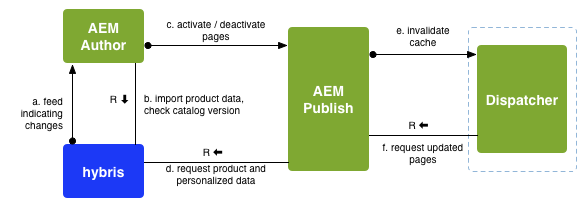

# Desenvolvimento com o SAP Commerce Cloud {#developing-with-sap-commerce-cloud}

>[!NOTE]
>
>A estrutura de comércio eletrônico pode ser usada com qualquer solução de comércio eletrônico. Certos detalhes e exemplos tratados aqui referem-se à solução de [híbridos](https://www.hybris.com/) .

A estrutura de integração inclui uma camada de integração com uma API. Isso permite que você:

* conecte um sistema de eCommerce e extraia dados de produtos para AEM
* criar componentes AEM para recursos de comércio, independentemente do mecanismo de eCommerce específico


>[!NOTE]
>
>[A documentação](/help/sites-developing/ecommerce.md#api-documentation) da API também está disponível.

Vários componentes predefinidos AEM são fornecidos para usar a camada de integração. Atualmente, eles são:

* um componente de exibição de produto
* um carrinho de compras
* check-out

Para pesquisar, é fornecido um gancho de integração que permite usar a pesquisa AEM, a pesquisa do sistema de comércio eletrônico, uma pesquisa de terceiros (como Search&amp;Promote) ou uma combinação desses itens.

## Seleção do mecanismo de comércio eletrônico {#ecommerce-engine-selection}

A estrutura eCommerce pode ser usada com qualquer solução de eCommerce, o mecanismo usado precisa ser identificável por AEM:

* Os mecanismos de comércio eletrônico são serviços OSGi que oferecem suporte à `CommerceService` interface

   * Os mecanismos podem ser diferenciados por uma propriedade `commerceProvider` de serviço

* AEM suporte `Resource.adaptTo()` para `CommerceService` e `Product`

   * A `adaptTo` implementação procura uma `cq:commerceProvider` propriedade na hierarquia do recurso:

      * Se encontrado, o valor é usado para filtrar a pesquisa do serviço de comércio.
      * Se não for encontrado, o serviço de comércio classificado mais alto será usado.
   * Uma `cq:Commerce` combinação é usada para que o `cq:commerceProvider` possa ser adicionado a recursos com um tipo muito restrito.


* A `cq:commerceProvider` propriedade é também utilizada para fazer referência à definição de fábrica de comércio adequada.

   * Por exemplo, uma `cq:commerceProvider` propriedade com o valor `hybris` se correlacionará à configuração OSGi para **Day CQ Commerce Fatory for Hybris** (com.adobe.cq.commerce.hybris.impl.HybrisServiceFactory) - onde o parâmetro `commerceProvider` também tem o valor `hybris`.

   * Aqui, outras propriedades, como a versão **do** Catálogo, podem ser configuradas (quando apropriado e disponível).

Consulte os seguintes exemplos abaixo:

| `cq:commerceProvider = geometrixx` | numa instalação normal AEM é necessária uma implementação específica; por exemplo, o exemplo geometrixx, que inclui extensões mínimas para a API genérica |
|---|---|
| `cq:commerceProvider = hybris` | implementação do hybris |

### Exemplo {#example}

```shell
/content/store
+ cq:commerceProvider = hybris
  + mens
    + polo-shirt-1
    + polo-shirt-2
    + employee
+ cq:commerceProvider = jcr
  + adobe-logo-shirt
    + cq:commerceType = product
    + price = 12.50
  + adobe-logo-shirt_S
    + cq:commerceType = variant
    + size = S
  + adobe-logo-shirt_XL
    + cq:commerceType = variant
    + size = XL
    + price = 14.50
```

>[!NOTE]
>
>Usando o CRXDE Lite, você pode ver como isso é tratado no componente do produto para a implementação de hybris:
>
>`/apps/geometrixx-outdoors/components/hybris/product/product.jsp`

### Desenvolvimento para híbridos 4 {#developing-for-hybris}

A extensão hybris do eCommerce Integration Framework foi atualizada para suportar o Hybris 5, mantendo a compatibilidade retroativa com o Hybris 4.

As configurações padrão no código são ajustadas para Hybris 5.

Para desenvolver para Hybris 4 é necessário o seguinte:

* Ao chamar o maven, adicione o seguinte argumento de linha de comando ao comando

   `-P hybris4`

   Ele baixa a distribuição pré-configurada do Hybris 4 e a incorpora ao pacote `cq-commerce-hybris-server`.

* No gerenciador de configuração OSGi:

   * Desative o suporte para Hybris 5 para o serviço Parser de resposta padrão.
   * Verifique se o serviço Hybris Basic Authentication Handler tem uma classificação de serviço inferior ao serviço Hybris OAuth Handler.

### Manuseio de sessão {#session-handling}

hybris usa uma sessão do usuário para armazenar informações como o carrinho de compras do cliente. A ID da sessão é retornada de híbridos em um `JSESSIONID` cookie que precisa ser enviado em solicitações subsequentes para hipbris. Para evitar o armazenamento da ID da sessão no repositório, ela é codificada em outro cookie armazenado no navegador do comprador. As seguintes etapas são executadas:

* Na primeira solicitação, nenhum cookie é definido na solicitação do comprador; portanto, uma solicitação é enviada para a instância hybris para criar uma sessão.
* Os cookies de sessão são extraídos da resposta, codificados em um novo cookie (por exemplo, `hybris-session-rest`) e definidos na resposta ao comprador. A codificação em um novo cookie é necessária, pois o cookie original é válido somente para um determinado caminho e, de outra forma, não seria enviado de volta do navegador em solicitações subsequentes. As informações de caminho também devem ser adicionadas ao valor do cookie.
* Em solicitações subsequentes, os cookies são decodificados dos `hybris-session-<*xxx*>` cookies e definidos no cliente HTTP usado para solicitar dados de híbridos.

>[!NOTE]
>
>Uma nova sessão anônima é criada quando a sessão original não é mais válida.

#### CommerceSession {#commercesession}

* Esta sessão &quot;é proprietária&quot; do carrinho de **compras**

   * realiza add/remove/etc
   * realiza os vários cálculos no carrinho;

      `commerceSession.getProductPrice(Product product)`

* Possui o local *do* armazenamento para os dados do **pedido**

   `CommerceSession.getUserContext()`

* Também possui a conexão de processamento de **pagamento**
* Também possui a conexão de **execução**

### Sincronização e publicação do produto {#product-synchronization-and-publishing}

Os dados do produto que são mantidos em híbridos precisam estar disponíveis em AEM. Foi implementado o seguinte mecanismo:

* Uma carga inicial de IDs é fornecida por híbridos como um feed. Pode haver atualizações neste feed.
* os híbridos fornecerão informações de atualização por meio de um feed (que AEM pesquisas).
* Quando o AEM estiver usando dados de produto, ele enviará solicitações de volta aos híbridos para os dados atuais (solicitação de obtenção condicional usando a última data modificada).
* Em hiperbilidades é possível especificar o conteúdo do feed de forma declarativa.
* O mapeamento da estrutura do feed para o modelo de conteúdo AEM acontece no adaptador do feed no lado AEM.



* O importador (b) é usado para a configuração inicial da estrutura em árvore de páginas em AEM para catálogos.
* As alterações de catálogo em híbridos são indicadas para AEM por meio de um feed, propagando-se então para AEM (b)

   * Produto adicionado/excluído/alterado em relação à versão do catálogo.
   * Produto aprovado.

* A extensão hybris fornece um importador de pesquisas (esquema &quot;hybris&quot;), que pode ser configurado para importar alterações para AEM em um intervalo especificado (por exemplo, a cada 24 horas, onde o intervalo é especificado em segundos):

   * 

      ```js
      http://localhost:4502/content/geometrixx-outdoors/en_US/jcr:content.json
       {
       * "jcr:mixinTypes": ["cq:PollConfig"],
       * "enabled": true,
       * "source": "hybris:outdoors",
       * "jcr:primaryType": "cq:PageContent",
       * "interval": 86400
       }
      ```

* A configuração do catálogo no AEM reconhece as versões do catálogo **Staged** e **Online** .

* A sincronização de produtos entre versões de catálogo exigirá uma (des)ativação da página de AEM correspondente (a, c)

   * A adição de um produto a uma versão de catálogo **on-line** requer a ativação da página do produto.
   * A remoção de um produto requer a desativação.

* A ativação de uma página no AEM (c) requer uma verificação (b) e só é possível se

   * O produto está em uma versão de catálogo **on-line** para páginas de produtos.
   * Os produtos referenciados estão disponíveis em uma versão de catálogo **on-line** para outras páginas (por exemplo, páginas de campanha).

* As páginas de produtos ativadas precisam acessar a versão **on-line** (d) dos dados do produto.

* A instância de publicação de AEM exige acesso a híbridos para recuperação de produtos e dados personalizados (d).

### Arquitetura {#architecture}

#### Arquitetura de produtos e variantes {#architecture-of-product-and-variants}

Um único produto pode apresentar variações múltiplas; por exemplo, pode variar de acordo com a cor e/ou o tamanho. Um produto deve definir as propriedades que determinam a variação; chamamos estes eixos *variantes*.

No entanto, nem todas as propriedades são eixos variantes. As variações também podem afetar outras propriedades; por exemplo, o preço pode depender do tamanho. Estas propriedades não podem ser selecionadas pelo comprador, pelo que não são consideradas eixos variantes.

Cada produto e/ou variante é representado por um recurso e, portanto, mapeia 1:1 para um nó de repositório. É corolário que um produto e/ou variante específicos possam ser identificados exclusivamente pelo seu caminho.

O produto/recurso variante nem sempre contém os dados reais do produto. Pode ser uma representação dos dados realmente mantidos em outro sistema (como híbridos). Por exemplo, descrições de produtos, preços etc. não são armazenados em AEM, mas recuperados em tempo real do mecanismo de comércio eletrônico.

Qualquer recurso de produto pode ser representado por um `Product API`. A maioria das chamadas na API do produto é específica para variações (embora as variações possam herdar valores compartilhados de um ancestral), mas também há chamadas que listas o conjunto de variações ( `getVariantAxes()`, `getVariants()`, etc.).

>[!NOTE]
>
>Com efeito, os eixos variantes são determinados pelo que quer que `Product.getVariantAxes()` retorne:
>
>* hybris o define para a implementação de hybris
>
>
While products (in general) can have many variant axes, the out-of-the-box product component only handles two:
>
>1. `size`
   >
   >
1. mais um
>
>   
Esta variante adicional é selecionada através da `variationAxis` propriedade da referência do produto (geralmente `color` para Geometrixx Outdoors).

#### Referências do produto e dados do produto {#product-references-and-product-data}

Em geral:

* product data is located under `/etc`

* e referências de produto em `/content`.

Deve haver um mapa 1:1 entre variações do produto e nós de dados do produto.

As referências de produto também devem ter um nó para cada variação apresentada - mas não há necessidade de apresentar todas as variações. Por exemplo, se um produto tem variações S, M, L, os dados do produto podem ser.

```shell
etc
|──commerce
|  |──products
|     |──shirt
|       |──shirt-s
|       |──shirt-m
|       |──shirt-l
```

Enquanto um catálogo &quot;Grande e Alto&quot; pode ter apenas.

```shell
content
|──big-and-tall
|  |──shirt
|     |──shirt-l
```

Por fim, não há necessidade de usar os dados do produto. É possível colocar todos os dados do produto sob as referências no catálogo; mas não é possível ter vários catálogos sem duplicar todos os dados do produto.

**API**

#### com.adobe.cq.commerce.api.Interface do produto {#com-adobe-cq-commerce-api-product-interface}

```java
public interface Product extends Adaptable {

    public String getPath();            // path to specific variation
    public String getPagePath();        // path to presentation page for all variations
    public String getSKU();             // unique ID of specific variation

    public String getTitle();           // shortcut to getProperty(TITLE)
    public String getDescription();     // shortcut to getProperty(DESCRIPTION)
    public String getImageUrl();        // shortcut to getProperty(IMAGE_URL)
    public String getThumbnailUrl();    // shortcut to getProperty(THUMBNAIL_URL)

    public <T> T getProperty(String name, Class<T> type);

    public Iterator<String> getVariantAxes();
    public boolean axisIsVariant(String axis);
    public Iterator<Product> getVariants(VariantFilter filter) throws CommerceException;
}
```

#### com.adobe.cq.commerce.api.VariantFilter  {#com-adobe-cq-commerce-api-variantfilter}

```java
/**
 * Interface for filtering variants and AxisFilter provided as common implementation
 *
 * The <code>VariantFilter</code> is used to filter variants,
 * e.g. when using {@link Product#getVariants(VariantFilter filter)}.
 */
public interface VariantFilter {
    public boolean includes(Product product);
}

/**
 * A {@link VariantFilter} for filtering variants by the given
 * axis and value. The following example returns a list of
 * variant products that have a value of <i>blue</i> on the
 * <i>color</i> axis.
 *
 * <p>
 * <code>product.getVariants(new AxisFilter("color", "blue"));</code>
 */
public class AxisFilter implements VariantFilter {

    private String axis;
    private String value;

    public AxisFilter(String axis, String value) {
        this.axis = axis;
        this.value = value;
    }

    /**
     * {@inheritDoc}
     */
    public boolean includes(Product product) {
        ValueMap values = product.adaptTo(ValueMap.class);

        if(values != null) {
            String v = values.get(axis, String.class);

            return v != null && v == value;
        }

        return false;
    }
}
```

* **General Storage Mechanism**

   * Product nodes are nt:unstructured.
   * Um nó de produto pode ser:

      * A reference, with the product data stored elsewhere:

         * Product references contain a `productData` property, which points to the product data (typically under `/etc/commerce/products`).
         * The product data is hierarchical; product attributes are inherited from a product data node&#39;s ancestors.
         * Product references can also contain local properties, which override those specified in their product data.
      * A product itself:

         * Without a `productData` property.
         * A product node which holds all properties locally (and does not contain a productData property) inherits product attributes directly from its own ancestors.


* **AEM-generic Product Structure**

   * Each variant must have its own leaf node.
   * The product interface represents both products and variants, but the related repository node is specific about which it is.
   * The product node describes the product attributes and variant axes.

#### Exemplo {#example-1}

```shell
+ banyan_shirt
    - cq:commerceType = product
    - cq:productAttributes = [jcr:title, jcr:description, size, price, color]
    - cq:productVariantAxes = [color, size]
    - jcr:title = Banyan Shirt
    - jcr:description = Flowery, all-cotton shirt.
    - price = 14.00
    + banyan_shirt_s
        - cq:commerceType = variant
        - size = S
        + banyan_shirt_s_red
            - cq:commerceType = variant
            - color = red
        + banyan_shirt_s_blue
            - cq:commerceType = variant
            - color = blue
    + banyan_shirt_m
        - cq:commerceType = variant
        - size = M
        + banyan_shirt_m_red
            - cq:commerceType = variant
            - color = red
        + banyan_shirt_m_blue
            - cq:commerceType = variant
            - color = blue
    + banyan_shirt_l
        - cq:commerceType = variant
        - size = L
        + banyan_shirt_l_red
            - cq:commerceType = variant
            - color = red
        + banyan_shirt_l_blue
            - cq:commerceType = variant
            - color = blue
    + banyan_shirt_xl
        - cq:commerceType = variant
        - size = XL
        - price = 18.00
```

#### Architecture of the Shopping Cart {#architecture-of-the-shopping-cart}

**Componentes**

* The shopping cart is owned by the `CommerceSession:`

   * The `CommerceSession` performs add/remove/etc.
   * The `CommerceSession` also performs the various calculations on the cart. ``

* Embora não esteja diretamente relacionado ao carrinho, o usuário também `CommerceSession` deve fornecer informações de preços do catálogo (já que ele possui preços)

   * Pricing might have several modifiers:

      * Quantity discounts.
      * Different currencies.
      * VAT-liable and VAT-free.
   * The modifiers are completely open-ended with the following interface:

      * `int CommerceSession.getQuantityBreakpoints(Product product)`
      * `String CommerceSession.getProductPrice(Product product)`


**Armazenamento**

* Armazenamento

   * No caso hybris, o servidor hybris é proprietário do carrinho.
   * No AEM-genérico, os cartões de memória são armazenados no [ClientContext](/help/sites-administering/client-context.md).

**Personalização**

* Personalization should always be driven through the [ClientContext](/help/sites-administering/client-context.md).
* A ClientContext `/version/` of the cart is created in all cases:

   * Products should be added by using the `CommerceSession.addCartEntry()` method.

* The following illustrates an example of cart information in the ClientContext cart:


#### Architecture of Checkout {#architecture-of-checkout}

**Cart and Order Data**

The `CommerceSession` owns the three elements:

1. Cart contents
1. Pricing
1. The order details

1. **Conteúdo do carrinho**

   The cart contents schema is fixed by the API:

   ```java
   public void addCartEntry(Product product, int quantity);
   public void modifyCartEntry(int entryNumber, int quantity);
   public void deleteCartEntry(int entryNumber);
   ```

1. **Pricing**

   O schema de preços também é corrigido pela API:

   ```java
   public String getCartPreTaxPrice();
   public String getCartTax();
   public String getCartTotalPrice();
   public String getOrderShipping();
   public String getOrderTotalTax();
   public String getOrderTotalPrice();
   ```

1. **Detalhes do pedido**

   No entanto, os detalhes do pedido *não* são corrigidos pela API:

   ```java
   public void updateOrderDetails(Map<String, String> orderDetails);
   public Map<String, String> getOrderDetails();
   public void submitOrder();
   ```

**Shipping Calculations**

* Order forms often need to present multiple shipping options (and prices).
* The prices might be based on items and details of the order, such as weight and/or delivery address.
* The `CommerceSession` has access to all the dependencies, so it can be treated in a similar manner as product pricing:

   * O `CommerceSession` proprietário é o preço de remessa.
   * Can retrieve/update delivery details by using `updateOrder(Map<String, Object> delta)`

>[!NOTE]
>
>Você poderia implementar um seletor de envio. por exemplo:
>
>`yourProject/commerce/components/shippingpicker`:
>
>* Essentially this could be a copy of `foundation/components/form/radio`, but with callbacks to the `CommerceSession` for:
   >
   >
* Verificando se o método está disponível
>* Adding pricing information
>* To enable shoppers to update the order page in AEM (including the superset of shipping methods and the text describing them), while still having the control to expose the relevant `CommerceSession` information.


**Processamento de pagamento**

* The `CommerceSession` also owns the payment processing connection.
* Os implementadores devem adicionar convites específicos (ao serviço de processamento de pagamentos por eles escolhido) à `CommerceSession` implementação.

**Preenchimento do pedido**

* The `CommerceSession` also owns the fulfillment connection.
* Implementors will need to add specific calls (to their chosen payment processing service) to the `CommerceSession` implementation.

### Search Definition {#search-definition}

Following the standard service API model, the eCommerce project provides a set of search-related APIs that can be implemented by individual commerce engines.

>[!NOTE]
>
>Currently, only the hybris engine implements the search API out-of-the-box.
>
>No entanto, a API de pesquisa é genérica e pode ser implementada por cada CommerceService individualmente.

The eCommerce project contains a default search component, located in:

`/libs/commerce/components/search`


Isso usa a API de pesquisa para query do mecanismo de comércio selecionado (consulte Seleção [do mecanismo de](#ecommerce-engine-selection)comércio eletrônico):

#### Search API {#search-api}

There are several generic / helper classes provided by the core project:

1. `CommerceQuery`

   Is used to describe a search query (contains information about the query text, current page, page size, sort and selected facets). All eCommerce services that implement the search API will receive instances of this class in order to perform their search. A `CommerceQuery` can be instantiated from a request object ( `HttpServletRequest`).

1. `FacetParamHelper`

   É uma classe de utilitário que fornece um método estático - `toParams` - que é usado para gerar strings de `GET` parâmetro de uma lista de aspectos e um valor alternado. Isso é útil na interface do usuário, onde é necessário exibir um hiperlink para cada valor de cada aspecto, de modo que quando o usuário clica no hiperlink o respectivo valor é alternado (isto é, se foi selecionado, ele é removido do query, caso contrário é adicionado). This takes care of all the logic of handling multiple/single-valued facets, overriding values, etc.

O ponto de entrada da API de pesquisa é o `CommerceService#search` método que retorna um `CommerceResult` objeto. See the [API Documentation](/help/sites-developing/ecommerce.md#api-documentation) for more information on this topic.

### User Integration {#user-integration}

Integration is provided between AEM and various eCommerce systems. This requires a strategy for synchronizing shoppers between the various systems so that AEM-specific code only has to know about AEM and vice-versa:

* Autenticação

   AEM is presumed to be the *only* web front-end and therefore performs *all* authentication.

* Contas em Hybris

   AEM cria uma conta correspondente (secundária) em híbridos para cada comprador. The username of this account is the same as the AEM username. Uma senha criptograficamente aleatória é gerada automaticamente e armazenada (criptografada) no AEM.

#### Usuários pré-existentes {#pre-existing-users}

Um front-end AEM pode ser posicionado na frente de uma implementação de hybris existente. Além disso, é possível adicionar um mecanismo hybris a uma instalação AEM existente. Para fazer isso, os sistemas devem ser capazes de lidar com os usuários existentes em qualquer sistema:

* AEM -> híbridos

   * Ao fazer logon em híbridos, se o usuário AEM ainda não existir:

      * criar um novo usuário hybris com uma senha aleatória criptografada
      * armazene o nome de usuário hybris no diretório de usuário do AEM
   * Consulte: `com.adobe.cq.commerce.hybris.impl.HybrisSessionImpl#login()`


* hybris -> AEM

   * Ao fazer logon no AEM, se o sistema reconhecer o usuário:

      * tentativa de fazer logon em hiperlinks com o nome de usuário/pwd fornecido
      * se bem-sucedido, crie o novo usuário no AEM com a mesma senha (sal específico para AEM resultará em hash específico para AEM)
   * O algoritmo acima é implementado em um Sling `AuthenticationInfoPostProcessor`

      * Consulte: `com.adobe.cq.commerce.hybris.impl.user.LazyUserImporter.java`


### Personalização do processo de importação {#customizing-the-import-process}

Para aproveitar a funcionalidade existente, seu manipulador de importação personalizado:

* tem que implementar a `ImportHandler` interface

* pode estender o `DefaultImportHandler`.

```java
/**
 * Services implementing the <code>ImportHandler</code> interface are
 * called by the {@link HybrisImporter} to create actual commerce entities
 * such as products.
 */
public interface ImportHandler {

  /**
  * Not used.
  */
  public void createTaxonomie(ImporterContext ctx);

  /**
  * Creates a catalog with the given name.
  * @param ctx   The importer context
  * @param name  The catalog's name
  * @return Path of created catalog
  */
  public String createCatalog(ImporterContext ctx, String name) throws Exception;

  /**
  * Creates a product from the given values.
  * @param ctx                The importer context
  * @param values             The product's properties
  * @param parentCategoryPath The containing category's path
  * @return Path of created product
  */
  public String createProduct(ImporterContext ctx, ValueMap values, String parentCategoryPath) throws Exception;

  /**
  * Creates a variant product from the given values.
  * @param ctx             The importer context
  * @param values          The product's properties
  * @param baseProductPath The base product's path
  * @return Path of created product
  */
  public String createVariantProduct(ImporterContext ctx, ValueMap values, String baseProductPath) throws Exception;

  /**
  * Creates an asset for a product. This is usually a product
  * image.
  * @param ctx             The importer context
  * @param values          The product's properties
  * @param baseProductPath The product's path
  * @return Path of created asset
  */
  public String createAsset(ImporterContext ctx, ValueMap values, String productPath) throws Exception;

  /**
  * Creates a category from the given values.
  * @param ctx           The importer context
  * @param values        The category's properties
  * @param parentPath    Path of parent category or base path of import in case of root category
  * @return Path of created category
  */
  public String createCategory(ImporterContext ctx, ValueMap values, String parentCategoryPath) throws Exception;
}
```

Para que seu manipulador personalizado seja reconhecido pelo importador, ele deve especificar a `service.ranking`propriedade com um valor superior a 0; por exemplo.

```java
@Component
@Service
@Property(name = "service.ranking", value = 100)
public class MyImportHandler extends DefaultImportHandler
{
...
}
```
