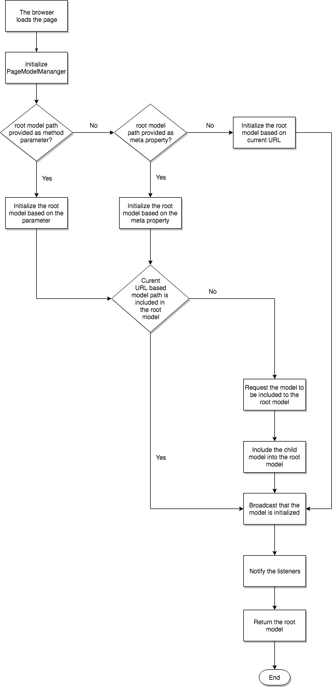

# Blueprint do SPA{#spa-blueprint}

Para permitir que o autor use o Editor de SPA AEM para editar o conteúdo de um SPA, há requisitos que o SPA deve atender, que são descritos neste documento.

>[!NOTE]
>
>O Editor de SPA é a solução recomendada para projetos que exigem renderização no lado do cliente baseada na estrutura SPA (por exemplo, React ou Angular).

## Introdução {#introduction}

Este documento descreve o contrato geral que qualquer estrutura SPA deve cumprir (ou seja, o tipo de camada de suporte de AEM) para implementar componentes SPA editáveis dentro do AEM.

>[!NOTE]
>
>Os requisitos a seguir são independentes de estrutura. Se esses requisitos forem atendidos, uma camada específica da estrutura composta por módulos, componentes e serviços poderá ser fornecida.
>
>**Estes requisitos já são cumpridos para os quadros do React e do Angular no AEM.** Os requisitos neste blueprint só são relevantes se você quiser implementar outra estrutura para uso com AEM.

>[!CAUTION]
>
>Embora as capacidades de AEM do SPA sejam independentes de estrutura, atualmente apenas as estruturas do React e do Angular são compatíveis.

Para permitir que o autor use o Editor de páginas AEM para editar os dados expostos por uma estrutura de Aplicativo de página única, um projeto deve ser capaz de interpretar a estrutura do modelo que representa a semântica dos dados armazenados para um aplicativo no repositório AEM. Para atingir essa meta, duas bibliotecas independentes de estrutura são fornecidas: a `PageModelManager` e a variável `ComponentMapping`.

### PageModelManager {#pagemodelmanager}

A variável `PageModelManager` A biblioteca do é fornecida como um pacote NPM para ser usado por um projeto SPA. Ele acompanha o SPA e serve como um gerenciador de modelo de dados.

Em nome do SPA, ele abstrai a recuperação e o gerenciamento da estrutura JSON que representa a estrutura de conteúdo real. Ele também é responsável pela sincronização com o SPA para informar quando é necessário renderizar novamente seus componentes.

Consulte o pacote NPM [@adobe/aem-spa-page-model-manager](https://www.npmjs.com/package/@adobe/aem-spa-page-model-manager)

Ao inicializar o `PageModelManager`, a biblioteca carrega primeiro o modelo raiz fornecido do aplicativo (por meio de parâmetro, metapropriedade ou URL atual). Se a biblioteca identificar que o modelo da página atual não faz parte do modelo raiz que ela busca e a inclui como o modelo de uma página secundária.



### ComponentMapping {#componentmapping}

A variável `ComponentMapping` O módulo é fornecido como um pacote NPM para o projeto de front-end. Ele armazena componentes de front-end e fornece uma maneira de o SPA mapear componentes de front-end para tipos de recursos AEM. Isso permite uma resolução dinâmica de componentes ao analisar o modelo JSON do aplicativo.

Cada item presente no modelo contém um `:type` campo que expõe um tipo de recurso AEM. Quando montado, o componente de front-end pode ser renderizado usando o fragmento de modelo que recebeu das bibliotecas subjacentes.

#### Modelo dinâmico para mapeamento de componentes {#dynamic-model-to-component-mapping}

Para obter detalhes sobre como o modelo dinâmico para o mapeamento de componentes ocorre no SDK SPA do JavaScript para AEM, consulte o artigo [Modelo dinâmico para mapeamento de componentes para SPA](/help/sites-developing/spa-dynamic-model-to-component-mapping.md).

### Camada específica da estrutura {#framework-specific-layer}

Uma terceira camada deve ser implementada para cada estrutura de front-end. Essa terceira biblioteca é responsável por interagir com as bibliotecas subjacentes e fornecer uma série de pontos de entrada bem integrados e fáceis de usar para interagir com o modelo de dados.

O restante deste documento descreve os requisitos desta camada específica da estrutura intermediária e deseja ser independente da estrutura. Respeitando os seguintes requisitos, uma camada específica da estrutura pode ser fornecida para que os componentes do projeto interajam com as bibliotecas subjacentes responsáveis pelo gerenciamento do modelo de dados.

## Conceitos gerais {#general-concepts}

### Modelo da página {#page-model}

A estrutura de conteúdo da página é armazenada no AEM. O modelo da página é usado para mapear e instanciar componentes do SPA. Os desenvolvedores do SPA criam componentes do SPA que são mapeados para componentes do AEM. Para fazer isso, eles usam o tipo de recurso (ou caminho para o componente AEM) como uma chave exclusiva.

Os componentes do SPA devem estar sincronizados com o modelo de página e ser atualizados de acordo com quaisquer alterações em seu conteúdo. Um padrão que utiliza componentes dinâmicos deve ser usado para instanciar componentes em tempo real, seguindo a estrutura do modelo de página fornecida.

### Metacampos {#meta-fields}

O modelo de página aproveita o Exportador de modelo JSON, que é baseado no [Modelo Sling](https://sling.apache.org/documentation/bundles/models.html) API. Os modelos do sling exportáveis expõem a seguinte lista de campos para permitir que as bibliotecas subjacentes interpretem o modelo de dados:

* `:type`: Tipo de recurso do AEM (padrão = tipo de recurso)
* `:children`: filhos hierárquicos do recurso atual. Os filhos não fazem parte do conteúdo interno do recurso atual (pode ser encontrado em itens que representam uma página)
* `:hierarchyType`: Tipo hierárquico de um recurso. A variável `PageModelManager` suporta atualmente o tipo de página

* `:items`: recursos de conteúdo filho do recurso atual (estrutura aninhada, presente somente em contêineres)
* `:itemsOrder`: lista ordenada dos filhos. O objeto de mapa JSON não garante a ordem de seus campos. Com o mapa e o array atual, o consumidor da API tem os benefícios de ambas as estruturas
* `:path`: caminho de conteúdo de um item (presente nos itens que representam uma página)

Consulte também [Introdução aos serviços de conteúdo AEM.](https://helpx.adobe.com/experience-manager/kt/sites/using/content-services-tutorial-use.html)

### Módulo específico da estrutura {#framework-specific-module}

A separação de preocupações ajuda a facilitar a implementação do projeto. Portanto, um pacote específico de npm deve ser fornecido. Este pacote é responsável pela agregação e exposição dos módulos básicos, serviços e componentes. Esses componentes devem encapsular a lógica de gerenciamento do modelo de dados e fornecer acesso aos dados que o componente do projeto está esperando. O módulo também é responsável por expor transitivamente pontos de entrada úteis das bibliotecas subjacentes.

Para facilitar a interoperabilidade das bibliotecas, Adobe aconselha o módulo específico da estrutura para agrupar as seguintes bibliotecas. Se necessário, a camada pode encapsular e adaptar as APIs subjacentes antes de expô-las ao projeto.

* [@adobe/aem-spa-page-model-manager](https://www.npmjs.com/package/@adobe/aem-spa-page-model-manager)
* [@adobe/aem-spa-component-mapping](https://www.npmjs.com/package/@adobe/aem-spa-component-mapping)

#### Implementações {#implementations}

#### React {#react}

módulo npm: [@adobe/aem-response-editable-components](https://www.npmjs.com/package/@adobe/aem-react-editable-components)

#### Angular {#angular}

módulo npm: [@adobe/aem-angular-editable-components](https://www.npmjs.com/package/@adobe/aem-angular-editable-components)

## Principais serviços e componentes {#main-services-and-components}

As seguintes entidades devem ser implementadas em conformidade com as orientações específicas de cada quadro. Com base na arquitetura da estrutura, a implementação pode variar amplamente, mas as funcionalidades descritas devem ser fornecidas.

### O provedor do modelo {#the-model-provider}

Os componentes do projeto devem delegar acesso aos fragmentos de um modelo a um Provedor de modelo. O Provedor de modelos é então encarregado de acompanhar as alterações feitas no fragmento especificado do modelo e retornar o modelo atualizado para o componente de delegação.

Para fazer isso, o Provedor de modelo deve se registrar na ` [PageModelManager](/help/sites-developing/spa-blueprint.md#pagemodelmanager)`. Em seguida, quando ocorrer uma alteração, ela receberá e transmitirá os dados atualizados para o componente de delegação. Por convenção, a propriedade disponibilizada para o componente de delegação que carregará o fragmento de modelo é chamada de `cqModel`. A implementação é livre para fornecer essa propriedade ao componente, mas deve considerar aspectos como a integração com a arquitetura da estrutura, a descoberta e a facilidade de uso.

### O decorador de HTML do componente {#the-component-html-decorator}

O decorador de componentes é responsável por decorar o HTML externo do elemento de cada ocorrência de componente com uma série de atributos de dados e nomes de classe esperados pelo Editor de páginas.

#### Declaração de componente {#component-declaration}

Os metadados a seguir devem ser adicionados ao elemento de HTML externo produzido pelo componente do projeto. Eles permitem que o Editor de páginas recupere a configuração de edição correspondente.

* `data-cq-data-path`: Caminho para o recurso relativo ao `jcr:content`

#### Declaração de recurso de edição e marcador de posição {#editing-capability-declaration-and-placeholder}

Os metadados e nomes de classe a seguir devem ser adicionados ao elemento de HTML externo produzido pelo componente do projeto. Eles permitem que o Editor de páginas ofereça funcionalidades relacionadas.

* `cq-placeholder`: nome da classe que identifica o espaço reservado para um componente vazio
* `data-emptytext`: rótulo a ser exibido pela sobreposição quando uma instância de componente estiver vazia

**Espaço reservado para Componentes vazios**

Cada componente deve ser estendido com uma funcionalidade que decorará o elemento de HTML externo com atributos de dados e nomes de classe específicos para espaços reservados e sobreposições relacionadas quando o componente for identificado como vazio.

**Sobre o vazio de um componente**

* O componente está logicamente vazio?
* O que deve ser o rótulo exibido pela sobreposição quando o componente estiver vazio?

### Contêiner {#container}

Um contêiner é um componente destinado a conter e renderizar componentes filhos. Para fazer isso, o contêiner itera sobre o `:itemsOrder`, `:items` e `:children` propriedades de seu modelo.

O contêiner obtém dinamicamente os componentes filhos do armazenamento do [`ComponentMapping`](/help/sites-developing/spa-blueprint.md#componentmapping) biblioteca. O contêiner estende o componente filho com os recursos do Provedor de modelo e finalmente o instancia.

### Página {#page}

A variável `Page` O componente estende a `Container` componente. Um contêiner é um componente destinado a conter e renderizar componentes filhos, incluindo páginas filhas. Para fazer isso, o contêiner itera sobre o `:itemsOrder`, `:items`, e `:children` propriedades de seu modelo. A variável `Page` O componente obtém dinamicamente os componentes filhos do armazenamento do [ComponentMapping](/help/sites-developing/spa-blueprint.md#componentmapping) biblioteca. A variável `Page` O é responsável pela instanciação de componentes filhos.

### Grade responsiva {#responsive-grid}

O componente de Grade responsiva é um container. Ele contém uma variante específica do Provedor de modelo que representa suas colunas. A Grade responsiva e suas colunas são responsáveis por decorar o elemento de HTML externo do componente do projeto com os nomes de classe específicos contidos no modelo.

O componente de Grade responsiva deve vir pré-mapeado para seu equivalente AEM, pois esse componente é complexo e raramente personalizado.

#### Campos de modelo específicos {#specific-model-fields}

* `gridClassNames:` Nomes de classe fornecidos para a grade responsiva
* `columnClassNames:` Nomes de classe fornecidos para a coluna responsiva

#### Espaço Reservado da Grade Responsiva {#placeholder-of-the-reponsive-grid}

O componente SPA é mapeado para um contêiner gráfico, como a Grade responsiva, e deve adicionar um espaço reservado para filho virtual quando o conteúdo é criado. Quando o conteúdo do SPA é criado pelo Editor de páginas, esse conteúdo é incorporado ao editor usando um iframe e o `data-cq-editor` atributo é adicionado ao nó do documento desse conteúdo. Quando a variável `data-cq-editor` estiver presente, o contêiner deverá incluir um HTMLElement para representar a área com a qual o autor interage ao inserir um novo componente na página.

Por exemplo:

```
<div data-cq-data-path={"path/to/the/responsivegrid/*"} className="new section aem-Grid-newComponent"/>
```

>[!NOTE]
>
>Os nomes de classe usados no exemplo são atualmente exigidos pelo editor de páginas.
>
>* `"new section"`: indica que o elemento atual é o espaço reservado do container
>* `"aem-Grid-newComponent"`: Normaliza o componente para a criação de layout
>

#### Mapeamento de componentes {#component-mapping}

A base subjacente [`Component Mapping`](/help/sites-developing/spa-blueprint.md#componentmapping) biblioteca e seus `MapTo` pode ser encapsulada e estendida para fornecer as funcionalidades relativas à configuração de edição fornecidas junto com a classe de componente atual.

```
const EditConfig = {

    emptyLabel: 'My Component',

    isEmpty: function() {
        return !this.props || !this.props.cqModel || this.props.cqModel.isEmpty;
    }
};

class MyComponent extends Component {

    render() {
        return <div className={'my-component'}></div>;
    }
}

MapTo('component/resource/path')(MyComponent, EditConfig);
```

Na implementação acima, o componente do projeto é estendido com a funcionalidade de vazio antes que o seja realmente registrado na [Mapeamento de componentes](/help/sites-developing/spa-blueprint.md#componentmapping) armazenamento. Isso é feito encapsulando e estendendo o [`ComponentMapping`](/help/sites-developing/spa-blueprint.md#componentmapping) biblioteca para introduzir o apoio do `EditConfig` objeto de configuração:

```
/**
 * Configuration object in charge of providing the necessary data expected by the page editor to initiate the authoring. The provided data will be decorating the associated component
 *
 * @typedef {{}} EditConfig
 * @property {String} [dragDropName]       If defined, adds a specific class name enabling the drag and drop functionality
 * @property {String} emptyLabel           Label to be displayed by the placeholder when the component is empty. Optionally returns an empty text value
 * @property {function} isEmpty            Should the component be considered empty. The function is called using the context of the wrapper component giving you access to the component model
 */

/**
 * Map a React component with the given resource types. If an {@link EditConfig} is provided the <i>clazz</i> is wrapped to provide edition capabilities on the AEM Page Editor
 *
 * @param {string[]} resourceTypes                      - List of resource types for which to use the given <i>clazz</i>
 * @param {class} clazz                                 - Class to be instantiated for the given resource types
 * @param {EditConfig} [editConfig]                     - Configuration object for enabling the edition capabilities
 * @returns {class}                                     - The resulting decorated Class
 */
ComponentMapping.map = function map (resourceTypes, clazz, editConfig) {};
```

## Contrato com o editor de páginas {#contract-with-the-page-editor}

Os componentes do projeto devem gerar, no mínimo, os seguintes atributos de dados para permitir que o editor interaja com eles.

* `data-cq-data-path`: O caminho relativo do componente, conforme fornecido pelo `PageModel` (por exemplo, `"root/responsivegrid/image"`). Esse atributo não deve ser adicionado às páginas.

Em resumo, para ser interpretado pelo editor de páginas como editável, um componente de projeto deve respeitar o seguinte contrato:

* Forneça os atributos esperados para associar uma instância de componente de front-end a um recurso AEM.
* Forneça a série esperada de atributos e nomes de classe que permite a criação de espaços reservados vazios.
* Forneça os nomes de classe esperados, permitindo arrastar e soltar os ativos.

### Estrutura típica do elemento de HTML {#typical-html-element-structure}

O fragmento a seguir ilustra a representação em HTML típica de uma estrutura de conteúdo de página. Estes são alguns pontos importantes:

* O elemento de grade responsivo transporta nomes de classe com o prefixo `aem-Grid--`
* O elemento de coluna responsivo transporta nomes de classe com o prefixo `aem-GridColumn--`
* Uma grade responsiva que também é a coluna de uma grade pai é encapsulada; por exemplo, os dois prefixos anteriores não aparecem no mesmo elemento
* Os elementos correspondentes aos recursos editáveis carregam um `data-cq-data-path` propriedade. Consulte a [Contrato com o editor de páginas](#contract-wtih-the-page-editor) seção deste documento.

```
<div data-cq-data-path="/content/page">
    <div class="aem-Grid aem-Grid--12 aem-Grid--default--12">
        <div class="aem-container aem-GridColumn aem-GridColumn--default--12" data-cq-data-path="/content/page/jcr:content/root/responsivegrid">
            <div class="aem-Grid aem-Grid--12 aem-Grid--default--12">
                <div class="cmp-image cq-dd-image aem-GridColumn aem-GridColumn--default--12" data-cq-data-path="/root/responsivegrid/image">
                    
                </div>
            </div>
        </div>
    </div>
</div>
```

## Navegação e Roteamento {#navigation-and-routing}

O aplicativo é o proprietário do roteamento. Primeiro, o desenvolvedor de front-end precisa implementar um componente de Navegação (mapeado para um componente de navegação AEM). Esse componente renderizaria links de URL a serem usados junto com uma série de rotas que exibirão ou ocultarão fragmentos de conteúdo.

A base subjacente [`PageModelManager`](/help/sites-developing/spa-blueprint.md#pagemodelmanager) biblioteca e seus ` [ModelRouter](/help/sites-developing/spa-routing.md)` Os módulos do (ativados por padrão) são responsáveis por buscar previamente e fornecer acesso ao modelo associado a um determinado caminho de recurso.

As duas entidades estão relacionadas com a noção de ` [ModelRouter](/help/sites-developing/spa-routing.md)` A é responsável apenas por ter o ` [PageModelManager](/help/sites-developing/spa-blueprint.md#pagemodelmanager)` carregado com um modelo de dados estruturado em sincronia com o estado atual do aplicativo.

Consulte o artigo [Roteamento de modelo SPA](/help/sites-developing/spa-routing.md) para obter mais informações.

## SPA em ação {#spa-in-action}

Veja como um SPA simples funciona e experimente você mesmo um SPA seguindo para o documento [SPA Introdução ao AEM](/help/sites-developing/spa-getting-started-react.md).

## Leitura adicional {#further-reading}

Para obter mais informações sobre o AEM no SPA, consulte os seguintes documentos:

* [Visão geral de criação do SPA](/help/sites-developing/spa-overview.md) para obter uma visão geral do AEM no SPA e o modelo de comunicação
* [SPA Introdução ao AEM](/help/sites-developing/spa-getting-started-react.md) para um guia para um SPA simples e como ele funciona
