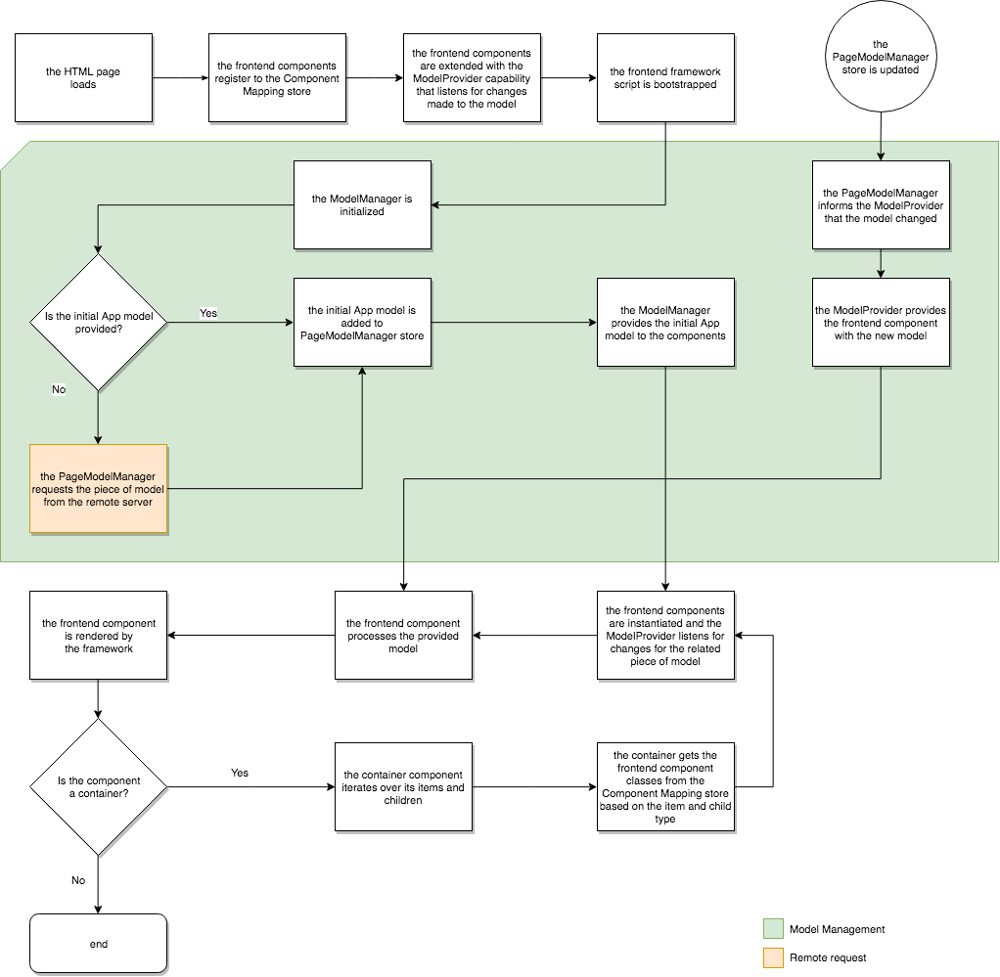

# Modelo dinâmico para mapeamento de componentes para SPA{#dynamic-model-to-component-mapping-for-spas}

Este documento descreve como ocorre o modelo dinâmico de mapeamento de componentes no SDK SPA para Adobe Experience Manager AEM () do JavaScript.

{{ue-over-spa}}

## Módulo ComponentMapping {#componentmapping-module}

O módulo `ComponentMapping` é fornecido como um pacote NPM para o projeto front-end. Ele armazena componentes de front-end e fornece uma maneira para o Aplicativo de página única mapear componentes de front-end para tipos de recursos de AEM. Isso permite uma resolução dinâmica de componentes ao analisar o modelo JSON do aplicativo.

Cada item presente no modelo contém um campo `:type` que expõe um tipo de recurso AEM. Quando montado, o componente de front-end pode ser renderizado usando o fragmento de modelo que recebeu das bibliotecas subjacentes.

Consulte [Blueprint do SPA](/help/sites-developing/spa-blueprint.md) para obter mais informações sobre análise de modelo e acesso do componente front-end ao modelo.

Consulte também o pacote npm: [https://www.npmjs.com/package/@adobe/aem-spa-component-mapping](https://www.npmjs.com/package/@adobe/aem-spa-component-mapping)

## Aplicativo de página única orientado por modelo {#model-driven-single-page-application}

Os aplicativos de página única que usam o JavaScript SPA SDK para AEM são orientados por modelo:

1. Os componentes front-end se registram no [Repositório de Mapeamentos de Componentes](/help/sites-developing/spa-dynamic-model-to-component-mapping.md#componentmapping-module).
1. Em seguida, o [Contêiner](/help/sites-developing/spa-blueprint.md#container), uma vez fornecido com um modelo pelo [Provedor de Modelos](/help/sites-developing/spa-blueprint.md#the-model-provider), itera sobre seu conteúdo de modelo ( `:items`).

1. Se houver uma página, seus filhos ( `:children`) obterão primeiro uma classe de componente do [Mapeamento de Componentes](/help/sites-developing/spa-blueprint.md#componentmapping) e a instanciarão.

## Inicialização do aplicativo {#app-initialization}

Cada componente é estendido com os recursos do [`ModelProvider`](/help/sites-developing/spa-blueprint.md#the-model-provider). A inicialização assume a seguinte forma geral:

1. Cada provedor de modelo se inicializa e escuta as alterações feitas na parte do modelo que corresponde ao componente interno.
1. O [`PageModelManager`](/help/sites-developing/spa-blueprint.md#pagemodelmanager) deve ser inicializado como representado pelo [fluxo de inicialização](/help/sites-developing/spa-blueprint.md).

1. Depois de armazenado, o gerenciador de modelo de página retorna o modelo completo do aplicativo.
1. Este modelo é então passado para o componente raiz de front-end [Container](/help/sites-developing/spa-blueprint.md#container) do aplicativo.
1. Partes do modelo são finalmente propagadas para cada componente filho individual.

