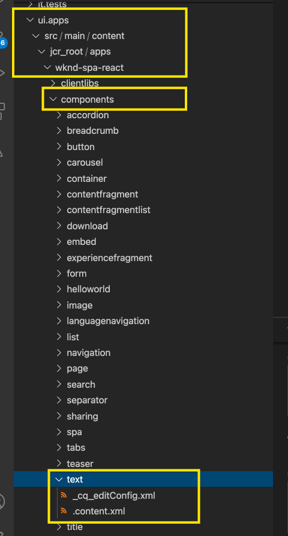

# Editar um SPA externo no AEM {#editing-external-spa-within-aem}

Ao decidir qual nível de integração você gostaria de ter entre seu SPA externo e o AEM, geralmente é necessário poder editar, bem como visualizar o SPA no AEM.

## Visão geral {#overview}

Este documento descreve as etapas recomendadas para carregar um SPA independente em uma instância de AEM, adicionar seções editáveis de conteúdo e ativar a criação.

## Pré-requisitos {#prerequisites}

Os pré-requisitos são simples.

* Verifique se uma instância do AEM está em execução localmente.
* Crie um AEM base SPA projeto usando [o Arquétipo de Projeto AEM.](https://experienceleague.adobe.com/docs/experience-manager-core-components/using/developing/archetype/overview.html?#available-properties)
   * Esta será a base do projeto AEM que será atualizado para incluir a SPA externa.
   * Para as amostras neste documento, estamos usando o ponto de partida de [o projeto de SPA WKND.](https://experienceleague.adobe.com/docs/experience-manager-learn/sites/spa-editor/spa-editor-framework-feature-video-use.html#spa-editor)
* Tenha a SPA funcional e externa React que deseja integrar ao seu alcance.

## Fazer upload de SPA para AEM projeto {#upload-spa-to-aem-project}

Primeiro, você precisa fazer upload do SPA externo para seu projeto AEM.

1. Substitua `src` na pasta do projeto `/ui.frontend` pela pasta `src` do aplicativo React.
1. Inclua quaisquer dependências adicionais no `package.json` do aplicativo no arquivo `/ui.frontend/package.json`.
   * Verifique se as dependências do SDK SPA são de [versões recomendadas.](spa-getting-started-react.md#dependencies)
1. Inclua quaisquer personalizações na pasta `/public`.
1. Inclua todos os scripts ou estilos integrados adicionados no arquivo `/public/index.html`.

## Configure o SPA remoto {#configure-remote-spa}

Agora que o SPA externo faz parte do seu projeto AEM, ele precisa ser configurado dentro do AEM.

### Incluir pacotes SDK do Adobe SPA {#include-spa-sdk-packages}

Para aproveitar AEM recursos SPA, há dependências nos três pacotes a seguir.

* [`@adobe/aem-react-editable-components`](https://github.com/adobe/aem-react-editable-components)
* [`@adobe/aem-spa-component-mapping`](https://www.npmjs.com/package/@adobe/aem-spa-component-mapping)
* [`@adobe/aem-spa-page-model-manager`](https://www.npmjs.com/package/@adobe/aem-spa-model-manager)

`@adobe/aem-spa-page-model-manager` fornece a API para inicializar um Gerenciador de Modelos e recuperar o modelo da instância de AEM. Esse modelo pode ser usado para renderizar componentes AEM usando APIs de `@adobe/aem-react-editable-components` e `@adobe/aem-spa-component-mapping`.

#### Instalação {#installation}

Execute o seguinte comando npm para instalar os pacotes necessários.

```shell
npm install --save @adobe/aem-spa-component-mapping @adobe/aem-spa-page-model-manager @adobe/aem-react-editable-components
```

### Inicialização do ModelManager {#model-manager-initialization}

Antes da renderização do aplicativo, o [`ModelManager`](spa-blueprint.md#pagemodelmanager) precisa ser inicializado para lidar com a criação do AEM `ModelStore`.

Isso precisa ser feito dentro do arquivo `src/index.js` do aplicativo ou onde a raiz do aplicativo for renderizada.

Para isso, podemos usar a API `initializationAsync` fornecida pelo `ModelManager`.

A captura de tela a seguir mostra como habilitar a inicialização do `ModelManager` em um aplicativo React simples. A única restrição é que `initializationAsync` precisa ser chamado antes de `ReactDOM.render()`.


Neste exemplo, `ModelManager` é inicializado e um `ModelStore` vazio é criado.

`initializationAsync` pode aceitar opcionalmente um  `options` objeto como parâmetro:

* `path` - Na inicialização, o modelo no caminho definido é buscado e armazenado no  `ModelStore`. Isso pode ser usado para buscar o `rootModel` na inicialização, se necessário.
* `modelClient` - Permite fornecer um cliente personalizado responsável pela busca do modelo.
* `model` - Um  `model` objeto passado como parâmetro normalmente preenchido ao  [usar o SSR.](spa-ssr.md)

### AEM Componentes de Folha Autorizáveis {#authorable-leaf-components}

1. Crie/identifique um componente AEM para o qual um componente React autorável será criado. Neste exemplo, estamos usando o componente de texto do projeto WKND.

   

1. Crie um componente de texto React simples no SPA. Neste exemplo, um novo arquivo `Text.js` foi criado com o conteúdo a seguir.

   

1. Crie um objeto de configuração para especificar os atributos necessários para habilitar a edição de AEM.

   

   * `resourceType` é obrigatório mapear o componente React para o componente AEM e ativar a edição ao abrir no editor de AEM.

1. Use a função wrapper `withMappable`.

   

   Essa função wrapper mapeia o componente React para o AEM `resourceType` especificado na configuração e ativa os recursos de edição quando aberto no editor de AEM. Para componentes independentes, ele também buscará o conteúdo do modelo para o nó específico.

   >[!NOTE]
   >
   >Neste exemplo, há versões separadas do componente: AEM componentes React embrulhados e desempacotados. A versão encapsulada precisa ser usada ao usar explicitamente o componente. Quando o componente faz parte de uma página, você pode continuar usando o componente padrão, como feito atualmente no editor de SPA.

1. Renderizar conteúdo no componente.

   As propriedades do JCR do componente de texto são exibidas da seguinte maneira no AEM.

   

   Esses valores são passados como propriedades para o componente `AEMText` React recém-criado e podem ser usados para renderizar o conteúdo.

   ```javascript
   import React from 'react';
   import { withMappable } from '@adobe/aem-react-editable-components';
   
   export const TextEditConfig = {
       // Empty component placeholder label
       emptyLabel:'Text', 
       isEmpty:function(props) {
          return !props || !props.text || props.text.trim().length < 1;
       },
       // resourcetype of the AEM counterpart component
       resourceType:'wknd-spa-react/components/text'
   };
   
   const Text = ({ text }) => (<div>{text}</div>);
   
   export default Text;
   
   export const AEMText = withMappable(Text, TextEditConfig);
   ```

   É assim que o componente será exibido quando as configurações de AEM forem concluídas.

   ```javascript
   const Text = ({ cqPath, richText, text }) => {
      const richTextContent = () => (
         <div className="aem_text" id={cqPath.substr(cqPath.lastIndexOf('/') + 1)} data-rte-editelement dangerouslySetInnerHTML={{__html: text}}/>
      );
      return richText ? richTextContent() : (<div className="aem_text">{text}</div>);
   };
   ```

   >[!NOTE]
   >
   >Neste exemplo, fizemos outras personalizações no componente renderizado para corresponder ao componente de texto existente. No entanto, isso não está relacionado à criação no AEM.

#### Adicionar componentes autoráveis à página {#add-authorable-component-to-page}

Depois que os componentes autoráveis do React forem criados, podemos usá-los em todo o aplicativo.

Vamos ver um exemplo de página em que precisamos adicionar um texto do projeto de SPA WKND. Neste exemplo, queremos exibir o texto &quot;Hello World!&quot; em `/content/wknd-spa-react/us/en/home.html`.

1. Determine o caminho do nó a ser exibido.

   * `pagePath`: A página que contém o nó , no nosso exemplo  `/content/wknd-spa-react/us/en/home`
   * `itemPath`: Caminho para o nó na página, em nosso exemplo  `root/responsivegrid/text`
      * Consiste nos nomes dos itens que contêm na página.

   

1. Adicione o componente na posição desejada na página.

   

   O componente `AEMText` pode ser adicionado na posição desejada na página com os valores `pagePath` e `itemPath` definidos como propriedades. `pagePath` é uma propriedade obrigatória.

#### Verificar a edição de conteúdo de texto em AEM {#verify-text-edit}

Agora podemos testar o componente em nossa instância AEM em execução.

1. Execute o seguinte comando Maven no diretório `aem-guides-wknd-spa` para criar e implantar o projeto no AEM.

```shell
mvn clean install -PautoInstallSinglePackage
```

1. Na instância de AEM, navegue até `http://<host>:<port>/editor.html/content/wknd-spa-react/us/en/home.html`.


O componente `AEMText` agora é autorável em AEM.

### AEM páginas autoráveis {#aem-authorable-pages}

1. Identifique uma página a ser adicionada para criação no SPA. Este exemplo usa `/content/wknd-spa-react/us/en/home.html`.
1. Criar um novo arquivo (por exemplo, `Page.js`) para o Componente de página criável. Aqui, podemos reutilizar o Componente de página fornecido em `@adobe/cq-react-editable-components`.
1. Repita a etapa quatro na seção [AEM componentes de folha autoráveis.](#authorable-leaf-components) Use a função wrapper  `withMappable` no componente.
1. Como foi feito anteriormente, aplique `MapTo` aos tipos de recurso AEM para todos os componentes filho na página.

   ```javascript
   import { Page, MapTo, withMappable } from '@adobe/aem-react-editable-components';
   import Text, { TextEditConfig } from './Text';
   
   export default withMappable(Page);
   
   MapTo('wknd-spa-react/components/text')(Text, TextEditConfig);
   ```

   >[!NOTE]
   >
   >Neste exemplo, estamos usando o componente de texto React desvinculado em vez do `AEMText` encurtado criado anteriormente. Isso ocorre porque quando o componente faz parte de uma página/contêiner e não é autônomo, o contêiner cuidará de mapear recursivamente o componente e ativar os recursos de criação, e o invólucro adicional não é necessário para cada filho.

1. Para adicionar uma página criável no SPA, siga as mesmas etapas na seção [Adicionar componentes autoráveis à página.](#add-authorable-component-to-page) Aqui, podemos ignorar a  `itemPath` propriedade.

#### Verificar o conteúdo da página no AEM {#verify-page-content}

Para verificar se a página pode ser editada, siga as mesmas etapas na seção [Verificar a edição do conteúdo de texto em AEM.](#verify-text-edit)


A página agora pode ser editada em AEM com um contêiner de layout e um Componente de texto filho.

### Componentes de Folha Virtual {#virtual-leaf-components}

Nos exemplos anteriores, adicionamos componentes ao SPA com conteúdo de AEM existente. No entanto, há casos em que o conteúdo ainda não foi criado no AEM, mas precisa ser adicionado posteriormente pelo autor de conteúdo. Para acomodar isso, o desenvolvedor de front-end pode adicionar componentes nos locais apropriados no SPA. Esses componentes exibirão espaços reservados quando abertos no editor no AEM. Depois que o conteúdo é adicionado nesses espaços reservados pelo autor de conteúdo, os nós são criados na estrutura do JCR e o conteúdo é persistente. O componente criado permitirá o mesmo conjunto de operações dos componentes de folha independentes.

Neste exemplo, estamos reutilizando o componente `AEMText` criado anteriormente. Queremos que o novo texto seja adicionado abaixo do componente de texto existente na página inicial da WKND. A adição de componentes é idêntica à dos componentes folhosos normais. No entanto, o `itemPath` pode ser atualizado para o caminho em que o novo componente precisa ser adicionado.

Como o novo componente precisa ser adicionado abaixo do texto existente em `root/responsivegrid/text`, o novo caminho seria `root/responsivegrid/{itemName}`.

```html
<AEMText
 pagePath='/content/wknd-spa-react/us/en/home'
 itemPath='root/responsivegrid/text_20' />
```

O componente `TestPage` é semelhante ao seguinte após adicionar o componente virtual.


>[!NOTE]
>
>Verifique se o componente `AEMText` tem seu `resourceType` definido na configuração para habilitar esse recurso.

Agora é possível implantar as alterações no AEM seguindo as etapas da seção [Verificar a edição do conteúdo de texto no AEM.](#verify-text-edit) Um espaço reservado será exibido para o  `text_20` nó atualmente não existente.


Quando o autor de conteúdo atualiza esse componente, um novo nó `text_20` é criado em `root/responsivegrid/text_20` em `/content/wknd-spa-react/us/en/home`.


#### Requisitos e limitações {#limitations}

Há vários requisitos para adicionar componentes de folha virtuais, bem como algumas limitações.

* A propriedade `pagePath` é obrigatória para criar um componente virtual.
* O nó de página fornecido no caminho em `pagePath` deve existir no projeto de AEM.
* O nome do nó a ser criado deve ser fornecido no `itemPath`.
* O componente pode ser criado em qualquer nível.
   * Se fornecermos um `itemPath='text_20'` no exemplo anterior, o novo nó será criado diretamente na página, ou seja, `/content/wknd-spa-react/us/en/home/jcr:content/text_20`
* O caminho para o nó onde um novo nó é criado deve ser válido quando fornecido via `itemPath`.
   * Neste exemplo, `root/responsivegrid` deve existir para que o novo nó `text_20` possa ser criado lá.
* Somente a criação do componente de folha é suportada. O contêiner virtual e a página serão suportados em versões futuras.

## Personalizações adicionais {#additional-customizations}

Se você seguiu os exemplos anteriores, seu SPA externo agora pode ser editado no AEM. No entanto, há aspectos adicionais de seu SPA externo que você pode personalizar ainda mais.

### ID do nó raiz {#root-node-id}

Por padrão, supomos que o aplicativo React seja renderizado dentro de um `div` de ID de elemento `spa-root`. Se necessário, isso pode ser personalizado.

Por exemplo, suponha que temos um SPA em que o aplicativo é renderizado dentro de um `div` de ID de elemento `root`. Isso precisa ser refletido em três arquivos.

1. No `index.js` do aplicativo React (ou onde `ReactDOM.render()` é chamado)

   

1. No `index.html` do aplicativo React

   

1. No corpo do componente de página do aplicativo de AEM, siga duas etapas:

   1. Crie um novo `body.html` para o componente de página.

   

   1. Adicione o novo elemento raiz no novo arquivo `body.html`.

   

### Editar uma SPA React com Roteamento {#editing-react-spa-with-routing}

Se o aplicativo React SPA externo tiver várias páginas, [ele poderá usar o roteamento para determinar a página/componente a ser renderizado.](spa-routing.md) O caso de uso básico é corresponder o URL ativo no momento ao caminho fornecido para uma rota. Para habilitar a edição em tais aplicativos ativados de roteamento, o caminho a ser comparado precisa ser transformado para acomodar informações AEM-específicas.

No exemplo a seguir, temos um aplicativo React simples com duas páginas. A página a ser renderizada é determinada pela correspondência do caminho fornecido ao roteador em relação ao URL ativo. Por exemplo, se estivermos em `mydomain.com/test`, `TestPage` será renderizado.


Para habilitar a edição no AEM para este SPA de exemplo, as etapas a seguir são necessárias.

1. Identifique o nível que atuaria como a raiz no AEM.

   * Para nossa amostra, consideramos `wknd-spa-react/us/en` como a raiz do SPA. Isso significa que tudo antes desse caminho é AEM somente páginas/conteúdo.

1. Crie uma nova página no nível necessário.

   * Neste exemplo, a página a ser editada é `mydomain.com/test`. `test` está no caminho raiz do aplicativo. Isso também precisa ser preservado ao criar a página no AEM. Portanto, podemos criar uma nova página no nível raiz definido na etapa anterior.
   * A nova página criada deve ter o mesmo nome da página a ser editada. Neste exemplo para `mydomain.com/test`, a nova página criada deve ser `/path/to/aem/root/test`.

1. Adicione ajuda no roteamento SPA.

   * A página recém-criada ainda não renderizará o conteúdo esperado no AEM. Isso ocorre porque o roteador espera um caminho de `/test`, enquanto o caminho ativo AEM é `/wknd-spa-react/us/en/test`. Para acomodar a parte específica do AEM do URL, precisamos adicionar alguns auxiliares do lado do SPA.

   

   * A ajuda `toAEMPath` fornecida por `@adobe/cq-spa-page-model-manager` pode ser usada para isso. Transforma o caminho fornecido para roteamento para incluir partes específicas de AEM quando o aplicativo estiver aberto em uma instância de AEM. Ele aceita três parâmetros:
      * O caminho necessário para roteamento
      * O URL de origem da instância de AEM em que o SPA é editado
      * A raiz do projeto no AEM, conforme determinado na primeira etapa
   * Esses valores podem ser definidos como variáveis de ambiente para maior flexibilidade.


1. Verifique a edição da página no AEM.

   * Implante o projeto para AEM e navegue até a página `test` recém-criada. O conteúdo da página agora é renderizado e AEM componentes podem ser editados.

## Recursos adicionais {#additional-resources}

O seguinte material de referência pode ser útil para entender SPA no contexto da AEM.

* [O Arquétipo de Projeto AEM](https://experienceleague.adobe.com/docs/experience-manager-core-components/using/developing/archetype/overview.html)
* [O projeto SPA WKND](https://experienceleague.adobe.com/docs/experience-manager-learn/sites/spa-editor/spa-editor-framework-feature-video-use.html)
* [Introdução ao SPA no AEM usando o React](spa-getting-started-react.md)
* [Materiais de referência SPA (referências de API)](spa-reference-materials.md)
* [SPA Blueprint e PageModelManager](spa-blueprint.md#pagemodelmanager)
* [Roteamento do Modelo de SPA](spa-routing.md)
* [Renderização de SPA e do servidor](spa-ssr.md)
