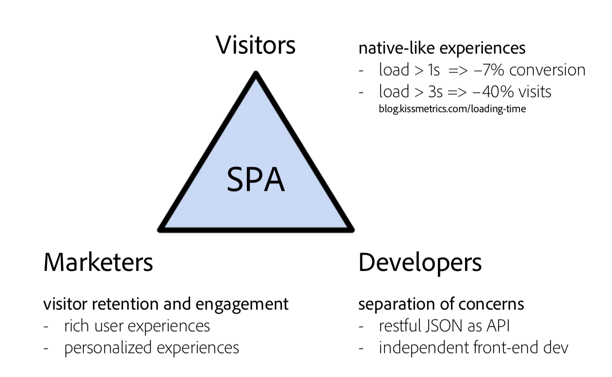

# Introdução ao SPA e Walkthrough{#spa-introduction-and-walkthrough}

Os aplicativos de página única (SPAs) podem oferta experiências interessantes para os usuários do site. Os desenvolvedores desejam criar sites usando estruturas SPA e os autores desejam editar o conteúdo no AEM sem problemas para um site criado usando essas estruturas.

O Editor SPA oferta uma solução abrangente para suportar SPAs no AEM. Este artigo aborda o uso de um aplicativo SPA básico para criação e mostra como ele se relaciona ao editor SPA subjacente.

>[!NOTE]
>
>O Editor SPA é a solução recomendada para projetos que exigem renderização do lado do cliente baseada em estrutura SPA (por exemplo, Reagir ou Angular).

## Introdução {#introduction}

### Objetivo do artigo {#article-objective}

Este artigo apresenta os conceitos básicos de SPAs antes de conduzir o leitor por uma apresentação do editor SPA usando um aplicativo SPA simples para demonstrar a edição básica de conteúdo. Em seguida, ele mergulha na construção da página e como o aplicativo SPA se relaciona e interage com o Editor SPA AEM.

O objetivo desta introdução e apresentação é demonstrar a um desenvolvedor do AEM por que as SPAs são relevantes, como elas geralmente funcionam, como um SPA é manipulado pelo Editor SPA do AEM e como é diferente de um aplicativo AEM padrão.

A apresentação é baseada na funcionalidade padrão do AEM e no aplicativo de amostra do Journal We.Retail. Devem ser cumpridos os seguintes requisitos:

* [AEM versão 6.4 com service pack 2 ou mais recente
   ](/help/release-notes/sp-release-notes.md)
* [Instale a amostra do aplicativo We.Retail Journal disponível no GitHub aqui.](https://github.com/Adobe-Marketing-Cloud/aem-sample-we-retail-journal)

### O que é um SPA? {#what-is-a-spa}

Um aplicativo de página única (SPA) é diferente de uma página convencional, pois é renderizado no lado do cliente e é principalmente controlado pelo Javascript, dependendo das chamadas do Ajax para carregar dados e atualizar dinamicamente a página. A maioria ou todo o conteúdo é recuperado uma vez em um único carregamento de página com recursos adicionais carregados de forma assíncrona, conforme necessário, com base na interação do usuário com a página.

Isso reduz a necessidade de atualizações de página e apresenta uma experiência ao usuário que é simples, rápida e se parece mais com uma experiência de aplicativo nativa.

O Editor SPA do AEM permite que desenvolvedores de front-end criem SPAs que podem ser integrados em um site do AEM, permitindo que os autores de conteúdo editem o conteúdo SPA tão facilmente quanto qualquer outro conteúdo do AEM.

### Por que um SPA? {#why-a-spa}

Ao ser mais rápido, fluido e mais parecido com um aplicativo nativo, um SPA se torna uma experiência muito atraente não apenas para o visitante da página da Web, mas também para profissionais de marketing e desenvolvedores devido à natureza de como os SPAs funcionam.



**Visitantes**

* Os Visitantes querem experiências nativas quando interagem com o conteúdo.
* Há dados claros de que quanto mais rápida uma página, mais provável uma conversão ocorrerá.

**Profissionais de marketing**

* Os profissionais de marketing querem oferta de experiências ricas e nativas para incentivar os visitantes a se envolverem totalmente com o conteúdo.
* A personalização pode tornar essas experiências ainda mais atraentes.

**Desenvolvedores**

* Os desenvolvedores querem uma separação clara entre as preocupações do conteúdo e da apresentação.
* A separação nítida torna o sistema mais extensível e permite o desenvolvimento de front-end independente.

### Como funciona um SPA? {#how-does-a-spa-work}

A ideia principal por trás de um SPA é que as chamadas e a dependência em um servidor são reduzidas para minimizar os atrasos causados pelas chamadas do servidor, de modo que o SPA se aproxime da capacidade de resposta de um aplicativo nativo.

Em uma página da Web tradicional e sequencial, somente os dados necessários para a página imediata são carregados. Isso significa que quando o visitante se move para outra página, o servidor é chamado para os recursos adicionais. Chamadas adicionais podem ser necessárias, já que o visitante interage com elementos na página. Essas chamadas múltiplas podem dar uma sensação de atraso ou atraso, pois a página precisa acompanhar as solicitações do visitante.


Para uma experiência mais fluida, que se aproxima do que um visitante espera de aplicativos móveis nativos, um SPA carrega todos os dados necessários para o visitante na primeira carga. Embora isso possa demorar um pouco mais no início, elimina a necessidade de chamadas de servidor adicionais.

Ao renderizar no lado do cliente, o elemento da página reage mais rapidamente e as interações com a página pelo visitante são imediatas. Quaisquer dados adicionais que possam ser necessários são chamados de forma assíncrona para maximizar a velocidade da página.

>[!NOTE]
>
>Para obter detalhes técnicos sobre como os SPAs funcionam no AEM, consulte o artigo [Introdução aos SPAs no AEM](/help/sites-developing/spa-getting-started-react.md).
>
>Para uma análise mais detalhada do design, arquitetura e fluxo de trabalho técnico do Editor SPA, consulte o artigo Visão geral [do Editor](/help/sites-developing/spa-overview.md)SPA.

## Experiência de edição de conteúdo com SPA {#content-editing-experience-with-spa}

Quando um SPA é criado para aproveitar o editor SPA do AEM, o autor do conteúdo não percebe diferença ao editar e criar conteúdo. A funcionalidade comum do AEM está disponível e nenhuma alteração no fluxo de trabalho do autor é necessária.

>[!NOTE]
>
>A apresentação é baseada na funcionalidade padrão do AEM e no aplicativo de amostra do Journal We.Retail. Devem ser cumpridos os seguintes requisitos:
>
>* [AEM versão 6.4 com service pack 2](/help/release-notes/sp-release-notes.md)
>* [Instale a amostra do aplicativo We.Retail Journal disponível no GitHub aqui.](https://github.com/Adobe-Marketing-Cloud/aem-sample-we-retail-journal)
>


1. Edite o aplicativo Journal We.Retail no AEM.

   `https://localhost:4502/editor.html/content/we-retail-journal/react.html`

   

1. Selecione um componente de cabeçalho e observe que uma barra de ferramentas aparece como para qualquer outro componente. Selecione **Editar**.

   

1. Edite o conteúdo como normal no AEM e observe que as alterações são persistentes.

   

   >[!NOTE]
   >Consulte a Visão geral [do editor](spa-overview.md#requirements-limitations) SPA para obter mais informações sobre o editor de texto e os SPAs no local.

1. Use o Navegador de ativos para arrastar e soltar uma nova imagem em um componente de imagem.

   

1. A alteração é persistente.

   

Ferramentas de criação adicionais, como arrastar e soltar componentes adicionais na página, reorganizar componentes e modificar o layout, são suportadas como em qualquer aplicativo que não seja SPA.

>[!NOTE]
>
>O Editor SPA não modifica o DOM do aplicativo. O próprio SPA é responsável pelo DOM.
>
>Para ver como isso funciona, prossiga para a próxima seção deste artigo Aplicativos [SPA e Editor](/help/sites-developing/spa-walkthrough.md#spa-apps-and-the-aem-spa-editor)SPA do AEM.

## Aplicativos SPA e o editor SPA do AEM {#spa-apps-and-the-aem-spa-editor}

Experimentar como um SPA se comporta para o usuário final e, em seguida, inspecionar a página SPA ajuda a entender melhor como um aplicativo SAP funciona com o Editor SPA no AEM.

### Uso de um aplicativo SPA {#using-an-spa-application}

1. Carregue o aplicativo Journal We.Retail no servidor de publicação ou usando a opção **Visualização como Publicado** no menu Informações **da** página no editor de páginas.

   `/content/we-retail-journal/react.html`

   

   Observe a estrutura das páginas, incluindo navegação para páginas filhas, widget meteorológico e artigos.

1. Navegue até uma página secundária usando o menu e veja se a página é carregada imediatamente sem a necessidade de uma atualização.

   

1. Abra as ferramentas integradas do desenvolvedor do navegador e monitore a atividade da rede à medida que você navega nas páginas secundárias.

   

   Há muito pouco tráfego à medida que você muda de página para página no aplicativo. A página não é recarregada e somente as novas imagens são solicitadas.

   O SPA gerencia o conteúdo e o roteamento totalmente no lado do cliente.

Então, se a página não é recarregada ao navegar pelas páginas secundárias, como ela é carregada?

A próxima seção, [Carregando um aplicativo](/help/sites-developing/spa-walkthrough.md#loading-an-spa-application)SPA, aprofunda os mecanismos de carregamento do SPA e como o conteúdo pode ser carregado de forma síncrona e assíncrona.

### Carregando um aplicativo SPA {#loading-an-spa-application}

1. Se ainda não tiver sido carregado, carregue o aplicativo Journal We.Retail no servidor de publicação ou usando a opção **Visualização como Publicado** no menu Informações **da** página no editor de páginas.

   `/content/we-retail-journal/react.html`

   

1. Use a ferramenta integrada do seu navegador para visualização da fonte da página.
1. Observe que o conteúdo da fonte é extremamente limitado.

   ```
   <!DOCTYPE HTML>
   <html lang="en-CH">
       <head>
       <meta charset="UTF-8">
       <title>We.Retail Journal</title>
   
       <meta name="template" content="we-retail-react-template"/>
   
   <link rel="stylesheet" href="/etc.clientlibs/we-retail-journal/react/clientlibs/we-retail-journal-react.css" type="text/css">
   
   <link rel="stylesheet" href="/libs/wcm/foundation/components/page/responsive.css" type="text/css">
   
   </head>
       <body class="page basicpage">
   
   <div id="page"></div>
   
   <script type="text/javascript" src="/etc.clientlibs/we-retail-journal/react/clientlibs/we-retail-journal-react.js"></script>
   
       </body>
   </html>
   ```

   A página não tem nenhum conteúdo em seu corpo. É formada principalmente por folhas de estilo e uma chamada para um script React, `we-retail-journal-react.js`.

   Esse script React é o principal driver desse aplicativo e é responsável pela renderização de todo o conteúdo.

1. Use as ferramentas incorporadas do seu navegador para inspecionar a página. Consulte o conteúdo do DOM totalmente carregado.

   

1. Alterne para a guia Rede no Inspetor e recarregue a página.

   Ignorando solicitações de imagem, observe que os recursos primários carregados para a página são a própria página, o CSS, o Javascript React, suas dependências, bem como os dados JSON para a página.

   

1. Carregue o `react.model.json` em uma nova guia.

   `/content/we-retail-journal/react.model.json`

   

   O editor AEM SPA aproveita os serviços [de conteúdo do](/help/assets/content-fragments.md) AEM para fornecer todo o conteúdo da página como um modelo JSON.

   Ao implementar interfaces específicas, os Modelos Sling fornecem as informações necessárias ao SPA. O delivery dos dados JSON é delegado para baixo em cada componente (da página, ao parágrafo, ao componente, etc.).

   Cada componente escolhe o que expõe e como é renderizado (no lado do servidor com HTL ou no lado do cliente com React). É claro que este artigo foca na renderização do lado do cliente com React.

1. O modelo também pode agrupar as páginas para que elas sejam carregadas de forma síncrona, reduzindo o número de recarregamentos de página necessários.

   No exemplo do Journal We.Retail, as páginas `home`, `blog`e `aboutus` são carregadas de forma síncrona, já que os visitantes normalmente visitam todas essas páginas. No entanto, a `weather` página é carregada de forma assíncrona, já que os visitantes têm menos probabilidade de visitá-la.

   Este comportamento não é obrigatório e é totalmente definível.

   

1. Para visualização dessa diferença de comportamento, recarregue a página e limpe a atividade da rede do inspetor. Navegue até o blog e sobre as páginas de nós no menu da página e veja se não há atividade de rede reportada.

   Navegue até a página do tempo e veja que o `weather.model.json` é chamado de modo assíncrono.

   

### Interação com o Editor SPA {#interaction-with-the-spa-editor}

Usando a amostra do aplicativo Journal We.Retail, fica claro como o aplicativo se comporta e é carregado quando publicado, aproveitando os serviços de conteúdo para o delivery de conteúdo JSON, bem como o carregamento assíncrono de recursos.

Além disso, para o autor do conteúdo, a criação de conteúdo usando um editor SPA é perfeita no AEM.

Na seção a seguir, exploraremos o contrato que permite que o Editor SPA relacione componentes dentro do SPA aos componentes do AEM e obtenha essa experiência de edição contínua.

1. Carregue o aplicativo Journal We.Retail no editor e alterne para o modo **Pré-visualização** .

   `https://localhost:4502/editor.html/content/we-retail-journal/react.html`

1. Usando as ferramentas de desenvolvedor incorporadas do seu navegador, inspecione o conteúdo da página. Usando a ferramenta de seleção, selecione um componente editável na página e visualização os detalhes do elemento.

   Observe que o componente tem um novo atributo de dados `data-cq-data-path`.

   

   Por exemplo

   `data-cq-data-path="root/responsivegrid/paragraph_1`

   Esses caminhos permitem a recuperação e a associação do objeto de configuração de contexto de edição de cada componente.

   Este é o único atributo de marcação necessário para que o editor reconheça isso como um componente editável no SPA. Com base nesse atributo, o Editor SPA determinará qual configuração editável está associada ao componente, para que o quadro, a barra de ferramentas etc. estejam corretos. está carregado.

   Alguns nomes de classe específicos também são adicionados para marcar espaços reservados e para a funcionalidade de arrastar e soltar do ativo.

   >[!NOTE]
   >
   >Essa é uma alteração no comportamento de páginas renderizadas do lado do servidor no AEM, onde há um `cq` elemento inserido para cada componente editável.
   >
   >
   >Essa abordagem no SPA elimina a necessidade de inserir elementos personalizados, contando somente com um atributo de dados adicional, tornando a marcação mais simples para o desenvolvedor principal.

## Próximas etapas {#next-steps}

Agora que você entende a experiência de edição de SPA no AEM e como um SPA se relaciona ao Editor SPA, aprofunde a compreensão de como um SPA é criado.

* [Introdução aos SPAs no AEM](/help/sites-developing/spa-getting-started-react.md) mostra como um SPA básico foi criado para funcionar com o Editor SPA no AEM
* [Visão geral](/help/sites-developing/spa-overview.md) do editor SPA aprofunda o modelo de comunicação entre o AEM e o SPA.
* [Desenvolvendo SPAs para AEM](/help/sites-developing/spa-architecture.md) descreve como envolver desenvolvedores front-end para desenvolver um SPA para o AEM, bem como como os SPAs interagem com a arquitetura do AEM.
