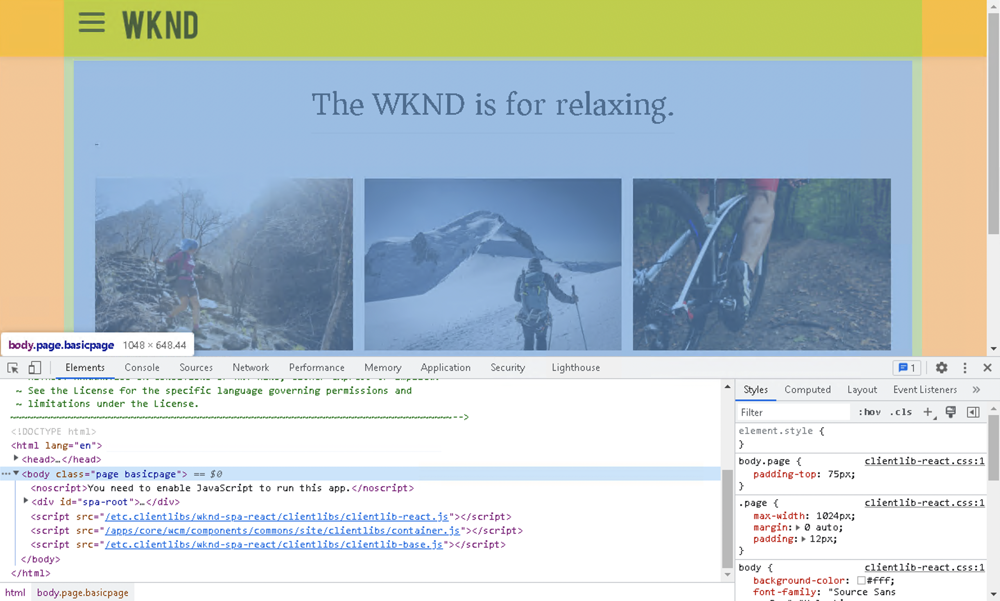

# Introdução e passo a passo do SPA {#spa-introduction-and-walkthrough}

Aplicativos de página única (SPAs) podem oferecer experiências interessantes para usuários de sites. Os desenvolvedores desejam criar sites usando estruturas SPA e os autores desejam editar o conteúdo com facilidade no AEM para um site criado usando essas estruturas.

O Editor de SPA oferece uma solução abrangente para oferecer suporte à SPA no AEM. Este artigo aborda o uso de um aplicativo SPA básico para criação e mostra como ele está relacionado ao AEM Editor SPA subjacente.

>[!NOTE]
>
>O Editor de SPA é a solução recomendada para projetos que exigem renderização do lado do cliente baseada em SPA estrutura (por exemplo, Reagir ou Angular).

## Introdução {#introduction}

### Objetivo do artigo {#article-objective}

Este artigo apresenta os conceitos básicos de SPA antes de levar o leitor por uma apresentação do editor de SPA usando um aplicativo de SPA simples para demonstrar a edição básica de conteúdo. Em seguida, ele mergulha na construção da página e como o aplicativo de SPA se relaciona e interage com o Editor de SPA de AEM.

O objetivo desta introdução e apresentação é demonstrar para um desenvolvedor de AEM por que SPA são relevantes, como eles geralmente funcionam, como um SPA é manipulado pelo Editor de SPA de AEM e como é diferente de um aplicativo de AEM padrão.

## Requisitos {#requirements}

A apresentação é baseada na funcionalidade de AEM padrão e no aplicativo de projeto SPA WKND de amostra. Para acompanhar essa apresentação, você deve ter o seguinte disponível.

* [AEM versão 6.5.4 ou mais recente](/help/release-notes/release-notes.md)
   * Você deve ter direitos de administrador no sistema.
* [O exemplo de aplicativo SPA projeto WKND disponível no GitHub](https://github.com/adobe/aem-guides-wknd-spa)
   * Baixe o [última versão do aplicativo React.](https://github.com/adobe/aem-guides-wknd-spa/releases) Ele será nomeado como semelhante a `wknd-spa-react.all.classic-X.Y.Z-SNAPSHOT.zip`.
   * Baixe o [imagens de amostra mais recentes](https://github.com/adobe/aem-guides-wknd-spa/releases) para o aplicativo. Ele será nomeado como semelhante a `wknd-spa-sample-images-X.Y.Z.zip`.
   * [Usar gerenciador de pacotes](/help/sites-administering/package-manager.md) para instalar os pacotes como você faria com qualquer outro pacote no AEM.
   * O aplicativo não precisa ser instalado usando o Maven para fins desta apresentação.

>[!CAUTION]
>
>Este documento usa o [Aplicativo de projeto Spa WKND](https://github.com/adobe/aem-guides-wknd-spa) apenas para fins de demonstração. Não deve ser utilizado para qualquer trabalho de projeto.
>
>Qualquer projeto AEM deve aproveitar [Arquétipo de projeto AEM,](https://experienceleague.adobe.com/docs/experience-manager-core-components/using/developing/archetype/overview.html?lang=pt-BR) que suporta projetos SPA usando o React ou Angular e aproveita o SDK SPA.

### O que é um SPA? {#what-is-a-spa}

Um aplicativo de página única (SPA) é diferente de uma página convencional, na medida em que é renderizado no cliente e é principalmente orientado por Javascript, dependendo das chamadas do Ajax para carregar dados e atualizar dinamicamente a página. A maioria ou todo o conteúdo é recuperado uma vez em um único carregamento de página com recursos adicionais carregados de forma assíncrona, conforme necessário, com base na interação do usuário com a página.

Isso reduz a necessidade de atualizações de página e apresenta uma experiência ao usuário que é contínua, rápida e se parece mais com uma experiência de aplicativo nativo.

O Editor de SPA de AEM permite que desenvolvedores de front-end criem SPA que possam ser integradas a um site de AEM, permitindo que os autores de conteúdo editem o conteúdo de SPA da mesma forma que qualquer outro conteúdo AEM.

### Por que um SPA? {#why-a-spa}

Ao ser mais rápido, fluido e mais parecido com um aplicativo nativo, um SPA torna-se uma experiência muito atraente não apenas para o visitante da página da Web, mas também para profissionais de marketing e desenvolvedores, devido à natureza de como o SPA funciona.

**Visitantes**

* Os visitantes desejam experiências nativas quando interagem com o conteúdo.
* Há dados claros de que quanto mais rapidamente uma página for exibida, mais provavelmente ocorrerá uma conversão.

**Profissionais de marketing**

* Os profissionais de marketing desejam oferecer experiências nativas e ricas para atrair visitantes para se envolverem totalmente com conteúdo.
* A personalização pode tornar essas experiências ainda mais atraentes.

**Desenvolvedores**

* Os desenvolvedores desejam uma separação clara das preocupações entre conteúdo e apresentação.
* A separação limpa torna o sistema mais extensível e permite um desenvolvimento front-end independente.

### Como funciona um SPA? {#how-does-a-spa-work}

A ideia principal por trás de um SPA é que as chamadas e a dependência em um servidor sejam reduzidas para minimizar os atrasos causados pelas chamadas do servidor, de modo que o SPA se aproxime da capacidade de resposta de um aplicativo nativo.

Em uma página da Web tradicional e sequencial, somente os dados necessários para a página imediata são carregados. Isso significa que quando o visitante se move para outra página, o servidor é chamado para os recursos adicionais. As chamadas adicionais podem ser necessárias, pois o visitante interage com elementos na página. Essas várias chamadas podem dar uma sensação de atraso ou atraso, pois a página precisa acompanhar as solicitações do visitante.

Para uma experiência mais fluida, que se aproxima do que um visitante espera de aplicativos móveis e nativos, um SPA carrega todos os dados necessários para o visitante na primeira carga. Embora isso possa demorar um pouco mais no início, elimina a necessidade de chamadas de servidor adicionais.

Ao renderizar no lado do cliente, o elemento da página reage mais rapidamente e as interações com a página pelo visitante são imediatas. Qualquer dado adicional que possa ser necessário é chamado de forma assíncrona para maximizar a velocidade da página.

>[!NOTE]
>
>Para obter detalhes técnicos sobre como SPA trabalhar no AEM, consulte o artigo [Introdução ao SPA no AEM](/help/sites-developing/spa-getting-started-react.md).
>
>Para uma análise mais detalhada do design, arquitetura e fluxo de trabalho técnico do Editor de SPA, consulte o artigo [Visão geral do editor de SPA](/help/sites-developing/spa-overview.md).

## Experiência de edição de conteúdo com SPA {#content-editing-experience-with-spa}

Quando uma SPA é criada para aproveitar o Editor de SPA de AEM, o autor de conteúdo não percebe diferença ao editar e criar conteúdo. Uma funcionalidade comum de AEM está disponível e nenhuma alteração no fluxo de trabalho do autor é necessária.

1. Edite o aplicativo SPA projeto WKND no AEM.

   `http://<host>:<port>/editor.html/content/wknd-spa-react/us/en/home.html`

   

1. Selecione um componente de cabeçalho e observe que uma barra de ferramentas aparece como para qualquer outro componente. Selecione **Editar**.

   

1. Edite o conteúdo normalmente no AEM e observe que as alterações são persistentes.

   

   >[!NOTE]
   >
   >Consulte a [Visão geral do editor de SPA](spa-overview.md#requirements-limitations) para obter mais informações sobre o editor de texto em vigor e o SPA.

1. Use o Navegador de ativos para arrastar e soltar uma nova imagem em um componente de imagem.

   

1. A alteração é persistente.

   

Outras ferramentas de criação, como arrastar e soltar componentes adicionais na página, reorganizar componentes e modificar o layout, são compatíveis como em qualquer aplicativo que não seja SPA.

>[!NOTE]
>
>O Editor de SPA não modifica o DOM do aplicativo. O próprio SPA é responsável pelo DOM.
>
>Para ver como isso funciona, prossiga para a próxima seção deste artigo [Aplicativos SPA e o editor de SPA AEM](#spa-apps-and-the-aem-spa-editor).

## Aplicativos SPA e o editor de SPA AEM {#spa-apps-and-the-aem-spa-editor}

Usar o comportamento de um SPA para o usuário final e, em seguida, inspecionar a página de SPA ajuda a entender melhor como um aplicativo SAP funciona com o Editor de SPA em AEM.

### Uso de um aplicativo SPA {#using-an-spa-application}

1. Carregue o aplicativo SPA projeto WKND no servidor de publicação ou usando a opção **Exibir como publicado** do **Informações da página** no editor de páginas.

   `http://<host>:<port>/content/wknd-spa-react/us/en/home.html`

   

   Observe a estrutura das páginas, incluindo a navegação para páginas filhas, widget de clima e artigos.

1. Navegue até uma página secundária usando o menu e veja que a página é carregada imediatamente sem a necessidade de uma atualização.

   

1. Abra as ferramentas do desenvolvedor incorporadas do seu navegador e monitore a atividade da rede à medida que você navega pelas páginas secundárias.

   

   Há muito pouco tráfego ao mover de página para página no aplicativo. A página não é recarregada e somente as novas imagens são solicitadas.

   O SPA gerencia o conteúdo e o roteamento totalmente no lado do cliente.

Portanto, se a página não for recarregada ao navegar pelas páginas secundárias, como ela será carregada?

A próxima seção, [Carregamento de um aplicativo SPA,](#loading-an-spa-application) aprofunda-se nos mecanismos de carregamento de SPA e como o conteúdo pode ser carregado de forma síncrona e assíncrona.

### Carregando um aplicativo SPA {#loading-an-spa-application}

1. Se ainda não tiver sido carregado, carregue o aplicativo SPA projeto WKND no servidor de publicação ou usando a opção **Exibir como publicado** do **Informações da página** no editor de páginas.

   `http://<host>:<port>/content/wknd-spa-react/us/en/home.html`

   

1. Use a ferramenta incorporada do seu navegador para visualizar a fonte da página.
1. Observe que o conteúdo da fonte é extremamente limitado.

   * A página não tem conteúdo em seu corpo. Ele é composto principalmente de folhas de estilos e uma chamada para vários scripts, como `clientlib-react.min.js`.
   * Esses scripts são os principais drivers desse aplicativo e são responsáveis pela renderização de todo o conteúdo.

1. Use as ferramentas internas do seu navegador para inspecionar a página. Veja o conteúdo do DOM totalmente carregado.

   

1. Alterne para **Rede** das ferramentas do desenvolvedor e recarregue a página.

   Ignorando solicitações de imagem, observe que os recursos primários carregados para a página são a própria página, o CSS, o React Javascript, suas dependências, bem como dados JSON para a página.

   

1. Carregue o `react.model.json` em uma nova guia.

   `http://<host>:<port>/content/wknd-spa-react/us/en/home.model.json`

   

   O Editor de SPA AEM aproveita [AEM Content Services](/help/assets/content-fragments/content-fragments.md) para fornecer todo o conteúdo da página como um modelo JSON.

   Ao implementar interfaces específicas, os Modelos do Sling fornecem as informações necessárias para o SPA. A entrega dos dados JSON é delegada em baixo a cada componente (da página, ao parágrafo, ao componente etc.).

   Cada componente escolhe o que expõe e como é renderizado (no lado do servidor com HTL ou no lado do cliente com o React). Este artigo foca na renderização do lado do cliente com o React.

1. O modelo também pode agrupar as páginas para que elas sejam carregadas de forma síncrona, reduzindo o número de recarregamentos de página necessários.

   No exemplo do aplicativo SPA projeto WKND, a variável `home`, `page-1`, `page-2`e `page-3` as páginas são carregadas de forma síncrona, já que os visitantes normalmente visitam todas essas páginas.

   Esse comportamento não é obrigatório e é totalmente definível.

   

1. Para exibir essa diferença de comportamento, recarregue a página e limpe a atividade de rede das ferramentas do desenvolvedor. Navegar para `page-1` no menu da página e veja que a única atividade de rede é uma solicitação de imagem de `page-1`. `page-1` ela mesma não precisa carregar.

   

### Interação com o Editor de SPA {#interaction-with-the-spa-editor}

Usando o exemplo de aplicativo WKND SPA Project, está claro como o aplicativo se comporta e é carregado quando publicado, aproveitando os serviços de conteúdo para a entrega de conteúdo JSON, bem como o carregamento assíncrono de recursos.

Além disso, para o autor de conteúdo, a criação de conteúdo usando um editor de SPA é contínua no AEM.

Na seção a seguir, exploraremos o contrato que permite que o Editor de SPA relacione componentes dentro do SPA para AEM componentes e obtenha essa experiência de edição contínua.

1. Carregue o aplicativo SPA projeto WKND no editor e alterne para **Visualizar** modo.

   `http://<host>:<port>/editor.html/content/wknd-spa-react/us/en/home.html`

1. Usando as ferramentas do desenvolvedor incorporadas do seu navegador, inspecione o conteúdo da página. Usando a ferramenta de seleção, selecione um componente editável na página e exiba os detalhes do elemento.

   Observe que o componente tem um novo atributo de dados `data-cq-data-path`.

   

   Por exemplo

   `data-cq-data-path="/content/wknd-spa-react/us/en/home/jcr:content/root/responsivegrid/text`

   Esse caminho permite a recuperação e a associação do objeto de configuração de contexto de edição de cada componente.

   Esse é o único atributo de marcação necessário para que o editor reconheça esse componente como editável no SPA. Com base nesse atributo, o Editor de SPA determinará qual configuração editável está associada ao componente, para que o quadro, a barra de ferramentas etc. estejam corretos. é carregado.

   Alguns nomes de classe específicos também são adicionados para marcar espaços reservados e para a funcionalidade de arrastar e soltar do ativo.

   >[!NOTE]
   >
   >Essa é uma alteração no comportamento de páginas renderizadas do lado do servidor no AEM, onde há uma `cq` elemento inserido para cada componente editável.
   >
   >
   >Essa abordagem no SPA remove a necessidade de inserir elementos personalizados, confiando apenas em um atributo de dados adicional, tornando a marcação mais simples para o desenvolvedor principal.

## Próximas etapas {#next-steps}

Agora que você entende a experiência de edição de SPA no AEM e como uma SPA se relaciona ao Editor de SPA, aprofunde-se para entender como uma SPA é criada.

* [Introdução ao SPA no AEM](/help/sites-developing/spa-getting-started-react.md) mostra como um SPA básico é criado para funcionar com o Editor de SPA no AEM
* [Visão geral do editor de SPA](/help/sites-developing/spa-overview.md) aprofunda o modelo de comunicação entre AEM e SPA.
* [Desenvolvimento de SPA para AEM](/help/sites-developing/spa-architecture.md) descreve como engajar desenvolvedores front-end no desenvolvimento de uma SPA para AEM e como SPA interagir com AEM arquitetura.
