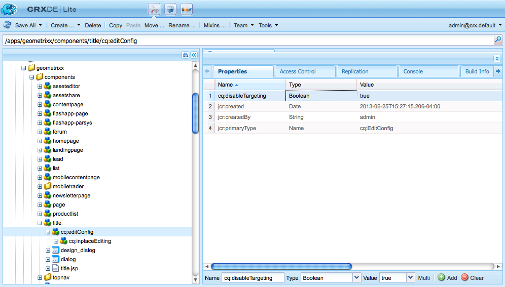

# Desenvolvimento de conteúdo direcionado{#developing-for-targeted-content}

Esta seção descreve os tópicos sobre o desenvolvimento de componentes para uso com o direcionamento de conteúdo.

* Para obter informações sobre a conexão com o Adobe Target, consulte [Integração com o Adobe Target](/help/sites-administering/target.md).
* Para obter informações sobre a criação de conteúdo direcionado, consulte [Criação de conteúdo direcionado usando o modo de direcionamento](/help/sites-authoring/content-targeting-touch.md).

>[!NOTE]
>
>Quando você direciona um componente em AEM autor, o componente faz uma série de chamadas do lado do servidor para o Adobe Target para registrar a campanha, configurar ofertas e recuperar segmentos do Adobe Target (se configurado). Nenhuma chamada do lado do servidor é feita AEM publicação no Adobe Target.

## Ativar a definição de metas com o Adobe Target em suas páginas {#enabling-targeting-with-adobe-target-on-your-pages}

Para usar componentes direcionados em suas páginas que interagem com o Adobe Target, inclua um código específico do lado do cliente no elemento &lt;head> .

### Seção do cabeçalho {#the-head-section}

Adicione ambos os blocos de código a seguir à seção &lt;head> da página:

```xml
<!--/* Include Context Hub */-->
<sly data-sly-resource="${'contexthub' @ resourceType='granite/contexthub/components/contexthub'}"/>
```

```xml
<cq:include script="/libs/cq/cloudserviceconfigs/components/servicelibs/servicelibs.jsp"/>
```

Esse código adiciona os objetos javascript do analytics necessários e carrega as bibliotecas do cloud service associadas ao site. Para o serviço do Target, as bibliotecas são carregadas por meio de `/libs/cq/analytics/components/testandtarget/headlibs.jsp`

O conjunto de bibliotecas carregadas depende do tipo de biblioteca do cliente de destino (mbox.js ou at.js) usada na configuração do Target:

**Para mbox.js padrão**

```
<script type="text/javascript" src="/libs/cq/foundation/testandtarget/parameters.js"></script>
 <script type="text/javascript" src="/libs/cq/foundation/testandtarget/mbox.js"></script>
 <script type="text/javascript" src="/libs/cq/foundation/personalization/integrations/commons.js"></script>
 <script type="text/javascript" src="/libs/cq/foundation/testandtarget/util.js"></script>
 <script type="text/javascript" src="/libs/cq/foundation/testandtarget/init.js"></script>
```

**Para mbox.js personalizada**

```
<script type="text/javascript" src="/etc/cloudservices/testandtarget/<CLIENT-CODE>/_jcr_content/public/mbox.js"></script>
        <script type="text/javascript" src="/libs/cq/foundation/testandtarget/parameters.js"></script>
 <script type="text/javascript" src="/libs/cq/foundation/personalization/integrations/commons.js"></script>
 <script type="text/javascript" src="/libs/cq/foundation/testandtarget/util.js"></script>
 <script type="text/javascript" src="/libs/cq/foundation/testandtarget/init.js"></script>
```

**Para at.js**

```
<script type="text/javascript" src="/libs/cq/foundation/testandtarget/parameters.js"></script>
 <script type="text/javascript" src="/libs/cq/foundation/testandtarget/atjs-integration.js"></script>
 <script type="text/javascript" src="/libs/cq/foundation/testandtarget/atjs.js"></script>
```

>[!NOTE]
>
>Somente a versão de `at.js` fornecida com o produto é compatível. A versão de `at.js` fornecida com o produto pode ser obtida observando o arquivo `at.js` no local:
>
>**/libs/cq/testandtarget/clientlibs/testandtarget/atjs/source/at.js**.

**Para at.js personalizada**

```
<script type="text/javascript" src="/etc/cloudservices/testandtarget/<CLIENT-CODE>/_jcr_content/public/at.js"></script>
    <script type="text/javascript" src="/libs/cq/foundation/testandtarget/parameters.js"></script>
 <script type="text/javascript" src="/libs/cq/foundation/testandtarget/atjs-integration.js"></script>
```

A funcionalidade do Target no lado do cliente é gerenciada pelo objeto `CQ_Analytics.TestTarget` . Portanto, a página conterá alguns códigos de inicialização, como no exemplo a seguir:

```
<script type="text/javascript">
            if ( !window.CQ_Analytics ) {
                window.CQ_Analytics = {};
            }
            if ( !CQ_Analytics.TestTarget ) {
                CQ_Analytics.TestTarget = {};
            }
            CQ_Analytics.TestTarget.clientCode = 'my_client_code';
        </script>
      ...

    <div class="cloudservice testandtarget">
  <script type="text/javascript">
  CQ_Analytics.TestTarget.maxProfileParams = 11;

  if (CQ_Analytics.CCM) {
   if (CQ_Analytics.CCM.areStoresInitialized) {
    CQ_Analytics.TestTarget.registerMboxUpdateCalls();
   } else {
    CQ_Analytics.CCM.addListener("storesinitialize", function (e) {
     CQ_Analytics.TestTarget.registerMboxUpdateCalls();
    });
   }
  } else {
   // client context not there, still register calls
   CQ_Analytics.TestTarget.registerMboxUpdateCalls();
  }
  </script>
 </div>
```

O JSP adiciona os objetos javascript do analytics e as referências necessárias às bibliotecas javascript do lado do cliente. O arquivo testandtarget.js contém as funções da mbox.js. O HTML gerado pelo script é semelhante ao seguinte exemplo:

```xml
<script type="text/javascript">
        if ( !window.CQ_Analytics ) {
            window.CQ_Analytics = {};
        }
        if ( !CQ_Analytics.TestTarget ) {
            CQ_Analytics.TestTarget = {};
        }
        CQ_Analytics.TestTarget.clientCode = 'MyClientCode';
</script>
<link rel="stylesheet" href="/etc/clientlibs/foundation/testandtarget/testandtarget.css" type="text/css">
<script type="text/javascript" src="/etc/clientlibs/foundation/testandtarget/testandtarget.js"></script>
<script type="text/javascript" src="/etc/clientlibs/foundation/testandtarget/init.js"></script>
```

#### A Seção do corpo (início) {#the-body-section-start}

Adicione o seguinte código imediatamente após a tag &lt;body> para adicionar os recursos de contexto do cliente à página:

```xml
<cq:include path="clientcontext" resourceType="cq/personalization/components/clientcontext"/>
```

#### A Seção do corpo (final) {#the-body-section-end}

Adicione o seguinte código imediatamente antes da tag final &lt;/body> :

```xml
<cq:include path="cloudservices" resourceType="cq/cloudserviceconfigs/components/servicecomponents"/>
```

O script JSP desse componente gera chamadas para a API javascript do Target e implementa outras configurações necessárias. O HTML gerado pelo script é semelhante ao seguinte exemplo:

```xml
<div class="servicecomponents cloudservices">
  <div class="cloudservice testandtarget">
    <script type="text/javascript">
      CQ_Analytics.TestTarget.maxProfileParams = 11;
      CQ_Analytics.CCM.addListener("storesinitialize", function(e) {
        CQ_Analytics.TestTarget.registerMboxUpdateCalls();
      });
    </script>
    <div id="cq-analytics-texthint" style="background:white; padding:0 10px; display:none;">
      <h3 class="cq-texthint-placeholder">Component clientcontext is missing or misplaced.</h3>
    </div>
    <script type="text/javascript">
      $CQ(function(){
      if( CQ_Analytics &&
          CQ_Analytics.ClientContextMgr &&
          !CQ_Analytics.ClientContextMgr.isConfigLoaded )
        {
          $CQ("#cq-analytics-texthint").show();
        }
      });
    </script>
  </div>
</div>
```

### Usar um arquivo de biblioteca do Target personalizado {#using-a-custom-target-library-file}

>[!NOTE]
>
>Se você não estiver usando o DTM ou outro sistema de marketing de destino, poderá usar arquivos personalizados da biblioteca de direcionamento.

>[!NOTE]
>
>Por padrão, as mboxes são ocultas - a classe mboxDefault determina esse comportamento. Ocultar mboxes garante que os visitantes não vejam o conteúdo padrão antes que ele seja trocado; no entanto, ocultar mboxes afeta o desempenho percebido.

O arquivo mbox.js padrão usado para criar mboxes está localizado em /etc/clientlibs/foundation/testandtarget/mbox/source/mbox.js. Para usar um arquivo mbox.js do cliente, adicione o arquivo à configuração de nuvem do Target. Para adicionar o arquivo, o arquivo mbox.js deve estar disponível no sistema de arquivos.

Por exemplo, se você deseja usar o [serviço de ID do Marketing Cloud](https://docs.adobe.com/content/help/en/id-service/using/home.html), é necessário baixar a mbox.js para que contenha o valor correto para a variável `imsOrgID`, que é baseada no seu locatário. Essa variável é necessária para integrar com o serviço de ID do Marketing Cloud. Para obter informações, consulte [Adobe Analytics como Fonte de relatórios do Adobe Target](https://docs.adobe.com/content/help/en/target/using/integrate/a4t/a4t.html) e [Antes de implementar](https://docs.adobe.com/content/help/en/target/using/integrate/a4t/before-implement.html).

>[!NOTE]
>
>Se uma mbox personalizada for definida em uma configuração do Target, todos deverão ter acesso de leitura a **/etc/cloudservices** nos servidores de publicação. Sem esse acesso, o carregamento de arquivos mbox.js no site de publicação resulta em um erro 404.

1. Vá para a página CQ **Tools** e selecione **Cloud Services**. ([https://localhost:4502/libs/cq/core/content/tools/cloudservices.html](https://localhost:4502/libs/cq/core/content/tools/cloudservices.html))
1. Na árvore, selecione Adobe Target e, na lista de configurações, clique duas vezes na configuração do Target.
1. Na página de configuração, clique em Editar.
1. Para a propriedade mbox.js personalizada, clique em Procurar e selecione o arquivo.
1. Para aplicar as alterações, digite a senha da sua conta do Adobe Target, clique em Reconectar ao Target e em OK quando a conexão for bem-sucedida. Em seguida, clique em OK na caixa de diálogo Editar componente .

A configuração do Target inclui um arquivo mbox.js personalizado, [o código necessário na seção de cabeçalho](/help/sites-developing/target.md#p-the-head-section-p) da página adiciona o arquivo à estrutura da biblioteca do cliente em vez de uma referência à biblioteca testandtarget.js.

## Desativar o comando do Target para componentes {#disabling-the-target-command-for-components}

A maioria dos componentes pode ser convertida em componentes direcionados usando o comando Target no menu de contexto.


Para remover o comando Target do menu de contexto, adicione a seguinte propriedade ao nó cq:editConfig do componente:

* Nome: cq:disableTargeting
* Tipo: booliano
* Valor: Verdadeiro

Por exemplo, para desativar o direcionamento para os componentes de título das páginas de Site de demonstração do Geometrixx, adicione a propriedade ao nó /apps/geometrixx/components/title/cq:editConfig .



## Enviando informações de confirmação de pedido para o Adobe Target {#sending-order-confirmation-information-to-adobe-target}

>[!NOTE]
>
>Se você não estiver usando o DTM, envie a confirmação do pedido para a Adobe Target.

Para rastrear o desempenho do seu site, envie informações de compra da página de confirmação de pedido para a Adobe Target. (Consulte [Criar uma mbox orderConfirmPage](https://docs.adobe.com/content/help/en/dtm/implementing/target/configure-target/mboxes/order-confirmation-mbox.html) na documentação do Adobe Target.) O Adobe Target reconhece os dados da mbox como dados de confirmação de pedido quando o nome da MBox é `orderConfirmPage` e usa os seguintes nomes de parâmetro específicos:

* productPurchasedId: Uma lista de IDs que identificam os produtos comprados.
* orderId: A ID do pedido.
* orderTotal: O valor total da compra.

O código na página HTML renderizada que cria a mbox é semelhante ao seguinte exemplo:

```xml
<script type="text/javascript">
     mboxCreate('orderConfirmPage',
     'productPurchasedId=product1 product2 product3',
     'orderId=order1234',
     'orderTotal=24.54');
</script>
```

Os valores de cada parâmetro são diferentes para cada pedido. Portanto, é necessário um componente que gere o código com base nas propriedades da compra. O CQ [eCommerce Integration Framework](/help/commerce/cif-classic/administering/ecommerce.md) permite que você se integre ao catálogo de produtos e implemente um carrinho de compras e uma página de check-out.

A amostra do Geometrixx Outdoors exibe a seguinte página de confirmação quando um visitante compra produtos:


O código a seguir para o script JSP de um componente acessa as propriedades do carrinho de compras e imprime o código para criar a mbox.

```java
<%--

  confirmationmbox component.

--%><%
%><%@include file="/libs/foundation/global.jsp"%><%
%><%@page session="false"
          import="com.adobe.cq.commerce.api.CommerceService,
                  com.adobe.cq.commerce.api.CommerceSession,
                  com.adobe.cq.commerce.common.PriceFilter,
                  com.adobe.cq.commerce.api.Product,
                  java.util.List, java.util.Iterator"%><%

/* obtain the CommerceSession object */
CommerceService commerceservice = resource.adaptTo(CommerceService.class);
CommerceSession session = commerceservice.login(slingRequest, slingResponse);

/* obtain the cart items */
List<CommerceSession.CartEntry> entries = session.getCartEntries();
Iterator<CommerceSession.CartEntry> cartiterator = entries.iterator();

/* iterate the items and get the product IDs */
String productIDs = new String();
while(cartiterator.hasNext()){
 CommerceSession.CartEntry entry = cartiterator.next();
 productIDs = productIDs + entry.getProduct().getSKU();
    if (cartiterator.hasNext()) productIDs = productIDs + ", ";
}

/* get the cart price and orderID */
String total = session.getCartPrice(new PriceFilter("CART", "PRE_TAX"));
String orderID = session.getOrderId();

%><div class="mboxDefault"></div>
<script type="text/javascript">
     mboxCreate('orderConfirmPage',
     'productPurchasedId=<%= productIDs %>',
     'orderId=<%= orderID %>',
     'orderTotal=<%= total %>');
</script>
```

Quando o componente é incluído na página de checkout do exemplo anterior, a origem da página inclui o seguinte script que cria a mbox:

```
<div class="mboxDefault"></div>
<script type="text/javascript">

     mboxCreate('orderConfirmPage',
     'productPurchasedId=47638-S, 46587',
     'orderId=d03cb015-c30f-4bae-ab12-1d62b4d105ca',
     'orderTotal=US$677.00');

</script>
```

## Noções básicas sobre o componente do Target {#understanding-the-target-component}

O componente de Direcionamento permite que os autores criem mboxes dinâmicas a partir de componentes de conteúdo CQ. (Consulte [Direcionamento de conteúdo](/help/sites-authoring/content-targeting-touch.md).) O componente de Direcionamento está localizado em /libs/cq/personalization/components/target.

O script target.jsp acessa as propriedades da página para determinar o mecanismo de direcionamento a ser usado para o componente e, em seguida, executa o script apropriado:

* Adobe Target: /libs/cq/personalization/components/target/engine_tnt.jsp
* [Adobe Target com AT.JS](/help/sites-administering/target.md): /libs/cq/personalization/components/target/engine_atjs.jsp
* [Adobe Campaign](/help/sites-authoring/target-adobe-campaign.md): /libs/cq/personalization/components/target/engine_cq_campaign.jsp
* Regras do lado do cliente/ContextHub: /libs/cq/personalization/components/target/engine_cq.jsp

### A Criação de Mboxes {#the-creation-of-mboxes}

>[!NOTE]
>
>Por padrão, as mboxes são ocultas - a classe mboxDefault determina esse comportamento. Ocultar mboxes garante que os visitantes não vejam o conteúdo padrão antes que ele seja trocado; no entanto, ocultar mboxes afeta o desempenho percebido.

Quando o Adobe Target direciona o conteúdo, o script engine_tnt.jsp cria mboxes que contêm o conteúdo da experiência direcionada:

* Adiciona um elemento `div` com a classe de `mboxDefault`, conforme exigido pela API do Adobe Target.

* Adiciona o conteúdo da mbox (o conteúdo da experiência direcionada) dentro do elemento `div`.

Após o elemento `mboxDefault` div , o javascript que cria a mbox é inserido:

* O nome, a ID e o local da mbox são baseados no caminho do repositório do componente.
* O script obtém valores e nomes de parâmetros de Contexto do Cliente.
* São feitas chamadas às funções que a mbox.js e outras bibliotecas de clientes definem para criar mboxes.

#### Bibliotecas de clientes para direcionamento de conteúdo {#client-libraries-for-content-targeting}

Estas são as categorias de clientlib disponíveis:

* testandtarget.mbox
* testandtarget.init
* testandtarget.util
* testandtarget.atjs
* testandtarget.atjs-integration
