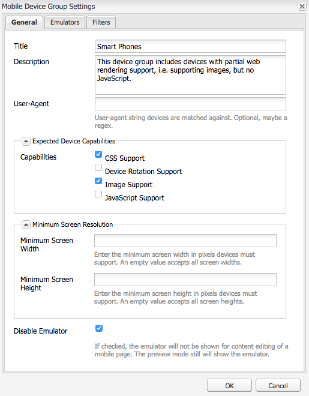
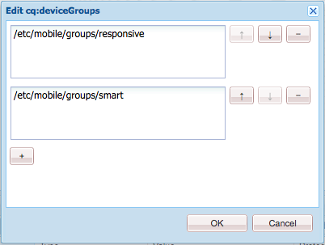

# Renderização do modelo adaptável{#adaptive-template-rendering}

A renderização do modelo adaptável fornece uma maneira de gerenciar uma página com variações. Originalmente útil para fornecer várias saídas HTML para dispositivos móveis (por exemplo, telefone de recurso vs. smartphone), esse recurso é útil quando as experiências precisam ser entregues para vários dispositivos que precisam de marcação diferente ou saída HTML.

## Visão geral {#overview}

Normalmente, os modelos são criados em torno de uma grade responsiva, e as páginas criadas com base nesses modelos são totalmente responsivas, ajustando-se automaticamente à janela do dispositivo cliente. Usando a barra de ferramentas Emulador no editor de páginas, os autores podem público alvo layouts para dispositivos específicos.

Também é possível configurar modelos para suportar renderização adaptável. Quando os grupos de dispositivos estiverem configurados corretamente, a página será renderizada com um seletor diferente no URL ao selecionar um dispositivo no modo de emulador. Usando um seletor, uma renderização de página específica pode ser chamada diretamente pelo URL.

Lembre-se ao configurar seus grupos de dispositivos:

* Cada dispositivo deve estar em pelo menos um grupo de dispositivos.
* Um dispositivo pode estar em vários grupos de dispositivos.
* Como os dispositivos podem estar em vários grupos de dispositivos, os seletores podem ser combinados.
* A combinação de seletores é avaliada de cima para baixo à medida que são persistentes no repositório.

>[!NOTE]
>
>O grupo de dispositivos **Dispositivos responsivos** nunca terá um seletor porque os dispositivos reconhecidos como compatíveis com o design responsivo presumem que não precisam de um layout adaptável

## Configuração {#configuration}

Os seletores de renderização adaptáveis podem ser configurados para grupos de dispositivos existentes ou para [grupos criados por você.](/help/sites-developing/mobile.md#device-groups)

Neste exemplo, vamos configurar o grupo de dispositivos existente **Telefones inteligentes** para ter um seletor de renderização adaptável como parte do modelo **Página de experiência** no We.Retail.

1. Edite o grupo de dispositivos que requer um seletor adaptável em `http://localhost:4502/miscadmin#/etc/mobile/groups`

   Defina a opção **Desativar Emulador** e salve.

   

1. O seletor estará disponível para **Blackberry** e **iPhone 4** desde que o grupo de dispositivos **Smart Phone** seja adicionado ao modelo e às estruturas de página nas etapas a seguir.

   

1. Usando o CRX DE Lite, permita que o grupo de dispositivos seja usado no modelo, adicionando-o à propriedade de string de vários valores `cq:deviceGroups` na estrutura do modelo.

   `/conf/<your-site>/settings/wcm/templates/<your-template>/structure/jcr:content`

   Por exemplo, se desejarmos adicionar o grupo de dispositivos do Smart Phone:

   `/conf/we-retail/settings/wcm/templates/experience-page/structure/jcr:content`

   

1. Usando o CRX DE Lite, permita que o grupo de dispositivos seja usado em seu site, adicionando-o à propriedade de string de vários valores `cq:deviceGroups` na estrutura do site.

   `/content/<your-site>/jcr:content`

   Por exemplo, se quisermos permitir o grupo de dispositivos **Smart Phone**:

   `/content/we-retail/jcr:content`

   

Agora, ao usar o [emulador](/help/sites-authoring/responsive-layout.md#layout-definitions-device-emulation-and-breakpoints) no editor de páginas (como quando [modificar o layout](/help/sites-authoring/responsive-layout.md)) e escolher um dispositivo do grupo de dispositivos configurado, a página será renderizada com um seletor como parte do URL.

Em nosso exemplo, ao editar uma página com base no modelo **Página de experiência** e escolher o iPhone 4 no emulador, a página é renderizada incluindo o seletor como `arctic-surfing-in-lofoten.smart.html` em vez de `arctic-surfing-in-lofoten.html`

A página também pode ser chamada diretamente usando esse seletor.

