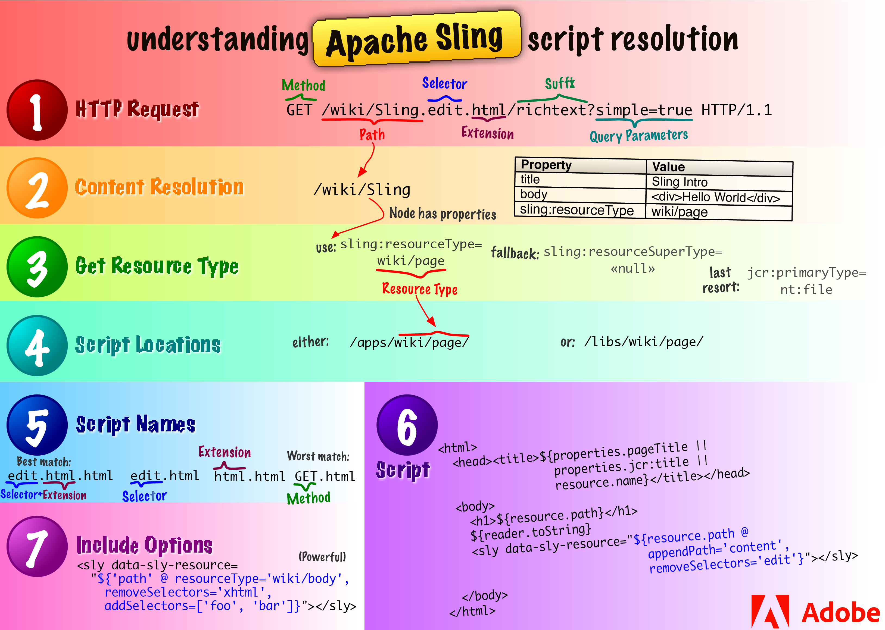

# Conceitos principais de AEM {#aem-core-concepts}

>[!NOTE]
>
>Antes de entrar nos conceitos principais do Adobe Experience Manager (AEM), o Adobe recomenda concluir o Tutorial WKND no [Introdução ao desenvolvimento do AEM Sites](/help/sites-developing/getting-started.md) documento. Ele inclui uma visão geral do processo de desenvolvimento do AEM e uma introdução aos conceitos principais.

## Pré-requisitos para o desenvolvimento no AEM {#prerequisites-for-developing-on-aem}

Você precisa das seguintes habilidades para desenvolver em cima do AEM:

* Conhecimento básico das técnicas de aplicação web, incluindo:

   * o ciclo solicitação-resposta (XMLHttpRequest / XMLHttpResponse)
   * HTML
   * CSS
   * JavaScript

* Conhecimento prático do Experience Server (CRX), incluindo o Content Explorer
* Para desenvolver na interface clássica do usuário, também é necessário ter conhecimento básico de JSP (JavaServer Pages), incluindo a capacidade de entender e modificar exemplos de JSP simples.

Também é recomendável que você leia e siga as [Diretrizes e práticas recomendadas](/help/sites-developing/dev-guidelines-bestpractices.md).

## Repositório de conteúdo Java™ {#java-content-repository}

O Java™ Content Repository (JCR) padrão, [JSR 283](https://developer.adobe.com/experience-manager/reference-materials/spec/jcr/2.0/index.html), especifica uma maneira independente de fornecedor e de implementação para acessar o conteúdo de forma bidirecional em nível granular em um repositório de conteúdo.

O lead da especificação é da Adobe Research (Switzerland) AG.

A variável [API JCR 2.0](https://developer.adobe.com/experience-manager/reference-materials/spec/javax.jcr/javadocs/jcr-2.0/index.html) javax.jcr.O &amp;ast; é usado para o acesso direto e manipulação de conteúdo do repositório.

## Experience Server (CRX) e Jackrabbit {#experience-server-crx-and-jackrabbit}

O Experience Server fornece os Serviços de experiência nos quais o AEM é incorporado e que podem ser usados para criar aplicativos personalizados, além de incorporar o Repositório de conteúdo com base no Jackrabbit.

[Apache Jackrabbit](https://jackrabbit.apache.org/jcr/index.html) O é uma implementação de código aberto, em total conformidade, da API 2.0 do JCR.

## Processamento de solicitação do Sling {#sling-request-processing}

### Introdução ao Sling {#introduction-to-sling}

O AEM é construído usando [Sling](https://sling.apache.org/index.html), uma estrutura de aplicativo web baseada em princípios REST que fornece desenvolvimento fácil de aplicativos orientados a conteúdo. O Sling usa um repositório JCR, como o Apache Jackrabbit ou, se houver AEM, o repositório de conteúdo CRX, como seu armazenamento de dados. O Sling contribuiu para a Apache Software Foundation - mais informações podem ser encontradas na Apache.

Usando o Sling, o tipo de conteúdo a ser renderizado não é a primeira consideração de processamento. Em vez disso, a principal consideração é se o URL resolve um objeto de conteúdo para o qual um script pode ser encontrado para executar a renderização. Isso fornece excelente suporte para que os autores de conteúdo da Web criem páginas que são facilmente personalizadas de acordo com suas necessidades.

As vantagens dessa flexibilidade são evidentes em aplicativos com uma grande variedade de elementos de conteúdo diferentes, ou quando você precisa de páginas que possam ser facilmente personalizadas. Especificamente, ao implementar um sistema de Gerenciamento de conteúdo na Web, como o WCM na solução AEM.

Consulte [Descubra o Sling em 15 minutos](https://sling.apache.org/documentation/getting-started/discover-sling-in-15-minutes.html) para conhecer as primeiras etapas de desenvolvimento com o Sling.

O diagrama a seguir explica a resolução do script Sling. Ele mostra como ir da solicitação HTTP ao nó de conteúdo, do nó de conteúdo ao tipo de recurso, do tipo de recurso ao script e quais variáveis de script estão disponíveis.



O diagrama a seguir explica todos os parâmetros de solicitação ocultos, mas eficientes, que você pode usar ao lidar com o SlingPostServlet. Ele inclui o manipulador padrão para todas as solicitações do POST, que oferece opções infinitas para criar, modificar, excluir, copiar e mover nós no repositório.


### O Sling é centrado no conteúdo {#sling-is-content-centric}

O Sling está *centrado no conteúdo*. Isso significa que o processamento está focado no conteúdo conforme cada solicitação (HTTP) é mapeada no conteúdo na forma de um recurso JCR (um nó de repositório):

* o primeiro destino é o recurso (nó JCR) que contém o conteúdo
* em segundo lugar, a representação ou script está localizada nas propriedades de recurso combinadas com determinadas partes da solicitação (por exemplo, seletores e/ou a extensão)

### Sling RESTful {#restful-sling}

Devido à filosofia centrada no conteúdo, o Sling implementa um servidor orientado para REST e, portanto, apresenta um novo conceito em estruturas de aplicações Web. As vantagens são:

* RESTful, não apenas na superfície; os recursos e as representações são modelados corretamente dentro do servidor
* remove um ou mais modelos de dados

   * anteriormente, era necessário o seguinte: estrutura de URL, objetos de negócios, esquema de BD;
   * agora isso é reduzido a: URL = resource = JCR structure

### Decomposição de URL {#url-decomposition}

No Sling, o processamento é orientado pelo URL da solicitação do usuário. Isso define o conteúdo a ser exibido pelos scripts apropriados. Para fazer isso, as informações são extraídas do URL.

Se você analisar o seguinte URL:

```xml
https://myhost/tools/spy.printable.a4.html/a/b?x=12
```

Você pode separá-la em suas partes compostas:

| protocolo | host | caminho do conteúdo | seletores | extensão |  | sufixo |  | params |
|---|---|---|---|---|---|---|---|---|
| https:// | myhost | tools/spy | .imprimível.a4. | html | / | a/b | ? | x=12 |

**protocolo** HTTP

**host** Nome do site.

**caminho do conteúdo** Caminho que especifica o conteúdo a ser renderizado. Usado com a extensão. Neste exemplo, eles traduzem para `tools/spy.html`.

**seletores** Usado para métodos alternativos de renderização do conteúdo; neste exemplo, uma versão compatível com a impressora no formato A4.

**extensão** Formato do conteúdo; também especifica o script a ser usado para renderização.

**sufixo** Pode ser usado para especificar informações adicionais.

**params** Quaisquer parâmetros necessários para o conteúdo dinâmico.

#### Do URL ao conteúdo e scripts {#from-url-to-content-and-scripts}

Usando estes princípios:

* o mapeamento usa o caminho de conteúdo extraído da solicitação para localizar o recurso
* quando o recurso apropriado é localizado, o tipo de recurso sling é extraído e usado para localizar o script a ser usado para renderizar o conteúdo

A imagem abaixo ilustra o mecanismo usado, que é discutido com mais detalhes nas seções a seguir.


Com o Sling, você especifica qual script renderiza uma determinada entidade (definindo o `sling:resourceType` no nó JCR). Este mecanismo oferece mais liberdade do que um em que o script acessa as entidades de dados (como uma instrução SQL em um script PHP faria) como um recurso pode ter várias representações.

#### Mapeamento de solicitações para recursos {#mapping-requests-to-resources}

O pedido é detalhado e as informações necessárias são extraídas. O repositório é pesquisado para o recurso solicitado (nó de conteúdo):

* primeiro O Sling verifica se um nó existe no local especificado na solicitação; por exemplo, `../content/corporate/jobs/developer.html`
* se nenhum nó for encontrado, a extensão será descartada e a pesquisa repetida; por exemplo, `../content/corporate/jobs/developer`
* se nenhum nó for encontrado, o Sling retornará o código http 404 (Não encontrado).

O Sling também permite que outros nós, além dos JCR, sejam recursos, mas esse é um recurso avançado.

### Localização do script {#locating-the-script}

Quando o recurso apropriado (nó de conteúdo) for localizado, a variável **tipo de recurso sling** é extraído. Esse é um caminho que localiza o script a ser usado para renderizar o conteúdo.

O caminho especificado pelo `sling:resourceType` pode ser:

* absoluto
* relativo a um parâmetro de configuração

  Os caminhos relativos são recomendados pelo Adobe à medida que aumentam a portabilidade.

Todos os scripts Sling são armazenados em subpastas de `/apps` ou `/libs`, que é pesquisado nesta ordem (consulte [Personalização de Componentes e Outros Elementos](/help/sites-developing/dev-guidelines-bestpractices.md#customizing-components-and-other-elements)).

Alguns outros pontos a observar são:

* quando o Método (GET, POST) é obrigatório, ele é especificado em maiúsculas, de acordo com a especificação HTTP, por exemplo, jobs.POST.esp (veja abaixo)
* vários mecanismos de script são compatíveis:

   * HTL (Linguagem de modelo de HTML - sistema de modelo preferencial e recomendado do Adobe Experience Manager para HTML): `.html`
   * Páginas do ECMAScript (JavaScript) (execução no lado do servidor): `.esp, .ecma`
   * Java™ Server Pages (execução no lado do servidor): `.jsp`
   * Compilador de Servlet Java™ (execução no lado do servidor): `.java`
   * Templates JavaScript (execução no lado do cliente): `.jst`

A lista de mecanismos de script compatíveis com determinada instância do AEM está listada no Felix Management Console ( `http://<host>:<port>/system/console/slingscripting`).

Além disso, o Apache Sling suporta a integração com outros mecanismos de script populares (por exemplo, Groovy, JRuby, Freemarker) e fornece uma maneira de integrar novos mecanismos de script.

Usando o exemplo acima, se a variável `sling:resourceType` é `hr/jobs` depois para:

* Solicitações GET/HEAD e URLs terminando em .html (tipos de solicitação padrão, formato padrão)

  O script é /apps/hr/jobs/jobs.esp; a última seção do sling:resourceType forma o nome do arquivo.

* solicitações POST (todos os tipos de solicitação, exceto GET/HEAD, o nome do método deve estar em maiúsculas)

  POST é usado no nome do script.

  O script é `/apps/hr/jobs/jobs.POST.esp`.

* URLs em outros formatos, não terminando em .html

  Por exemplo, `../content/corporate/jobs/developer.pdf`

  O script é `/apps/hr/jobs/jobs.pdf.esp`; o sufixo é adicionado ao nome do script.

* URLs com seletores

  Seletores podem ser usados para exibir o mesmo conteúdo em um formato alternativo. Por exemplo, uma versão para impressão, um feed RSS ou um resumo.

  Se você observar uma versão compatível com a impressora na qual o seletor pode estar *imprimir*, como em `../content/corporate/jobs/developer.print.html`

  O script é `/apps/hr/jobs/jobs.print.esp`; o seletor é adicionado ao nome do script.

* Se nenhum sling:resourceType estiver definido, então:

   * o caminho do conteúdo é usado para procurar um script apropriado (se o ResourceTypeProvider baseado em caminho estiver ativo).

     Por exemplo, o script para `../content/corporate/jobs/developer.html` geraria uma pesquisa em `/apps/content/corporate/jobs/`.

   * o tipo de nó primário é usado.

* Se nenhum script for encontrado, o script padrão será usado.

  A representação padrão é compatível como texto sem formatação (.txt), HTML (.html) e JSON (.json), e todas listam as propriedades do nó (adequadamente formatadas). A representação padrão da extensão .res, ou solicitações sem uma extensão de solicitação, é fazer spool do recurso (quando possível).
* Para o tratamento de erros http (códigos 403 ou 404), o Sling procura um script em:

   * o local /apps/sling/servlet/errorhandler para [scripts personalizados](/help/sites-developing/customizing-errorhandler-pages.md)
   * ou o local dos scripts padrão /libs/sling/servlet/errorhandler/403.esp ou 404.esp, respectivamente.

Se vários scripts se aplicarem a uma determinada solicitação, o script com a melhor correspondência será selecionado. Quanto mais específica for uma correspondência, melhor ela será; em outras palavras, quanto mais o seletor corresponder melhor, independentemente de qualquer correspondência de extensão de solicitação ou nome de método.

Por exemplo, considere uma solicitação para acessar o recurso
`/content/corporate/jobs/developer.print.a4.html`
do tipo
`sling:resourceType="hr/jobs"`

Supondo que você tenha a seguinte lista de scripts no local correto:

1. `GET.esp`
1. `jobs.esp`
1. `html.esp`
1. `print.esp`
1. `print.html.esp`
1. `print/a4.esp`
1. `print/a4/html.esp`
1. `print/a4.html.esp`

Em seguida, a ordem de preferência seria (8) - (7) - (6) - (5) - (4) - (3) - (2) - (1).

Além dos tipos de recursos (definidos principalmente pelo `sling:resourceType` ), também há o supertipo de recurso. Isso é indicado pela variável `sling:resourceSuperType` propriedade. Esses supertipos também são considerados ao tentar encontrar um script. A vantagem dos supertipos de recursos é que eles podem formar uma hierarquia de recursos em que o tipo de recurso default `sling/servlet/default` (usado pelos servlets padrão) é efetivamente a raiz.

O supertipo de recurso de um recurso pode ser definido de duas maneiras:

* pela `sling:resourceSuperType` propriedade do recurso.
* pela `sling:resourceSuperType` propriedade do nó para o qual a variável `sling:resourceType` pontos.

Por exemplo:

* /

   * a
   * b

      * sling:resourceSuperType = a

   * c

      * sling:resourceSuperType = b

   * x

      * sling:resourceType = c

   * y

      * sling:resourceType = c
      * sling:resourceSuperType = a

A hierarquia de tipo de:

* `/x`
   * é `[ c, b, a, <default>]`
* enquanto para `/y`
   * a hierarquia é `[ c, a, <default>]`

Isso ocorre porque `/y` tem o `sling:resourceSuperType` propriedade, enquanto `/x` não faz e, portanto, seu supertipo é retirado de seu tipo de recurso.

#### Os Sling Scripts não podem ser chamados diretamente {#sling-scripts-cannot-be-called-directly}

No Sling, os scripts não podem ser chamados diretamente, pois isso quebraria o conceito estrito de um servidor REST; você misturaria recursos e representações.

Se você chamar a representação (o script) diretamente, ocultará o recurso dentro do script para que a estrutura (Sling) não saiba mais sobre ela. Dessa forma, você perde determinados recursos:

* tratamento automático de métodos http diferentes do GET, incluindo:

   * POST, PUT, DELETE que é manipulada com uma implementação padrão do sling
   * o `POST.jsp` script no local sling:resourceType

* sua arquitetura de código não é mais tão limpa nem tão claramente estruturada quanto deveria ser; de importância primordial para o desenvolvimento em larga escala

### API Sling {#sling-api}

Usa o pacote da API do Sling, org.apache.sling.Bibliotecas de tags &amp;ast; e.

### Referência a elementos existentes usando sling:include {#referencing-existing-elements-using-sling-include}

Uma consideração final é a necessidade de fazer referência aos elementos existentes nos scripts.

Os scripts mais complexos (scripts de agregação) devem acessar vários recursos (navegação, barra lateral, rodapé, elementos de uma lista, por exemplo) e fazer isso incluindo o *recurso*.

Para fazer isso, use sling:include(&quot;/&lt;path>/&lt;resource>&quot;). Isso inclui a definição do recurso referenciado, como na instrução a seguir que faz referência a uma definição existente para renderizar imagens:

```xml
%><sling:include resourceType="geometrixx/components/image/img"/><%
```

## OSGI {#osgi}

O OSGi define uma arquitetura para desenvolver e implantar aplicativos e bibliotecas modulares (também é conhecido como Sistema de Módulos Dinâmicos para Java™). Os contêineres OSGi permitem dividir o aplicativo em módulos individuais (que são arquivos jar com informações meta adicionais e chamados de pacotes na terminologia OSGi) e gerenciar as dependências cruzadas entre eles com:

* serviços implementados no container
* um contrato entre o contêiner e seu aplicativo

Esses serviços e contratos fornecem uma arquitetura que permite que elementos individuais descubram dinamicamente uns aos outros para colaboração.

Uma estrutura OSGi oferece carregamento/descarregamento dinâmico, configuração e controle desses pacotes, sem exigir reinicializações.

>[!NOTE]
>
>Informações completas sobre a tecnologia OSGi podem ser encontradas no site [Site OSGi](https://www.osgi.org).
>
>Em particular, a página Educação Básica contém uma coleção de apresentações e tutoriais.

Essa arquitetura permite estender o Sling com módulos específicos do aplicativo. O Sling e, portanto, o CQ5, usam o [Apache Felix](https://felix.apache.org/documentation/index.html) implementação do OSGI (Open Services Gateway initiative) e é baseado nas especificações da OSGi Service Platform versão 4.2. Ambas as coleções de pacotes OSGi são executadas em uma estrutura OSGi.

Isso permite executar as seguintes ações em qualquer um dos pacotes da sua instalação:

* instalar
* start
* stop
* atualizar
* desinstalar
* ver o status
* acessar informações mais detalhadas (por exemplo, nome simbólico, versão e local) sobre os pacotes específicos

Consulte [o console da Web](/help/sites-deploying/web-console.md), [Configuração OSGI](/help/sites-deploying/configuring-osgi.md), e [Configurações do OSGi](/help/sites-deploying/osgi-configuration-settings.md) para obter mais informações.

## Objetos de desenvolvimento no ambiente AEM {#development-objects-in-the-aem-environment}

Os seguintes aspectos são de interesse para o desenvolvimento:

**Item** Um item é um nó ou uma propriedade.

Para obter informações detalhadas sobre como manipular objetos Item, consulte a [Documentos Java™](https://developer.adobe.com/experience-manager/reference-materials/spec/javax.jcr/javadocs/jcr-2.0/javax/jcr/Item.html) da interface javax.jcr.Item

**Nó (e suas propriedades)** Os nós e suas propriedades são definidos na especificação JCR API 2.0 (JSR 283). Eles armazenam conteúdo, definições de objeto, scripts de renderização e outros dados.

Os nós definem a estrutura do conteúdo e suas propriedades armazenam o conteúdo e os metadados reais.

Os nós de conteúdo orientam a renderização. O Sling obtém o nó de conteúdo da solicitação de entrada. A propriedade sling:resourceType deste nó aponta para o componente de renderização Sling a ser usado.

Um nó, que é um nome JCR, também é chamado de recurso no ambiente Sling.

Por exemplo, para obter as propriedades do nó atual, é possível usar o seguinte código no script:

`PropertyIterator properties = currentNode.getProperties();`

O currentNode é o objeto do nó atual.

Para obter mais informações sobre como manipular objetos Node, consulte a [Documentos Java™](https://developer.adobe.com/experience-manager/reference-materials/spec/javax.jcr/javadocs/jcr-2.0/javax/jcr/Node.html).

**Widget** No AEM, todas as entradas de usuários são gerenciadas por widgets. Geralmente, são usados para controlar a edição de um conteúdo.

As caixas de diálogo são criadas combinando Widgets.

O AEM foi desenvolvido usando a biblioteca ExtJS de widgets.

**Caixa de diálogo** Uma caixa de diálogo é um tipo especial de widget.

Para editar o conteúdo, o AEM usa caixas de diálogo definidas pelo desenvolvedor do aplicativo. Eles combinam uma série de widgets para apresentar ao usuário todos os campos e ações necessários para editar o conteúdo relacionado.

As caixas de diálogo também são usadas para editar metadados e por várias ferramentas administrativas.

**Componente** Um componente de software é um elemento do sistema que oferece um serviço ou evento predefinido e é capaz de se comunicar com outros componentes.

No AEM, um componente é frequentemente usado para renderizar o conteúdo de um recurso. Quando o recurso é uma página, a renderização do componente é chamada de Componente de nível superior ou de Componente de página. No entanto, um componente não precisa renderizar o conteúdo, nem estar vinculado a um recurso específico. Por exemplo, um componente de navegação exibe informações sobre vários recursos.

A definição de um componente inclui o seguinte:

* o código usado para processar o conteúdo
* uma caixa de diálogo para a entrada do usuário e a configuração do conteúdo resultante.

**Modelo** Um modelo é a base para um tipo específico de página. Ao criar uma página na guia Sites, o usuário precisa selecionar um modelo. A nova página é então criada copiando esse template.

Um modelo é uma hierarquia de nós que tem a mesma estrutura da página a ser criada, mas sem nenhum conteúdo real.

Ele define o componente da página usado para renderizar a página e o conteúdo padrão (conteúdo principal de nível superior). O conteúdo define como ele é renderizado, pois o AEM é centrado no conteúdo.

**Componente da página (componente de nível superior)** O componente a ser usado para processar a página.

**Página** Uma página é uma &quot;instância&quot; de um modelo.

Uma página tem um nó de hierarquia do tipo cq:Page e um nó de conteúdo do tipo cq:PageContent. A propriedade sling:resourceType do nó de conteúdo aponta para o componente de Página usado para renderizar a página.

Por exemplo, para obter o nome da página atual, é possível usar o seguinte código no script:

S`tring pageName = currentPage.getName();`

CurrentPage é o objeto da página atual. Para obter mais informações sobre como manipular objetos Page, consulte [Documentos Java™](https://developer.adobe.com/experience-manager/reference-materials/6-5/javadoc/com/day/cq/wcm/api/Page.html).

**Gerenciador de páginas** O gerenciador de páginas é uma interface que fornece métodos para operações em nível de página.

Por exemplo, para obter a página que contém um recurso, é possível usar o seguinte código no script:

Página myPage = pageManager.getContainingPage(myResource);

O pageManager é o objeto do gerenciador de páginas e o myResource um objeto de recurso. Para obter mais informações sobre os métodos fornecidos pelo gerenciador de páginas, consulte [Documentos Java™](https://developer.adobe.com/experience-manager/reference-materials/6-5/javadoc/com/day/cq/wcm/api/PageManager.html).

## Estrutura no repositório {#structure-within-the-repository}

A lista a seguir fornece uma visão geral da estrutura que você vê no repositório.

>[!CAUTION]
>
>As alterações nessa estrutura ou nos arquivos dentro dela devem ser feitas com cuidado.
>
>As alterações são necessárias quando você estiver desenvolvendo o, mas tenha cuidado para entender totalmente as implicações de qualquer alteração feita.

>[!CAUTION]
>
>Não altere nada no `/libs` caminho. Para configurações e outras alterações, copie o item de `/libs` para `/apps` e fazer alterações no `/apps`.

* `/apps`

  Relacionado ao aplicativo; inclui definições de componentes específicas do site. Os componentes que você desenvolve podem ser baseados nos componentes prontos para uso disponíveis em `/libs/foundation/components`.

* `/content`

  Conteúdo criado para o seu site.

* `/etc`

* `/home`

  Informações do usuário e do grupo.

* `/libs`

  Bibliotecas e definições que pertencem ao núcleo do AEM. As subpastas em `/libs` representam os recursos de AEM prontos para uso, como pesquisa ou replicação. O conteúdo em `/libs` não deve ser modificado, pois afeta a forma como o AEM funciona. Os recursos específicos do seu site devem ser desenvolvidos em `/apps` (consulte [Personalização de Componentes e Outros Elementos](/help/sites-developing/dev-guidelines-bestpractices.md#customizing-components-and-other-elements)).

* `/tmp`

  Área de trabalho temporária.

* `/var`

  Arquivos que são alterados e atualizados pelo sistema, como registros de auditoria, estatísticas, manipulação de eventos.

## Ambientes {#environments}

Com o AEM, um ambiente de produção geralmente consiste em dois tipos diferentes de instâncias: uma [Instâncias de Autor e Publicação](/help/sites-deploying/deploy.md#author-and-publish-installs).

## O Dispatcher {#the-dispatcher}

O Dispatcher é uma ferramenta de Adobe para armazenamento em cache e/ou balanceamento de carga. Mais informações podem ser encontradas em [o Dispatcher](https://experienceleague.adobe.com/docs/experience-manager-dispatcher/using/dispatcher.html?lang=pt-BR).

## FileVault (sistema de revisão de origem) {#filevault-source-revision-system}

O FileVault fornece o repositório JCR com mapeamento do sistema de arquivos e controle de versão. Ele pode ser usado para gerenciar projetos de desenvolvimento de AEM com suporte total para armazenar e versionar código, conteúdo, configurações do projeto e assim por diante, em sistemas de controle de versão padrão (por exemplo, Subversion).

Consulte a [Ferramenta FileVault](/help/sites-developing/ht-vlttool.md) para obter informações detalhadas.

## Fluxos de trabalhos {#workflows}

Seu conteúdo geralmente está sujeito a processos organizacionais, incluindo etapas como aprovação e aprovação por vários participantes. Esses processos podem ser representados como workflows, [definido e desenvolvido no âmbito do AEM](/help/sites-developing/workflows-models.md), em seguida, aplicado ao [páginas de conteúdo apropriadas](/help/sites-administering/workflows.md) ou [ativos digitais](/help/assets/assets-workflow.md) conforme necessário.

O Mecanismo de workflow é usado para gerenciar a implementação dos workflows e sua aplicação subsequente ao conteúdo.

## Gerenciamento de vários sites {#multi-site-management}

O gerenciador de vários sites (MSM) permite gerenciar facilmente vários sites que compartilham conteúdo em comum. O MSM permite definir relações entre os sites para que as alterações de conteúdo em um site sejam automaticamente replicadas em outros sites.

Por exemplo, sites geralmente são fornecidos em vários idiomas para públicos internacionais. Quando o número de sites no mesmo idioma é baixo (três a cinco), é possível realizar um processo manual para sincronizar o conteúdo entre os sites. No entanto, quando o número de sites aumenta ou quando vários idiomas estão envolvidos, torna-se mais eficiente automatizar o processo.

* Gerencie com eficiência diferentes versões de idioma de um site.
* Atualizar automaticamente um ou mais sites com base em um site de origem:

   * Aplique uma estrutura de base comum e use conteúdo comum em vários sites.
   * Maximize o uso dos recursos disponíveis.
   * Mantenha uma aparência comum.
   * Concentre esforços no gerenciamento do conteúdo que difere entre os sites.

Para obter mais informações, consulte [Gerenciador de vários sites](/help/sites-administering/msm.md).
