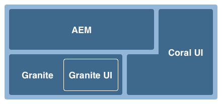
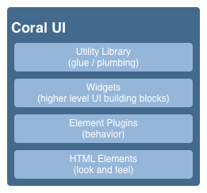

# Conceitos da interface de usuário habilitada para toque do AEM{#concepts-of-the-aem-touch-enabled-ui}

O AEM possui uma interface do usuário habilitada para toque com [design responsivo](/help/sites-authoring/responsive-layout.md) para o ambiente do autor, projetado para operar em dispositivos de toque e desktop.

>[!NOTE]
>
>A interface de usuário habilitada para toque é a interface de usuário padrão para AEM. A interface clássica foi descontinuada com o AEM 6.4.

A interface habilitada para toque inclui:

* O cabeçalho do conjunto que:
   * Mostra o logotipo
   * Fornece um link para a Navegação global
   * Fornece link para outras ações genéricas; como Pesquisa, Ajuda, Soluções do Marketing Cloud, Notificações e Configurações do usuário.
* O painel esquerdo (mostrado quando necessário e oculto), que pode mostrar:
   * Linha do tempo
   * Referências
   * Filtros
* O cabeçalho de navegação, que é novamente sensível ao contexto e pode mostrar:
   * Indica qual console você está usando no momento e/ou seu local dentro desse console
   * Seleção para o painel à esquerda
   * Navegações estruturais
   * Acesso ao **Criar** ações
   * Exibir seleções
* A área de conteúdo que:
   * Lista os itens de conteúdo (sejam páginas, ativos, postagens do fórum etc.)
   * Pode ser formatado conforme solicitado, por exemplo, coluna, cartão ou lista
   * Usa um design responsivo (a tela é redimensionada automaticamente de acordo com o dispositivo e/ou o tamanho da janela)
   * Usa rolagem infinita (sem paginação, todos os itens são listados em uma janela)


>[!NOTE]
>
>Quase toda a funcionalidade AEM foi transferida para a interface habilitada para toque. No entanto, em alguns casos limitados, a funcionalidade reverterá para a interface clássica. Consulte [Status do recurso da interface de toque](/help/release-notes/touch-ui-features-status.md) para obter mais informações.

A interface habilitada para toque foi projetada pelo Adobe para fornecer consistência à experiência do usuário em vários produtos. Tem por base:

* **Interface do usuário do Coral** (CUI) uma implementação do estilo visual Adobe para a interface do usuário habilitada para toque. A interface do usuário do Coral fornece tudo o que seu produto/projeto/aplicativo da Web precisa para adotar o estilo visual da interface do usuário.
* **Interface do usuário do Granite** Os componentes são criados com a interface do usuário do Coral.

Os princípios básicos da interface habilitada para toque são:

* Primeiro móvel (com desktop em mente)
* Design responsivo
* Exibição relevante para o contexto
* Reutilizável
* Incluir documentação de referência incorporada
* Incluir testes incorporados
* Design de baixo para cima para garantir que esses princípios sejam aplicados a cada elemento e componente

Para obter uma visão geral da estrutura da interface habilitada para toque, consulte o artigo [Estrutura da interface de usuário habilitada para toque do AEM](/help/sites-developing/touch-ui-structure.md).

## Pilha de tecnologia AEM {#aem-technology-stack}

AEM usa a plataforma Granite como base e a plataforma Granite inclui, entre outras coisas, o Java Content Repository.


## Granite {#granite}

O Granite é uma pilha de Web Open, fornecendo vários componentes incluindo:

* Um iniciador de aplicativo
* Uma estrutura OSGi na qual tudo é implantado
* Vários serviços de compêndio OSGi para apoiar aplicativos de construção
* Uma estrutura de registro abrangente que fornece várias APIs de registro
* A implementação do repositório CRX da especificação da API JCR
* A estrutura Web do Apache Sling
* Partes adicionais do produto CRX atual

>[!NOTE]
>
>O Granite é executado como um projeto de desenvolvimento aberto no Adobe: as contribuições para o código, discussões e questões são feitas em toda a empresa.
>
>No entanto, o Granite é **not** um projeto de código aberto. É altamente baseado em vários projetos de código aberto (Apache Sling, Felix, Jackrabbit e Lucene em particular), mas o Adobe desenha uma linha clara entre o que é público e o que é interno.

## Interface do usuário do Granite {#granite-ui}

A plataforma de engenharia do Granite também fornece uma estrutura básica da interface do usuário. Os principais objetivos são:

* Fornecer widgets granulares da interface do usuário
* Implemente os conceitos da interface do usuário e ilustre as práticas recomendadas (renderização de listas longas, filtragem de listas, CRUD de objeto, assistentes de CUD...)
* Fornecer uma interface de administração extensível e baseada em plug-in

Eles atendem aos requisitos:

* Respeite &quot;celular primeiro&quot;
* Ser extensível
* Seja fácil de substituir


GraniteUI.pdf

[Obter arquivo](assets/graniteui.pdf)
A interface do usuário do Granite:

* Usa a arquitetura RESTful do Sling
* Implementa bibliotecas de componentes destinadas à criação de aplicativos Web centrados no conteúdo
* Fornece widgets granulares da interface do usuário
* Fornece uma interface de usuário padrão e padronizada
* É extensível
* Foi projetado para dispositivos móveis e para desktop (respeita primeiro dispositivos móveis)
* Pode ser usado em qualquer plataforma/produto/projeto baseado em Granite; eg AEM


* [Componentes básicos da interface do usuário do Granite](#granite-ui-foundation-components)
Essa biblioteca de componentes fundamentais pode ser usada ou estendida por outras bibliotecas.
* [Componentes de administração da interface do usuário do Granite](#granite-ui-administration-components)

### Lado do cliente vs Lado do servidor {#client-side-vs-server-side}

A comunicação cliente-servidor na interface de usuário do Granite consiste em hipertexto, não objetos, portanto, não há necessidade do cliente entender a lógica de negócios

* O servidor enriquece o HTML com dados semânticos
* O cliente enriquece o hipertexto com a hipermídia (interação)


#### Lado do cliente {#client-side}

Isso usa uma extensão do vocabulário do HTML, desde que o autor possa expressar sua intenção de criar um aplicativo Web interativo. Esta é uma abordagem semelhante à [WAI-ARIA](https://www.w3.org/TR/wai-aria/) e [microformatos](https://microformats.org/).

Consiste principalmente em uma coleção de padrões de interação (por exemplo, envio assíncrono de um formulário) interpretados por códigos JS e CSS, executados no lado do cliente. A função do lado do cliente é aprimorar a marcação (fornecida como a concessão de hipermídia pelo servidor) para a interatividade.

O lado do cliente é independente de qualquer tecnologia de servidor. Desde que o servidor forneça a marcação apropriada, o lado do cliente pode cumprir sua função.

Atualmente, os códigos JS e CSS são fornecidos como Granite [clientlibs](/help/sites-developing/clientlibs.md) Na categoria :

`granite.ui.foundation and granite.ui.foundation.admin`

Eles são fornecidos como parte do pacote de conteúdo:

`granite.ui.content`

#### Lado do servidor {#server-side}

Ele é formado por uma coleção de componentes do sling que permitem ao autor *compor* um aplicativo web rápido. O desenvolvedor desenvolve componentes, o autor monta os componentes para serem um aplicativo web. A função do lado do servidor é fornecer o preço da hipermídia (marcação) ao cliente.

Atualmente, os componentes estão localizados no repositório do Granite em:

`/libs/granite/ui/components/foundation`

Isso é fornecido como parte do pacote de conteúdo:

`granite.ui.content`

### Diferenças com a interface clássica {#differences-with-the-classic-ui}

As diferenças entre a interface do Granite e a ExtJS (usada para a interface clássica) também são de interesse:

<table>
 <tbody>
  <tr>
   <td><strong>ExtJS</strong></td>
   <td><strong>Interface do usuário do Granite</strong></td>
  </tr>
  <tr>
   <td>Chamada de procedimento remoto<br /> </td>
   <td>Transições de Estado</td>
  </tr>
  <tr>
   <td>Objetos de transferência de dados</td>
   <td>Hipermídia</td>
  </tr>
  <tr>
   <td>O cliente sabe internamente no servidor</td>
   <td>O cliente não sabe internar</td>
  </tr>
  <tr>
   <td>"Fat client"</td>
   <td>"Cliente fino"</td>
  </tr>
  <tr>
   <td>Bibliotecas especializadas de clientes</td>
   <td>Bibliotecas de clientes universais</td>
  </tr>
 </tbody>
</table>

### Componentes básicos da interface do usuário do Granite {#granite-ui-foundation-components}

O [Componentes básicos da interface do usuário do Granite](https://helpx.adobe.com/experience-manager/6-5/sites/developing/using/reference-materials/granite-ui/api/jcr_root/libs/granite/ui/index.html) forneça os elementos básicos necessários para criar qualquer interface do usuário. Incluem, entre outros:

* Botão
* Hiperlink
* Avatar do usuário

Os componentes fundamentais podem ser encontrados em:

`/libs/granite/ui/components/foundation`

Esta biblioteca contém um componente da interface do usuário do Granite para cada elemento do Coral. Um componente é controlado por conteúdo, e sua configuração reside no repositório. Isso possibilita compor um aplicativo de interface de usuário do Granite sem gravar a marcação de HTML manualmente.

Propósito:

* Modelo de componente para elementos HTML
* Composição do componente
* Teste automático de unidade e funcionalidade

Implementação:

* Composição e configuração baseadas em repositório
* Aproveitamento das instalações de teste fornecidas pela plataforma Granite
* Modelo JSP

Essa biblioteca de componentes fundamentais pode ser usada ou estendida por outras bibliotecas.

### Componentes do ExtJS e da interface de usuário do Granite correspondente {#extjs-and-corresponding-granite-ui-components}

Ao atualizar o código ExtJS para usar a interface do Granite, a lista a seguir fornece uma visão geral conveniente dos xtypes e tipos de nó ExtJS com seus tipos de recursos equivalentes da interface do Granite.

| **ExtJS xtype** | **Tipo de recurso da interface de usuário do Granite** |
|---|---|
| `button` | `granite/ui/components/foundation/form/button` |
| `checkbox` | `granite/ui/components/foundation/form/checkbox` |
| `componentstyles` | `cq/gui/components/authoring/dialog/componentstyles` |
| `cqinclude` | `granite/ui/components/foundation/include` |
| `datetime` | `granite/ui/components/foundation/form/datepicker` |
| `dialogfieldset` | `granite/ui/components/foundation/form/fieldset` |
| `hidden` | `granite/ui/components/foundation/form/hidden` |
| `html5smartfile, html5smartimage` | `granite/ui/components/foundation/form/fileupload` |
| `multifield` | `granite/ui/components/foundation/form/multifield` |
| `numberfield` | `granite/ui/components/foundation/form/numberfield` |
| `pathfield, paragraphreference` | `granite/ui/components/foundation/form/pathbrowser` |
| `selection` | `granite/ui/components/foundation/form/select` |
| `sizefield` | `cq/gui/components/authoring/dialog/sizefield` |
| `tags` | `granite/ui/components/foundation/form/autocomplete``cq/gui/components/common/datasources/tags` |
| `textarea` | `granite/ui/components/foundation/form/textarea` |
| `textfield` | `granite/ui/components/foundation/form/textfield` |

| **Tipo de nó** | **Tipo de recurso da interface de usuário do Granite** |
|---|---|
| `cq:WidgetCollection` | `granite/ui/components/foundation/container` |
| `cq:TabPanel` | `granite/ui/components/foundation/container``granite/ui/components/foundation/layouts/tabs` |
| `cq:panel` | `granite/ui/components/foundation/container` |

### Componentes de administração da interface do usuário do Granite {#granite-ui-administration-components}

O [Componentes de administração da interface do usuário do Granite](https://helpx.adobe.com/experience-manager/6-5/sites/developing/using/reference-materials/granite-ui/api/jcr_root/libs/granite/ui/index.html) crie nos componentes fundamentais para fornecer blocos de construção genéricos que qualquer aplicativo de administração pode implementar. Entre outros, incluem-se:

* Barra de navegação global
* Trilho (esqueleto)
* Painel Pesquisar

Propósito:

* Aparência e comportamento unificados para aplicativos de administração
* Rad para aplicativos de administração

Implementação:

* Componentes predefinidos usando os componentes fundamentais
* Os componentes podem ser personalizados

## Interface do usuário do Coral {#coral-ui}

CoralUI.pdf

[Obter arquivo](assets/coralui.pdf)
A interface do usuário do Coral (Coral UI) é uma implementação do estilo visual do Adobe para a interface do usuário habilitada para toque, que foi criada para fornecer consistência na experiência do usuário em vários produtos. A interface do usuário do Coral fornece tudo o que você precisa para adotar o estilo visual usado no ambiente de criação.

>[!CAUTION]
>
>Coral UI é uma biblioteca de interface do usuário disponível para AEM clientes para criar aplicativos e interfaces da Web dentro dos limites do uso licenciado do produto.
>
>O uso da interface do Coral é permitido somente:
>
>
>* Quando tiver sido enviado e fornecido com AEM.
>* Para uso ao estender a interface do usuário existente do ambiente de criação.
>* Adobe corporativo de materiais, anúncios e apresentações.
>* A interface do usuário de aplicativos da marca Adobe (a fonte não deve estar prontamente disponível para outros usos).
>* Com pequenas personalizações.
>
>A utilização da interface do Coral deve ser evitada em:
>
>* Documentos e outros itens não relacionados com Adobe.
>* Ambientes de criação de conteúdo (onde os itens anteriores podem ser gerados por outros).
>* Aplicativos/componentes/páginas da Web que não estejam claramente conectadas ao Adobe.
>


A interface do usuário do Coral é uma coleção de blocos de construção para o desenvolvimento de aplicações Web.



Projetado para ser modular desde o início, cada módulo forma uma camada distinta com base em sua função primária. Embora as camadas tenham sido projetadas para se apoiarem, elas também podem ser usadas independentemente, se necessário. Isso possibilita implementar a experiência do usuário do Coral em qualquer ambiente compatível com o HTML.

Com a interface do usuário do Coral, não é obrigatório usar um modelo e/ou plataforma de desenvolvimento específico. O objetivo principal da Coral é fornecer marcação HTML5 unificada e limpa, independentemente do método real usado para emitir essa marcação. Isso pode ser usado para renderização do cliente ou do servidor, modelos, JSP, PHP ou até mesmo aplicativos RIA do Flash do Adobe - para nomear apenas alguns.

### Elementos de HTML - A camada de marcação {#html-elements-the-markup-layer}

Os elementos de HTML fornecem uma aparência comum para todos os elementos básicos da interface do usuário (incluindo barra de navegação, botão, menu, trilho, entre outros).

No nível mais básico, um elemento HTML é uma tag HTML com um nome de classe dedicado. Os elementos mais complexos podem ser compostos de várias tags, aninhadas entre si (de uma maneira específica).

O CSS é usado para fornecer a aparência real. Para possibilitar a personalização fácil da aparência (por exemplo, no caso de marca), os valores de estilo reais são declarados como variáveis expandidas pela variável [MENOS](https://lesscss.org/) pré-processador durante o tempo de execução.

Propósito:

* Fornecer elementos básicos da interface do usuário com uma aparência comum
* Fornecer o sistema de grade padrão

Implementação:

* Tags HTML com estilos inspirados por [bootstrap](https://twitter.github.com/bootstrap/)
* As classes são definidas em arquivos MENOS
* Os ícones são definidos como fontes

Por exemplo, a marcação:

```xml
<button class="btn btn-large btn-primary" type="button">Large button</button>
<button class="btn btn-large" type="button">Large button</button>
```

É exibido como:


A aparência é definida em LESS, vinculada a um elemento por nome de classe dedicado (o seguinte extrato foi encurtado por motivos de brevidade):

```xml
.btn {
    font-size: @baseFontSize;
    line-height: @baseLineHeight;
    .buttonBackground(@btnBackground,
                                @btnBackgroundHighlight,
                                @grayDark, 0 1px 1px rgba(255,255,255,.75));
```

Os valores reais são definidos em um arquivo de variável MENOS (a seguinte extração foi encurtada por motivos de brevidade):

```xml
@btnBackgroundHighlight: darken(@white, 10%);
@btnPrimaryBackgroundHighlight: spin(@btnPrimaryBackground, 20%);
@baseFontSize: 17px;
@baseFontFamily: @sansFontFamily;
```

### Plug-ins de elemento {#element-plugins}

Muitos dos elementos de HTML precisarão exibir algum tipo de comportamento dinâmico, como abrir e fechar menus pop-up. Essa é a função dos plug-ins de elemento, que realizam essas tarefas manipulando o DOM usando JavaScript.

Um plug-in é:

* Projetado para operar em um elemento DOM específico. Por exemplo, um plug-in de diálogo espera encontrar `DIV class=dialog`
* Genérico por natureza. Por exemplo, um gerenciador de layout fornece layout para qualquer lista de `DIV` ou `LI` elementos

O comportamento do plug-in pode ser personalizado com parâmetros por meio de:

* Passar os parâmetros por meio de uma chamada javascript
* Uso dedicado `data-*` atributos vinculados à marcação HTML

Embora o desenvolvedor possa selecionar a melhor abordagem para qualquer plug-in, a regra principal é usar:

* `data-*` atributos para opções relacionadas ao layout de HTML. Por exemplo, para especificar o número de colunas
* Opções/classes de API para funcionalidade relacionada aos dados. Por exemplo, construir a lista de itens a serem exibidos

O mesmo conceito é usado para implementar a validação de formulário. Para um elemento que você deseja validar, você deve especificar o formulário de entrada necessário como personalizado `data-*` atributo. Esse atributo é então usado como uma opção para um plug-in de validação.

>[!NOTE]
>
>A validação de formulário HTML5-nativo deve ser usada sempre que possível e/ou expandida.

Propósito:

* Fornecer comportamento dinâmico para Elementos de HTML
* Fornecer layouts personalizados não é possível com o CSS puro
* Executar validação de formulário
* Executar manipulação avançada de DOM

Implementação:

* Plug-in do jQuery, vinculado a elementos DOM específicos
* Usando `data-*` atributos para personalizar o comportamento

Uma marcação de exemplo de extração (observe as opções especificadas como data-&#42; atributos):

```xml
<ul data-column-width="220" data-layout="card" class="cards">
  <li class="item">
    <div class="thumbnail">
      
      <div class="caption">
        <h4>Toolbar</h4>
          <p><small>toolbar</small><br></p>
      </div>
    </div>
  </li>
  <li class="item">
    <div class="thumbnail">
      
      <div class="caption">
        <h4>Toolbar</h4>
        <p><small>toolbar</small><br></p>
      </div>
    </div>
  </li>
```

A chamada para o plug-in jQuery:

```
$(‘.cards’).cardlayout ();
```

Isso será exibido como:


O `cardLayout` o plug-in apresenta o segmento delimitado `UL` elementos com base em suas respectivas alturas e também considerando a largura do pai.

### Widgets de elementos de HTML {#html-elements-widgets}

Um widget combina um ou mais elementos básicos com um plug-in javascript para formar elementos de interface do usuário de &quot;nível superior&quot;. Eles podem implementar comportamentos mais complexos e também uma aparência mais complexa do que um único elemento poderia oferecer. Bons exemplos são o seletor de tags ou os widgets de painel.

Um widget pode acionar e ouvir eventos personalizados para cooperar com outros widgets da página. Alguns widgets são, na verdade, widgets nativos do jQuery que usam os elementos do HTML Coral.

Propósito:

* Implemente elementos de interface do usuário de nível superior que exibam comportamento complexo
* Acionamento e manipulação de eventos

Implementação:

* Plug-in jQuery + marcação HTML
* Pode utilizar modelos do lado do cliente/servidor

Exemplo de marcação é:

```
<input type="text" name="tags" placeholder="Tags" class="tagManager"/>
```

A chamada para o plugin jQuery (com opções):

```
$(".tagManager").tagsManager({
        prefilled: ["Pisa", "Rome"] })
```

O plug-in emite a marcação HTML (essa marcação usa elementos básicos, que podem usar outros plug-ins internamente):

```
<span>Pisa</code>
<a title="Removing tag" tagidtoremove="0"
   id="myRemover_0" class="myTagRemover" href="#">x</a></code>

<span id="myTag_1" class="myTag"><span>Rome</code>
<a title="Removing tag" tagidtoremove="1"
   id="myRemover_1" class="myTagRemover" href="#">x</a></code>

<input type="text" data-original-title="" class="input-medium tagManager"
       placeholder="Tags" name="tags" data-provide="typeahead" data-items="6"
       autocomplete="off">
```

Isso será exibido como:


### Biblioteca de utilitários {#utility-library}

Esta biblioteca é uma coleção de plug-ins e/ou funções de ajuda do javascript que são:

* Independente da interface do usuário
* No entanto, é fundamental para a criação de aplicações Web completas

Isso inclui manipulação de XSS e barramento de evento.

Embora os plugins e widgets do elemento HTML possam depender da funcionalidade fornecida pela biblioteca de utilitários, a biblioteca de utilitários não pode ter nenhuma dependência forte dos elementos nem dos próprios widgets.

Propósito:

* Fornecer funcionalidade comum
* Implementação do barramento de evento
* Modelos do lado do cliente
* XSS

Implementação:

* Plug-ins jQuery ou módulos JavaScript compatíveis com AMD
