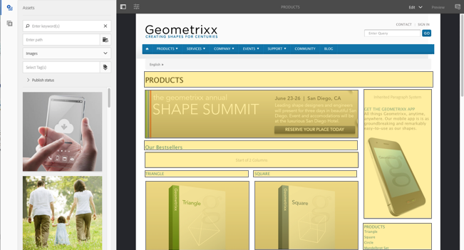
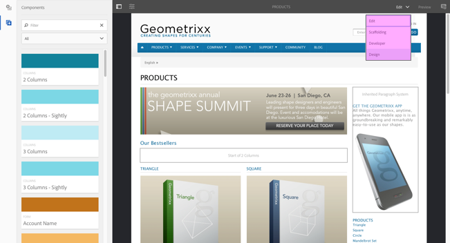

# Estrutura da interface habilitada para toque AEM{#structure-of-the-aem-touch-enabled-ui}

A interface do usuário habilitada para toque AEM tem vários princípios subjacentes e é composta de vários elementos chave:

## Consoles {#consoles}

### Layout básico e redimensionamento {#basic-layout-and-resizing}

A interface do usuário atende a dispositivos móveis e de desktop, mas, em vez de criar dois estilos, o Adobe decidiu usar um estilo que funciona para todas as telas e dispositivos.

Todos os módulos usam o mesmo layout básico, AEM isso pode ser visto como:

O layout segue um estilo de design responsivo e acomodará-se ao tamanho do dispositivo/janela que você está usando.

Por exemplo, quando a resolução for inferior a 1024px (como em um dispositivo móvel), a tela será ajustada de acordo:

### Barra do cabeçalho {#header-bar}

A barra de cabeçalho mostra elementos globais incluindo:

* o logotipo e o produto/solução específicos que você está usando no momento; para AEM isso também forma um link para a Navegação global
* Pesquisar  
* ícone para acessar os recursos de ajuda
* ícone para acessar outras soluções
* um indicador de (e acesso a) quaisquer alertas ou itens da Caixa de entrada que estejam esperando por você
* o ícone do usuário, juntamente com um link para o gerenciamento de perfis

### Barra de ferramentas {#toolbar}

Isso é contextual à sua localização e às ferramentas de superfície relevantes para controlar a visualização ou os ativos na página abaixo. A barra de ferramentas é específica do produto, mas há alguma compatibilidade com os elementos.

Em qualquer local, a barra de ferramentas mostra as ações disponíveis no momento:

Também depende se um recurso está selecionado no momento:

### Painel esquerdo {#left-rail}

O painel esquerdo pode ser aberto/oculto, conforme necessário, para mostrar:

* **Linha do tempo**
* **Referências**
* **Filtro**

O padrão é **Somente conteúdo** (painel oculto).

## Criação de página {#page-authoring}

Ao criar páginas, as áreas estruturais são as seguintes.

### Quadro de conteúdo {#content-frame}

O conteúdo da página é renderizado no quadro de conteúdo. O quadro de conteúdo é completamente independente do editor - para garantir que não haja conflitos devido a CSS ou javascript.

O quadro de conteúdo está na seção à direita da janela, abaixo da barra de ferramentas.

### Quadro do editor {#editor-frame}

O quadro do editor detecta os recursos de edição.

O quadro do editor é um container (abstrato) para todos os *elementos de criação de página*. Ele fica sobre o quadro de conteúdo e inclui:

* a barra de ferramentas superior
* painel lateral
* todas as sobreposições
* qualquer outro elemento de criação de página; por exemplo, a barra de ferramentas do componente

### Painel lateral {#side-panel}

Ele contém duas guias padrão para permitir que você selecione ativos e componentes; eles podem ser arrastados daqui e soltos até a página.

O painel lateral está oculto por padrão. Quando selecionado, será mostrado no lado esquerdo ou deslizará para cobrir toda a janela (quando o tamanho da janela estiver abaixo de uma largura de 1024px; como, por exemplo, em um dispositivo móvel).

### Painel lateral - Ativos {#side-panel-assets}

Na guia Ativos, é possível selecionar na faixa de ativos. Você também pode filtrar um termo específico ou selecionar um grupo.

### Painel lateral - Grupos de ativos {#side-panel-asset-groups}

Na guia Ativo, há uma lista suspensa que você pode usar para selecionar os grupos de ativos específicos.

### Painel lateral - Componentes {#side-panel-components}

Na guia Componentes, é possível selecionar a partir do intervalo de componentes. Você também pode filtrar um termo específico ou selecionar um grupo.

### Sobreposições {#overlays}

Elas sobrepõem o quadro de conteúdo e são usadas pelas [camadas](#layer) para perceber os mecanismos de como você pode interagir (de forma totalmente transparente) com os componentes e seu conteúdo.

As sobreposições vivem no quadro do editor (com todos os outros elementos de criação de página), embora na verdade sobreponham os componentes apropriados no quadro de conteúdo.

### Camada {#layer}

Uma camada é um conjunto independente de funcionalidades que pode ser ativado para:

* fornecer uma visualização diferente da página
* permite manipular e/ou interagir com uma página

As camadas fornecem funcionalidade sofisticada para a página inteira, em vez de ações específicas em um componente individual.

AEM vem com várias camadas já implementadas para a criação de páginas; incluindo, por exemplo, editar, pré-visualização e anotar.

>[!NOTE]
>
>As camadas são um conceito poderoso que afeta a visualização do usuário e a interação com o conteúdo da página. Ao desenvolver suas próprias camadas, é necessário garantir que a camada seja limpa quando ela for fechada.

### Comutador de Camada {#layer-switcher}

O alternador de camadas permite que você escolha a camada que deseja usar. Quando fechada, indica a camada que está sendo usada no momento.

O alternador de camadas está disponível como uma lista suspensa na barra de ferramentas (na parte superior da janela, no quadro do editor).

### Component Toolbar {#component-toolbar}

Cada instância de um componente revelará sua barra de ferramentas quando clicada (uma vez ou com um clique em duplo lento). A barra de ferramentas contém as ações específicas (por exemplo, copiar, colar, editor aberto) que estão disponíveis para a instância do componente (editável) na página.

Dependendo do espaço disponível, as barras de ferramentas do componente são posicionadas no canto superior ou inferior direito do componente apropriado.

## Informações adicionais {#further-information}

Para obter mais detalhes sobre os conceitos em torno da interface de usuário habilitada para toque, continue com o artigo [Conceitos da interface de usuário habilitada para toque AEM](/help/sites-developing/touch-ui-concepts.md).

Para obter mais informações técnicas, consulte o [conjunto de documentação JS](https://helpx.adobe.com/experience-manager/6-5/sites/developing/using/reference-materials/jsdoc/ui-touch/editor-core/index.html) para o editor de página habilitado para toque.

