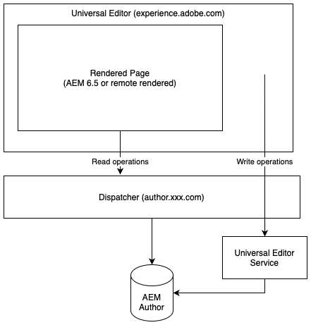

# O Editor universal {#universal-editor}

Saiba mais sobre a flexibilidade do Universal Editor e como ele pode ajudar a potencializar suas experiências headless usando o AEM 6.5.

## Visão geral {#overview}

O Universal Editor é um editor visual versátil que faz parte do Adobe Experience Manager Sites. Ele permite que os autores façam a edição &quot;o que você vê é o que você obtém&quot; (WYSIWYG) de qualquer experiência headless.

* Os autores se beneficiam da flexibilidade do Universal Editor, pois ele oferece suporte à mesma edição visual consistente para todas as formas de conteúdo headless do AEM.
* Os desenvolvedores se beneficiam da versatilidade do Universal Editor, pois ele também suporta a verdadeira dissociação da implementação. Ele permite que os desenvolvedores utilizem praticamente qualquer estrutura ou arquitetura de sua escolha, sem impor restrições de SDK ou tecnologia.

Consulte a [documentação do AEM as a Cloud Service sobre o Universal Editor](https://experienceleague.adobe.com/pt-br/docs/experience-manager-cloud-service/content/implementing/developing/universal-editor/introduction) para obter mais detalhes.

## Arquitetura {#architecture}

O Editor universal é um serviço que trabalha em conjunto com o AEM para criar conteúdo em headless.

* O Editor Universal está hospedado em `https://experience.adobe.com/#/aem/editor/canvas` e pode editar páginas renderizadas pelo AEM 6.5.
* A página do AEM é lida pelo Editor universal por meio do dispatcher da instância do autor do AEM.
* O Universal Editor Service, que é executado no mesmo host que a Dispatcher, grava as alterações de volta na instância de autor do AEM.



## Requisitos {#requirements}

O Editor Universal é compatível com:

* AEM 6.5 (service pack 21 ou 22 mais um pacote de recursos)
   * Tanto no local quanto na hospedagem do AMS são compatíveis.
* [AEM as a Cloud Service](https://experienceleague.adobe.com/pt-br/docs/experience-manager-cloud-service/content/implementing/developing/universal-editor/introduction) (versão `2023.8.13099` ou superior)

Este documento se concentra no suporte do AEM 6.5 ao Universal Editor.

## Configurar {#setup}

Para testar o Editor universal, será necessário:

1. [Atualize e configure sua instância de criação do AEM.](#update-configure-aem)
1. [Configurar um Serviço do Editor Universal local.](#set-up-ue)
1. [Ajuste o dispatcher para permitir o Universal Editor Service.](#update-dispatcher)

Após concluir a instalação, você pode [instrumentar seus aplicativos para usar o Editor Universal.](#instrumentation)

### Atualizar o AEM {#update-aem}

O Service Pack 21 ou 22 e um pacote de recursos para o AEM são necessários para usar o Universal Editor com o AEM 6.5.

#### Aplicar Service Pack Mais Recente {#latest}

Verifique se você está executando pelo menos o service pack 21 ou 22 para o AEM 6.5. Você pode baixar o service pack mais recente em [Distribuição de software.](https://experienceleague.adobe.com/docs/experience-cloud/software-distribution/home.html?lang=pt-br)

#### Instalar o Pacote de Recursos do Universal Editor {#feature-pack}

Instale o **Pacote de Recursos do Universal Editor para AEM 6.5** [disponível na Distribuição de Software.](https://experience.adobe.com/#/downloads/content/software-distribution/en/aem.html?package=/content/software-distribution/en/details.html/content/dam/aem/public/cq-6.5.21-universal-editor-1.0.0.zip)

Se você já estiver executando o service pack 23 ou superior, o pacote de recursos não será necessário.

### Configurar serviços {#configure-services}

O pacote de recursos instala vários novos pacotes para os quais são necessárias configurações adicionais.

#### Defina o Atributo SameSite para o cookie `login-token`. {#samesite-attribute}

1. Abra o Gerenciador de configurações.
   * `http://<host>:<port>/system/console/configMgr`
1. Localize o **Manipulador de autenticação de token do Adobe Granite** na lista e clique em **Alterar os valores de configuração**.
1. Na caixa de diálogo, altere o atributo **SameSite do cookie de token de logon** (`token.samesite.cookie.attr`) para `Partitioned`.
1. Clique em **Salvar**.

#### Remova a opção X-Frame de cabeçalhos `SAMEORIGIN`. {#sameorigin}

1. Abra o Gerenciador de configurações.
   * `http://<host>:<port>/system/console/configMgr`
1. Localize o **Apache Sling Main Servlet** na lista e clique em **Editar os valores de configuração**.
1. Exclua o valor `X-Frame-Options=SAMEORIGIN` do atributo (`sling.additional.response.headers`) **Cabeçalhos de resposta adicionais** se ele existir.
1. Clique em **Salvar**.

#### Configure o Manipulador de autenticação de parâmetro de consulta do Adobe Granite. {#query-parameter}

1. Abra o Gerenciador de configurações.
   * `http://<host>:<port>/system/console/configMgr`
1. Localize o **Manipulador de Autenticação de Parâmetro de Consulta do Adobe Granite** na lista e clique em **Editar os valores de configuração**.
1. No campo **Caminho** (`path`), adicione `/` para habilitar.
   * Um valor vazio desativa o manipulador de autenticação.
1. Clique em **Salvar**.

#### Defina para quais caminhos de conteúdo ou `sling:resourceTypes` o Editor Universal deve ser aberto. {#paths}

1. Abra o Gerenciador de configurações.
   * `http://<host>:<port>/system/console/configMgr`
1. Localize o **Serviço de URL do Editor Universal** na lista e clique em **Editar os valores de configuração**.
1. Defina para quais caminhos de conteúdo ou `sling:resourceTypes` o Editor Universal deve ser aberto.
   * No campo **Mapeamento de Abertura do Editor Universal**, forneça os caminhos para os quais o Editor Universal está aberto.
   * No **Sling:resourceTypes, que deve ser aberto pelo Editor Universal**, forneça uma lista de recursos que são abertos diretamente pelo Editor Universal.
1. Clique em **Salvar**.
1. Verifique sua [configuração do externalizador](/help/sites-developing/externalizer.md) e certifique-se de que, no mínimo, você tenha os ambientes local, de autor e de publicação definidos como no exemplo a seguir.

   ```text
   "local $[env:AEM_EXTERNALIZER_LOCAL;default=http://localhost:4502]",
   "author $[env:AEM_EXTERNALIZER_AUTHOR;default=http://localhost:4502]",
   "publish $[env:AEM_EXTERNALIZER_PUBLISH;default=http://localhost:4503]"
   ```

Quando essas etapas de configuração forem concluídas, o AEM abrirá o Editor universal para páginas na seguinte ordem.

1. O AEM verificará os mapeamentos em `Universal Editor Opening Mapping` e se o conteúdo estiver em qualquer caminho definido nele, o Editor Universal será aberto para ele.
1. Para conteúdo não nos caminhos definidos em `Universal Editor Opening Mapping`, o AEM verifica se o `resourceType` do conteúdo corresponde aos definidos em **Sling:resourceTypes, que devem ser abertos pelo Editor Universal**, e se o conteúdo corresponder a um desses tipos, o Editor Universal será aberto para ele em `${author}${path}.html`.
1. Caso contrário, o AEM abrirá o Editor de páginas.

As variáveis a seguir estão disponíveis para definir seus mapeamentos em `Universal Editor Opening Mapping`.

* `path`: Caminho de conteúdo do recurso a ser aberto
* `localhost`: Entrada do externalizador para `localhost` sem esquema, ex.: `localhost:4502`
* `author`: Entrada externalizadora para autor sem esquema, ex.: `localhost:4502`
* `publish`: Entrada do externalizador para publicação sem esquema, ex.: `localhost:4503`
* `preview`: Entrada do externalizador para visualização sem esquema, ex.: `localhost:4504`
* `env`: `prod`, `stage`, `dev` com base nos modos de execução do Sling definidos
* `token`: Token de consulta necessário para `QueryTokenAuthenticationHandler`

Exemplo de mapeamentos:

* Abrir todas as páginas em `/content/foo` no Autor do AEM:
   * `/content/foo:${author}${path}.html?login-token=${token}`
   * Isto resulta na abertura de `https://localhost:4502/content/foo/x.html?login-token=<token>`
* Abrir todas as páginas em `/content/bar` em um servidor NextJS remoto, fornecendo todas as variáveis como informações
   * `/content/bar:nextjs.server${path}?env=${env}&author=https://${author}&publish=https://${publish}&login-token=${token}`
   * Isto resulta na abertura de `https://nextjs.server/content/bar/x?env=prod&author=https://localhost:4502&publish=https://localhost:4503&login-token=<token>`

### Configurar o Serviço do Editor Universal {#set-up-ue}

Com o AEM atualizado e configurado, você pode configurar um Serviço local do Universal Editor para desenvolvimento e teste locais.

1. Instale o Node.js versão >=20.
1. Baixe e descompacte o Serviço Universal Editor mais recente da [Distribuição de Software](https://experienceleague.adobe.com/pt-br/docs/experience-cloud/software-distribution/home)
1. Configure o Universal Editor Service por meio de variáveis de ambiente ou arquivo `.env`.
   * [Consulte a documentação do AEM as a Cloud Service Universal Editor para obter detalhes.](https://experienceleague.adobe.com/pt-br/docs/experience-manager-cloud-service/content/implementing/developing/universal-editor/local-dev#setting-up-service)
   * Observe que talvez seja necessário usar a opção `UES_MAPPING` se for necessária a regravação interna do IP.
1. Executar `universal-editor-service.cjs`

### Atualizar o Dispatcher {#update-dispatcher}

Com o AEM configurado e um serviço local do Universal Editor em execução, será necessário permitir um proxy reverso para o novo serviço [ no Dispatcher.](https://experienceleague.adobe.com/pt-br/docs/experience-manager-dispatcher/using/dispatcher)

1. Ajuste o arquivo vhost da instância do autor para incluir um proxy reverso.

   ```html
   <IfModule mod_proxy.c>
    ProxyPass "/universal-editor" "http://localhost:8080"
    ProxyPassReverse "/universal-editor" "http://localhost:8080"
   </IfModule>
   ```

   >[!NOTE]
   >
   >8080 é a porta padrão. Se você alterou isto usando o parâmetro `UES_PORT` em [seu arquivo `.env`,](https://experienceleague.adobe.com/pt-br/docs/experience-manager-cloud-service/content/implementing/developing/universal-editor/local-dev#setting-up-service) ajuste o valor da porta aqui de acordo.

1. Reinicie o Apache.

## Instrumentar o aplicativo {#instrumentation}

Com o AEM atualizado e um Serviço do editor universal local em execução, você pode começar a editar conteúdo headless usando o editor universal.

No entanto, seu aplicativo deve ser instrumentado para aproveitar o Editor universal. Isso envolve a inclusão de metatags para instruir o editor sobre como e onde persistir o conteúdo. Os detalhes desta instrumentação estão disponíveis na [documentação do Universal Editor para AEM as a Cloud Service.](https://experienceleague.adobe.com/pt-br/docs/experience-manager-cloud-service/content/implementing/developing/universal-editor/getting-started#instrument-page)

Observe que, ao seguir a documentação do Universal Editor com AEM as a Cloud Service, as seguintes alterações se aplicam ao usá-lo com o AEM 6.5.

* O protocolo na meta tag deve ser `aem65` em vez de `aem`.

  ```html
  <meta name="urn:adobe:aue:system:aemconnection" content={`aem65:${getAuthorHost()}`}/>
  ```

* O ponto de extremidade do Serviço do Editor Universal deve ser anunciado por meio de uma meta tag.

  ```html
  <meta name="urn:adobe:aue:config:service" content={`${getAuthorHost()}/universal-editor`}/>
  ```

* Na seção `plugins` da definição de componentes, deve ser usado `aem65` em vez de `aem`.

>[!TIP]
>
>Para obter um guia abrangente de introdução do Universal Editor para desenvolvedores, consulte o documento [Visão geral do Universal Editor para desenvolvedores do AEM](https://experienceleague.adobe.com/pt-br/docs/experience-manager-cloud-service/content/implementing/developing/universal-editor/developer-overview) na documentação do AEM as a Cloud Service, tendo em mente as alterações necessárias para o suporte ao AEM 6.5, conforme mencionado nesta seção.

## Diferenças entre o AEM 6.5 e o AEM as a Cloud Service {#differences}

O Editor universal no AEM 6.5 funciona amplamente da mesma forma que no AEM as a Cloud Service, incluindo a interface do usuário e grande parte da configuração. Há, no entanto, diferenças que devem ser observadas.

* O Universal Editor no 6.5 é compatível apenas com o caso de uso headless.
* A configuração do Editor Universal varia ligeiramente para 6.5 ([conforme descrito](#setup) no documento atual).
* O Editor universal na versão 6.5 usa um seletor de ativos diferente e um seletor de Fragmento de conteúdo diferente do AEM as a Cloud Service.
