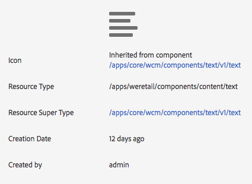

# Tentando componentes principais no We.Retail{#trying-out-core-components-in-we-retail}

Os componentes principais são componentes modernos e flexíveis, com fácil extensibilidade e permitindo uma integração simples em seus projetos. Os componentes principais foram criados em torno de vários princípios importantes de design, como HTL, usabilidade pronta para uso, configurabilidade, controle de versão e extensibilidade. O We.Retail foi criado em componentes principais.

## Tentando sair {#trying-it-out}

1. Inicie o AEM com o conteúdo de amostra We.Retail e abra o [Console Componentes](/help/sites-authoring/default-components-console.md).

   **Navegação global -> Ferramentas -> Componentes**

1. Ao abrir o painel no console Componentes, é possível filtrar por um grupo de componentes específico. Os componentes principais podem ser encontrados em

   * `.core-wcm`: Os componentes principais padrão
   * `.core-wcm-form`: Os componentes principais de envio do formulário

   Choose `.core-wcm`.

   

1. Observe que todos os componentes principais são nomeados como **v1**, refletindo que esta é a primeira versão desse componente principal. As versões regulares serão lançadas a partir de agora, o que será compatível com a versão do AEM e permitirá uma atualização fácil para que você possa aproveitar os recursos mais recentes.
1. Clique em **Texto (v1)**.

   Veja que o **Tipo de Recurso** do componente é `/apps/core/wcm/components/text/v1/text`. Os componentes principais são encontrados em `/apps/core/wcm/components` e têm versão por componente.

   

1. Clique na guia **Documentation** para ver a documentação do desenvolvedor do componente.

   

1. Retorne ao Console de componentes. Filtre o grupo **We.Retail** e selecione o componente **Text**.
1. Veja que o **Tipo de Recurso** aponta para um componente conforme esperado em `/apps/weretail`, mas o **Supertipo de Recurso** aponta para o componente principal `/apps/core/wcm/components/text/v1/text`.

   

1. Clique na guia **Uso em tempo real** para ver em quais páginas esse componente está sendo usado no momento. Clique na primeira página **Thank You** para editar a página.

   

1. Na página Obrigado, selecione o componente de texto e, no menu de edição do componente, clique no ícone Cancelar herança .

   [O We.Retail tem uma ](/help/sites-developing/we-retail-globalized-site-structure.md) estrutura de site globalizada, onde o conteúdo é enviado de mestres de idioma para cópias  [ativas por meio de um mecanismo chamado herança](/help/sites-administering/msm.md). Por esse motivo, a herança deve ser cancelada para permitir que um usuário edite texto manualmente.

   

1. Confirme o cancelamento clicando em **Yes**.

   

1. Depois que a herança é cancelada e você seleciona os componentes de texto, muitas outras opções estão disponíveis. Clique em** Editar**.

   

1. Agora é possível ver quais opções de edição estão disponíveis para o componente de texto.

   

1. No menu **Informações da página** selecione **Editar modelo**.
1. No Editor de modelo da página, clique no ícone **Política** do componente de Texto no **Contêiner de layout** da página.

   

1. Os componentes principais permitem que um autor de modelo configure quais propriedades estão disponíveis para os autores da página. Isso inclui recursos como fontes de colagem permitidas, opções de formatação, estilos de parágrafo disponíveis, etc.

   Essas caixas de diálogo de design estão disponíveis para muitos componentes principais e funcionam lado a lado com o editor de modelo. Uma vez ativadas, elas ficam disponíveis para o autor por meio dos editores de componente.

   

## Informações adicionais {#further-information}

Para obter mais informações sobre os componentes principais, consulte o documento de criação [Componentes principais](https://docs.adobe.com/content/help/pt-BR/experience-manager-core-components/using/introduction.html) para obter uma visão geral dos recursos dos componentes principais e o documento do desenvolvedor [Desenvolvimento dos componentes principais](https://helpx.adobe.com/experience-manager/core-components/using/developing.html) para obter uma visão geral técnica.

Além disso, talvez você queira investigar mais detalhadamente [modelos editáveis](/help/sites-developing/we-retail-editable-templates.md). Consulte o documento de criação [Criação de modelos de página](/help/sites-authoring/templates.md) ou o documento do desenvolvedor Página [Modelos - Editável](/help/sites-developing/page-templates-editable.md) para obter detalhes completos sobre modelos editáveis.
